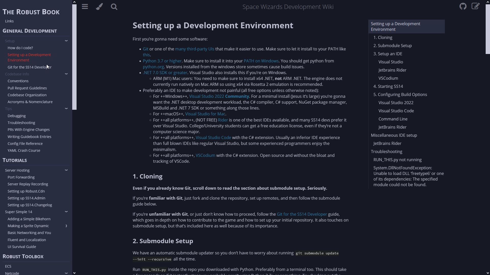
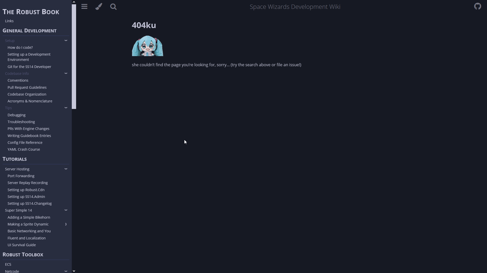

# Space Wizards Development Wiki

This is a port of the old Wiki.js SS14 documentation to `mdbook`, for the following benefits:
- First-class git support, open source and actually editable by everyone
- No webshit bloat, much faster in general
- More familiar & comfortable for developers since `mdbook` use is very widespread
- No sign-on infrastructure or hosting necessary (besides GH pages)
- More customizable
- Friction to editing reduced significantly
- Eventual localization support

The following `mdbook` features & plugins are available and in use:
- `MathJax` support 
- Sidebar ToC (integrated directly into `index.hbs` etc)
- `mdbook-mermaid`
- `mdbook-linkcheck`
- `mdbook-template`
- `mdbook-admonish`
- `mdbook-emojicodes`

The site is currently hosted at [https://docs.spacestation14.com](https://docs.spacestation14.com).

**For information such as how to edit, build & test these docs, see [Guide to Editing Docs](https://spacestation14.io/docs/en/meta/guide-to-editing-docs.html). on the site itself** (or [in this repo](./src/en/meta/guide-to-editing-docs.md))

## Screenshots

## License

The Space Wizards Development Wiki is released under the Mozilla Public License v2.0.
