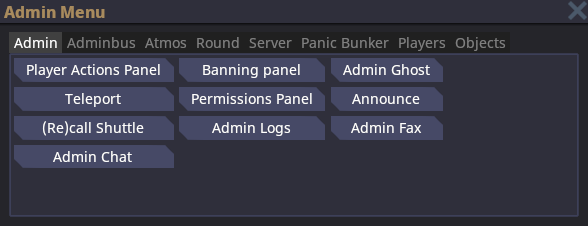
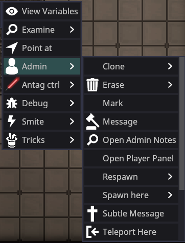
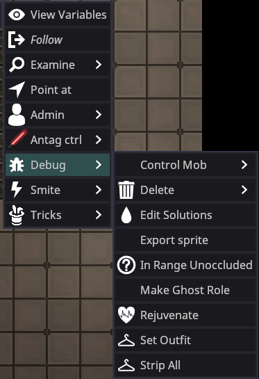
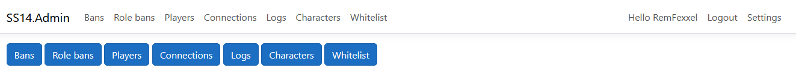
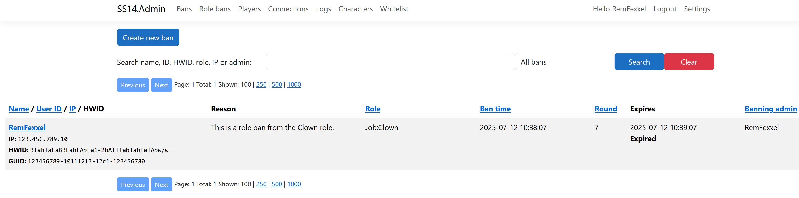
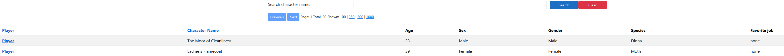
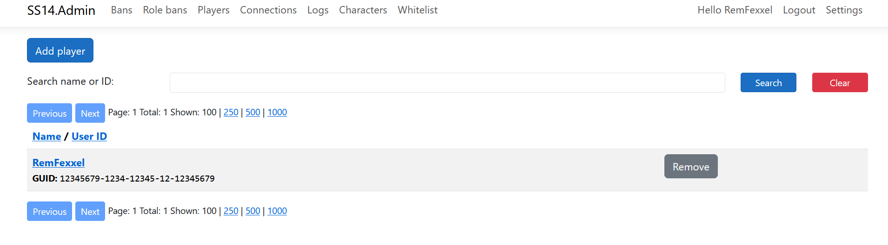

# Admin Tooling

The tools at a Game Admin's disposal take some time to get used to. The tools can range from being easy to understand to requiring a few hours to understand.

## Admin Menu

The Admin Menu can be opened by pressing F7 or using the button bar at the top.

The *Admin* tab contains useful actions for general admin use.

The *Adminbus* tab gives you control of many things--including spawning entities, tiles, or decals, as well as running/stopping station events.

The *Atmos* tab lets you modify the atmosphere for the current grid. You shouldn't need to use this when regularly admining.

The *Round* tab lets you control the flow of the current round. You can start, end, or restart the round using this menu. There are equivalent commands for all of these.

The *Server* tab lets you shutdown/restart the entire server, or toggle OOC/LOOC. This is only available to admins with the proper flags.

The *Panic Bunker* tab lets you toggle settings for the Panic Bunker, such as enabling or disabling the Panic Bunker, automatically enabling or disabling the Panic Bunker, count deadmined players, and showing the reason why the Panic Bunker is enabled. You can also set the minimum required account age or overall playtime to bypass the Panic Bunker.

The *Player* tab lets you view all of the players in a round. You can also toggle the **Player Overlay** here, which draws some basic information (username, character name, is antag) over all players in-game.

The *Objects* tab lets you view all of the grids, maps, and stations in the current round, including their name and Entity IDs. You can also teleport to an object or delete it from the tab.

---

## Verbs

### Admin Verbs

There are multiple admin verbs available. These are all fairly self-explanatory. 

- **Clone:** Clones the targeted player's current entity.

- **Erase:** Deletes the targeted player's entity from the round. Useful for removing a character from a round entirely. 

- **Mark:** Places an entity into the $marked variable, a list of entities, replacing its prior value.

- **Message:** Opens the ahelp window targeted at the player.

- **Open Admin Notes:** Opens the user's notes. 

- **Open Player Panel:** Opens a panel with the targeted player's information, such as their username, and if they are whitelisted. The panel also includes their total playtime, notes, bans, role bans, and shared connections. The admin verbs are included in the Player Panel.

- **Teleport Here/To:** Self-explanatory.

- *Freeze* stops them from moving or interacting until they are unfrozen by an admin.

---

### Debug Verbs

The debug verbs are primarily for debugging, but are also very useful for normal admins.

- **Control Mob:** Gives you control of the entity, if they are sentient.

- **Delete:** Deletes the entity.

- **Edit Solutions:** Opens a tab that lists the current reagents in the entity. This includes reagents in their bloodstream or temporarily in their bloodstream. You can modify the solutions and reagents in the tab.

- **Export Sprite:** Exports the entity's sprite to the SS14 Data folder.

- **In Range Unoccluded**

- **Make Ghost Role:** Makes an entity a Ghost role that dead players can request.

- **Rejuvenate:** Fully heals an entity and removes any temporary reagents in their body. Only use when necessary.

- **Set Outfit:** Opens a tab with preset outfits you can set a player to wear. Some outfits may include extra items. This verb is useful for running events or respawning players.

---

### Smite Verbs

Use sparingly. These smites can range from minor inconveniences to severely affecting a player's round negatively.

---

## Admin Help

The **Admin Help** menu can be opened by pressing `Esc -> Admin Help`, by using the `Player Actions Panel` in the **Admin Menu**, or by using the `Message` admin verb.

Select the player to message or use any of the buttons via the menu on the left. The 'sword' icon lets you know if they're an antagonist. It also shows their current character name as well as their username. The pin on the far right of the player's name can be toggled to lock the player's name to the top of the playerlist. Useful for keeping note of a player or when you are handling a situation involving certain players.

- **Admin Only:** Checking the option will make your messages sent to a player's ahelp only visible to other admins.
- **Bwoink:** Checking or unchecking the option enables or disables the ahelp message sound for the player. This does not apply whenever a normal player ahelps.
- **Ban list:** Opens a tab containing all of the player's bans and information on the ban.
- **Notes:** Opens a tab containing any notes about the player and
- **Kick:** Kicks the player from the server.
- **Ban:** Opens the Banning panel with the target's username autofilled.
- **Respawn:** Sends the targeted player to the lobby. Does not delete their character.
- **Follow:** Makes you follow the targeted player.

---

## Admin Logs

The admin logs menu shows you all interactions that have occurred during the round, as well as which entities and players were involved. It can be opened in the *Admin* tab of the **Admin Menu**.

The far left menu lets you filter by log type. The second-from-the-left menu lets you filter by the player/entity who was involved in the log. 

The top left *Round* spinbox lets you change which round you're looking at, though this rarely needs to be done except for retroactive ahelps.

You can filter by *log impact* at the top, though this is rarely needed if you know what you're looking for.

You can view the actual log data on the far right menu, and search for logs. If the log you're looking for doesn't show up, try hitting *refresh* (you'll likely need to do this when changing which player or log type you're looking for*. If it still doesn't show up, press *Next* and wait for a couple of seconds.

The *Pop out* button pops the log menu into a separate OS window. Useful for saving some space on your main monitor.

---

## Admin Notes

Admin notes give admins a way to store information about a user when a ban would be too harsh a punishment. Notes can be edited (and show their edit information), and can be deleted if the note is no longer relevant.

Admin notes by default expire after six months, slowly becoming less visible. You can hover your mouse over the note to make it easier to see.

Notes can be accessed using the `Admin` verb category, at the bottom of the AHelp menu, or by typing "adminnotes [username] in the console.

## View Variables
**View variables** is a very, very useful tool that allows you to view all marked variables on every component that an entity has, as well as modify some. Useful for debugging, but also has great use for adminning as it allows you to add or remove arbitrary components, for example `OwOAccent`. Further explanation of how to use **View variables** (VV) is given below.

---

A couple of things to discuss about how SS14 works before the VV menu can be useful to you:

- An 'entity' is an object in game--walls, players, projectiles, items, etc. Each entity has a unique `EntityUid` corresponding to it, which is the number `15199` you see at the top left next to the entity's name.
- Each entity (generally) has a prototype ID, or the 'type' of entity it is. This is the `MobObserver` string you see at the top left.
- Entities have **components**, which give some kind of behavior to the entity. The component for a 'player-controlled' entity is `ActorComponent`, for a weapon it is `MeleeWeaponComponent`, for damageable objects it is `DamageableComponent`, etc. You can dynamically add and remove components whenever you want.
- The game is separated into 'client' and 'server', with some shared stuff between them. Client is what's running on your computer, server is what's running on the game server, obviously.

Most of the time, you'll want to view the **Server Components** list, as you can add/remove/modify components there, and every client will see the effects.

I recommend that you simply try and use the VV menu to get a feel for how it works. It's a little daunting, but once you get the hang of using VV, you'll be able to fix problems within an entity and try new ideas with less trouble.

### VV Tips

- Press `enter` after modifying a variable to save its value.
- Some variables may look non-modifiable, but there may be a modifiable version of them further down the list.
- `TransformComponent` holds the entity's position, rotation, etc.
- `Grids` (the station) are entities too, and their components can be changed
- You can modify the `zoom` on the client-side `EyeComponent` to see farther.
- `MindComponent` contains information like antag roles, jobs, objectives, etc.
- An entity's name/description can be changed using `Server Variables`, or on the server-side `MetaDataComponent`.

## Game Console

---

The console can be opened using the tilde `~` key, unless rebound. Any player can open it, but I'm just mentioning it here in case you were unaware of that fact. Commands can be run by typing the command and then the arguments, like any shell. Important client logs will show up here as well, so it's useful for debugging.

Use the `list` command to list all available commands, and the `help <command name>` command to view instructions for the command.

### Useful Commands

| Command                                 | Description                                                                                             | Syntax                                                                     |
|-----------                            |-----------                                                                                            |-----------                                                                |
| `aghost`                               | Turn yourself into an admin ghost, or back again.             |                                                                                   |
| `deadmin`                           | Lets you play the game without getting admin notifications. Always use before playing in a round normally.|   |
| `readmin`                           | Returns all admin functions to the user after they `deadmin`. Not necessary to run upon joining.|   |
| `help`                                   | Shows information about the specified command.                  | `help <keyword>`                                                   |
| `list`                                  | Lists all commands in the game.                                               |                                                                                   |
| `list <keyword>`              | Lists all commands with the specified keyword.                   | `list <keyword>`                                                     |
| `quit`                                  | Closes the game.                                                                               |                                                                                      |
| `adminwho`                          | List all admins online.                                                               |                                                                                   |
| `togglehealthoverlay`   | Toggles a visual layer for the playerhealth.                       | `togglehealthoverlay <true/false>`               |
| `scale`                                  | Make things bigger or smaller. Relative to current size (2 twice is the same as 4 once).| `scale <uid>`|
| `adduplink`                       | Adds an uplink to a PDA and links it to the user.           | `adduplink <ckey> <pda uid>`                           |
| `lsobjective`                      | Shows all objectives of the targeted player.                       | `lsobjective <ckey>`                                           |
| `addobjective`                  | Adds an objective, requires the objective ID.                   | `addobjective <ckey> <objectiveID`               |
| `rmobjective`                      | Removes an objective from the players mind.                       | `rmobjective <ckey> <number>`                       |
| `fixgridatmos`                  | Resets all atmos on the grid to breathable and clean.   | `fixgridatmos <GRID_ID>` (use autofill)   |
| `tpto`                                   | Teleport all targets to the first `<ckey/uid>` in the command.                                       | `tpto <ckey/uid> <ckey/uid> <ckey/uid>`          |
| `tp`                                       | Teleports yourself to the coordinates on the specified map.                                           | `tp <X> <Y> <MAPID>`                                               |
| `setmind`                           | Puts the player's soul into the ID (may require the entity to have a mind).               | `setmind <uid> <ckey>`                                           |
| `customvote`                       | Creates a custom vote for all players, requires at least two choices. Always do this before running any important events.  | `customvote "<title>" "<option1>" "<option2>" ...`   |
| `addhand`                           | Adds a hand to the entity; not all entities are supported, requires the "Hands" component in the entity.   | `addhand <uid>`       |
| `adjstationjob`               | Adds or removes jobs. Can be used if a member of command leaves.                                   | `adjstationjob <STATION_ID> <job> <amount>` |
| `addgamerule`                   | Adds the chosen game event to the game.                                                                                      | `addgamerule <gameruleName>`                               |
| `endgamerule`                   | Removes the chosen gamerule from the game. Useful for repeating false events.   | `endgamerule <gameruleName>`                               |
| `rename`                              | Correct way to rename a person (includes ID, PDA, and cloner entries).                   | `rename <ckey/uid> <"FIRSTNAME LASTNAME">`  |
| `setadminooc`                   | Changes the color of your adminchat while being an admin.                                               | `setadminooc <HEX Code>`                                       |
|`addcomp`                                | Adds a component to an entity.                                                                                                        | `addcomp <uid> <component name>`                        |
|`banlist`                                | List all bans for a user.                                                                                                                    | `banlist <ckey>`                                                        |
|`dock`                                        | Tries to dock two docking airlocks together.                                                                            | `dock <airlock uid 1> <airlock uid 2>`            |
|`forcemap`                                | Forces the next map to the given map.                                                                                            | `forcemap <map prototype id>`                                |
|`forcepreset`                        | Forces the next game preset to the given preset.                                                                    | `forcepreset <preset prototype id>`                    |
|`loadgamemap`                        | Loads a new game map into the given coordinates on the given map ID. Useful for impromptu nukies.|`loadgamemap <map prototype id> <mapid> <x> <y>`|
|`vv`                                            | Open the view variables menu on an entity. Useful for VV-ing grids.                                | `vv <uid>`                                                                    |

---

## SS14.Admin

If you're an official Space Wizards :tm: Admin, you can access the online admin panel at https://ss14-admin.spacestation14.com/. Log in using your SS14 account. Third-party servers can also set up this panel for themselves using the repository, so thats why this information is here and not secret.

The *Bans* tab at the top is the most useful. This shows all current bans. You can search by active bans or total bans for any player. **This menu shows PII (personally identifying info) such as HWID and IP, so do not ever reveal this information to others.**

You can see the ban time, reason, and when it expires. You can also check *ban hits*, or whether someone attempted to join and was denied because of a ban, as well as what username/IP/HWID they tried to join with. Useful for detecting ban evaders. You can also unban users on this panel.

The *Role Bans* tab shows all current role bans. You can search by name, ID, HWID, role, IP, or the banning admin. **This menu shows PII (personally identifying info) such as HWID and IP, so do not ever reveal this information to others.**

The *Players* tab just lets you search by username, IP, HWID, etc, for any user. **Contains lots of PII, be careful.**

You can click on *Player Info* to the far right of the player's name to view their PII, play time, characters, notes, bans, and rolebans.

The *Connections* tab shows you the most recent connections to the servers as well as information for each connection.

The *Logs* tab shows you actions that have occurred. You can search by a date range, text, server, round, player, type, and severity.

The *Characters* tab shows you all characters a player has currently saved on the server.

The *Whitelist* tab shows you all current whitelisted players.

## Admin Ghost
You can turn yourself into an aghost using the **Admin Menu** or by using the `aghost` command.

Admin ghosts are special observer entities that replace your ghost's name with your username, have hands, can interact with any object ingame, and have all access. You also spawn with a Satchel of Holding and an Admin PDA.

You can return to your initial body whenever, as long as the body is still in the round.

## Deadmin / Readmin

If you want to play the game normally, it's recommended that you deadmin using the `deadmin` command. If you want to perform admin duties again or need to use your powers in a certain situation, use the `readmin` command.
