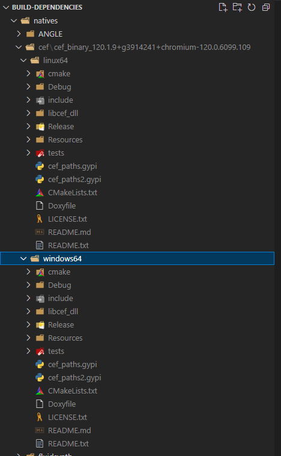

# Updating CEF

CEF (Chromium Embedded Framework) FUCKING SUCKS. FUCKING HELL. Here's how to update it.

## Download the latest stable CEF build

Go [here](https://cef-builds.spotifycdn.com/index.html), download the latest stable build for Windows 64-bit and Linux 64-bit.

## Update Xilium.CefGlue

`Xilium.CefGlue` is the C# binding we use for the CEF API. They don't update upstream all that frequently but when they do it's worth merging in their changes. You'll have to accept THEIR changes for conflicts, because we've made plenty of changes that conflict otherwise.

Update `CefGlue.Interop.Gen/include` with the latest headers from the CEF bundle you downloaded earlier, then re-run `gen-cef3.cmd`.

If there's been any changes to the CEF API you might need to update the rest of CefGlue to make it compatible etc. Do that.

## Update Robust.Natives.Cef

These are the NuGet packages that ship the CEF binaries to regular developers of RT/OpenDream so they don't have to manually download CEF from above.

Clone [`build-dependencies`](https://github.com/space-wizards/build-dependencies). Extract your downloaded CEF copies (for both platforms) into `natives/cef/` so it looks like this: 



Strip the Linux binaries, you do this by running `strip *.so` in the `Release/` folder of the Linux download. Use WSL if you're on Windows.

Then update `Packages/Robust.Natives.Cef/Robust.Natives.Cef.nuspec` so the files are correct for the new CEF version. You need the files from `Release/` and `Resources/` in the CEF build.

Run `dotnet pack ./Packages/Robust.Natives.Cef/Robust.Natives.Cef.csproj` to produce `Packages/Robust.Natives.Cef/bin/Release/Robust.Natives.Cef.<VERSION>.nupkg`.

## Modify `nuget.config` in your test repo

Ok so obviously you're gonna be testing stuff yeah? You don't want to upload the above native package to NuGet in case it doesn't work, but how do you test that it *does* work? Well that's easy, use a local NuGet source!

The repo you're testing against will have a `nuget.config` file next to the solution. It'll look like this (or similar):

```xml
<?xml version="1.0" encoding="utf-8"?>
<configuration>
  <packageSources>
  	<add key="nuget" value="https://api.nuget.org/v3/index.json" />
    <add key="dotnet-eng" value="https://pkgs.dev.azure.com/dnceng/public/_packaging/dotnet-eng/nuget/v3/index.json" />
  </packageSources>
</configuration>
```

You can locally make the NuGet package above available by adding the full path to your `Packages/Robust.Natives.Cef/bin/Release/` from earlier as a source: 

```xml
<?xml version="1.0" encoding="utf-8"?>
<configuration>
  <packageSources>
  	<add key="nuget" value="https://api.nuget.org/v3/index.json" />
    <add key="dotnet-eng" value="https://pkgs.dev.azure.com/dnceng/public/_packaging/dotnet-eng/nuget/v3/index.json" />
    <add key="cef" value="E:\ss14\build-dependencies\Packages\Robust.Natives.Cef\bin\Release" />
  </packageSources>
</configuration>
```

## Update Robust.Client.WebView

With all the previous steps taken care of, you can now bump the `PackageReference` in `Robust.Client.WebView` to the new version. After building and running, *hopefully* everything will work!

## TEST EVERYTHING

CEF has this nasty habit of being a massive fucking dependency that can break in a morbillion ways. TEST THAT YOU DIDN'T BREAK ANYTHING.

Specifically, test OpenDream on Windows, Linux, and both again through the launcher. You can test the launcher by following [Testing against launcher](./testing-against-launcher.md). Just use `Tools/package_webview.py` to package the zip for it.

## Upload natives to NuGet

Upload `Robust.Natives.Cef` to https://www.nuget.org/. There's a big upload button, use it. It'll take a while because the whole package is a couple hundred megabytes (oof) but thankfully there's no limit I know of.

## Commit everything

Commit everything to CefGlue, build-dependencies and Robust. Yay!

## Upload new Robust Module to centcomm

* SSH into suns
* `mkdir /var/lib/robust-builds/modules/Robust.Client.WebView/<rt_version>`
* `scp release/Robust.Client.WebView* suns:/var/lib/robust-builds/modules/Robust.Client.WebView/<rt_version>`
* cd `/home/robust-build-push`
* `./push_module.ps1 Robust.Client.WebView <rt_version>`