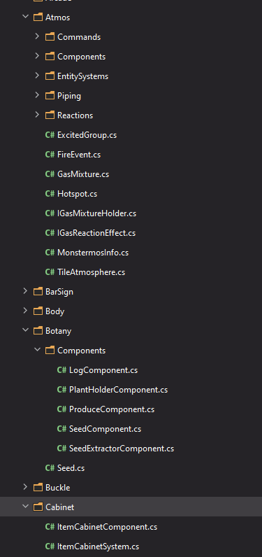

# Codebase Organization

## Projects

SS14 and RobustToolbox are split into several different projects. The main ones you'll care about are the `Client`, `Shared`, and `Server` projects. Other projects are for smaller things like integration tests, benchmarks, or database-specific code. 

`Client`, `Shared`, and `Server` are each packaged into different 'assemblies', which is basically .NET talk for executables or shared libraries.

The `Client` project in both Robust and SS14 contains client-specific code, like UI. This assembly is only sent to the client, the person actually playing the game.

The `Server` project contains server-specific code that no specific client should be able to interact with, like atmospherics or botany. This assembly is only located on the game server.

The `Shared` project contains shared code that can be used by the client or the server. This assembly is not executable, and it relies on the client or server to call functions in it or use data classes located within it. The purpose of shared is to allow for network prediction (where the client and server run the same code, to make things smoother) as well as to specify shared data classes, like network messages, so that the client and server can speak to each other effectively.

Shared code is only allowed to access other shared code, not client or server code. However, client and server code are always allowed to access shared code.

## Game Code

In SS13, all game code is randomly thrown around under `code/`, and instead of grouping by relevance to systems, is grouped by abstract things like whether the file is a list of constants or whether a file pertains to a master controller subsystem. In SS14, we first delineate by which game system we're working with (atmos/botany/buckling, etc) and then by the classes needed for it, which is much easier for anyone actually trying to work within a single system.

`Content.Client`, `Content.Shared`, and `Content.Server` all follow this organization. RobustToolbox's equivalents do not currently, but will in the future.

- All game code will be organized in folders directly under Content.Client/Shared/Server etc.
- Game code folders are split into Components, EntitySystems, Visualizers, UI, Prototypes, etc
- If there would only be one file in a folder, it doesn't need a folder (unless that file would go directly into the project's top directory, which is undesirable).
- Do not use 'misc' folders; misc folders are hell for organization and its completely arbitrary what goes inside them and what doesn't. You can encapsulate smaller game systems inside larger game systems if it unambiguously makes sense (Atmos -> Piping), but don't just slap all the smaller game systems into a misc folder.

This structure should hopefully be very clear after working with it or seeing examples.

A real example, under `Content.Server` at `da11cbd8e6bef3373ec1f570df7d7b9155a3890f`

- Atmos is a fairly large game system. It has many folders, and many files that do not need to go in these folders.
- Botany is a smaller game system. However, it only has one folder for Components since that's all that's really there.
- ItemCabinets are a very small game system. They just have a component and EntitySystem, and thus do not need folders for each.

## Resources

The resources folder is another area where we hope to improve over the organization structure of SS13 codebases.

### Entity Prototypes

New folders should usually only be created for a new parent type. If you find something that can be pulled out into a parent prototype, it should go in its own folder.

Parent prototypes should be contained in `base.yml` in this folder, while other prototypes go in a different file.

Not everywhere is organized like this; however, the `Structures` folder is.

This was chosen to make the directory structure mirror the prototype inheritance tree, making it obvious where to place new prototypes as well as being fairly unambiguous when choosing to create new folders.
