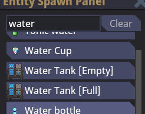

# Conventions

There are nearly infinite ways to program, but as a result, it's near impossible to keep code maintainable without some strict rules about how the code should look at and work.

```admonish info
The last thing we'd want is someone to integrate their F# + ClojureCLR DSL into Space Station 14 because they think that C# isn't "functional" enough.
```

As such, this document outlines SS14's style guides, which are to be supplemented with Microsoft's official [C# coding conventions](https://learn.microsoft.com/en-us/dotnet/csharp/fundamentals/coding-style/coding-conventions). We'd highly recommend getting a C# code formatter, which are hidden somewhere in your IDE.

```admonish info
Keep in mind that some older areas of the codebase might not follow these conventions. These should be refactored in the future to follow them.

All new code should try to follow these conventions as closely as possible.
```

# General Coding Conventions

## File Layout

1. Files should always start with the [using directives](https://learn.microsoft.com/en-us/dotnet/csharp/language-reference/keywords/using-directive) at the top of the file.

2. All classes should be explicitly namespaced.  
   Use [file-scoped namespaces](https://learn.microsoft.com/en-us/dotnet/csharp/language-reference/proposals/csharp-10.0/file-scoped-namespaces), e.g. a single `namespace Content.Server.Atmos.EntitySystems;` before any class definitions instead of `namespace Content.Server.Atmos.EntitySystems { /* class here */ }`.

3. Always put all fields and auto-properties before any methods in a class definition.

````admonish example "File Layout Example"
```cs
// Using directives at the top (truncated)
using Content.Shared.Administration.Logs;

// Explicitly-namespaced, before any declarations
namespace Content.Server.Teleportation;

public sealed class PortalSystem : SharedPortalSystem
{
    // Fields before methods
    [Dependency] private readonly ISharedAdminLogManager _adminLogger = default!;

    protected override void LogTeleport(EntityUid portal, EntityUid subject, EntityCoordinates source,
        EntityCoordinates target)
    {
        // Truncated
    }
}
```
Source: [`Content.Server/Teleportation/PortalSystem.cs`](https://github.com/space-wizards/space-station-14/blob/ee8224bce22c5d5ca76faaa43b2fc8441f356610/Content.Server/Teleportation/PortalSystem.cs)
````

## Comments

1. Comment code at a high level to explain _what_ the code is doing, and more importantly, _why_ code is doing what it is doing.

```admonish info "Why Vs. What"
It's common for people to blindly adhere to idea that you should only "comment the why, not the what", but you should strive to also explain the what as you are not the only person who is going to be reading and writing code.
```

````admonish example "Why + What Example"
You should not just do Why, but also the What. While the variables are technically self-documenting, if you do not know the math behind this, you will not understand what wizardry is happening.

Thus, the what should also be documented as well as the why.

```cs
// Let n = moles(inlet) - moles(outlet), really a Δn
var P = inlet.Air.Pressure - outlet.Air.Pressure; // really a ΔP
// Such that positive P causes flow from the inlet to the outlet.

// We want moles transferred to be proportional to the pressure difference, i.e.
// dn/dt = G*P

// To solve this we need to write dn in terms of P. Since PV=nRT, dP/dn=RT/V.
// This assumes that the temperature change from transferring dn moles is negligible.
// Since we have P=Pi-Po, then dP/dn = dPi/dn-dPo/dn = R(Ti/Vi - To/Vo):
float dPdn = Atmospherics.R * (outlet.Air.Temperature / outlet.Air.Volume + inlet.Air.Temperature / inlet.Air.Volume);

// Multiplying both sides of the differential equation by dP/dn:
// dn/dt * dP/dn = dP/dt = G*P * (dP/dn)
// Which is a first-order linear differential equation with constant (heh...) coefficients:
// dP/dt + kP = 0, where k = -G*(dP/dn).
// This differential equation has a closed-form solution, namely:
float Pfinal = P * MathF.Exp(-comp.G * dPdn * dt);

// Finally, back out n, the moles transferred in this tick:
float n = (P - Pfinal) / dPdn;
```
Source: [`Content.Server/Atmos/EntitySystems/HeatExchangerSystem.cs#L56-L76`](https://github.com/space-wizards/space-station-14/blob/ee8224bce22c5d5ca76faaa43b2fc8441f356610/Content.Server/Atmos/EntitySystems/HeatExchangerSystem.cs#L56-L76)
````

2. When documenting classes, structs, methods, properties/fields, and class members, use [XML docs](https://docs.microsoft.com/en-us/dotnet/csharp/language-reference/xmldoc/)

````admonish example "XML Doc"

```cs
// ... truncated ...
namespace Content.Shared.Communications;

/// <summary>
/// Only exists in shared to provide API and for access.
/// All logic is serverside.
/// </summary>
public abstract class SharedCommsHackerSystem : EntitySystem
{
    /// <summary>
    /// Set the threats prototype to choose from when hacking a comms console.
    /// </summary>
    public void SetThreats(EntityUid uid, string threats, CommsHackerComponent? comp = null)
    {
        /// ... truncated ...
    }
}

/// <summary>
/// DoAfter event for comms console terror ability.
/// </summary>
[Serializable, NetSerializable]
public sealed partial class TerrorDoAfterEvent : SimpleDoAfterEvent { }
```

Source: [`Content.Shared/Communications/SharedCommsHackerSystem.cs`](https://github.com/space-wizards/space-station-14/blob/ee8224bce22c5d5ca76faaa43b2fc8441f356610/Content.Shared/Communications/SharedCommsHackerSystem.cs)

````

## Methods

1. If you have too many parameters to a function and need to wrap it with a newline, break it apart so each line has **only one parameter**.

````admonish example "Method paramater formatting"

```cs
    public void CopyTo(
        ISerializationManager serializationManager,
        NPCBlackboard source,
        ref NPCBlackboard target,
        IDependencyCollection dependencies,
        SerializationHookContext hookCtx,
        ISerializationContext? context = null)
    {
        // ... truncated ...
    }
```
Source: [`Content.Server/NPC/NPCBlackboardSerializer.cs#L84-L91`](https://github.com/space-wizards/space-station-14/blob/ee8224bce22c5d5ca76faaa43b2fc8441f356610/Content.Server/NPC/NPCBlackboardSerializer.cs#L84-L91)
````

## Strings and Identifiers

1. Human-readable text should never be used as an identifier or vice versa. That means no putting human-readable text (result of localization functions) in a dictionary key, comparing with `==`, etc...  
   This avoids spaghetti when these inevitably have to be decoupled for various reasons, and avoids inefficiency and bugs from comparing human-readable strings.

2. If you're doing something like a filter/search dialog, use `CurrentCulture` comparisons over human-readable strings. Do not use invariant cultures.

````admonish example "CurrentCulture Comparison Example"
```cs
var entitySpriteStates = GroupEntities(entities);
var orderedStates = entitySpriteStates.ToList();
orderedStates.Sort((x, y) => string.Compare(
    Identity.Name(x.First(), _entityManager),
    Identity.Name(y.First(), _entityManager),
    StringComparison.CurrentCulture)); // Uses StringComparison.CurrentCulture to sort
```
Source: [`Content.Client/ContextMenu/UI/EntityMenuUIController.cs#L93-L98`](https://github.com/space-wizards/space-station-14/blob/ee8224bce22c5d5ca76faaa43b2fc8441f356610/Content.Client/ContextMenu/UI/EntityMenuUIController.cs#L93-L98)

````

## Properties

1. In a property setter, the value of the property should always literally become the `value` given. Never try to map a value inside of a setter. Always assume that the caller has done their due diligence and has converted it _for_ you.

````admonish example "Proper Properties Examples"

```cs
[MethodImpl(MethodImplOptions.AggressiveInlining)]
public void SetMoles(int gasId, float quantity)
{
    if (!float.IsFinite(quantity) || float.IsNegative(quantity))
        throw new ArgumentException($"Invalid quantity \"{quantity}\" specified!", nameof(quantity));


    if (!Immutable)
        // Doesn't modify input and instead directly passes it
        Moles[gasId] = quantity;
}
```
Source: [`Content.Shared/Atmos/GasMixture.cs#L122-L130`](https://github.com/space-wizards/space-station-14/blob/ee8224bce22c5d5ca76faaa43b2fc8441f356610/Content.Shared/Atmos/GasMixture.cs#L122-L130)
````

## Constants & CVars

1. If you have a specific value like an integer, you should generally make it either:
   - a constant (`const`) if it's never meant to be changed (immutable).
   - a CVar if it's meant to be configured.

## Prototypes

1. Don't cache prototypes, instead use the `prototypeManager` to index them when they are needed. You can store them by their ID.  
   When using data-fields that involve phototype ID strings, use ProtoId<T>.

````admonish example "ProtoID Example"
```cs
[Serializable, NetSerializable]
public struct AlertState
{
    public short? Severity;
    public (TimeSpan, TimeSpan)? Cooldown;
    public bool AutoRemove;
    public bool ShowCooldown;
    public ProtoId<AlertPrototype> Type;
}
```
Source: [`Content.Shared/Alert/AlertState.cs#L6-L14`](https://github.com/space-wizards/space-station-14/blob/ee8224bce22c5d5ca76faaa43b2fc8441f356610/Content.Shared/Alert/AlertState.cs#L6-L14)
````

2. You should **always** use prototypes over enums, and enums are _heavily discouraged_.

# Resources

## Sounds

1. When specifying sound data fields, use `SoundSpecifier`.

````admonish example "SoundSpecifier Example"

```cs
[RegisterComponent, NetworkedComponent, Access(typeof(SharedDiceSystem))]
[AutoGenerateComponentState(true)]
public sealed partial class DiceComponent : Component
{
    [DataField]
    public SoundSpecifier Sound { get; private set; } = new SoundCollectionSpecifier("Dice");

    // ... truncated ...
}
```

Source: [`Content.Shared/Dice/DiceComponent.cs#L7-L12`](https://github.com/space-wizards/space-station-14/blob/ee8224bce22c5d5ca76faaa43b2fc8441f356610/Content.Shared/Dice/DiceComponent.cs#L7-L12)

```yaml
- type: soundCollection
  id: Dice
  files:
  - /Audio/Items/Dice/dice1.ogg
  - /Audio/Items/Dice/dice2.ogg
  - /Audio/Items/Dice/dice3.ogg
  - /Audio/Items/Dice/dice4.ogg
  - /Audio/Items/Dice/dice5.ogg
  - /Audio/Items/Dice/dice6.ogg
  - /Audio/Items/Dice/dice7.ogg
```

Source: [`Resources/Prototypes/SoundColletions/dice.yml`](https://github.com/space-wizards/space-station-14/blob/ee8224bce22c5d5ca76faaa43b2fc8441f356610/Resources/Prototypes/SoundCollections/dice.yml)


````

### Sprites and Textures

1. When specifying sprite or texture data fields, use `SpriteSpecifier`.

````admonish example "SpriteSpecifier Example"

```cs
/// <summary>
/// Texture path used in the CargoConsole GUI.
/// </summary>
[DataField]
public SpriteSpecifier Icon { get; private set; } = SpriteSpecifier.Invalid;
```
Source: [`Content.Shared/Cargo/Prototypes/CargoProductPrototype.cs#L68-L72`](https://github.com/space-wizards/space-station-14/blob/ee8224bce22c5d5ca76faaa43b2fc8441f356610/Content.Shared/Cargo/Prototypes/CargoProductPrototype.cs#L68-L72)
````

2. In the YAML, you do not need to include the `/Textures/` part of the path.

````admonish example "Textures Path Example"
```yml
- type: MyComponent
  icon: /Textures/path/to/my/texture.png

# /Textures/ is inferred here, but make sure that you don't start the path with a slash if you don't specify it
- type: MyComponent
  icon: path/to/my/texture.png

# You can specify an rsi sprite like this
- type: MyOtherComponent
  icon:
    sprite: /Textures/path/to/my/sprite.rsi
    state: MySpriteState
```
````

3. RSI meta.json should have this specific order of fields:

   1. version
   2. license
   3. copyright
   4. size
   5. states

4. Make sure not to minify the JSON, and should follow the normal JSON quality guidelines (Egyptian brackets, etc). You can optionally follow the [Google JSON Style Guide](https://google.github.io/styleguide/jsoncstyleguide.xml).

````admonish example "JSON Formatting Examples"

```json
{
    "version": 1,
    "license": "CC-BY-SA-3.0",
    "copyright": "Modified from https://github.com/discordia-space/CEV-Eris/raw/f7aa28fd4b4d0386c3393d829681ebca526f1d2d/icons/obj/drinks.dmi",
    "size": {
      "x": 32,
      "y": 32
    },
    "states": [
      {
        "name": "icon",
        "delays": [
        [
            1,
            1,
            1,
            1
        ]
      ]
    }
  ]
}
```
Source: [`Resources/Textures/Objects/Consumable/Drinks/royrogers.rsi/meta.json](https://github.com/space-wizards/space-station-14/blob/ee8224bce22c5d5ca76faaa43b2fc8441f356610/Resources/Textures/Objects/Consumable/Drinks/royrogers.rsi/meta.json)

````

## Entities

1. When using `EntityUid` in admin logs, use the `IEntityManager.ToPrettyString(EntityUid)` method.

````admonish example "Pretty EntityUid Example"

```cs
_adminLogger.Add(LogType.Slip, LogImpact.Low,
    $"{ToPrettyString(other):mob} slipped on collision with {ToPrettyString(uid):entity}");
```

Source: [`Content.Shared/Slippery/SlipperySystem.cs#L110-L111`](https://github.com/space-wizards/space-station-14/blob/ee8224bce22c5d5ca76faaa43b2fc8441f356610/Content.Shared/Slippery/SlipperySystem.cs#L110-L111)

````

2. If you need to pass "optional" entities, you should use a nullable `EntityUid` for this. Never use `EntityUid.Invalid` to denote the absence of `EntityUid`. Always use `null`.

````admonish example "Nullable EntityUid"

```cs
[ByRefEvent]
public readonly struct AfterFlashedEvent
{
    public readonly EntityUid Target;
    public readonly EntityUid? User;
    public readonly EntityUid? Used;

    // ... truncated ...
}
```
Source: [`Content.Server/Flash/FlashSystem.cs#L234-L239](https://github.com/space-wizards/space-station-14/blob/ee8224bce22c5d5ca76faaa43b2fc8441f356610/Content.Server/Flash/FlashSystem.cs#L234-L239)

````

## Components

```admonish warning
There used to be a style guide about using `[Friend(...)]` in components, but as it was absent from the codebase, it was deleted.
```

1. All data in components should be public

````admonish example "Public Data Example"

```cs
[ByRefEvent]
public readonly struct AfterFlashedEvent
{
    public readonly EntityUid Target;
    public readonly EntityUid? User;
    public readonly EntityUid? Used;

    // ... truncated ...
}
```
Source: [`Content.Server/Flash/FlashSystem.cs#L234-L239](https://github.com/space-wizards/space-station-14/blob/ee8224bce22c5d5ca76faaa43b2fc8441f356610/Content.Server/Flash/FlashSystem.cs#L234-L239)

````

2. If you want to specify which types are allowed to read or modify the data in your class, use `[Access(...)]`. Components should always specify their access restrictions whenever possible, and usually only allow the entity systems that wrap them to modify their data.

````admonish example "Access Example"

```cs
[Access(typeof(ChemMasterSystem))]
public sealed partial class ChemMasterComponent : Component
```

Source: [`Content.Server/Chemistry/Components/ChemMasterComponent.cs#L12-L13`](https://github.com/space-wizards/space-station-14/blob/a88e747a0b338a217a8cf97a32fe8b8f8789492d/Content.Server/Chemistry/Components/ChemMasterComponent.cs#L12-L13)

````

3. If a shared component is inherited by server-side and client-side counterparts, it should be marked as `abstract`.

````admonish example "Abstract Component Example"

```cs
public abstract class SharedAccessSystem : EntitySystem
```

Source: [`Content.Shared/Access/Systems/SharedAccessSystem.cs#L9`](https://github.com/space-wizards/space-station-14/blob/ee8224bce22c5d5ca76faaa43b2fc8441f356610/Content.Shared/Access/Systems/SharedAccessSystem.cs#L9)
````

## Entity Systems

1. Game logic should _always_ go in entity systems, not components. Components should _only_ hold data.

````admonish example "Separation of Data and Logic example"

Systems have logic:

```cs
public sealed class PaperSystem : EntitySystem
{
    // ... truncated ...
    public override void Initialize()
    {
        base.Initialize();


        SubscribeLocalEvent<PaperComponent, ComponentInit>(OnInit);
        SubscribeLocalEvent<PaperComponent, BeforeActivatableUIOpenEvent>(BeforeUIOpen);
        SubscribeLocalEvent<PaperComponent, ExaminedEvent>(OnExamined);
        SubscribeLocalEvent<PaperComponent, InteractUsingEvent>(OnInteractUsing);
        SubscribeLocalEvent<PaperComponent, PaperInputTextMessage>(OnInputTextMessage);


        SubscribeLocalEvent<ActivateOnPaperOpenedComponent, PaperWriteEvent>(OnPaperWrite);


        SubscribeLocalEvent<PaperComponent, MapInitEvent>(OnMapInit);
    }
}
```

Source: [`Content.Server/Paper/PaperSystem.cs#L17-L41`](https://github.com/space-wizards/space-station-14/blob/ee8224bce22c5d5ca76faaa43b2fc8441f356610/Content.Server/Paper/PaperSystem.cs#L17-L41)

Components have data:

```cs
public sealed partial class PaperComponent : SharedPaperComponent
{
    public PaperAction Mode;
    [DataField("content")]
    public string Content { get; set; } = "";


    [DataField("contentSize")]
    public int ContentSize { get; set; } = 6000;


    [DataField("stampedBy")]
    public List<StampDisplayInfo> StampedBy { get; set; } = new();


    /// <summary>
    ///     Stamp to be displayed on the paper, state from beauracracy.rsi
    /// </summary>
    [DataField("stampState")]
    public string? StampState { get; set; }
}
```

Source: [`Content.Server/Paper/PaperComponent.cs#L7-L24`](https://github.com/space-wizards/space-station-14/blob/ee8224bce22c5d5ca76faaa43b2fc8441f356610/Content.Server/Paper/PaperComponent.cs#L7-L24)

````

2. When possible, try using the `EntitySystem`'s [proxy methods](https://github.com/space-wizards/RobustToolbox/blob/master/Robust.Shared/GameObjects/EntitySystem.Proxy.cs) instead of using the `EntityManager` directly.

````admonish example "Proxy Methods Example"

Do:
```cs
public bool DoEmagEffect(EntityUid user, EntityUid target)
{
    // HasComp<T>() is a Proxy Method
    if (HasComp<EmaggedComponent>(target))
        return false;

    // ... truncated ...
}
```

Source: [`Content.Shared/Emag/Systems/EmagSystem.cs#L77-L81`](https://github.com/deltanedas/space-station-14/blob/16be126ca1e65ebc94a0d688d7d5eca749fc272d/Content.Shared/Emag/Systems/EmagSystem.cs#L77-L81)

**Do not do:**
```cs
        public bool DoEmagEffect(EntityUid user, EntityUid target)
        {
            // prevent emagging twice
            if (IsEmagged(target))
                return false;

            // ... truncated
        }

        /// <summary>
        /// Returns whether an entity has the emagged marker component
        /// </summary>
        public bool IsEmagged(EntityUid uid)
        {
            // I REPAET! DO NOT DO THIS:
            return EntityManager.HasComponent<EmaggedComponent>(uid);
        }
```

Source: [Outdated `Content.Shared/Emag/Systems/EmagSystem.cs#L154-L178`](https://github.com/deltanedas/space-station-14/blob/8e8bc7d0d31c75518619b280907b45850e1c420f/Content.Shared/Emag/Systems/EmagSystem.cs#L154-L178)

````

3. All public Entity System API Methods that deal with entities and game logic should _always_ follow this very specific structure.
   1. All relevant `Entity<T?>` and `EntityUid` should come first in the parameters.
      - The `T?` stands for the component type that you need from the entity.
      - The question mark `?` must be present to mark it as nullable.
   2. Any other parameters you want should come afterwards.
   3. The first thing you should call in the body of the method should be `Resolve` for the entity UID and components.

````admonish example "Entity System API Methods Example"

```cs
/// <summary>
/// Sets whether or not the entity's eyelids are closed.
/// </summary>
/// <param name="eyelids">The entity that contains an EyeClosingComponent</param>
/// <param name="value">Set to true to close the entity's eyes. Set to false to open them</param>
public void SetEyelids(Entity<EyeClosingComponent?> eyelids, bool value)
{
    if (!Resolve(eyelids, ref eyelids.Comp))
        return;

    if (eyelids.Comp.EyesClosed == value)
        return;

    eyelids.Comp.EyesClosed = value;
    Dirty(eyelids);

    if (eyelids.Comp.EyeToggleActionEntity != null)
        _actionsSystem.SetToggled(eyelids.Comp.EyeToggleActionEntity, eyelids.Comp.EyesClosed);

    _blindableSystem.UpdateIsBlind(eyelids.Owner);

    DoAudioFeedback(eyelids, eyelids.Comp.EyesClosed);
}
```

Source: [`Content.Shared/Eye/Blinding/Systems/EyeClosingSystem.cs#L74-L96`](https://github.com/space-wizards/space-station-14/blob/b1c123efae5fdcc1ba8d968c32ef85321afb939c/Content.Shared/Eye/Blinding/Systems/EyeClosingSystem.cs#L74-L96)

````

```admonish note
The `Resolve` helper performs a few useful checks for you. In `DEBUG`, it checks whether the component reference passed (if not null) is actually owned by the entity specified.

The `Resolve` helper function performs a few useful checks for you:
- In `DEBUG` mode, it verifies that the component referenced passed (if non-null) is actually owned.
- It will log an error by default if the entity is missing any components.
    - This error logging can be disabled by passing `false` to the helper's `logMissing` argument.
- If you want to disable error logging for optional components, use the `TryX` pattern methods or others.

Please note that the `Resolve` helper also has overloads for resolving 2, 3 or even 4 components at once.

If you want to resolve components for multiple entities, or you want to resolve more than 4 components at once for a given entity, you'll need to perform multiple `Resolve` calls.
```

4. Extension methods (methods with an explicit `this` as the first argument) should never be used on any classes directly related to simulation, such as `EntityUid`/components/entity systems.

```admonish note
Extension methods on `EntityUid` are used throughout the codebase, however this is bad practice and should be replaced with entity system public methods instead.
```

5. Prefer system dependencies instead of resolving the system using `IoCManager`.

````admonish example "System Dependencies Example"

Use an entity system dependency:

```cs
[Dependency] private readonly IRobustRandom _random = default!;
_random.Prob(0.1f);
```

**DO NOT DO**:

```cs
var random = IoCManager.Resolve<IRobustRandom>(); // DO NOT DO THIS
random.Prob(0.1f);
```
````

## Events

1. Method Events (events that you raise when you want to perform a certain action) are **prohibited**. **Always** use Entity System methods instead.
   - There is an exception for circumstances that the Entity System wraps the Method Event.

````admonish example "Entity Systems Methods Example"

Always use Entity System methods or their appropriate proxy methods on a system to perform an action.
```cs
EntitySystem.Get<DamageableSystem>().ChangeDamage(uid, 10);
```

**Never** use method events.

```cs
RaiseLocalEvent(uid, new ChangeDamageEvent(10));
```

In this example, it would be fine to have a Method Event if internally the implementation of `DamagableSystem.ChangeDamage(...)` raised the `ChangeDamageEvent(...)`.
````

2. Event names should always be suffixed with `[some]Event`
3. Event handlers names should always be in the format `On[NamedEvent]`

```admonish example "Event and EventHandler Naming Example"

Events:
`DamagedEvent`, `AnchorAttemptEvent`, etc

Event Handlers:
`OnDamagedEvent`, `OnAnchorAttemptEvent`, etc

```

4. Events should be structs (not classes).
5. Events should always be raised by ref, and should be read-only if applicable.

````admonish example "Events Example"

Events should generally look like:

```cs
[ByRefEvent]
public record struct EmpPulseEvent(float EnergyConsumption, bool Affected, bool Disabled, TimeSpan Duration);
```
Source: [`Content.Server/Emp/EmpSystem.cs#L139-L140`](https://github.com/space-wizards/space-station-14/blob/b1c123efae5fdcc1ba8d968c32ef85321afb939c/Content.Server/Emp/EmpSystem.cs#L139-L140)

And using the event should generally look like:

```cs
public void DoEmpEffects(EntityUid uid, float energyConsumption, float duration)
{
    var ev = new EmpPulseEvent(energyConsumption, false, false, TimeSpan.FromSeconds(duration));
    RaiseLocalEvent(uid, ref ev);
    // ... truncated ...
}
```

Source: [`Content.Server/Emp/EmpSystem.cs#L69-L72`](https://github.com/space-wizards/space-station-14/blob/b1c123efae5fdcc1ba8d968c32ef85321afb939c/Content.Server/Emp/EmpSystem.cs#L69-L72)

````

6. EventBus should be preferred over C# events where possible, as C# events can leak when used with ephemeral components.
   - C# events should only be used for out-of-simulation events, such as UI events.
   - Remember to always unsubscribe them.

````admonish example "EventBus Example"

```cs
var entChangeEv = new ConstructionChangeEntityEvent(mech, uid);
entityManager.EventBus.RaiseLocalEvent(uid, entChangeEv);
entityManager.EventBus.RaiseLocalEvent(mech, entChangeEv, broadcast: true);
entityManager.QueueDeleteEntity(uid);
```

Source: [`Content.Server/Construction/Completions/BuildMech.cs#L68-L71`](https://github.com/space-wizards/space-station-14/blob/b1c123efae5fdcc1ba8d968c32ef85321afb939c/Content.Server/Construction/Completions/BuildMech.cs#L68-L71)

````

7. Use events instead of async for any game simulation.
   - For things such as DoAfter, always use events instead of async.
   - Async is generally virulent (meaning if one part is async, suddenly much more of the codebase needs to become async), cannot be serialized (which is why you don't use it for DoAfter), and generally causes bad code.
   - Events, on the other hand, tie in nicely with the rest of the architecture and are way more lightweight.

## UI

1. You should always prefer using XAML over C#-defined UIs.
   - It's much easier to deal with XAML than the weird C# UI.
   - It's fine to extend C#-defined UIs, but they should all be converted at some point.

````admonish example "XAML-Defined UI"

Example of a XAML-defined UI:

```xaml
<Control xmlns="https://spacestation14.io">
    <BoxContainer Margin="8,8,8,8" Orientation="Vertical">
        <BoxContainer Orientation="Horizontal">
            <Label Name="StoreItemName" HorizontalExpand="True" />
            <Button
                Name="StoreItemBuyButton"
                MinWidth="64"
                HorizontalAlignment="Right"
                Access="Public" />
        </BoxContainer>
        <PanelContainer StyleClasses="HighDivider" />
        <BoxContainer HorizontalExpand="True" Orientation="Horizontal">
            <TextureRect
                Name="StoreItemTexture"
                Margin="0,0,4,0"
                MinSize="48 48"
                Stretch="KeepAspectCentered" />
            <Control MinWidth="5"/>
            <RichTextLabel Name="StoreItemDescription" />
        </BoxContainer>
    </BoxContainer>
</Control>
```

Source: [`Content.Client/Store/Ui/StoreListingControl.xaml`](https://github.com/space-wizards/space-station-14/blob/b1c123efae5fdcc1ba8d968c32ef85321afb939c/Content.Client/Store/Ui/StoreListingControl.xaml)
````

## Performance

1. Always use [iterator methods](https://docs.microsoft.com/en-us/dotnet/csharp/iterators) over creating a new collection and returning for performance reasons.
   - This is a tradeoff as iterators allocate a lot of memory, but are much faster.
   - If you need to reduce allocations as much as possible, use struct iterators.

````admonish example "Iterator Methods Example"

```cs
public void UpdateListing()
{
    var sorted = _cachedListings.OrderBy(l => l.Priority).ThenBy(l => l.Cost.Values.Sum());


    // should probably chunk these out instead. to-do if this clogs the internet tubes.
    // maybe read clients prototypes instead?
    ClearListings();
    foreach (var item in sorted)
    {
        AddListingGui(item);
    }
}
```

Source: [`Content.Client/Store/Ui/StoreMenu.xaml.cs#L77-L88`](https://github.com/space-wizards/space-station-14/blob/b1c123efae5fdcc1ba8d968c32ef85321afb939c/Content.Client/Store/Ui/StoreMenu.xaml.cs#L77-L88)

````

2. All classes should be marked as either `abstract`, `static`, `sealed`, or `[Virtual]`.

   - It slightly improves performance when accessing or invoking virtual members
   - Specifically, use each of them for this specific circumstance:
     - **`sealed`** is it shouldn't be inherited
     - **`[Vertual]`** for default C# behavior
     - **`static`** for non-instantiated classes
     - **`abstract`** only inherited, never instantiated

3. Always try to run code in response to an event rather than updating every tick.

4. Avoid variable capturing when using [lambdas](https://learn.microsoft.com/en-us/dotnet/csharp/language-reference/operators/lambda-expressions) or [local functions](https://docs.microsoft.com/en-us/dotnet/csharp/programming-guide/classes-and-structs/local-functions)

   - Variable capture can make the GC work less efficiently and waste allocations.

5. If you're using a [`Func` delegate](https://docs.microsoft.com/en-us/dotnet/api/system.func-2), make sure to overload it so that custom data can be passed in.

````admonish example "Func Delegate Example"

Do This:
```cs
void DoSomething(EntityUid otherEntity)
{
    // This is good and much more performant.
    var predicate = (EntityUid uid, EntityUid otherUid)
    		=> uid == otherUid;

  	// Pass our custom data to this method.
    MethodWithPredicate<EntityUid>(predicate, otherEntity);
}
```

**DO NOT DO THIS**:

```cs
void DoSomething(EntityUid otherEntity)
{
    // This is BAD. It will allocate on the heap a lot.
    var predicate = (EntityUid uid) // DO NOT DO THIS
        => uid == otherEntity;

  	// This method doesn't allow us to pass custom data,
    // so we're forced to do a costly variable capture.
    MethodWithPredicate(predicate);
}

```

````

## Shared

1. Shared types should only be prefixed with `Shared` if and only if there is a server and/or client inherited type with the same name.

```admonish example "Shared Example"
If `FooComponent` only exists in shared, it doesn't need a prefix.

??? What about only one ???

If `BarComponent` exists in shared, server and client, the shared type should be prefixed with shared: `SharedBarComponent`.
```

## Physics

1. Always use `TransformComponent` for anchoring.
   1. You may use the `PhysicsComponent` static body anchoring **only** if you know what you're doing and can defend it.

````admonish example "TransformComponent Example"
```cs
private void OnExamined(EntityUid uid, GasVolumePumpComponent pump, ExaminedEvent args)
{
    if (!EntityManager.GetComponent<TransformComponent>(uid).Anchored || !args.IsInDetailsRange) // Not anchored? Out of range? No status.
        return;

    // ... truncated ...
}
```

Source: [`Content.Server/Atmos/Piping/Binary/EntitySystems/GasVolumePumpSystem.cs#L60-L63`](https://github.com/space-wizards/space-station-14/blob/af7f70bade908658416be91c5571cab1160e18ec/Content.Server/Atmos/Piping/Binary/EntitySystems/GasVolumePumpSystem.cs#L60-L63)
````

# YAML Conventions

1. Every component's `- type` should be together without an empty newline separating them.

````admonish example "YAML Component Newline Example"

```yaml
- type: Fixtures
    fixtures: {}
- type: OccluderTree
- type: SpreaderGrid
- type: Shuttle
- type: GridPathfinding
- type: Gravity
    gravityShakeSound: !type:SoundPathSpecifier
    path: /Audio/Effects/alert.ogg
```

Source: [`Resources/Maps/Salvage/small-chef.yml#L48-L56`](https://github.com/space-wizards/space-station-14/blob/af7f70bade908658416be91c5571cab1160e18ec/Resources/Maps/Salvage/small-chef.yml#L48-L56)
````

2. Separate prototypes with one empty newline

````admonish example "YAML Prototype Newline Example"

```yaml
- type: mixingCategory
  id: DummyGrind
  verbText: mixing-verb-default-grind
  icon:
    sprite: Structures/Machines/juicer.rsi
    state: juicer0


- type: mixingCategory
  id: DummyJuice
  verbText: mixing-verb-default-juice
  icon:
    sprite: Structures/Machines/juicer.rsi
    state: juicer0


- type: mixingCategory
  id: DummyCondense
  verbText: mixing-verb-default-condense
  icon:
    sprite: Structures/Piping/Atmospherics/condenser.rsi
    state: display
```

Source: [`Resources/Prototypes/Chemistry/mixing_types.yml#L11-L30`](https://github.com/space-wizards/space-station-14/blob/af7f70bade908658416be91c5571cab1160e18ec/Resources/Prototypes/Chemistry/mixing_types.yml#L11-L30)
````

3. The `name:` and `description:` fields should never have quotations unless punctuation requires the use of them.

4. Do not specify textures in abstract prototypes/parents.

5. You should declare the first prototype block in this order:

   1. `type`
   2. `abstract`
   3. `parent`
   4. `id`
   5. `name`
   6. `description`
   7. `components`

6. New components should not have an indent when added to the `components:` section.

7. When it makes sense, place more generalized/engine components near the top of the components list and more specific components near the bottom.

````admonish example "Generalized Components Example"

```yaml
    components:
    - type: Sprite # Engine-specific
    - type: Physics
    - type: Anchorable # Content, but generalized
    - type: Emitter # A component for a specific type of item
```

````

8. IDs and component names should be in `PascalCase`

   - `prefix.Something` should **never** be used for IDs.

9. Everything else, even prototype names, use `camelCase`.

10. You can use the `suffix` property in prototypes as a spawn-menu-only suffix to help you distinguish prototypes without modifying the prototype name.

```admonish example "Suffix Property Example"

One example is for the Water Tank, which provides an empty and full variant.

Instead of having to change the name of the prototype, we can just add a suffix of `Empty` or `Full`.

As a result, it'd look like:


```

# Localization

1. Every player-facing string needs to be localized.

2. Localization IDs are always in `kebab-case`, and should never contain capital letters.

3. Localization IDs should be as specific as possible to avoid conflicts with other IDs.

````admonish example "Localization ID Example"
```ftl
antag-traitor-user-was-traitor-message = ...
```
````
