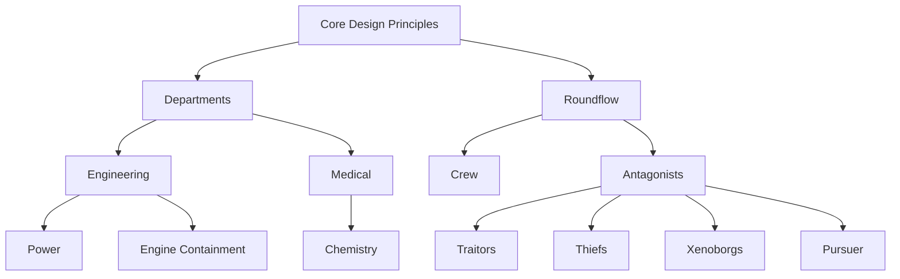

# Design Documents and Proposals
Design documents outline or guide a game area, department, mechanic, or system design.
They are extremely important for organizing SS14's development.

Overall, a design document seeks to achieve the following goals:
1. **Design documents are important for establishing a general direction and working towards a vision.**
   1. It is useful for contributors and maintainers to know whatever you're thinking, and how your feature will fit into the game.
   2. Sometimes things are simply incompatible with a previously existing design or goal, and we don't want you to waste your time making something that has to be rejected at the end of the day. Similarly, you shouldn't write a feature to completion and then attempt to write a design document that justifies your added feature. This usually results in a lot more wasted time.
   3. It is essential that ideas, problems, solutions, etc. do not get lost to time. SS14 has been burned in the rear by people forgetting *why* we made a decision, going down a path we already found out the hard way as to why it doesn't work. As such, design documents serve as a way to outline your reasoning and preserve your thought process as to why something exists.
2. **Design documents inform the players and contributors as to how something should be.**
   1. Not everyone knows what you're thinking, and sometimes it's tiring explaining your idea over and over again. By explicitly outlining your intentions and goals, people will be more comfortable following through with your idea.
3. **Design documents allow you to think about your design critically and with other people.**
   1. It's best to write down what you intend to do/solve somewhere instead of winging it first try after you asked around. This also allows fellow contributors to review your ideas, offer advise, compliment your design, or point out issues.

As such, we highly encourage you to write a design document if necessary.
This page should tell you everything you need to know if you're considering writing one - be sure to read it fully.

## Writing design documents
These further sections outline what should be seen out of a design document.

### Do I need to write a design document?
It depends on where your goals align in the following section. In general, if you're adding a major roundflow element, department mechanic, antagonist, or other large feature, you should consider making a design document.

Minor features shouldn't need a design document, but instead use existing design documents to justify their addition when a pull request is made to the content repository.

### Design documents should be tiered
Design documents should be structured in a way so that each design document is derived or supported by the design document that came before it.
This cuts down on having to explain *why* game design elements are beneficial, and instead focus on *how* your design satisfies what is desired out of a feature.

In general, higher-level design documents should outline base gameplay and very general principles that designs under them should try and follow. Lower-level design documents would then outline features, mechanics, or other gameplay that try to satisfy said principles.

For example, take the following dependency tree:

In this instance:
- The core design principles would outline general goals that designs should fulfill.
  - For example, department mechanics should be engaging, promote social behavior, and work towards chaotic gameplay.
- The department design document would outline how the department fulfills these ideas.
  - How do departments interact with players? We need to promote social behavior, so there should be some form of interdepartmental cooperation.
  - How should departments structure their gameloops? Should departments work around mechanics that are available to everyone?
- The *specific* (engineering in this case) design document would then outline how the department establishes itself as a department.
  - This is a good place to talk about a department's "theme" and what players are expected to do, and what mechanics they'll be interacting with the most.
  - Maybe Engineering is getting their hands dirty most of the time, with gameplay being repair-focused and keeping up with station degradation.
  - Maybe engineering is tasked with powering the station - how is powering the station engaging, and how does it promote interdepartmental cooperation?
- The later design documents would now outline features that satisfy the goals the department design document set out.
  - Engineering wants repair-focused gameplay, so what does this gameplay look like? Things like a "machine repair" design document and a "station degradation" design document belong here.
  - Engineering needs to power the station. How will they power the station? What does power look like? How will the crew interact with power?

### Design documents should defend themselves
The evil question of doom is approaching, and they have some choice words for you: Why are you doing what you're doing?

Design documents should ultimately work towards a goal, and part of that work is justifying the changes you're making, and how they contribute to your goal.
Documents shouldn't be a feature list that simply describe a list of abilities an antagonist has, or what mechanics a department has.
These abilities should come with justifications that outline _why_ these abilities are being designed this way, and how they contribute to your goal.

For example, take the Pursuer design document, an antagonist that establishes itself as a furious robot dude that chases a poor soul down and seeks to kill them.
The document explicitly outlines the _theming_ of the antagonist, and the antagonist's goals:

> The Pursuer is a midround antag focused on creating a short duration of high-intensity action for part of the crew, while keeping its overall station impact is relatively low. One crewmember is selected as the Pursuer’s target and must evade capture long enough for the Pursuer to be killed, either via the assistance of other crewmembers or a natural timer on the Pursuer’s end, while the Pursuer aims to kill and gib the target through various brute-force methods. The Pursuer is designed to be loud, intimidating and bulky, with a ramping strength that pushes towards an exciting climax.

In this, we've already outlined a few goals:
- The antagonist adds a spike of chaos while not being extremely problematic to the point where it causes the station a lot of trouble.
- The pursuer has a single target and must kill it or else it runs out of time. We expect the crew to either intervene or the player to hold a PhD in running away from things.
- The theming of the antagonist is established - it's a terrifying hunk of metal, and it wants to kill you.

The document then describes a list of features, but makes sure to say why those features are necessary and how they work towards the established design goal.

### Design documents should not delve into technical implementation details
Design documents seek to establish what your design is, why you're doing what you're doing, and how it should be produced.
As such, design documents should try to stray away from how a feature will be implemented technically.
This is often irrelevant to a design document - contributors want to know how to create more features or mechanics that align with your design goals, not how to code them.
In general, this guideline is less strict as you start to move closer to a low-level design document that's outlining a concrete feature.
Core design principles or higher-level design documents shouldn't be delving into technical details.

For example, a Traitors design document should never, ever, outline how `StealthSystem` is used for making a lot of invisible stealth-based traitor equipment.
Instead, the document should elaborate on how traitors are expected to use stealth equipment.
Do they use it offensively? Defensively? How expensive should the equipment be?
Should it be a get-out-of-jail-free card, or something that requires careful planning?

This is especially true for design documents that put focus on how players express creativity, or mechanics designed around players making creative combinations from available mechanics.
For example, the Atmospherics design document outlines how devices should not perform everything all in one device, rather devices should perform one operation at a time:

> Atmospherics and its mechanics, tooling, and devices should perform small unit operations, or single tasks, with multiple devices coming together to form a larger system. Just like how all logic gates (and computers in general) are built off of the universal logic gates `NAND` and `NOR`, atmospheric systems are built via the combination of smaller devices.
>
> This allows for a wide variety of solutions to problems and encourages players to think creatively about how to solve them. There should rarely be a single “correct” solution to a problem, instead players should be able to come up with their own solutions based on the tools available to them.

It _does not_ go into detail as to how these devices will be split on a technical level, how they interact with each other using `NodeContainer`s, how they transfer gas to each other using `PipeNet`s, etc.
Those are all implementation details that are determined when PRing the feature.

### Design documents should not be written as if the feature already exists
Design documents should be written from the perspective of someone who hasn't interacted with your feature before.
We can't see inside your head, or what you've personally experienced.
The person reading the document needs to know the _context_ and surrounding _events_ that drove you to make the decisions that you made.

- If your design document is explicitly designing around bad gameplay, it should state what that gameplay was, why it was bad for the game, and how the new design plans to resolve the previous issues.
- If your design document mentions that a similar design existed in SS13, you should *really* take advantage of whatever lessons that were learned (or lack thereof) in SS13. Mentioning that a feature "existed in SS13" shouldn't be used as automatic justification for a feature existing, as SS14 is different and lacks a lot of the surrounding mechanics and context that might have made a design good in SS13.
