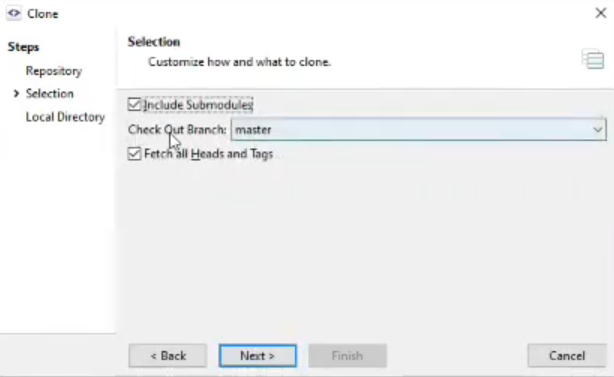
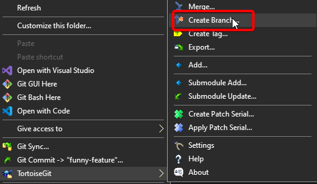
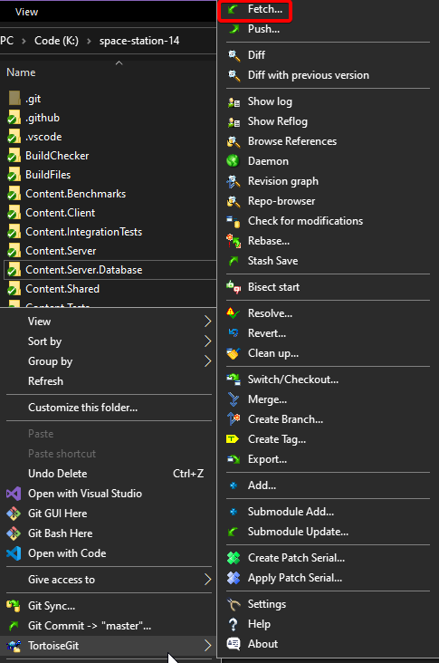

# Git for the SS14 Developer

This guide will get you ready to contribute to Space Station 14 in Git with no prior experience.

This guide isn't a one-stop shop for Git (nor should you think it is). This is just here to serve as a reference for people who _only_ really want to learn enough to contribute to Space Station 14.

We're obliged to give you some alternative (and probably better) resources:

- [Atlassian's Git Guides](https://www.atlassian.com/git/tutorials/setting-up-a-repository). Excellent short Git tutorials.
- [The Git Book](https://git-scm.com/book/en/v2). The free official book endorsed by the Git developers.
- [Oh shit, Git?!](https://ohshitgit.com/). A Git cookbook.
- [Learn Git Branching](https://learngitbranching.js.org/). A very comprehensive interactive Git tutorial. It goes way beyond the scope of this guide, but you'll be very experienced.

## Prerequisites

1. [**GitHub Account**](https://docs.github.com/en/get-started/start-your-journey/creating-an-account-on-github)  
   This is for managing your remote fork repository and making pull requests.
2. [**Git**](https://git-scm.com)  
   This is SS14's version control system.
   If you are looking for a Git GUI, you can use the one built-in to your IDE or the [many others](https://git-scm.com/downloads/guis).
   Make sure you install the Git backend along with Git Bash.
3. [**Python 3.7 or higher**](https://www.python.org/)  
   This is used for many development scripts.
   **Only download this from the Python website and not the Microsoft Store.**
   Make sure `py launcher` option is enabled.

```admonish note
Make sure that all the software you downloaded is added to your `PATH`, otherwise you will not be able to run it.
- [Git](../../assets/images/setup/git-path.png)
- [Pyhon](../../assets/images/setup/python-path.png)
```

```admonish danger "DO NOT USE GITKRAKEN OR GITHUB DESKTOP"
While Github Desktop and GitKraken do an excelent job of presenting themselves as sleek and beginner free, but you can very easily mess something up and deal with a world of pain to debug it.

Instead of them, we highly recommend that you use **Git Bash** (as will a lot of developers), but you can always use:
- [**TortoiseGit**](https://tortoisegit.org/)
  -  Old but gold Git GUI that shows info in the file explorer menu and makes basic stuff a breeze
- [**SmartGit**](https://www.syntevo.com/smartgit/)
  -  Fully featured Git GUI that's very customizable and simple to use
- [**Fork**](https://git-fork.com/)
  - Fast and extremely ergonomic GUI. "Non-free", but it's WinRAR-level non-free, so it's basically free. Has support for partial staging of
- [**Sublime Merge**](https://www.sublimemerge.com/)
  - Very similar to Fork, looks and feels great. Also has support for partial staging.
- [**Magit**](https://magit.vc/)
  - For all of the Emacs users, I don't know why I need to remind you to use Magit.
- **Your IDE's built-in Git Integration**
  - Your Git almost definitely comes with Git support built-in. Jetbrains Rider has an especially good integration. We don't talk about Visual Studio's for a reason.

Note that this guide will only provide examples for TortoiseGit, SmartGit, and Git Bash.
```

## 1. Why Git?

Git is a _version control system_ that tracks changes made to files over time. This allows you to:

- Maintain a consistent history of all changes.
- Collaborate with other developers by interweaving changes.
- Easily revert and correct changes.

Git is just a piece of software, so we use _GitHub_ to host our _repositories_ (codebase/folders) for effective collaboration.

Since Space Station 14 is open source, you can just go to our [GitHub page](https://github.com/space-wizards/space-station-14) and download the code!

## 2. Setting up Your repositories

A _repository_ (repo) is the name for a git-enhanced folder.

These repositories contain _branches_, which are made up of _commits_. A branch is a snapshot of all the files at a certain time, which is represented as a chain of commits, that themselves represent some change in the files. This will be explained more later.

As repositories are just folders, we have _remotes_, which are other places that this folder is stored. The only remote that you'll interact with in this guide is the one that points to GitHub's servers.

This all needs to be set up before you can get any work done.

### 2.A Creating Your Remote Repository (Forking)

To contribute changes to the Space Station 14 project, you'll need to create your own _fork_, or copy, of the original repository hosted on GitHub. This ensures you don't accidentally modify the main project.

Forking is similar to copying a folder, except that is all done on GitHub's server. The forked repository becomes your own, allowing you to make and test changes without affecting the main repository.

```admonish example "How to Create a GitHub Fork"

1. Navigate to the [`Space-Wizards/Space-Station-14`](https://github.com/space-wizards/space-station-14) repository.
2. Press the "Fork" button at the top right.
    

From there, it’ll ask you where to fork it and what to name it. You can choose any name, but we recommend keeping it as `space-station-14`.
```

### 2.B Creating your local repository

After creating your fork, you'll need a _clone_, or copy, on your local machine. This creates a working directory on your computer where you can modify the project files.

```admonish example "TortoiseGit Directions"
Right click to see TortoiseGit's context menu stuff:

1. Right click the of the directory you want to clone it into.
2. Click "clone".

   

3. Set the "URL" to `https://github.com/[your-username-here]/space-station-14`

   

4. Click "Ok"
```

```admonish example "SmartGit Directions"

1. Launch SmartGit and and click "clone".

   

2. Set the "Repository URL" to `https://github.com/[your-username-here]/space-station-14`

   

3. Click "Next".

4. Disable "Include Submodules". We manage this ourselves.

   

5. Keep clicking next until it's closed.

```

```admonish example "Git Bash Directions"

1. Open Git Bash in the directory that you want to clone it into.

   

2. If you aren't in the right directory, you can `cd` (change directory) until you get to it.

3. Run `git clone https://github.com/[your-username-here]/space-station-14`

```

### 2.C Submodules

```admonish danger "Pay attention to this"
If you don't pay attention to this section, you'll get a lot of weird errors about stuff not being available when you actually try to build the game.
```

```admonish note
This section is identical to the same section in the development environment guide. This means it's **extremely** important.
```

Space Station 14 utilizes submodules, which are essentially other Git repositories embedded within the main repository. These submodules, like the RobustToolbox engine, require separate updating.

To manage this, we provide a an automatic submodule updater script (`RUN_THIS.py`) root of the repository.

1. After you first clone the repository, run `RUN_THIS.py` (ideally run in a terminal like `python3 RUN_THIS.py`) found at the root of the repository using Python. If you have any issues, refer to the [troubleshooting section](#troubleshooting).

2. Verify it has succeeded by checking for `/RobustToolbox` directory with in files in it.

```admonish tip
If you actually want to modify the engine code or otherwise want to manually update submodules, create a file called `DISABLE_SUBMODULE_AUTOUPDATE` inside the `/BuildChecker/` directory.
```

## 3. Setting up remotes

When you cloned your forked repository from GitHub, a remote named origin was automatically created by Git. This remote points to your fork on GitHub.

_Remotes_ are essentially references or links to other Git repositories. They allow you to _pull_ (download) updates and _push_ (upload) your local changes to a shared repository, typically hosted on a platform like GitHub.

In addition to `origin`, it's often helpful to add another remote that points to the original, "upstream" repository maintained at `space-wizards/space-station-14`. This allows you to stay updated with the latest changes from the main repository.

We create the `upstream` remote for this purpose, as it will point and track the main repository for us.

```admonish tip
The convention is to call the remote pointing to the original repository `upstream` but you can technically call it whatever you like. I'll be referring to it as 'the upstream', though, and it's terminology Git guides use as well.
```

```admonish example "TortoiseGit Directions"

1. Right click on the directory that holds your repository.
2. Under "TortoiseGit", click "Settings".

   

3. Navigate to "Git" and then "Remote".

4. To the right of the remotes list, set the remote to "`upstream`" and the URL to "`https://github.com/space-wizards/space-station-14`".

5. Then, click "Add New/Save".

   
```

```admonish example "SmartGit Directions"

1. With the repository open in SmartGit, under "Remote", click "Add...".

   

2. Set the "URL" to "`https://github.com/space-wizards/space-station-14`" and the "Name" to "`upstream`".

3. Click "Add".

   
```

```admonish example "Git Bash Directions"
1. In your terminal inside of the repository directory, run `git remote add upstream https://github.com/space-wizards/space-station-14`.
```

Now there is a new remote named `upstream` that points to the original `space-wizards/space-station-14` repository. Now you can download updated directly from the main repository.

### 3.A Addendum for Fork/Downstream Developers

If you are not just contributing to SS14 but also the wider ecosystem, you might encounter a scenario where the target repository for your contribution is a direct fork of the SS14 project. This is indicated by a "forked from" label on GitHub.

Adding this forked repository as a remote to your local repository is an optional step, which could be useful for specific workflows or tracking changes within the fork.

The process for adding a remote is similar to adding the upstream repository.

It doesn't matter if your fork originates directly from the original project or the downstream fork. As long as the commit history in your branches aligns and they haven't diverged, your pull request will be able to work.

## 4. Branching & Commits

Branches and commits are two of the most important concepts in Git, and most of the work you do will revolve around them.

### 4.A Whats a Commit?

Commits are essentially groups of _changes_. These changes are things like creating, modifying, and deleting files.

Commits have an author, timestamp, a message, and some code changes attached to them. They also have a really long "commit hash", which is a unique identifier used to refer to different commits.

Commits are what Git's history is built out of. Though commits, you can actually view the history of the SS14 repository from the beginning.


### 4.B What's a branch?

Branches are how you turn commits into something more useful than just a change. They create meaning by chaining commits together, with newer commits changing the things changed by older commits (the commits are atomic, but if you stack the resulting files are different).

This is useful as they let people work on different features and bug fixes in isolation from other changes made in the codebase. This lets people easily collaborate simultaneously and then at the end patch everything together.

The default branch is called `master` (similar to the `main` branch convention). Think of master as the _canonical_ branch, by which all other branches are derived. When you download Space Station 14, you're actually downloading the master branch.


This diagram shows how the branches _diverge_, with each dot representing a commit and the boxes with arrows are the branch header. If you follow the chain of dots backwards, that is the history of that branch.

### 4.C Merging Branches

_Merging_ allows for divergent branches to be brought back into the same. This is usually done after implementing a feature or fix, as everyone merges into main.

Merging just means that you take the commits from one branch and then apply them onto the other branch.

After you finish your feature branch, you can create a _Pull Request_ (which is also more aptly called a Merge Request), which is a formal way of asking for another repository to pull your changes and merge it into their own branches.

Pull requests show all this information very well:


Before we get to that, there's a lot of preliminary work.

### 4.D Making Branches

```admonish danger
If you try to create a pull request from your fork's `master` branch, it will be closed automatically.
```

Make a new branch called `funny-feature`:

```admonish example "TortoiseGit Directions"
1. Right click on the directory that holds your repository.
2. Under "TortoiseGit", click "Create Branch".

   

3. Give the branch a good name (here, make it "funny-feature").
4. Then click "Ok".

   
```

```admonish example "SmartGit Directions"
1. With the repository open in SmartGit, under "Branch", click "Add Branch...".

   

2. Give the branch a good name (here, make it "funny-feature").
3. Click "Add Branch"

   
```

```admonish example "Git Bash Directions"
1. In your terminal inside of the repository directory, run `git switch -c funny-branch`.
```

With the branch created, you are now free to work however you please without fear of messing up the all-important `master` branch.

### 4.E Switching Branches

Switching between branches is simple, you just _check out_ (`git checkout` or `git switch`) the branch.

When you do this, your files and folders locally will be changed to match the branch. If you have any uncommitted changed when trying to commit, you should either commit them or stash them.

Switch to your new branch.

```admonish example "TortoiseGit Directions"
1. Right click on the directory that holds your repository.
2. Under "TortoiseGit", click "Switch/Checkout".

   

3. Then select the branch you want to switch to.
4. Then click "Ok".
```

```admonish example "SmartGit Directions"
1. With the repository open in SmartGit, under "Branch", click "Check Out...".

   

2. Select the branch you want to switch to.
3. Then click "Ok".
```

```admonish example "Git Bash Directions"
1. In your terminal inside of the repository directory, run `git switch funny-branch`.
```

Now, make whatever local changes you want! It doesn't really matter. Make a new file, delete everything, change one line in a file, etc.

It won't affect your `master` branch, because this is the `funny-feature` branch now!

### 4.F Checking the Status

Before doing anything, it's good to know what has changed in your codebase since the last commit. This lets us see what work we did and discover if we made any accidental changes.

To see what's going on the repository, just check its status or diff.

```admonish example "TortoiseGit Directions"
1. Right click on the directory that holds your repository.
2. Under "TortoiseGit", click "Diff".

   

TortoiseGit also shows all of the changed files and folders in the Windows Explorer through a red icon in the bottom right, which is really convenient.
```

```admonish example "SmartGit Directions"
1. Open the repository in SmartGit.

   

Your main screen shows the status and diffs by default.

This is assuming you installed SmartGit with the option that the main window shows diffs and status. If you didn’t, I don’t really know where it is.
```

```admonish example "Git Bash Directions"
1. In your terminal inside of the repository directory, run `git diff`.
```

### 4.G Staging and Commiting Changes

Now that you've verified that all of these changes look good, you must _stage_ your changed in Git. The staging area acts as a holding area for changes to make sure that what we are commiting is what we want to commit.

This helps you catch mistakes like accidentally committing submodules, which doesn't end well.

Once you've _staged_ your changes, it's time to make a commit. It's highly recommended to be detailed in the message that you are providing with the commit as reviewers and others reading your code can gain guidance from it.

```admonish example "TortoiseGit Directions"
1. Right click on the directory that holds your repository.
2. Select "Git Commit -> 'funny-feature'"

   

3. In that menu, write a good message.
4. Select all the files you want to stage by checking their box.
5. Finally, click "commit".

   

TortoiseGit also shows all of the changed files and folders in the Windows Explorer through a red icon in the bottom right, which is really convenient.
```

```admonish example "SmartGit Directions"
1. With the repository open in SmartGit, select all the files you want to commit.
2. Click "Stage".

   

3. Now, click "Commit".
4. Write a good commit message.
5. Finally, click "Commit".

   

You main screen by default shows the status and the diffs.

This is assuming you installed SmartGit with the option that the main window shows diffs and status. If you didn’t, I don’t really know where it is.
```

```admonish example "Git Bash Directions"
1. In your terminal inside of the repository directory, run `git status`.

2. Now, run `git add [path-to-files-to-stage]`

You can also use -A to stage all files in the repository.

3. Finally, run `git commit -m "[good commit message]"`

   
```

Now that the commit has been created, all of the changes are now in the history of our local repository.

Our `funny-feature` branch now diverges from the `master` branch, so if you chose, you can merge it back into `master` if you're a fork developer and don't intend to upstream them.

If you intend to upstream, you will create a Pull Request upstream to pull your branch and apply it there, letting everyone experience it.

## 5. Pushing and Making a PR

A _pull request_ just means that you want a codebase to merge your changes from one of your branches onto one of their branches. In the context of the `funny-feature` example, this means you would be asking the main Space Station 14 repository to pull your code and integrate it there.

GitHub only allows pull requests from repositories that are hosted on their servers, so you must update your GitHub fork (the `origin` remote) to be consistent with your local repository. To do this, we push our local branch to the `origin` remote.

### 5.A Pushing Commits

Once you've verified that you are done and all of your changes have been committed, you're ready to send them to your fork.

```admonish note
GitHub is probably going to make you authenticate to verify that it's actually you pushing to your fork instead of a random person.

If you know how to use SSH, just use SSH authentication instead.
```

When pushing changes, you need specify the remote repository that you’re pushing to and the local branch that you’re pushing from.

```admonish example "TortoiseGit Directions"
1. Right click on the directory that holds your repository.
2. Under "TortoiseGit", click "Push...".

   

3. Set the "local" branch to the branc that you are developing on, and set the "remote" branch to the same name. Make sure the remote is "`origin`".
4. Click "Ok".

   
```

```admonish example "SmartGit Directions"
1. Open the repository in SmartGit.
2. Click the "Push" button

   

3. Click "Push" again to confirm".

   

```

```admonish example "Git Bash Directions"
1. In your terminal inside of the repository directory, run `git push origin funny-feature`.
```

### 5.B Making a Pull Request

Now, with that pushed to our fork, we can now go to GitHub and make a pull request. If you recently did the push, you should see a message when viewing the upstream `space-wizards/space-station-14` repository.


Now, follow the [Pull Request Guidelines](../codebase-info/pull-request-guidelines.md) document so that you can make sure your contributions get merged.

## 6. Updating our repository

Over time, other developers will make changes and create commits onto the upstream master. In order for your changes to stay relevant and to stay on top of development, you will need to pull down those changes and integrate it locally.

To achieve this, there are two methods: _fetching and merging_, and _pulling_.

- _Pulling_ downloads the changes and automatically tries to merge them locally. This is a very simple tool but can sometimes get confusing or do incorrect things.
- _Fetching & Merging_ downloads the changes without merging them, giving you the fine-grained ability to selectively download and merge upstream changes locally. This is the more powerful but also more confusing tool.

### 6.A The Fetch + Merge Method

_Fetching_ refers to downloading the new branches and commits from a remote repository, but not doing anything with them yet. After we fetch changes from our `upstream` remote (the main SS14 repository), we'll merge them into our local `master` branch.

When you fetch a remote, it downloads the branches to your local repository and prepends their with the remotes name and a slash (As an example, `upstream` becomes `upstream/master`).

```admonish example "TortoiseGit Directions"
1. Right click on the directory that holds your repository.
2. Under "TortoiseGit", click "Fetch...".

   

3. In the Remote dropdown, select "`upstream`".
4. Click "Ok".

   
```

```admonish example "SmartGit Directions"
1. Open the repository in SmartGit.
2. Under "Remote", select "fetch".

   

This should fetch from all remotes. If it doesn't:

3. At the bottom right, right click the `upstream` branches and click `Fetch more...`.

   

```

```admonish example "Git Bash Directions"
1. In your terminal inside of the repository directory, run `git fetch upstream`.
```

Now, you need to merge those changes we just downloaded into our `master` branch. Git will usually manage merging for you, and if not, it will provide you the tools to resolve any [merge conflicts](#4a-resolving-merge-conflicts).

```admonish example "TortoiseGit Directions"
1. Right click on the directory that holds your repository.
2. Under "TortoiseGit", click "Merge...".

   

3. In the Branch dropdown, select "`remotes/upstream/master`".
4. Click "Ok".

   
```

```admonish example "SmartGit Directions"
1. Open the repository in SmartGit.
2. Under "Branch", select "Merge".

   

3. Select the commit that's tagged with "`upstream/master`".
4. Click "Create Merge-Commit".

   

```

```admonish example "Git Bash Directions"
1. In your terminal inside of the repository directory, run `git switch [branch-to-merge-into]`.

2. Run `git merge upstream/master`

You can also just directly run `git merge upstream/master [branch-to-merge-into]`.
```

### 6.B Pull method

_Pulling_ in Git is just an abstraction for fetching and then automatically merging.

Git will attempt to automatically reconcile what is being pulled and your local copy into a singular history. Pulling is often simpler as you're unlikely to run into a situation that truly requires you to fetch then merge.

We'll fetch from our `upstream` remote (the main SS14 repository) and tell it to merge into our local `master` branch automatically.

```admonish example "TortoiseGit Directions"
1. Right click on the directory that holds your repository.
2. Under "TortoiseGit", click "Pull...".

   

3. In the Remote dropdown, select "`upstream`", and in the Remote Cranch, select "`master`".
4. Click "Ok".

   
```

```admonish example "SmartGit Directions"
1. Open the repository in SmartGit.
2. Click the "Pull" button.

   

3. You can select either Rebase or Merge. Both work, but Rebase is usually prefered.

   

4. Set "Fetch From" to `upstream`. (Ignore how the picture says origin).

   

```

```admonish example "Git Bash Directions"
1. In your terminal inside of the repository directory, run `git switch [branch-to-merge-into]`.

2. Run `git pull upstream/master`
```

Now the local `master` branch is updated to the upstream one. Do this regularly as it helps make sure your changes still work against the latest version and makes it easier for your changes to integrate during merges.

# Addendum

## 1. Things to keep in mind

You’ve more or less learned the workflow for developing features for SS14 Git-wise, but here’s some things you really need to hammer into your mind:

- When creating a feature, **ALWAYS** create a new branch off of `master` before committing anything. If you accidentally do this, you're going to be in a world of pain when trying to merge as it's going to be one big merge conflict!

- **NEVER** commit any submodules like `RobustToolbox` or `Lidgren.Network` unless you know what you're doing. In the top level of the repository, they're treated as regular files, so it's possible to accidentally stage and commit them. There's some stuff in the appendix which may help, but it's not going to be enjoyable.

- If you ever need help with anything strange in Git, feel free to ask in the `#howicode` channel of the Discord. Git is built on top of arcane magic, so before running and weird online one-liners, you should probably verify what it does before it deletes all of your changes.

## 2. A Quick Example Workflow

```bash
git checkout master # Before we create a new branch, we should be on master.

# You can also just do `git pull upstream master`
git fetch upstream # We'll fetch any new changes from the SS14 repo..
git merge upstream/master # ..and merge them into our master branch.

git checkout -b my-new-feature # Make a new branch for the feature
...local changes later...
git add -A # Add all of our local changes to the staging area
git commit -m "Fix spaghetti explosions" # Commit them
git push origin my-new-feature # and push them to our remote

# Now, I want to work on a different pull request.

git checkout master

# It hasn't been too long, and nothing important was merged,
# so I won't fetch and merge changes again--just a new branch.

git checkout -b another-feature
...local changes later...
git add -A
git commit -m "Deletes nuclear operatives"

# I committed, but then I realized my commit was entirely wrong
# and i'll take it up later.

git revert HEAD
git checkout master

...a week later...

# A lot of new stuff was merged, so let's update our branch.

git fetch upstream
git merge upstream/master master
git checkout another-feature
git merge master

# Now we'll make changes and push again, this time correctly.

...local changes later...
git add -A
git commit -m "Adds Highlander gamemode"
git push origin another-feature

# Made both PRs, both were merged, so we're done here

git checkout master
git branch -d my-new-feature # Delete both old branches
git branch -d another-feature
```

## 3. Glossary; The Inner Machinations of Git

Here's a little glossary of Git concepts and terms explained in a little more detail, all in one place:

- **Branches** are self-contained versions of the codebase that you can add commits to. The default branch is **master**, but you can make as many as you like.
- **Repositories** are essentially just folders where you can use Git to make changes and keep track of changes made. Local repositories are repositories you have on your computer, and remote repositories are repositories that live on websites like [GitHub](https://github.com/space-wizards/space-station-14). Repositories are made up of a lot of branches.
- **Remotes** are names for and links to remote repositories that your local repository can use.
- **Submodules** are repositories that are located inside another repository.
- **Forks** are repositories that are based on another repository. If you're going to make a pull request to the SS14 repository, you need to fork it first.
- **The working tree** is just every file and folder and what not that's in the repository.
- **Staging** means adding (with `git add`) changes from your working tree into the "staging area", where some actions can be performed on it
- **Commits** are snapshots of the repository's working tree at a given time. Basically a save point. A "commit" is just a list of files that have been changed from the last commit, and the changes that are "committed" are the changes that you've "staged".
- **Checking out** is the act of switching to another branch so you can mess with it or look at its changes locally.
- **Merging** is the act of integrating the changes from one branch into another branch.
- **Merge conflicts** occur when integrating the changes from one branch into another can't be done automatically because they both change the same area in a file, or their changes are mutually exclusive in some other way.
- **Fetching** means getting the branches and commits of a remote repository, but not actually.. doing anything with them yet. You'll just have them updated for if you want to checkout or merge them later.
- **Pulling** is the act of integrating changes from a remote repository's branch into your local branch.
- **Pull requests** are a GitHub-specific action that allow you to request that your local branch and all of its changes is merged into another repository's branch.
- **Pushing** is the act of integrating your local changes into a remote repository.

There are _way_ more commands and concepts than this, but this should be all you need to know for basic development work.

## 4. Appendix: Helpful Tips & Tricks

There's some stuff that was intentionally left out of the main guide for brevity's sake, which would be more useful for complicated stuff.

This section is for that exact purpose, and will be exclusively in Git Bash (as that's what is most versatile for complicated Git-ing). Most Git interfaces probably have similar keywords or commands.

### 4.A Resolving Merge Conflicts

```admonish note
Previously there was a short unfinished guide that has since been replaced by an external guide.
```

Imagine you've just finished your week-long but a maintainer says to "Resolve conflicts" or they "won't merge you."

This is because it is not their job to make sure _your_ change gets added. It is their job to make sure Space Station 14 stays stable and is able to evolve, but they have no specific guarantees for any specific contribution.

To deal with merge conflicts, read [this handy guide by Atlassian](https://www.atlassian.com/git/tutorials/using-branches/merge-conflicts)!

### 4.B Checking History

Git's history is integral to how many developers interact with code. It helps you frame the current implementation in how it was built up, letting you better reason about the choice.

Sometimes you wanna find out what has recently changed so you know what things you can work on.

To do this, just run the simple command (the `--oneliner` flag truncates the log and makes you able to see more):

```bash
git log --oneliner
```

### 4.C Getting Rid of Local Changes

You might have accidentally made changes you didn’t want to, and you don’t want to bother with making an entirely new branch or something.

**Importantly, you have not committed any of these changes yet**

```bash
git reset --hard HEAD
```

This just means "change the current working tree to the last commit, overriding any changes since". **Warning**: this will delete your local changes, and you cannot undo it.

### 4.D Unstaging Changes

Let's say you accidentally staged `RobustToolbox`. Don't worry, you can just:

```bash
git reset HEAD [file]
```

Or if you want to unstage everything:

```bash
git reset HEAD
```

### 4.E Reverting a Commit

Uh oh, you accidentally committed something priavte into one of the repositories!

Well, you can do:

```bash
git revert HEAD
```

Which creates a new commit undoing all of the changes of the latest commit. If you want to revert a specific commit, you can provide the commit hash from `git log` instead of `HEAD`.

```admonish danger
`git revert` his doesn't undo those changed from Git's history.

It merely makes a new commit doing the opposite.

If you actually want to rewrite Git's history, you'll need to use a much more dangerous tool, `reset`.
```

### 4.F Resetting a Commit

```admonish danger
This can very easily go wrong and accidentally break some part of your repository, so approach this with caution.

Also, if you already pushed up the commit you want to revert, GitHub will likely still have it saved on it's servers.
```

To actually rewrite your latest commit Git's history, you can run (or any other commit hash instead of `HEAD`):

```bash
git reset --hard HEAD
```

If you pushed your change that you later reset to a remote, you'll get a warning. To deal with this, you will need to overwrite the remote branch to follow your local branch, which is achieved by:

```bash
git push origin [branch] --force
```

This `--force` flag tells the server to overwrite what it has saved. Importantly, this can overwrite _other people's work_, so if you are collaborating with other people, do this very cautiously.

### 4.G Checking Out a PR Locally

If you ever need to review someone else's PR or work on it with them, you'll need to pull down their changes locally so you can run/test/program/etc.

There's a couple of ways, each with their own downsides and upsides.

- [**GitHub CLI**](https://cli.github.com/). (Highly recommended). This is the official integration allowing you to pull down GitHub PRs.
- **Changing .git/config**. This involves telling Git to also pull all PRs instead of just regular branches. Can waste a lot of storage.
- **Adding a New Remote**. This is the most time-consuming as you manually pull from their fork/feature branch.

#### 4.G.1 GitHub CLI

After installing and setting up the [GitHub CLI](https://cli.github.com), you can just do a simple one-liner to pull it:

```bash
gh pr checkout [pr number]
```

#### 4.G.2 Changing `.git/config`

Here, we're basically telling Git to recognize all of the PRs as their own special branch to let us use the normal Git facilities. The only issue is that this will cause you to pull down _all_ of the PR branches, which is quite a lot.

1. Inside of the root directory of your Space Station 14 repository, go into the `.git` folder
   This will likely be hidden by default on Windows.
2. Open the `config` file, which should look something like:
   ```ini
   [remote "upstream"]
   url = https://github.com/space-wizards/space-station-14
   fetch = +refs/heads/*:refs/remotes/upstream/*
   ```
3. Add the line `fetch = +refs/pull/*/head:refs/remotes/upstream/pr/*` to the end, so it looks like:
   ```ini
   [remote "upstream"]
       url = https://github.com/space-wizards/space-station-14
       fetch = +refs/heads/*:refs/remotes/upstream/*
       fetch = +refs/pull/*/head:refs/remotes/upstream/pr/*
   ```
4. Now if you do `git pull upstream` or `git fetch upstream`, it should also pull down all the PRs.
5. To switch to a specific PR, you can just do `git checkout upstream/pr/[pr number]`

#### 4.G.3 Adding a New Remote

This is pretty much the worst method as it's pretty manual, but if you want to check out someone else’s fork of the game and their branches it’s pretty nice.

All you need to do is create a new remote in your repository pointing to their GitHub fork, allowing you to `fetch`/`pull` and then `checkout`.

```bash
git remote add [username] https://github.com/[username]/space-station-14
git fetch [username]
git checkout [username]/[branch name]
```

Importantly, this also lets you make PRs against their fork instead of just the upstream Space Station 14 repository.
