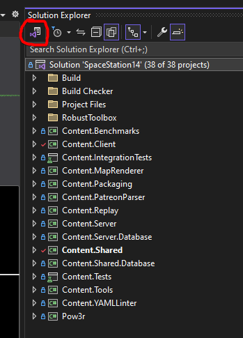
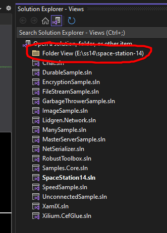
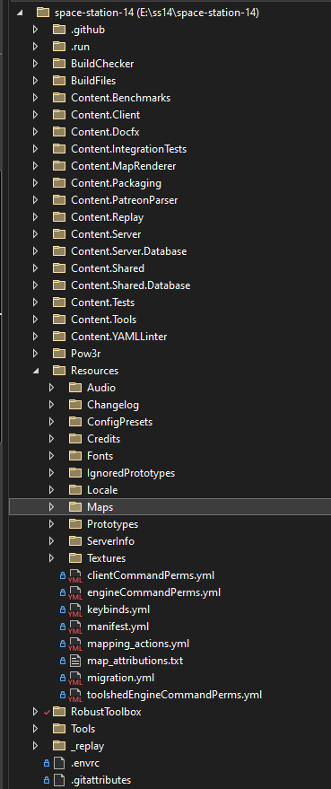
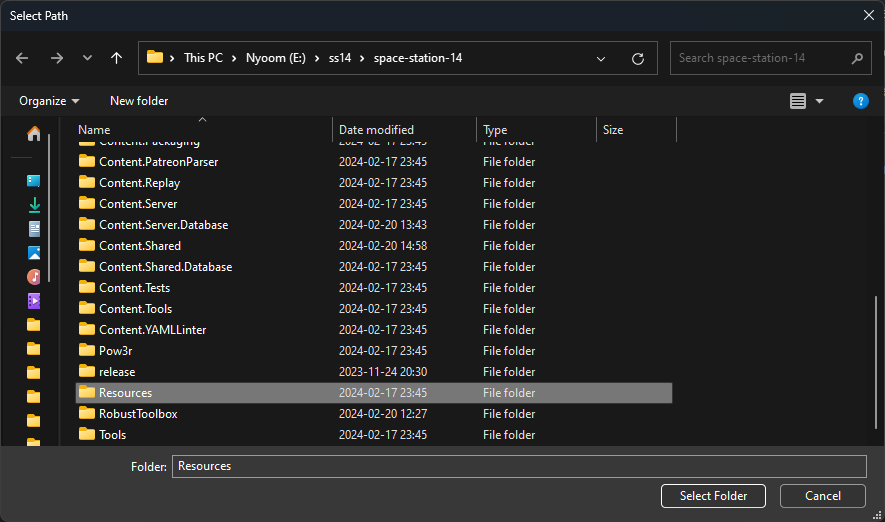
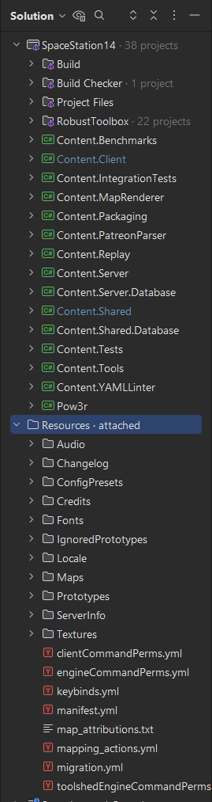

# Setting up a Development Environment

First you're gonna need some software:

* [Git](https://git-scm.com/) or one of the [many](https://www.sourcetreeapp.com/) [third-party](http://www.syntevo.com/smartgit/) [UIs](https://tortoisegit.org/) that make it easier to use. Make sure to let it install to your PATH like [this](../../assets/images/setup/git-path.png).
* [Python 3.7 or higher](https://www.python.org/). Make sure to install it into your [PATH on Windows](../../assets/images/setup/python-path.png). Also make sure the 'py launcher' option is enabled when installing on Windows. You should get python from [python.org](https://www.python.org/). Versions installed from the windows store sometimes cause build issues.
* [.NET 8.0 SDK](https://dotnet.microsoft.com/download/dotnet/8.0). Visual Studio also installs this if you're on Windows.
  * ARM (M1) Mac users: You need to make sure to install x64 .NET, **not** ARM .NET. The engine does not currently run natively on Mac ARM so using x64 via Rosetta 2 emulation is recommended. 
* Preferably an IDE to make development not painful (all free options unless otherwise noted):
  * For **Windows**, [Visual Studio 2022 **Community**](https://www.visualstudio.com/). For a minimal install (Jesus it's large) you're gonna want the .NET desktop development workload, the C# compiler, C# support, NuGet package manager, MSBuild and .NET 8 SDK or something along those lines.
  * For **macOS**, [Visual Studio for Mac](https://docs.microsoft.com/en-us/visualstudio/mac/).
  * For **all platforms**, (NOT FREE) [Rider](https://www.jetbrains.com/rider/) is one of the best IDEs available, and many SS14 devs prefer it over Visual Studio. College/University students can get a free education license, even if they're not a computer science major.
  * For **all platforms**, [Visual Studio Code](https://code.visualstudio.com/) with the C# extension. Usually an inferior IDE experience than full blown IDEs like regular Visual Studio, but some experienced programmers enjoy the minimalism.
  * For **all platforms**, [VSCodium](https://vscodium.com/) with the C# extension. Open source and without the bloat and tracking of VSCode.

## 1. Cloning

**Even if you already know Git, scroll down to read the section about submodule setup. Seriously.**

If you're **familiar with Git**, just fork and clone the repository, set up remotes, and then follow the submodule guide below.

If you're **unfamiliar with Git**, or just don't know how to proceed, follow the [Git for the SS14 Developer](./git-for-the-ss14-developer.md) guide, which goes in depth on how to contribute to the game and how to set up your initial repository. It also touches on submodule setup, but that's included here as well because of its importance.

## 2. Submodule Setup

We have an automatic submodule updater so you don't have to worry about running `git submodule update --init --recursive` all the time. 

Run `RUN_THIS.py` inside the repo you downloaded with Python. Preferably from a terminal too. This should take a few seconds so if it instantly stops then check if you are running Python 3.7+ otherwise keep reading.

**If running `RUN_THIS.py` immediately opens and closes a window: do not worry.** This does not mean that it failed. The script closes automatically upon completion, so if you want to verify that it worked properly, check the submodule `/RobustToolbox/` and verify that all the files are there. If not try checking out the troubleshooting at the bottom of this page.

Note: If you have any issues when getting started with missing files it's recommended you run `git submodule update --init --recursive` by hand once in case something went wrong with python.

If you *do* want to modify the engine directly however, or you want to update the submodule manually (the auto updating can be a pain), make a file called `DISABLE_SUBMODULE_AUTOUPDATE` inside the `BuildChecker/` directory. 

And with that, your repo is now properly setup!

## 3. Setup an IDE

### Visual Studio

1. Download Visual Studio Community (if you don't own a paid version) from here https://visualstudio.microsoft.com/vs/community/
2. Run the installer and choose `.net desktop development`, then install
3. If the installer asks you for a development environment select `Visual C#`.
4. Open Visual Studio
5. Select `Open a project or solution`, then navigate to your cloned repository from above and open `SpaceStation14.sln`

### Jetbrains Rider
* TODO

### VSCodium
1. Download [VSCodium Here](https://vscodium.com/) or more directly [on Github Here](https://github.com/VSCodium/vscodium/releases) (On the latest release, click the assets dropdown then scroll to the ZIP or .exe for your OS).
2. Run the installer or extract the zip file to a location of your choice and run the .exe once extracted.
3. Once installed, navigate to the Extensions tab (part way down on the top left corner bar, looks like 4 tiles) and search for "C#". An extension by "Muhammad-Sammy" with over 70K downloads and a green / white logo is the one, install that. Extension ID `muhammad-sammy.csharp`.
4. Select File > Open Folder, then navigate to your cloned repository from above and open this full folder.
5. When asked to open a solution, select `SpaceStation14.sln`. Alternatively, set `dotnet.defaultSolution` setting to `SpaceStation14.sln` in your workspace settings.
6. Now you can run and debug your game. Select the icon above "Extensions" from earlier for "Run and Debug" and from the dropdown next to the green play button you can select "Server/Client". This will run both the client and server, opening the game for you to debug. Relevant information will pop up in the debug along the bottom. Select the processes in the call stack on the left to change what you are debugging.

## 4. Starting SS14

Now you can get on to compiling the client and server! Use your flavor of IDE to open the solution file `SpaceStation14.sln` and press the build button.

To compile without an IDE, run `dotnet build` in the Space Station 14 repo directory. Then, call the following commands to run the client and server.
* `dotnet run --project Content.Server`
* `dotnet run --project Content.Client`

Both these commands use a debug configuration by default. To enable release optimizations, add `--configuration Release` to the dotnet invocation.
 
Note: If you're having problems with dotnet not finding libssl (e.g. when using libressl), try setting the `CLR_OPENSSL_VERSION_OVERRIDE` environment variable to the appropriate version. For instance, set it to `48` if your `/usr/lib` contains `libssl.so.48`.
If that doesn't work you can also try running `ln -s /usr/lib/libssl.so /usr/local/lib/libssl.so.1.0.0` instead.

## 5. Configuring Build Options

The SS14 client and server are independent projects, but both can launch with a single button somewhere in your IDE. This needs to be set up, however. Note: **It is recommended that you run `Content.Client` and `Content.Server` when developing from your IDE.** *Not* `Robust.Client` or `Robust.Server`. The reason is that running `Content.*` will make your IDE aware of dependencies correctly and ensure everything is rebuilt nicely. If you run `Robust.Client` directly you have to make sure the solution is fully built every time which is annoying and easy to forget. If you're unsure what Robust or Content are, check out [this page](../codebase-info/codebase-organization.md) on how the project is organized.

### Visual Studio 2022

In Visual Studio 2022, you can configure the build button to run both the server and client by right clicking the solution, then selecting `Configure StartUp Projects...`. Once the menu pops up, then select `Multiple startup projects:` and set the action for `Content.Client` and `Content.Server` to `Start`. Once you apply the changes, hitting the big `Start` button with a green arrow next to it should launch both client and server at the same time.

Note: If you're having problems with the program not getting built right, you may need to set always build before run. Go to Options `Projects and Solutions/Build and Run` and change `On Run, when projects are out of date` to `Always build`.

In VS you can also use the keys F7 to build the project and F5 to run it.

### Visual Studio Code

The C# extension provides a `"coreclr"` launch type which can be used to run the `Content.Server` and `Content.Client` executables in their respective `bin/` directories. A [compound launch configuration](https://code.visualstudio.com/Docs/editor/debugging#_compound-launch-configurations) can be used to run the server and client at the same time.

### Command Line

Build with `dotnet build` and run the client and server on different command lines with:

* `dotnet run --project Content.Server`
* `dotnet run --project Content.Client`

There's also definitely some way to run two commands at the same time, but you should probably google it.

### JetBrains Rider

In Rider you can create a "compound configuration" to run or debug both client and server at the same time. Quite convenient!


## 6. Configuring IDE directories

C# IDEs like Visual Studio and Rider do not automatically show the `Resources` folder in the project. This folder contains all non-C# files such as sprites, audio, and most importantly, YAML prototypes. These instructions will explain how to get this folder to show up in your IDE, so you can easily work with it.

### Visual Studio 2022

In Visual Studio, you can switch the **Solution Explorer** from "solution" view (only showing the C# projects) to "folder" view (showing all the files in the project). Press the button to switch views as follows, then select the folder view:




After this, the Solution Explorer should look something like this, and you should be able to easily access the `Resources` folder:



### JetBrains Rider

In Rider, you can "attach" the resources directory to the solution. Do this by right clicking the solution in the explorer, then doing "Add" -> "Existing Folder...". Select the "Resources" directory in the file picker.




After this, your solution view should look something like this, and you should be able to easily access the `Resources` folder:



### Visual Studio Code

Visual Studio Code shows all files by default, so no extra setup is needed here.

# Reproducible Development Environment with Nix/NixOS

An easier way to set up your development environment for Linux users is to leverage Nix. Nix is a package manager and a functional domain specific language that allows one to declare anything from development environments to entire systems. In order to prevent the dreaded "it works on my machine" conundrum, we can declare a development environment in Nix that spawns an isolated reproducible shell.

## Setting up Nix/NixOS with flakes

You can [install Nix](https://nixos.org/download) either through installing the NixOS distribution itself or by using the script that is compatible with all Linux distributions that use systemd (Ubuntu, Fedora, Mint etc). For the sake of simplicity and convenience, it is recommended that you install Nix in a distribution that you are comfortable with instead of making the jump to a different operating system entirely. It is also possible to use Nix with MacOS through `nix-darwin` though this has not been tested as of yet and thus not covered in this article.

Once Nix is installed, you should enable experimental features such as flakes. If you are on a non-NixOS distribution, you can just add the following to your `~/.config/nix/nix.conf`.

* `experimental-features = nix-command flakes`

If you're using NixOS, you only need to add these options to your `configuration.nix` file.

* `nix.settings.experimental-features = [ "nix-command" "flakes" ];`

For more information about how to enable Nix flakes, see [here](https://nixos.wiki/wiki/Flakes).

## Using Nix flakes for a Robust Development Environment

NB it is technically required that you already have Git installed but in the case with most Linux distributions it comes preinstalled. In the highly unlikely case that you do not:

* Use your distribution's package manager

* Declare it in your `configuration.nix` file if you're using NixOS. It's recommended that you check the [appropriate section in the NixOS manual](https://nixos.org/manual/nixos/stable/#sec-configuration-file) but in short you should add `pkgs.git` into the `environment.systemPackages` attribute.

Using your terminal you can simply navigate to the root directory of your SS14 repo and run:

* `nix develop`

Nix will automatically handle all dependencies as declared by `shell.nix` and called by the `flake.nix` file. You will have a new ephemeral shell (known as a `devShell`) that has everything that you need installed to build SS14 from source.

This remains the reason as to why flakes are highly recommended despite being considered an experimental feature. We can make sure that everyone has the same versions of dependencies by specifying the nixpkgs collection version in the input attribute of the flake and locking the versions in a `flake.lock` file. In this way, all contributors that use Nix/NixOS get to have the exact same development environment. No pun intended, but that is pretty robust!

## (Optional) Run JetBrains Rider through Nix

You can then use either use an editor or IDE of your choosing. However within the shell that you already spawned you can just specify that you require JetBrains Rider. Run this command in your devShell.

* `NIXPKGS_ALLOW_UNFREE=1 nix shell nixpkgs#jetbrains.rider --impure`

From your new shell you can start a "detached" JetBrains Rider process by running something like:

* `nohup rider >/dev/null 2>&1 &`

And voila! You have robustly set up your development environment in a way that doesn't result in pesky buildup of "state". You can practically work on SS14 from any Linux distribution (granted that they use systemd) without irreversibly changing your system.

# Troubleshooting

Make sure [the first three items](#setting-up-a-development-environment) on top are downloaded.

## `RUN_THIS.py` not running
Check that python is installed from the website and not the Microsoft Store. If it's installed from the Microsoft Store, uninstall it then download and install from the python website.

If you are on Windows and get redirected to the Microsoft Store or encounter a message in your terminal claiming that Python is not installed. This issue may be caused by a stupid Microsoft shortcut. Which you can disable by searching for `Manage App Execution Aliases` and disabling the two python references

### py not found
If python was installed from the website and the `python` command works, but you still get the error 'py is not installed', then check if `C:\WINDOWS\py.exe` works. If so, then add `C:\WINDOWS` to your path.

## System.DllNotFoundException: Unable to load DLL 'freetype6' or one of its dependencies: The specified module could not be found.

```PS C:\Users\Larme\Downloads\space-station-14> dotnet run --project Content.Client
Unhandled exception. Robust.Shared.IoC.Exceptions.ImplementationConstructorException: Robust.Client.Graphics.FontManager threw an exception inside its constructor.
 ---> System.DllNotFoundException: Unable to load DLL 'freetype6' or one of its dependencies: The specified module could not be found. (0x8007007E)
   at SharpFont.FT.FT_Init_FreeType(IntPtr& alibrary)
   at SharpFont.Library..ctor()
   at Robust.Client.Graphics.FontManager..ctor(IClyde clyde) in C:\Users\Larme\Downloads\space-station-14\RobustToolbox\Robust.Client\Graphics\FontManager.cs:line 33
   --- End of inner exception stack trace ---
   at Robust.Shared.IoC.DependencyCollection.BuildGraph() in C:\Users\Larme\Downloads\space-station-14\RobustToolbox\Robust.Shared\IoC\DependencyCollection.cs:line 348
   at Robust.Shared.IoC.IoCManager.BuildGraph() in C:\Users\Larme\Downloads\space-station-14\RobustToolbox\Robust.Shared\IoC\IoCManager.cs:line 271
   at Robust.Client.GameController.InitIoC(DisplayMode mode) in C:\Users\Larme\Downloads\space-station-14\RobustToolbox\Robust.Client\GameController\GameController.IoC.cs:line 16
   at Robust.Client.GameController.ParsedMain(CommandLineArgs args, Boolean contentStart, IMainArgs loaderArgs, GameControllerOptions options) in C:\Users\Larme\Downloads\space-station-14\RobustToolbox\Robust.Client\GameController\GameController.Standalone.cs:line 49
```

Uninstall .NET Core SDK x86. Install .NET Core SDK x64.


## The client and server aren't available in Visual Studio to configure in Multiple startup projects

This may be because you opened the project as a folder rather than a solution. Make sure you open it as a solution and click the space station 14 .sln file.

## The system cannot find the specified file RUN_THIS.py

`The system cannot find the specified file` error usually means that OneDrive is conflicting with the git repository. Clone the git repo outside of OneDrive or disable syncing for the cloned folder.
