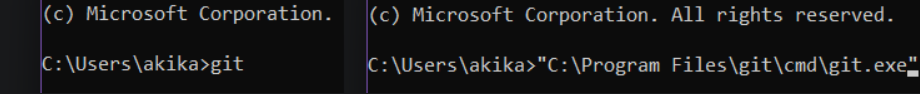
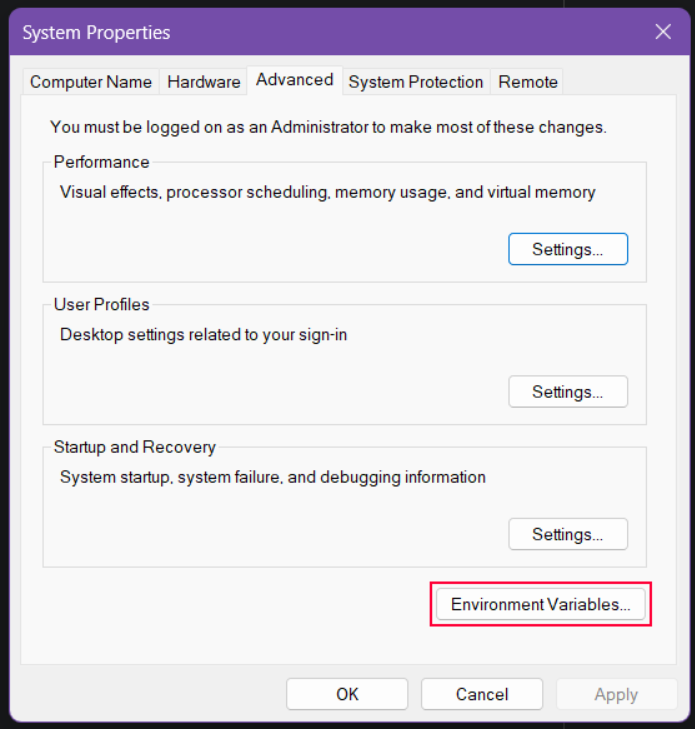
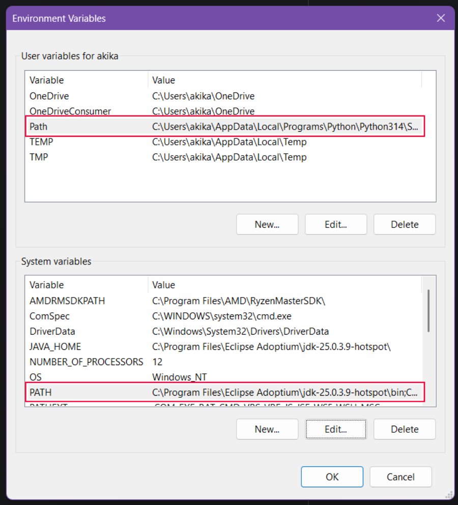

# So, you forgot to add git to path.

If you've forgotten to add git and python to path during install, or weren't provided with the option to do so, you're in the right place.

Your path environment contains "paths" (funny, right?) to folders that contain command line executables, among other things.

Your command line tool then makes these executables invokable without you needing to know or point to where the exe is located.

The difference is left and right as it were.

# So, why do I need this?

Some of the tools we use to make development easier don't assume or make exceptions if you *don't* have your path variables setup.

.\RUN_THIS.py for instance. While you can invoke the script by directly pointing to a python executable, the script itself is going to

call "git". It doesn't know where git is installed, so if git isn't in your path variable, the command will fail. This comes in the form

of a FileNotFoundError. If that's what you're seeing, now you know why.

# So, how do I fix it?

There are a few steps, but follow closely and you'll get there. It's really not that hard.

- Click start and type Path.

- Click "Edit the system environment variables". You may be prompted by UAC.

- Click "Environment Variables" in the bottom right corner.

- Double-click on Path in either the upper or lower white box.

~~~admonish info "System or User?"
You have a choice here. If you want other users on your computer to have easy access to these command line applications, choose system (lower box). Otherwise, choose user (upper box).
~~~

- This next bits the hard part. You need to know where python and git are installed.

~~~admonish info "Install Locations"
If you didn't change where the applications are installed during setup, try checking where they go by defalut first.

For Python:
    C:\Program Files\Python<Version>\ (All Users)
    C:\Users\<YourUsername>\AppData\Local\Programs\Python\Python<Version>\ (Per User)
    
For Git:
    C:\Program Files\Git\cmd\
~~~

- In the "Edit environment variable" window, double-click on a new line. A text entry box will appear and the line will highlight blue.

- Add git and python to path. You'll want to make sure path is targeting the /cmd/ folder for git and both the root and /scripts/ folder for python.

- Make certain you click OK on all three windows. Otherwise, your changes here won't save and you'll still be having problems.

- Close and restart your terminal application. Path changes don't take effect immediately. You have to restart any terminals using the path variable before changes will work.
 
- Test your changes. Open a new terminal instance and run "git".

# And done.

That's all she wrote. If for some reason you're still getting a command not recognized error or RUN_THIS.py is throwing a FileNotFoundError,

go back and ensure your changes to the path variable saved, spelling is correct, and you're pointing to the right directory. Any mistakes made here

will mean you're not correctly pointing at the right location and as such commands will not work. If you're still having trouble, hit up [#howdoicode](https://discord.com/channels/310555209753690112/560845886263918612)

on the official [Wizard's Den discord](https://discord.spacestation14.io).