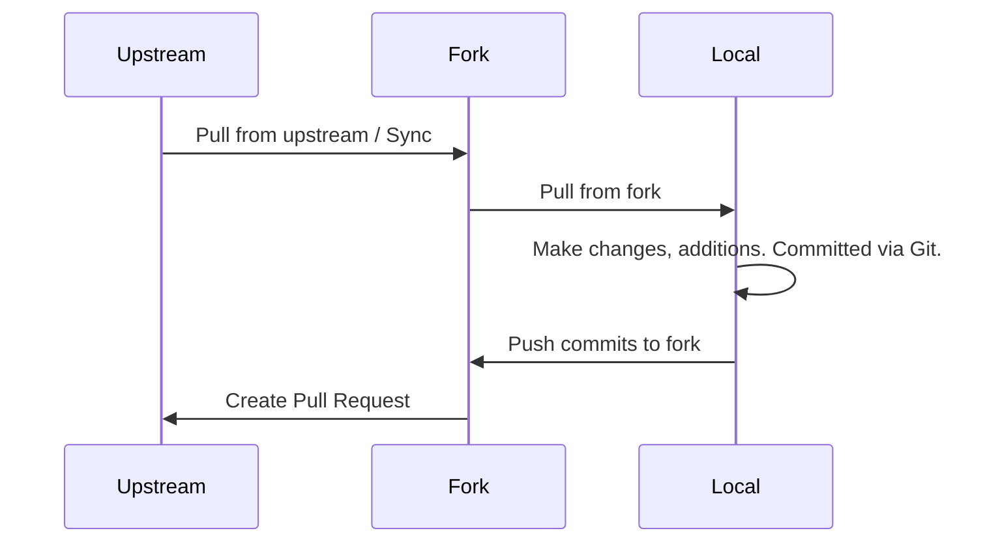

# Beginner FAQ

This is an FAQ for a lot of common beginner questions. If you're looking for questions that are related to [troubleshooting and issues](./troubleshooting-faq.md), go there.

## How do I contribute to Space Station 14?

See: [Learning to Code#developing-you-skills](../setup/learning-to-code.md#developing-your-skills).

There's also other ways to contribute that don't involve you knowing how to code, such as [translating](../contributing-translations.md), [writing guidebook entries](./writing-guidebook-entries.md), creating art, and contributing to the [documentation](../../meta/guide-to-editing-docs.md).

## How Does Code Get Transferred Between My Computer & `space-wizards/space-station14`?

See: [Git for SS14 Developers](../setup/git-for-the-ss14-developer.md).

There are three locations relevant:
1. Your local repository (The files/folders on your computer)
2. Your GitHub fork (`your-username/space-station-14`)
3. The Upstream/Master repository (`space-wizards/space-station-14`).

The system goes something like:

## I Have an Idea

1. Before suggesting anything, _please_ verify that we haven't already implemented it.
2. Next, check if there is an open issue on the [`space-wizards/space-station-14`](https://github.com/space-wizards/space-station-14/issues) that suggests what you want.
3. Check if there is an open [feature proposal](https://github.com/space-wizards/docs/pulls).
4. Finally, you can consider creating an issue or [feature proposal](../feature-proposals/index.md). Or, just complain about it in the Discord.