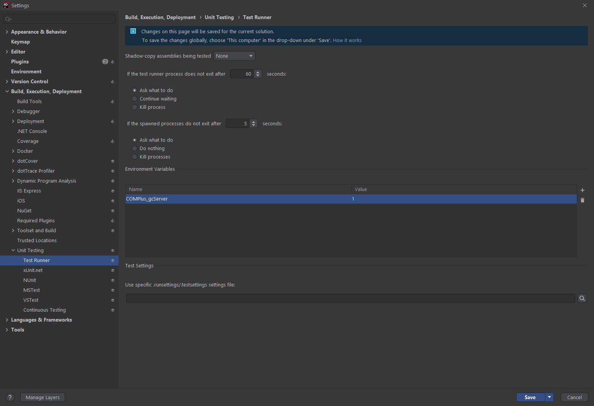

# Debugging Tools

## Quick Controls
`~ (Tilde)` - Toggle the debug console which many commands are run from. Use `list` to see a list of commands. Use `help someCommand` to get info about a command. The `list` command can also be provided with a filter like so: `list show`.
`F3` - Toggle the debug overlay. Has a lot of useful info on networking, rendering, and other game state. Mouse over entities and areas to see things like entity id, grid id, coordinates and more.
`F5` - Toggle entity spawn window
`F6` - Toggle tile spawn window
`B` - Toggle sandbox window
`Shift + F4` - Toggle UI

## View Variables

**View Variables** or VV for short is a tool to view and modify the variables of things. You can VV an object with the `vv` command or using the right-click verb.
You can also use the `vvread`, `vvwrite` and `vvinvoke` commands to use VV directly from the console.

Parameters the `vv` commands take:

`vv /path/to/an/object` will VV the path you entered. Check command auto-completion for all possibilities.
`vv <IoC Interface>`, eg `vv IPlayerManager`, will VV a client-side IoC thing.
`vv S<IoC Interface>`, eg `vv SIPlayerManager`, will VV a server-side IoC thing.
`vv CE<Entity System>`, eg `vv CEPhysicsSystem`, will VV a client-side entity system.
`vv SE<Entity System>`, eg `vv CSPhysicsSystem`, will VV a server-side entity system.
`vv <EntityUid>` will VV an entity. Both client and server, at once.
`vv guihover` will VV the current GUI control under the mouse.

## Dev window

`devwindow` opens a secondary window that contains a growing number of useful debugging and development tools:

* Secondary debug console
* UI tree view

## Running Tests

### Server GC

I recommend you enable [**server GC**](https://docs.microsoft.com/en-us/dotnet/standard/garbage-collection/workstation-server-gc) to run SS14 tests, *especially* integration tests (it cuts integration test times in *half*). 

To enable this in various editors:

#### Rider
Unit Testing -> Test Runner and add an environment variable for `COMPlus_gcServer=1`



#### `dotnet test`

Pass `-e COMPlus_gcServer=1` to the `dotnet test` command

#### Visual Studio

Set the environment variable `COMPlus_gcServer=1` using your OS's command line utility. For Windows the command would be `SET COMPlus_gcServer=1`, and in other operating systems it would be `export COMPlus_gcServer=1`. Further details can be found at [Microsoft's official documentation page](https://learn.microsoft.com/en-us/dotnet/core/runtime-config/garbage-collector) on the subject.  

## Scripting

Scripting allows you to run a C# Interactive REPL inside the game! You can run scripts on both server and client. Note that scripting is disabled for release client builds due to size and security concerns, and you obviously need host level permissions to do it on the server.

To open scripting, there are two commands: `csi` and `scsi`. The former is on the client and the latter on the server. There is also `watch` which shows the output of a list of commands each frame (like your debugger's watch window).

See [this link](https://github.com/dotnet/roslyn/wiki/C%23-Interactive-Walkthrough) for an introduction (I guess).

Default globals you can use are defined in `IScriptGlobals` on both client and server. Useful ones are `vv` on the client, `res<T>()` for quick IoC resolve, etc...

## Testing the Lobby

By default the server is ran in "no lobby" mode. This means that the lobby is disabled and you're sent straight into the game when you connect to the server. This is convenient for testing of course, but if you want to actually *test* the lobby you can imagine why it's annoying.

To enable the lobby you need to set the config variable `game.lobbyenabled` to true. There are multiple ways to do this:
1. Edit the server config file in the server's bin folder and add `lobbyenabled=true` under the `[game]` section.
2. Pass `--cvar game.lobbyenabled=true` to the command you're using to launch the game.
3. Modify the variable mid-game by running `cvar game.lobbyenabled true` in the server console. You will have to respawn your character to reach the lobby if you connected before doing this.

If you are using Rider, I would recommend making a separate run configuration (see below) with  `--cvar game.lobbyenabled=true`.

To quickly check the lobby with a lighter setup, `golobby` will end the round, enable lobby, and dump you in the pregame lobby. You can skip the timer for the next round with `forcepreset sandbox` (or whatever gamemode you wish.)

## Advanced console usage

* `sudo` allows you to execute commands *as the server console* from your client. Most admin commands (like `ban`) are automatically sent to server if you have permission to use them, but certain server management commands like `cvar` can only be executed from the server console *normally*. That's where you use `sudo`. Of course, this requires `+HOST`.
* `exec <file>` allows you to execute script files in the user data directory (`%appdata%/space station 14/data` for client or similar depending on OS, `data` folder next to executable for server). You could make a `lobby` script that automatically restarts the round into lobby and then run it like `exec lobby`:

```
sudo cvar game.lobbyenabled 1
restartroundnow
```

## Misc. Useful Console Commands
These are a few useful console commands and what they do. This is by no means an extensive list. To see all console commands use `list`.

* `guidump` - dumps a complete dump of the GUI tree to a text file in `%APPDATA%/Space Station 14/guidump.txt` (Windows), `~/Library/Application Support/Space Station 14/guidump.txt` (macOS), or `~/.local/share/Space Station 14/guidump.txt` (Linux, yes it uses XDG base dir env variables).
* `showrays` - toggles debug drawing of physics rays. It takes a parameter for the lifetime of the rays.
* `showbb` - Visualizes bounding boxes and grids. Grids are shown as blue volumes, with their bounds being red lines. Bounding boxes are shown as red lines.
* `physics shapes` - Shows you the exact collision hulls of objects. Very useful if you are trying to configure a structure with a novel shape.
* `dumpentities` - dumps entity list of UIDs and prototypes.
* `debugai` - used for the tooltips above mob heads (currently covers thinking as well as pathfinder for that specific mob).
* `pathfinder` covers off overall pathfinding, which is currently the graph, routes, nodes (especially useful for JPS).
* `togglelight` - toggles light rendering. Useful for mapping.
* `net_graph` - Turn on with `net_graph 1`, off with `net_graph 0`. Shows graph of network usage.
* `tp` - Teleports a player to any location. Usage: `tp <x> <y> [<MapId>]`.
* `aghost` - Toggles admin ghost mode for quickly exploring map.\
* `restartroundnow` - Unless you are working on the post game screen, usually what you want to end the round with. Restarts the round without the minute wait.
* `restartround` - Restarts the round as it normally ends, sending players back to the pre-round lobby.
* `restart` - Completely restarts the server.
* `launchauth` - Loads authentication tokens from your launcher settings when ran from the client. You can run this before connecting to a server to easily enable and test authentication from dev builds.
* `deadmin` - If you are working on anything that behaves differently for admins and non-admins, such as chat, you want to make sure that you manually de-admin to ensure it works for normal players too.

## Use run configurations

If you are using Rider, make the most out of **run configurations** to quickly switch between scenarios you are testing. This is more necessary if you need to alternate between testing various scenarios such as different database backends, but get creative. For example these are the run configurations I have at the time of writing:


You can use `--cvar` or `+command` to modify server configuration and automatically execute commands to set up your test environments easily. Look around the rest of this page for some ideas if you want.

## Debug performance

By default, Rider will disable optimizations on *all* assemblies when running via debugger. This means that even BCL code (`System`) will run much slower than it otherwise would. This can make running things in the debugger quite painful.

You can disable this by unticking this checkbox in Settings -> Build, Execution & Deployment -> Debugger:


## External Tools
* [renderdoc](https://renderdoc.org/) - Perfect for debugging the rendering engine and shaders.
