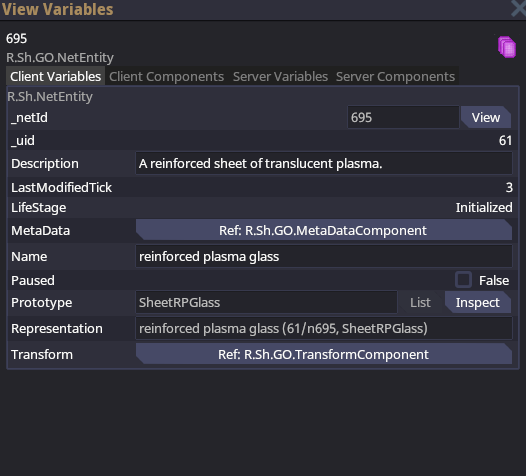
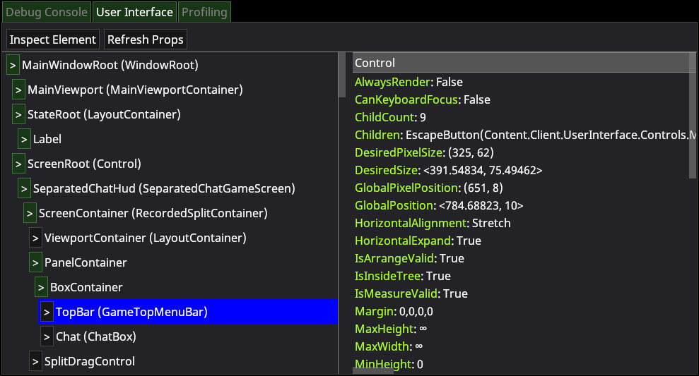
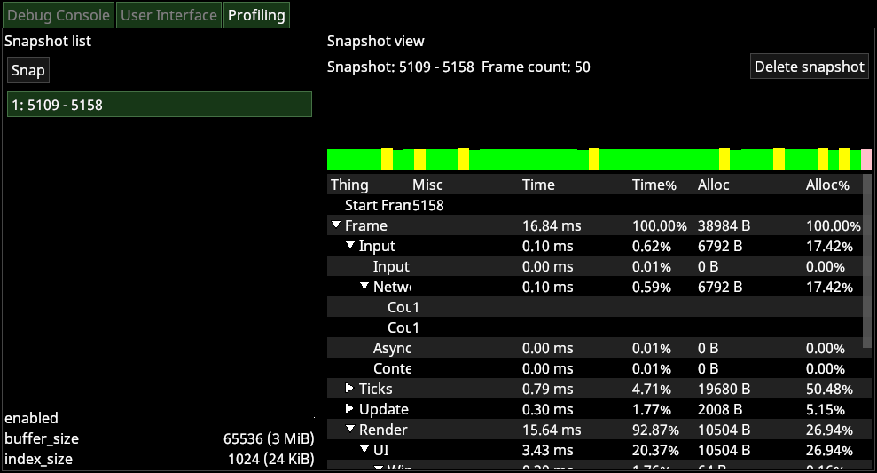
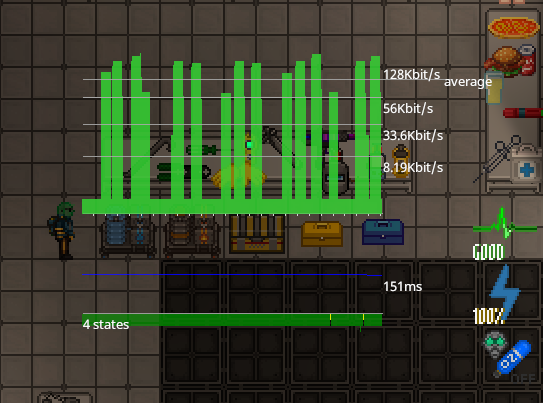
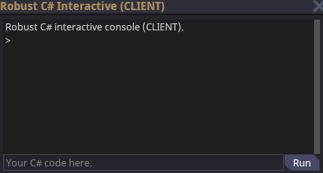
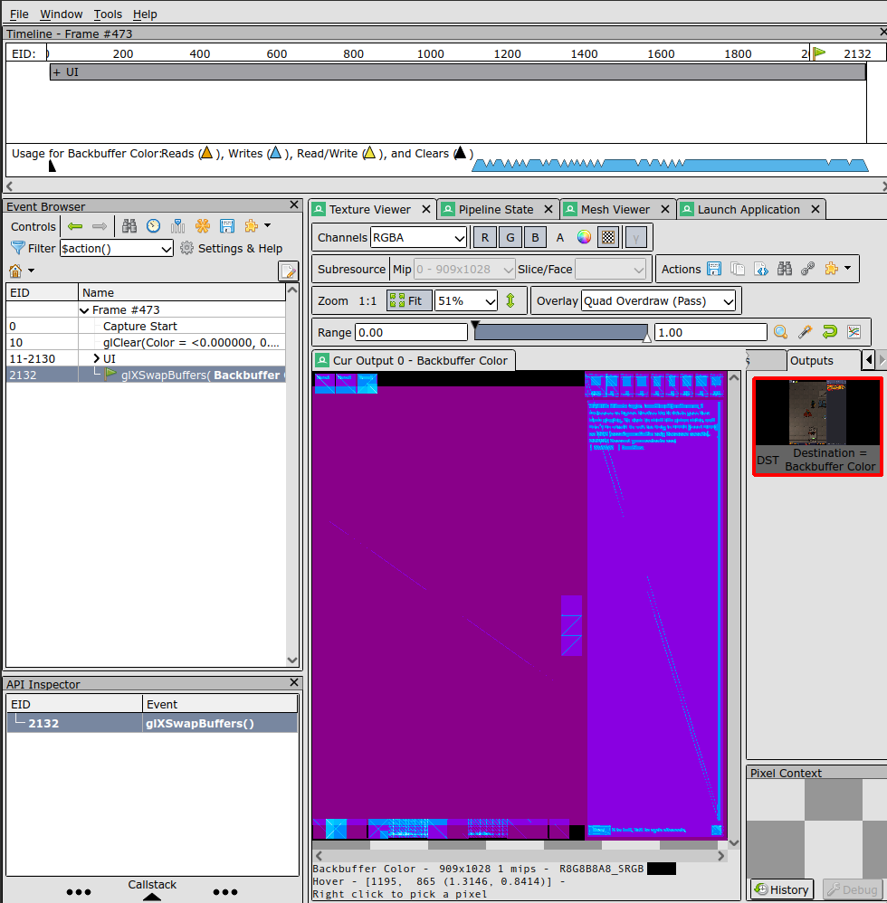
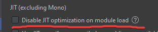

# Debugging Tools

Now, you get to the part that every developer loves: tracking down the obscure Heisenbug that keeps leaking all of SS14's memory!

This is a very disorganized guide that tries to touch on everything that you can use at your disposal. If you are trying to figure out a bug, I welcome you to try to follow the guide in order to pare down what could possibly be going wrong.

```admonish note
The lowest hanging fruit for debugging is just running the tests that were already written for you to find out what went wrong. Please test your code!
```

## In-Game Debugging

So, you've thankfully been able to boot into the game but have realized that something is wrong.

1. To start looking into it, press `~` (tilde) on your keyboard to launch the console (Warning, this might freeze your client for a second or two).
2. Now you should see a console interface that provides a log and a command-line.
   1. If you're lucky, you'll see errors pointing directly to what you're looking for in the log.
3. Now, you can continue on the guide with other methods of debugging.

```admonish tip
As a quick tip:

- If you are launching either the Server from a TTY/Console, you can just use the stdin and stdout as the console instead of the gui.
- You can prepend `sudo` to a command that you are running so that it is run as the server instead of as your client. This is required for some commands like `cvar`.
```

```admonish note "Testing the Lobby"
If you're trying to test the Lobby, you'll need to go through a little more work.

By default, the server is ran in "no lobby" mode.

To enable the lobby you need to set the config variable `game.lobbyenabled` to `true`. There are multiple ways to do this:
1. If you are just trying to quickly test the lobby, you can run `golobby` in the console which will automatically end the round, enable it, and send you to it. You can then run `forcepreset sandbox` to go back to the sandbox (or any other gamemode you wish).
2. Edit the server config file in the server’s folder and add `lobbyenabled=true` under the `[game]` section.
3. Pass `--cvar game.lobbyenabled=true` to the command you’re using to launch the game.
4. Modify the variable mid-game by running `cvar game.lobbyenabled true` in the server console.
    You will have to respawn your character to reach the lobby if you connected before doing this.

If you are using an IDE, we would recommend that you make a custom run configuration with `--cvar game.lobbyenabled=true`.
```

### Debug Overlay

A good first step is to start up the Debug Overlay by pressing `F3`.

This overlay gives a plethora of information like the amount of allocated memory, the network traffic, the hardware renderer, your operating system, and more.

This is good at a cursory glance at what might be going wrong. If your game suddenly starts stuttering, you'll be able to pinpoint what went wrong.

```admonish tip
If you want to configure the Debug overlay, you can use the `monitor [argument]` command in the console to add or remove parts of the overlay.
```

### Viewing Variables

Let's assume that the bug isn't something graphical but is more of a logic bug. You put some items into a machine but the machine doesn't see it. The way to view what it happening with the Entities is by the View Variables interface.

One simple command that you can run is `vv` (which stands for **V**iew **V**ariables). It lets you view and modify the variables of any object. If you wish, there's also the `vvread`, `vvwrite`, and `vvinvoke` commands if you want to stay in the console interface.

You can also use the right click `View Variable` verb.

Now with this interface open, you can edit the client and server variables, which would hopefully let you find what went wrong.



### Dev Window

If you're having trouble with UI, the size of main console is too small, or need a profiler, the `devwindow` command can help you greatly.

It provides a full UI tree-view that lets you incrementally view the whole UI that is being rendered on your screen along with all of its properties.



It also provides a nifty profiler if you are trying to pinpoint a performance issue.



### Other Commands

This is just a rapid-fire list of a bunch of debugging commands and what they do.

```admonish example "buildinfo"
Run `buildinfo` in the client console

This should return:
1. Game Name
2. Build Commit
3. Manifest Hash
4. Engine Version

This is primarily for finding out who is at fault. If you're making a bug report, it might be useful to include this information and make sure it's actually for Space Station 14 and for the latest version.
```

```admonish example "netgraph"
Run `net_graph` in the client console.

This will display an overlay that shows the network traffic.


```

```admonish example "showrays"
Run `showrays 100` in the client console.

Any rays that are casted from your player (which is usually for interaction) will be shown for 100 seconds (you can provide any number). This helps you verify that the interaction system is working correctly.
```

```admonish example "physics shapes"
Run `physics shapes` in the client console.

Shows you the exact collision hulls of objects. Very useful if you are trying to configure a structure with a novel shape.
```

```admonish example "fullstatereset"
Run `fullstatereset` in the client console.

If there's a weird bug with a client-server desync, this will cause the client to drop all of it's state and get a fresh state from the server.
```

````admonish example "guidump"
Run `guidump` in the client console.

It will save a text dump of the current GUI to:
- **Windows**: `APPDATA%/Space Station 14/guidump.txt`
- **macOS**: `~/Library/Application Support/Space Station 14/guidump.txt`
- **Linux**: `~/.local/share/Space Station 14/guidump.txt` (or whever the XDG-BASE-DIR points)

Here's a truncated example output:
```
ROOT: MainWindowRoot (WindowRoot)
MainWindowRoot (WindowRoot)
 * AlwaysRender: False
 * CanKeyboardFocus: False
 * ChildCount: 8
 * Children: Robust.Client.UserInterface.Control+OrderedChildCollection
 * DesiredPixelSize: (1405, 1028)
 * DesiredSize: <1405, 1028>
 * GlobalPixelPosition: (0, 0)
 * GlobalPosition: <0, 0>
 * HorizontalAlignment: Stretch
 * HorizontalExpand: False
 * IsArrangeValid: True
 * IsInsideTree: True
 * IsMeasureValid: True
 * Margin: 0,0,0,0
 * MaxHeight: ∞
```
````

```admonish example "nodevis"
Run `nodevis` in the client console

This displays all of the node groups, which is power/atmos. It lets you view all of the properties of each node of the graph, letting you highlight any power/atmos-related bugs.
```

```admonish example "showaudio"
Run `showaudio` in the client console.

This displays all of the audio sources with a box describing their properties.
```

## Scripting

Scripting is the most powerful tool at your disposal while staying inside of SS14.

If you built your server in `Debug` mode and not `Release`, you have access to the `csi` (C-Sharp Intepreter) and `scsi` (Server C-Sharp Interpreter).

With these two commands, you can run arbitrary C# on either the client or the server to live debug SS14 without needing to rebuild and rerun the projects.



## 3rd Party

You're not just limited to built-in tools in Space Station 14 when you're trying to debug.

### RenderDoc

[RenderDoc](https://renderdoc.org/) is an excellent 3rd party graphics debugger that lets you see what's going on with the underlying graphics shaders.

With `RenderDoc` installed, in a terminal you can run: (There is also a GUI option that I'm skipping)

```bash
renderdoccmd capture -w --opt-hook-children  dotnet run --project Content.Client
```

And now if you press `F12` while inside the game, it will take a snapshot of the current frame and save it inside the `RenderDoc/` folder.

Now, you can view it in RenderDoc and try to discover why the game isn't rendering properly!



### IDEs

Your IDE most definitely comes with a build-in debugger and stepper so that you can incrementally debug your project.

This is just for some IDE-specific changes that you should make to aid your debugging:

#### Rider

```admonish example "Rider Directions"
If you're running Rider, you should add `COMPlus_gcServer=1` to the Test Runner so that all tests run faster.


As well as that, Rider doesn't optomize Debug binaries, so if you want any semblance of performance, you'll need to enable the JIT in the debugger settings.



Finally, if you're looking for a reference on the kinds of run configurations you should have:


```
