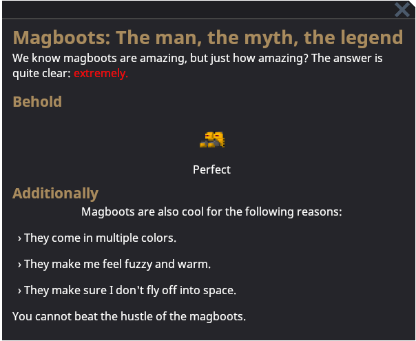

# Writing Guidebook Entries

The guidebook is a powerful tool for communicating more obscure in-game information to players without forcing them to travel to an external wiki. Moving forward, most information should be moved from the wiki to the guidebook in some form.

This guide explains how to write a guidebook entry and set it up in game as well as provides helpful tips for creating good quality entries. Afterwards, if you want to learn how to make a pull request for your new entry, check out [Git for the SS14 Developer](../setup/git-for-the-ss14-developer.md).

Guide entries are made of two parts, the `.xml` file for the contents of the guide itself and the YAML prototype which defines metadata about the guide itself. We will first go over the file which makes up the contents of the guide.

## Writing Guides 

All guide entries are stored in the `/Resources/ServerInfo/Guidebook/` path in the main repository. The file structure of the guides themselves should roughly correspond to the structure of the entries themselves, though this is not required. The most important aspect is just making sure the files are roughly organized.

The entries themselves are essentially plain text files with some additional tags that are used for styling. The only part of an entry that is required is the `<Document>` tag. 

Thus, the simplest entry you can make looks like this:
```xml
<Document>
</Document>
```

Any text written in the bounds of the tag will be displayed plainly on the guide. But, if you write a guide with only plain text, eye explosion (and subsequent death) rates will skyrocket globally.

Save hundreds of l-eye-ves and use the (small) variety of markdown tags that are supported:
- `#` creates a title.
- `##` creates a heading.
- `-` creates a list entry.
- `[color=hex][/color]` colors the text inside the tags with the specified hex color.
- `[bold][/bold]` and `[italic][/italic]` make text inside the tags bold or italic respectively.
- `[keybind=""]` will display the user's keybind for the function in the quotation marks.
	- The list of functions can be found in `keybinds.yml`.
- `[textlink="text" link="guideID"]` will allow users to jump to the article linked.

### Example
Here is an example guidebook entry, `magboots.xml`
```xml
<Document>
# Magboots: The man, the myth, the legend
We know magboots are amazing, but just how amazing? The answer is quite clear: [color=#ff0000]extremely.[/color]
  
## Behold
<Box>
<GuideEntityEmbed Entity="ClothingShoesBootsMag" Caption="Perfect"/>
</Box>

## Additionally
<Box>Magboots are also cool for the following reasons:</Box>
- They come in multiple colors.
- They make me feel fuzzy and warm.
- They make sure I don't fly off into space.

You cannot beat the hustle of the magboots.
</Document>
```

And this is how it appears in game:


## Custom Guidebook Controls
These are custom controls that can be used to add unique visuals or behavior to a guide. Some are more useful than others, but consider using some or all of them to add more visual interest and more specific information to a guide.

### Box
The `<Box>` tag can be used to center part of a guide. This isn't very useful for text, but can be used in conjunction with other tags to create a more visually appealing page.

It has the following properties:
- `Orientation`: The orientation the items inside the box will be laid out in. Either "Vertical" or "Horizontal"
- `HorizontalAlignment`: How the box will be placed horizontally on the page. Can be "Stretch", "Left", "Center", or "Right"
- `VerticalAlignment`: How the box will be placed vertically on the page. Can be "Stretch", "Top", "Center", or "Bottom"

### CommandButton
The `<CommandButton>` tag allows you to embed a button in a guidebook. Clicking the button will execute a command. This may seem useless, but there are many useful client-side commands, such as ones that open menus. 

Note, it's important to not use these for admin-only commands, as the average players is likely to be confused by this.

It has the following properties:
- `Text`: The text that will be displayed inside the button. Supports locale strings
- `Command`: The full command, including arguments. This is what's run when the button is pressed. 

### GuideEntityEmbed
The `<GuideEntityEmbed>` tag allows you to embed in-game prototypes into a guide. Depending on how it's configured, you can even interact with them and examine them.

It has the following properties:
- `Entity`: The prototype ID for the entity that will be displayed.
- `Caption`: A caption displayed underneath the entity. Defaults to the entity's name.
- `Scale`: A value for scaling the size of the embedded entity. `2` will result in twice the size and `0.5` will result in half the size.  
- `Interactive`: Whether or not the embedded entity can be interacted with. 
- `Rotation`: What angle the entity is rotated at. Useful if you want to display a particular fashionable side sprite. Defaults to facing south.
- `Init`: Whether or not the embedded entity is map-initialized. Defaults to true.

> **Emo's helpful tips:**
> If you are not seeing specific examine text or interactions on your embedded entity, it's likely because your logic is on the server.
>
> All entities in the guidebook are client-side only, meaning that if you want certain examine text to be visible or have a certain appearance, it must be defined in either shared or client code.

### GuideReagentEmbed
The `<GuideReagentEmbed>` tag creates a small descriptive box about a given reagent. It includes the name, description, physical description, recipes (if it exists), and effects (if any). These can be used if you want to provide common chems and their recipes in relevant places. For example, placing the embed for Space Cleaner in the janitor guide.

It has the following properties:
- `Reagent`: The prototype ID for the reagent the embed will use.

### GuideReagentGroupEmbed
The `<GuideReagentGroupEmbed>` tag is quite similar to the proceeding `<GuideReagentEmbed>`. The difference between them is that this one is meant to show an entire category of reagents, instead of a single one. This allows a guide to always contain all of the reagents of a given category without having to be regularly updated.

An important thing to note is that, while the list it generates is alphabetically sorted, it is also quite long. This means that it's important to put it at the bottom of your guide as to not obscure information.

It has the following properties:
- `Group`: The group that all the reagents will have. This should correspond to a value on the `group` field of `ReagentPrototype`.

## Creating Entries

Now that you've created a file with all of your content, you need to make an entry for it to display in game. Entries are prototypes found in the `/Resources/Prototypes/Guidebook/` folder. Like before, try to group guides and their children together so that they can be easily found.

Each entry consists of a single prototype with a few different variables you can set. Here is an example prototype for our entry we just wrote:
```yaml
- type: guideEntry
  id: Magboots
  name: guide-entry-magboots
  text: "/ServerInfo/Guidebook/magboots.xml"
  priority: 10
  children:
  - Radio
```

To make sure that it appears in the guidebook, you'll need to also add it as the child to another entry.

> **Emo's helpful tips:**
> Now that you have written your entry created the prototype, you can now open up the guidebook and view it.
>
> Guide entries support hot-reloading, which means that you can modify the file while your local server is running, close the guidebook, reopen it, and see your changes.

All of these fields are pretty basic, so let's step through them one by one.

### id
This is simply a unique prototype Id. Just make sure it roughly corresponds to your guide's name.

### name
This is a the name which appears in the file view sidebar of the guidebook. Importantly, it's a locale string, which is used for translation. It's also the only part of a guide entry that needs to have a locale string. 

You can learn more about localization [here](../../ss14-by-example/fluent-and-localization.md).

### text
This is just a file path to the entry, starting from the `/Resources/` directory.

### priority
This is a numeric value for sorting top-level guides. Higher values will appear first.

This is not used if the guides are the children of another guide; in that scenario, they are sorted by the order listed in the `children` field.

### children
This is a list of all other guide entries that appear below this one in the guide sidebar. The items in this list must correspond to the `id`s of other guide entries.

## In-Game Integration

A helpful way to make guidebook entries more visible to players is by utilizing the `GuideHelpComponent`. When entities with this component are examined, a small question mark box will appear in the bottom right of the examine window and, when clicked, open up the entry specified on the component.

This is extremely helpful for new players and helps people quickly navigate to relevant guides.

Simply add the component onto relevant prototypes and add the relevant guide ids to the `guides` datafield on the component.

Here's an example:
```yml
- type: entity
  id: BaseStockPart
  name: stock part
  parent: BaseItem
  description: What?
  abstract: true
  components:
    - type: Sprite
      netsync: false
      sprite: Objects/Misc/stock_parts.rsi
    - type: Item
      size: 1
    #this is the part you add
    - type: GuideHelp 
      guides:
      - MachineUpgrading #this is the guide that is opened
```
## Using Markdown
For consistency across the guidebook, it's easier to pick one way to use each markdown tag and stick to it.

A good way to use each tag is listed here.
- `[color=cyan]` should be used to highlight keywords or phrases directly related to the subheader.
- `[bold]` is good for keywords or phrases of a paragraph (but not necessarily a subheader).
- `[italic]` is good for emphasis on sentences or clauses that may be important to read.
- Highlight allegiances, departments or roles with `[color=someotherrelevantcolorthatisn'tcyanprobably]`.
- Text links make the guidebook more interactive and can be done with `[textlink="text" link="guideID"]`.
- `[color=#a4885c][italic]` is good for actions or text found in the context menu.
- `[color=yellow][bold][keybind="function"]` is a superb combo to bring attention to keybinds which may be short.
- And of course, it may become clear that you need to use `[color=red]`.

All of this comes together in this example that may or may not be based on reality:
```xml
## What I had for lunch today
Today I decided to have a [color=cyan]burrito[/color] because it was easy to make and I was feeling lazy.

[bold]Knowing how to roll a burrito[/bold] is vital to consistently making good ones.

[bold]Cheese[/bold] is simply a requirement. If you don't put any in your burrito, [italic]I'll refuse to eat it.[/italic] 

I think [bold]Rat Kings[/bold] should find a burrito or two every time when they [color=#a4885c][italic]Rummage[/italic][/color].

If you're holding a burrito in your hand, you can press [color=yellow][bold][keybind="ActivateItemInHand"][/bold][/color] to eat it.

[color=#cb0000]Security[/color] hates burritos. That's why I joined [color=#66FF00]The Spider Clan[/color].

If you hate burritos, [color=red]I'll be very very mad at you.[/color] I hope the [color=pink]Clown[/color] slips you.
```


Important text is highlighted, it's got visual appeal, and it's easy to read. Success!

## Best Practices

Here are some general tips for writing good guides:
- Keep titles clear and concise. Players don't want to search around for what they need.
- Keep entries short. You can always add child entries if you want to elaborate more on the topic.
- Use a healthy amount of boxes, embedded entities, and markdown tags.
	- Remember not to overdo it, though. If most of the text has a markdown tag, it's too much.
- Refrain from including specific advice and "meta" strategies. The guide should be an impartial source of information.
- Articles should be written in a neutral tone. 
- Encourage interacting with the guide.
	- If your embedded entities support it, suggesting that the player examines the entity to learn more is a helpful way of communicating information and teaching players.
