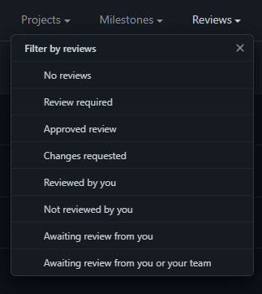

2021-10-30 - Maintainer Meeting Notes
===
```admonish info
Any decisions taken in these notes may no longer be applicable.
```

**Time:** 30.10.2021 16:00 UTC

**Attendees:**  
PJB  
DrSmugLeaf  
Vera  
Silver  
Paul  
metalgearsloth he arrived AUSTRALIA TIMEZONE counts casual 3am 100 space bucks sloth falls asleep during meeting excuse me I was here at 9am once ok sloth why did you have to go there the first meeting was not that long ok I was busy playing rain world, PJB approved ok understandable have a nice day  
mirrorcult

## Visibility of maintainer notes | Paul
- Can contributors read?
- Can everyone read?

Proposal: Mirror whatever visibility the meeting has.
(#maintainers channel is separate does not apply)

## Changing the release date on Steam from Fall 2021 | Vera
- Let's be honest, we won't be ready until we have a few more things...
- We should probably change it to something like Dwarf Fortress ("time is subjective")
    - when mommi flys
    - when we code it

Discussion about when to open up the playtest: When we are fine with it being reviewed?


## Screenshots for Steam | Paul
Do screenshots really need to be 1080p? surely we could edit them to also allow for smaller ones(?)

No.

## Name letter restrictions | Vera
What kinda letters do we allow
yes:
- Alphanumerical
- Accents: ä, á, à...
- Numbers
- Symbols -> restrict to machines/sillycons
  no:
- Kanji
- Zalgo -->  s̸̡͆̕͠i̴̧̢̺̩̦͙̜͑͛͑͑̓̿̈͛̚ͅl̴̨̘͔̥̩͎̼̞͌̎̈́͂͜͠͠v̷̘̦̬̹̖͎͌̾e̶̩̻͔̦͗̅̀͂r̵̦̟̹̤͓̼͓̣̉̄̃̽̿̑̇͗̚
- X Æ A-12
- Spanish Ñ spanish Ñ is under no why live if ñ is not in I die this paul please save the spanish Ñ
   :thistbh: stolen from pjb's stream
  
  `If you mean could someone legally name their child "Bobbysystem 14", that depends. Some countries have laws about what names you can give your child. I'm not aware of any law in the United States against giving your child a number for a name.`
  Vera: "im not coding that"


## Fluent Text type | PJB
To allow different locales on the server at the same time

- russian and us players play on the same server

question: make loc fully clientside/user-dependent
how cbt will this be to do? *very*: send the loc ids & parameters instead of the strings

vera: I'm so happy I accounted for this in contructionGL2 part 2: of guides and recipes
silver: brb deleting constructionGL2 branch
vera: :waltre:

this wont be that useful for ss13/4, but definitely for some other rt-game

tldr: its gonna be a (vera: maybe not, pj disagrees) massive refactor, but noone is opposed to the idea.

verdict: WYCI
also a problem atm: you use the static method alot

## PR GitHub bot | DrSmugleaf, Mirrorcult
Automatically tags PRs with:
- Conflicts
- Needs Review
- Awaiting Changes
- Approved
- Map Changes
- Sprite Changes

What default GitHub looks like (ass)



## YAML Prototype Editor | DrSmugleaf
- Do we do it
    - If not, is autocompletion/validation on the IDE for prototypes a good idea instead
        - Merely do all of the above gaming
- In-game, out of game or both
- Is Injazz alive so they can design it
- Would it integrate other tools into it like the construction graph editor
    - if not, I die

we do it
Which ui system? ROLL OUR OWN oh god ours, cba for avalonia.
editor in-engine.
- funny in-editor run would be possible
- F A S T
- semiblocker: hotreload game assemblies.
- solution: pjb codes it!
- if we don't do this, I die tbh

pjb: OH NO *shows three lines of code*


## Do we localize command error messages | Vera
Do we *really* need to localize commands?
https://pickerwheel.com/

- What about admin stuff?

Just go with it. (Don't localize command names)

## Docking airlocks | ~~Vera~~ Sloth
Should the only way to dock two grids be via special docking airlocks?

special docking airlock with joints
*PJB3005 set atmos preset to ZAS - Hellish*
we *WILL* have atmos presets mark my words
*PJB3005 set atmos preset to Plasma*

## Visualizer refactor | Vera
Visualizers are a pain in the ass to work with. Let's come up with a better way to do 'em.
Pain points:
- touching five files for smth
- enum keys are bad for perf
- animations are janky

handle visualizers over the entitysystem?
visualizer-data should just be a component
- serv3 killed my flyweighting

pjb should write down her ideas  
good luck with that
do we make a discord thread for this?
simply quickly type out pjb's words turbo fast
5 pings ought to do it
ECSECSECSECSECSECSECSECSECSECSECSECSECSECSECSECSECSECSECSECSECSECSECSECSECSECSECSECSECSECSECSECSECSECSECSECSECSECSECSECSECSECSECSECSECSECSECSECSECSECSECSECSECSECS

Just make visualizer data a component seriously

this has been promoted to threadstatus
this discussion has been terrible for the barotrauma timetable
man this speedruning split was terrible
<!-- Funny problem in the room: THE VV PROBLEM (next meeting???) -->

## Timed entity system updates / master controller stuff | Mirrorcult

See https://github.com/space-wizards/RobustToolbox/pull/2125

How do we want to handle timed updates since the boilerplate for it is really bad right now--reflection, virtual methods, etc, and do we want to do something like SS13's MC so we can smooth updates out over multiple ticks intelligently

Do we want mc: yeah, definitely
prediction is gonna be funky for this -> make it use gametime? but then we cant do mastercontroller stuff. cross that bridge when we get there.

## Impromptu topic: PVS and NaNs | Metalgearsloth
average pjb rant: compression streams are slow in pvs we need to dfcsiuzxfhvd rteu7yi54rhjirotpter
sloth: shut it
kill da NaN

general agreement: destroy the NaN
fix: throw entity into the nullspace shadow realm
nullspace entities work differently between client and server
allegedly server cant refer to nullspace entity on the client

## Engine Entity Tags in MetaData | Vera
Basically, tagging entities is something vital enough that it feels it should be supported by the engine, and not something content provides.

yes fund it gaming
Move TagComponent to engine <!-- tag component my beloved -->
When you source gen the flags

## Merging IEntitySystemManager into IEntityManager | Vera
First it was IComponentManager, now it's gonna be IEntitySystemManager.
There's no reason not to merge EntitySystemManager into EntityManager. Hell, the former is initialized and shut down by the latter. Also screw mocking, tbh.

Powerful Vera will take care of the entire refactor
"dw about it, i will code it"

I expect vera to be done by the end of tonight
Unless she plays baro with us :focus:
expect the PR-- wait I'm hanging out with someone later

## Identity System | Vera
So basically, `entity.Name` bad.

Obscure name, voice, face etc. Chameleon traitor items.
This is terrible for component states not being player specific
Remove `entity.Name`
pipe entity through a system to get a string representation
entity.name is just kinda bad and should be removed

## Maintainer meeting topics topic | Paul
Ideally i want to have a short description of each topic to order/group them before the meeting & to have a rough estimate of the time needed for each topic. How we wrote down topics this time was kinda bad in that regard :heck:

Proposal: Maybe have a link next to each topic pointing to a discord-message explaining it a bit? Maybe have somewhat of a guide on how these messages should look: No open questions, etc.

## Discuss Bodysystem Replacement | Silver
rip sub 2 hour speed run
quick distract paul ok
man
gaming
