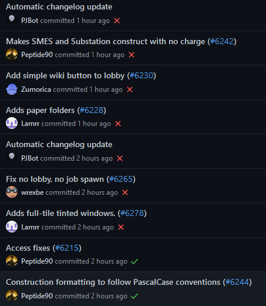

# Maintainer Meeting (5 Feb 2022)
===
```admonish info
Any decisions taken in these notes may no longer be applicable.
```

**Time:** 5 Feb 2022 16:00 UTC

**Attendees:**  
DrSmugleaf  
Vera  
PJB  
Paul  
ElectroSR  
ShadowCommander  
moony  
Silver

## Improving the usability of animations in code | metalgearsloth
- For example, an easy way to play a state then go to another.
- Animations big suck
    - Hard to play, keep track of and synchronize (need sync with animation timing)
- In most game engines (Godot/Unreal) you have a state machine with the animations, based on some state
- **Should be part of visualizers**
- Not having a GUI to define them kinda sucks.


## Guide for reporting bugs | metalgearsloth
- Subnautica button
    - S 👏 u 👏 b 👏 n 👏 a 👏 u 👏 t 👏 i 👏 c 👏 a 👏 👏 b 👏 u 👏 t 👏 t 👏 o 👏 n
    - [GDC talk](https://www.youtube.com/watch?v=Urx7WQE6NY0)
- **Have a /vg/-like button** to create issues on GitHub on a separate repo, so the main one is not spammed
    - **In-game window**
    - Make sure it has **feedback** so we dont get duplicate bug reports
    - What do we grab:
        - Round information
        - Commit the server is at
    - How do we fix it not leaking current-round information?
        - Only send at end of round.
        - **Cache the reports into local SQLite DB (game server) while the round is going on** in case the server crashes, then send them **through the server**, not the watchdog.


## Replacing prototype inheritance with composition | Paul
- **Fund it**
- Conflicts (multiple inheritance/diamond problem)
    - based on imported order, like python
- Prototype load ordering
    - Push composition on the mapping level, not on the created objects
    - Gets rid of deserialization results
    - Makes it possible to do it in order
    - load all mappings at once, then serialize them in one method call


## Start using Bors for PR rollup | moony
[Discord message](https://discord.com/channels/310555209753690112/900426319433728030/934889142431653888)
[GitHub link](https://github.com/bors-ng/bors-ng)
Helps avoid this:


- Usage: you write bors r+
- Gives more overhead to merging PRs
- We can use it when we are merging a lot of PRs at once, not for every PR
- [Bors can't squash merge](https://github.com/bors-ng/bors-ng/issues/1217)
- **No Bors**, try to find another alternative
- **We should not publish releases to servers if CI fails**


## Implementing a load balancer | moony
[Discord message](https://discord.com/channels/310555209753690112/900426319433728030/934951024500826142)
- Opt-in vs opt-out
    - If its automatic instead of a prompt sloth dies
    - **Opt-in**
- Doing it with batches of players (so it doesn't balance 1 at a time)
    - **Yes**
    - Have a threshold of players that need to have clicked yes for the autobalance to actually happen.
        - Check the other server's pop, if it's over an amount transfer anyway.
        - Needs inter-server communication.
- What about ping?
    - **Show the ping to the person**, maybe a ping comparison between the current server and the other one?
- Popup midround?
    - **If we do it, don't do it for alive players, only ghosts**
- Endround popup?
    - **Yes**
- Need to have it be per group of servers
- **Control players counts with player caps**, tell players they can move
- **Prompt on the server full deny screen to connect to another server, indicate this with the launcher**
- **Have a queue** that shows you can join to other servers
- Servers having different versions? Paul issue
    - They will usually be the same version + delta updates + ratio


## Policy on pushing to master vs PRs | moony
- PRs are better for downstreams specially when conflicts arise. Working directly with PRs is easier (bots that mirror upstream PRs).
    - What is easier? Who knows? Where's moony?
- **Simple bug fixes can be committed to master**
- PJB vs Paul 2 hour discussion on whether to PR or not


## Put changes we are committed to in the roadmap | metalgearsloth
[Discord message](https://discord.com/channels/310555209753690112/900426319433728030/935176505993089085)
- For example the melee refactor


## Early Access Roadmap
[Previous Roadmap](https://docs.spacestation14.io/en/maintainer-meetups/secret/2022-01-22-meetup)

- emergency shuttle
    - auto shuttle movement
- gamemodes/antags
    - dynamic | mirror
        - nuke ops
            - the nuke is done, nuke ops isn't yet
            - does not work outside dynamic
        - lings?
        - blob | Remie
        - cult?
            - make it as good as vg for pjb
        - revs
- EL BODY SYSTEM | mirror
    - some refactors were done by mirror, still some left
    - surgery died in the war of 1992
- Salvage proc gen | moony
    - [Cargo Commander](https://www.youtube.com/watch?v=H0LPWuTt2o4)
- Radiation refactor
    - Singularity rebalance
- body system but again
- body system (get smug to code it)
    - Species
        - we need to do non human body parts
- __***ENGINE EDITOR***__
    - could benefit from full state reload
- movement refactor
    - Client side movement?
        - a smidgen
- Tutorial
    - In game guides
        - Yes
        - Waiting on pretty labels
        - books/ebooks in pda
            - ebooks preloaded on pda for selected job
            - when rich text gets merged
                - :death:
- oldchat + ui refactor
- explosion refactor | electrosr
- combat refactor
- pulling refactor
- role bans | ShadowCommander
- admin notes | drsmugleaf
- Admin traitor/role menu
    - Assign people roles
- Job playtime requirements
    - Playtime tracking
    - Per role playtime tracking
- experimental science
- action ui refactor, [like ss13 maybe](https://i.ytimg.com/vi/iFf_T31C-iU/maxresdefault.jpg)
- change pvs to p/invoke zstd

Bugs: (when are we moving these to GitHub)
- turn this section into crashes / critical bugs later
- automatically log exceptions shown on grafana
- being able to see inside containers
    - Need to change PVS to not send all container contents
    - Isn't this a separate issue anyway
        - Seems like PVS queue bugs?
        - Imagine if players could give steps to replicate, insanium
- hud disappearing
    - cant reproduce yet, status icons keep disappearing
    - might be food or thrist related
    - Gets fixed when status gets and update (Like buckling or unbuckling)
- Singularity pops in. Needs a PVS override.
- when the station moves or rotates (rotation is reliable) everyone is unbuckled
