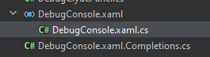
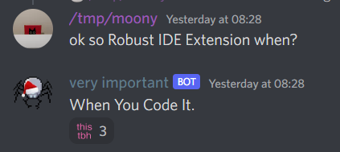

# Maintainer Meeting (28 May 2022)
===
```admonish info
Any decisions taken in these notes may no longer be applicable.
```

**Time:** 28 May 2022 18:00 UTC

**Attendees:**
- Visne
- Remie
- Wrexbe
- Electro
- ShadowCommander
- PJB
- Sloth
- Vera
- Moony
- Silver
- DrSmugleaf, in spirit, briefly

## Smug left the meeting for Canada | DrSmugleaf
- a mimir
    - Jezlag is no joke
- Jez sends her regards
- :pray:

## Rethink flat folder structure | Sloth
- a:
    1. Engine still doesn't match
    2. There's no nice place to put sundry components
    3. I have to scroll for like 5 seconds to go from client to shared if I don't know the right term to ctrl-F
- Fuck the netherlands we're moving to belgium

Result: Jeopardy Music
- **Previous system didn't work**
- **just... nest things more? Put all the engines together**
    - Potential ones brought up:
        - By department (Science, Engineering, etc.)
            - Doesn't seem to work that well.
        - By game mechanic (Power, Physics, etc.)

## Remove maintainer ping | Sloth
- Discord permissions moment
- Do we even need to put this in here

Results:
- **yes**
- Removed mention from maintainer,
- Gave maintainer @ everyone so they can keep pinging eachother

## making events directed by default instead of broadcast | Sloth
- For `RaiseLocalEvent`
- (essentially, making broadcast default to false on directed `RaiseLocalEvent`)

Results:
- **a lot of things would break**
- **Make everything explicitly true at call sites**
- **Make it default to false**

## remove component reference | PJB
- How do we make it happen
- What about Shared components inherited by client/server ones?

Result:
- We need to get rid of component inheritance/interfaces anyways.
- Only remaining use left is shared components
- Figure out an alternative for shared components:
    - *Maybe* (not decided yet) make them more specific so they can be optimized better.
    - Some problems:
        - Shared component presence 1:1 tied to client/server component
        - EnsureComponent spaghet

## `EntityUid?` vs `EntityUid.Invalid` | Vera

- Nullable EntityUid has convenient compile-time checks, and forces you to handle null cases.
- There's a clear distinction between EntityUid? and EntityUid, you can expect the latter to be valid in most cases.
- Nullable EntityUid, however, forces you to write a lot more boilerplate.
- Using EntityUid.Invalid is more convenient and allows you to write less boilerplate in most cases, but you lose compile-time checks and an explicit way to mark something as "possibly being invalid/not having a value".
- We need to decide this ASAP and stick with one.

Results:

- Problem with nullables: memory overhead (2x mem usage due to alignment)
- One option: `Option<EntityUid>`
    - Only difference is no orange squiggle when doing `.Value` instead of `!.Value`.
    - No pattern matching: `if (foo is { } ent)`
        - goodtbh
            - Agreed
- **Use EntityUid? whereever possible. If memory usage is a concern, store as `EntityUid.Invalid` and convert on usage but try to avoid using it.**
- Content-facing APIs should use `EntityUid?`, convert if needed.
- Need to convert existing usages

## Change XAML file naming scheme | PJB
- `Foo.xaml`/`Foo.xaml.cs` -> `Foo.cs.xaml`/`Foo.cs`


Results:
-  it's fine as is, the UI aspect is "made more important" by this

## Rename maintainer meetings to Round Table Meetings | PJB
- El Psy Kongroo
- Rename to Round Buckle Table Meetings
    - High Round Buckle Table Meeting

- smugleaf jumpscare
    - holyshit smug is typing from air plane
        - spanish airplanes have wifi confirmed
            - better wifi than Spain
                - how long before you land?
                - the trick is i havent even left yet
                    - amongus or silver moment
    - yoooo smug bsaed based based
    - !!!

- Rename maintainers to Labo Members
    - tuturu~
- rename maintainers to mini wizards

Results:
- uhhhhh all shitposting aside
- alles gekheid op een stokje...
- **Nonissue, can be named whatever**

## Simplify ResourcePath | PJB
- what do we remove from it
    - paths :clown_face:
- PJB was an idiot at the time
    - she apologises
        - not good enough, a blood sacrifice must be made
- Current status:
    - Bunch of filesystem semantics like `/` (rooted path), `.` (current dir), `..` (go up a dir)
    - Customizable separators (WHO NEEDS THIS)
    - Path stored as segmented array of strings
- It's a class because fuck me
    - :face_with_one_eyebrow_raised:

Results:
- PJB has started this already
- Wrapper struct around string
    - Keep division operator combining paths P / P
- Remove `..` support
- Remove `.` support
- `null` path is same as `""`

## Components: Properties or Fields | Wrexbe
- [Message link since we decided to bikeshed this 3 hours before the meeting](https://discord.com/channels/310555209753690112/900426319433728030/980127305894600704)

Results:
- We settled this pre-meeting (see message link above)
- Use fields unless you need to debug it, but then turn it back into a field after

## Require public functions/fields be documented | Moony
- Silver votes that this should be enforced now that we have docfx for content/engine.

Results:
- **Write a convention page about writing good docs. Link it at people.**
- **Try to care more**
- **Maintainers can block PRs in review if deem more docs needed in med/big systems**
- Don't put an analyzer that enforces it too much (i.e. having to repeat yourself just to satisfy the analyzer)
- Don't assume the reader knows game mechanics/has ever played SS13

## Robust IDE Extension | Moony
- 
- Examples:
    - More complex templates for client/server component boilerplates
    - YAML language server
        - ez pz
    - analyzer for sandbox violations

Results:
- WYCI

## The Renderer Sucks | Moony
- How do we make it not
- Specifically: byond beats us in some of the things it can do
- Revive RobustEngine

Results:
- Make wishlist
- Let PJB do it
- Court mandated graphics programming lessons for all maintainers yes yes

## ~~what should be done about BaseWindow? | Flipp~~
~~-  it seems to be that things that use BaseWindow in SS14 construct the layout in C# rather than XAML~~
- Mistakes were made

## what do about fwiend :relieved: PR funny enum | Vera
- where do I put the enum both the analyzer and robust.shared/content need it AAAAAAAAAA
- (do I just make this a completely separate project and put it on nuget or something it'd be useful for other projects, dunno anyway just some bikeshedding)
- Give the enum its own file:
    - Link it in both projects SIMPLE

## Early Access Roadmap
- emergency shuttle
    - auto shuttle movement
- gamemodes/antags
    - dynamic | mirror
        - ~~!!nuke ops | Paul~~
        - lings?
            - needs DNA
        - blob | Remie
        - cult?
            - make it as good as vg for pjb
        - revs | Vera
            - we want a generic antag overlay system
            - loyalty implant
            - faction system
- EL BODY SYSTEM | mirror
    - some refactors were done by mirror, still some left
    - surgery died in the war of 1992
    - limb damage.....
- Salvage proc gen | moony
    - [Cargo Commander](https://www.youtube.com/watch?v=H0LPWuTt2o4)
    - **Coded on outer-rim, just needs porting to upstream**
        - moony's entirely rewriting it anyways so **don't do that**
- body system but again
- body system
- Grid merging
- Diagonal tiles | sloth
    - we have diagonal walls, tiles are harder
- __***ENGINE EDITOR***__ | PJB
    - could benefit from full state reload
- movement refactor
    - Client side movement?
        - a smidgen
            - as a treat
            - acruid pls com bak
- Tutorial
    - In game guides
        - Yes
        - Waiting on pretty labels
        - books/ebooks in pda
            - ebooks preloaded on pda for selected job
            - when rich text gets merged
- oldchat + ui refactor | Jezithyr, DrSmugleaf
    - we did it
    - lost in the canadian wilds
- combat rework (needs to be bikeshedded)
    - https://github.com/space-wizards/space-station-14/issues/3378
- ghostrole bans | ShadowCommander
    - unify ghost roles prototype
- Admin traitor/role menu
    - Assign people roles
    - Objectives UI
- Job playtime requirements
    - Playtime tracking
    - Per role playtime tracking
- experimental science
    - artifacts??!?!?
    - "Science is still a piece of shit" - Vera 28/05/2022
- action ui refactor, [like ss13 maybe](https://i.ytimg.com/vi/iFf_T31C-iU/maxresdefault.jpg) | Jezithyr
    - stuck in canada
- any% maintainer | Jezithyr
    - Stuck in canada
        - soon tm
- Prototype composition | Paul
    - https://github.com/space-wizards/RobustToolbox/pull/2678
    - https://github.com/space-wizards/space-station-14/pull/7403
    - paul still not done with his thesis
- Server polls
- Round Statistics
    - Log votes, which maps are played the most…
- State mandated Xonotic matches
    - Please I have severe withdrawal symptoms
    - Replaced by private SS14 playtests
    - Man down
- The game runs like shit how do people play this
    - still does | PJB 28/05/2022
        - "how do people play this game" (high pitched scream) | PJB 28/05/2022

Crashes / Critical bugs: (when are we moving these to GitHub)
=> till next time
