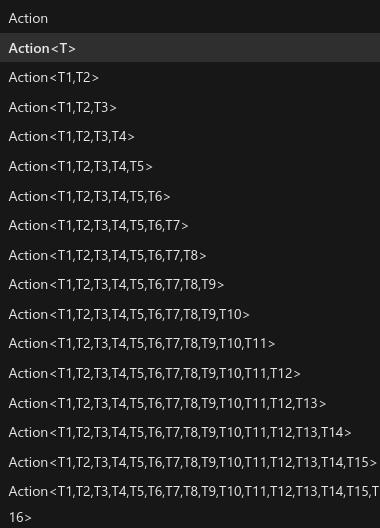

# Maintainer Meeting (16 July 2022)
```admonish info
Any decisions taken in these notes may no longer be applicable.
```

**Time:** 16 July 2022 18:00 UTC

**Attendees:**
- DrSmugleaf
- ElectroSR
- Silver
- Vera
- Ike709
- ShadowCommander
- PJB

## Replace EffectSystem with client-side entities | Metalgearsloth
- Effects don't have animations
- Can't have layered effects nor do fancy animations
- At the moment we mix the two
- They do the same thing and are legacy
- **Conclusion: Yes**


## Labelling EntityUids as "should have a component" | PJB
- Such as EntityUid\<ToolComponent\>
- Wouldn't really mean anything short of just being implicit cast to/from EntityUid when relevant, just a type hint kinda thing
- Vast majority would expect TransformComponent, would make more sense to explicitly say it doesn't require it
- 
    - ship it
- Generic struct that contains the entity uid and component, keeps it in a field
- **Conclusion: Ship it (When PJB Codes It)**


## Engine changelogs | Ike709
- Do we want them: Yes
- Who codes it: PJB
- When: RN
- With: MoMMI
- **Put the changelog in a markdown file**


## Replacing tags with tag components | Mirrorcult
- They often break with prototype inheritance
- Auto ignored comps are now a thing
- The engine needs to be optimized for this (store tag components as a bit flag instead of full components)
- Need proper ECS for this
- **Do it**


## Expanding the number of people allowed to merge PRs | Moony
- **Appoint more maintainers (easier now that master is protected)**
- Link docs automatically when a relevant file is changed.
    - Example: Link construction docs when a file relating to construction is changed.
- Fix the GitHub workflow to auto-remove "needs review" when the PR gets one review, if more reviews are needed put the tag back on.
    - Have it add waiting for review tag as well.
- **Re-read and re-write if necessary the review/PR guidelines.**
- **Show PR guidelines somewhere to the contributor when making a PR.**


## Making wide-attack based on click was a huge mistake | Remie
- [From previous notes](https://docs.spacestation14.io/en/maintainer-meetups/secret/2022-06-25-meetup)


## Early Access Roadmap
- gamemodes/antags
    - dynamic | mirror
        - lings?
            - needs DNA
        - blob | Remie
        - revs
            - we want a generic antag overlay system
            - loyalty implant
            - faction system
- EL BODY SYSTEM | mirror
    - some refactors were done by mirror, still some left
    - surgery died in the war of 1992
        - Mirror died in the war of 1993
    - limb damage.....
- Salvage proc gen | moony
    - [Cargo Commander](https://www.youtube.com/watch?v=H0LPWuTt2o4)
    - **Coded on outer-rim, just needs porting to upstream**
        - moony's entirely rewriting it anyways so **don't do that**
- body system but again
- body system
- __***ENGINE EDITOR***__ | PJB
    - could benefit from full state reload
- movement refactor
    - Client side movement?
        - a smidgen
            - as a treat
            - acruid pls com bak
    - TILE MOVEMENT [c#5551](https://github.com/space-wizards/space-station-14/issues/5551)
- Tutorial
    - In game guides
        - Yes
        - Waiting on pretty labels
        - books/ebooks in pda
            - ebooks preloaded on pda for selected job
            - when rich text gets merged
- oldchat + ui refactor | Jezithyr, DrSmugleaf
    - we did it
    - lost in the canadian wilds
- combat rework (needs to be bikeshedded)
    - https://github.com/space-wizards/space-station-14/issues/3378
- ghostrole bans
    - unify ghost roles prototype
- Admin traitor/role menu
    - Assign people roles
    - Objectives UI
- Job playtime requirements | metalgearsloth, Veritius [c#9384](https://github.com/space-wizards/space-station-14/pull/9384)
    - Playtime tracking
    - Per role playtime tracking
- experimental science
    - artifacts??!?!?
    - "Science is still a piece of shit" - Vera 28/05/2022
- action ui refactor, [like ss13 maybe](https://i.ytimg.com/vi/iFf_T31C-iU/maxresdefault.jpg) | Jezithyr
    - stuck in canada
- any% maintainer | Jezithyr
    - Stuck in canada
        - soon tm
- Prototype composition | Paul
    - https://github.com/space-wizards/RobustToolbox/pull/2678
    - https://github.com/space-wizards/space-station-14/pull/7403
    - paul still not done with his thesis
- Server polls
- Round Statistics
    - Log votes, which maps are played the most…
- State mandated Xonotic matches | PJB
    - Please I have severe withdrawal symptoms
    - Replaced by private SS14 playtests
    - Man down
- The game runs like shit how do people play this
    - still does | PJB 28/05/2022
        - "how do people play this game" (high pitched scream) | PJB 28/05/2022
    - Slightly better | PJB 11/06/2022
    - It's better but still not as good as I'd like it to be | PJB 25/06/2022
    - I haven't played the game since | PJB 16/07/2022

Crashes / Critical bugs: (when are we moving these to GitHub)
      => till next time
