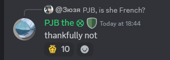

# Maintainer Meeting (12 October 2024)

**Time:** 12 October 2024

```admonish info

**Attendees:**
- Vasilis (Myra)
- PJB
- Errant
- ShadowCommander
- Jezithyr
- Slartibartfast
- Lank
- notafet
- keronsSHB
- ElectroSR
- Julian
- slambamactionman
```
Notice: This meeting was recorded:



# Review system

https://docs.spacestation14.com/en/wizden-staff/maintainer/review-procedure.html

> Is the two maintainer signoff and requirements ok so far? Anything good or bad?
> * Better than the PR Review Forum. - Slam


- Can we streamline small uncontroversial PR merging (like localizing job titles)
    - Channel
    - GitHub Project
- One of my questions about it was "Does a Maintainer pr'ing somethign count as an implicit 1 of 2 required maintainers review/ 👍 . Or does it require 2 people entirely seperate from the PR'er"
    - Yes. A maintainer making a PR counts as one approval.

# Docs vs proposals

Docs are for full implementation details

Proposals are for somewhat fleshed out ideas that aren't thought out to the implementation yet.

# Updating docs

- Mapping needs updating
- There could be more stuff around the concept of Systems/Components, it tripped me up heavily, but I'm planning on writing some notes about that from the perspective of a new contributor. 
- I think there should be a doc that talking about the difference between an entsys and a manger (iirc there isn't, is there?)
    - EntitySystems run in simulation
    - Managers run outside of simulation
    - Simulation is inside a round. If you want something to run in the lobby then it should be a manager.


# Test server

Should we have a test server that runs on the master branch (just like before)

- Myra suggested turning Miros to a test server (no one joins it lmao, if we did a new server the admin team would retire). It should use automatic whitelisting so that it requires at least [BIKESHED AMOUNT OF TIME] to be able to join it. Since we want somewhat expirienced players.
- Theres concerns it will not have players joining it.
- Database stuff may be a nightmare???
- Maints should have admin access
    - Wait dont maints already have maintermin?
        - No cause ss14.admin does not support permissions and we dont want the CHILDREN to have access to PII 

# Other

- Update guidelines for closing of Draft PRs
- Separate Code Conventions and Code Style
- Lock down what Code Style we want. Consider using StyleCop or other code style plugins because dotnet format doesn't format enough things.
- One suggestion if i can make one : downstream we've replaced the github template point "Technical details" with "How to test" which has helped get more people to test the open PRs without waiting for maints.

## Other notes


