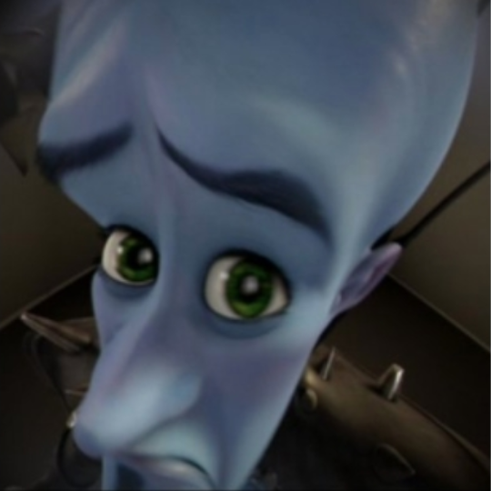

# Maintainer Meeting (7 December 2024)

**Time:** 7 December 2024

```admonish info
**Attendees:**
- Vasilis (Myra)
- Chroimboy
- Slartibartfast
- Julian
- Errant
- PJB
- Slam
```

Notice: This meeting was recorded:



# No topics?


## Stable review
Here the usual list of new features. Mapping changes, bugfixes, refactors and code cleanup are not included.
- [33047](https://github.com/space-wizards/space-station-14/pull/33047) Simplify separated screen top menu
    - Conclusion: We should discuss more about this tommorow and consider #33482
- [33547](https://github.com/space-wizards/space-station-14/pull/33547) Greytide Virus station event
- [33588](https://github.com/space-wizards/space-station-14/pull/33588) Added Oppenhopper poster to the game
- [33660](https://github.com/space-wizards/space-station-14/pull/33660) Juiceable slimeballs
- [33637](https://github.com/space-wizards/space-station-14/pull/33637) Add missing nacho recipes
- [33710](https://github.com/space-wizards/space-station-14/pull/33710) Adds Store on Collide and Wand of the Locker
- [33722](https://github.com/space-wizards/space-station-14/pull/33722) Give vox health regen for poison below 20 damage
- [33467](https://github.com/space-wizards/space-station-14/pull/33467) Add a maintenance panel to bar signs
- [33433](https://github.com/space-wizards/space-station-14/pull/33433) Derelict Borg Revival
- [33277](https://github.com/space-wizards/space-station-14/pull/33277) Add Sprite changes to Logic Gates to show the input/output state
- [33441](https://github.com/space-wizards/space-station-14/pull/33441) New Low-Mid Pop Station - Amber Station
- [31623](https://github.com/space-wizards/space-station-14/pull/31623) Minor improvements & fixes to Shuttle Console UI
- [33437](https://github.com/space-wizards/space-station-14/pull/33437) Fix salvage vendor inventory
- [33466](https://github.com/space-wizards/space-station-14/pull/33466) Allow AI and observers to see electrified doors
- [33465](https://github.com/space-wizards/space-station-14/pull/33465) Draw muzzle flash below mobs
    - Ask sloth and artainers for their opinions (and check in game)
- [33234](https://github.com/space-wizards/space-station-14/pull/33234) Delete HOS headset from warden's locker
- [33540](https://github.com/space-wizards/space-station-14/pull/33540) Shark plushies now goes rawr on hit.
- [33513](https://github.com/space-wizards/space-station-14/pull/33513) Turn off PointLights on VendingMachines when broken or off.
- [33066](https://github.com/space-wizards/space-station-14/pull/33066) Adds more diona names
- [33615](https://github.com/space-wizards/space-station-14/pull/33615) Makes knives fly straight when thrown
- [33545](https://github.com/space-wizards/space-station-14/pull/33545) Rename nitrogen internals crate
- [32869](https://github.com/space-wizards/space-station-14/pull/32869) Require Wield To Activate Double-bladed ESword
- [32457](https://github.com/space-wizards/space-station-14/pull/32457) Fixed ghost role rules for some syndicate familiars
- [31490](https://github.com/space-wizards/space-station-14/pull/31490) Add cooldown to buttons in borg's laws UI
- [33733](https://github.com/space-wizards/space-station-14/pull/33733) set n2 survival box sprite layers
- [33739](https://github.com/space-wizards/space-station-14/pull/33739) vox guidebook update poison regen
- [33699](https://github.com/space-wizards/space-station-14/pull/33699) Samurai dogi is now major contraband

# QNA

## Will there be new midround ghostroles soon?
Theres a bunch of design docs and some prs, but we dont know when they will be merged.

## Will there be standardized design docs templates for feature design docs
This is something we want to work on in the design team but have not had time to implement it as of yet.

## Outcome of the voxbox stuff?
Voxboxes are to be removed from maps (Players can still make them). And as discussed in one of the prs above, they can self heal poison damage below 20 damage. Which also gives them an upside they really need.

## Newmed christmas
Just a week away