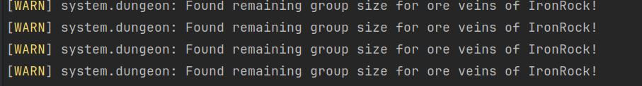

# Maintainer Meeting (6 December 2025)

```admonish info
**Attendees:**
- ArtisticRoomba
- Skan
- Ada
- Slartibartfast
- Princess Cheeseballs
- Scar
- Myra
- Spanky
- Tiniest Shark
- The quiet one
```

This meeting was recorded:



## Bullet fast (Slam)

-  [34971](https://github.com/space-wizards/space-station-14/pull/34971) Do we wanna pull the trigger on this one? Just needs a minor change I can do, and then we can have two weeks of ZOOMY GUNS on Vulture to see if it breaks something?
-  I have noted that stingers have been finding walls kind of optional lately. As this may be related to projectile speed this is a further reason to make sure we're testing this thoroughly before it hits stable. 

- Slam will test this with whether fixtures can correctly block bullets, and if there are any guns that use custom values and if they need to be updated. If it all looks good, the PR will be marked Experimental and merged for Vulture so that we can discuss it next Maintainer meeting.

## Errant had a thing

- `Errant` DungeonSystem spams a lot of errors. Does anyone want to look into it?
  - 

## Silicon Workgroup doc vote hi (Scar)
- https://forum.spacestation14.com/t/silicon-workgroup-document/25503

## Predicted Gunplay (Princess)
- We have two options: Push it off until someone touches the Physics engine ever or use an RMC workaround
  - `Slarti:` I'll finish up RandomPredicted and then start with hitscan prediction which does not need clientside physics. After that we will see.
  - `Princess:` Currently the client cannot LERP clientside only entities in physics. This means we either have to manually fake physics clientside on entities and manually network fake collide events, or completely rewrite the clientside physics engine. 

## Reintroducing the tester role (Slam)
- It was removed because it was essentially an @everyone because it was part of discord onboarding.
- We should try it out again making it a command to assign it.
    - Done (`!selfrole Tester`)

## Stable review

```admonish info
Write your name here if you read this list fully.
**I checked this PR list:**
- ScarKy0
- Princess
- Southbridge
- aada
- Errant
- Tiniest Shark
- Slam
- Slarti
```

- [41494](https://github.com/space-wizards/space-station-14/pull/41494) Add admin antag control command for making people into Wizards
- [41518](https://github.com/space-wizards/space-station-14/pull/41518) Give Rust Removal a shorter Doafter (#770)
    - `Shark`: With how fast it is to remove rust now I think it'd be interesting to start having ways to re-rust the station via antags like the Revenant or Rat King
- [41450](https://github.com/space-wizards/space-station-14/pull/41450) [1984] Beach balls no longer collide with players
- [41377](https://github.com/space-wizards/space-station-14/pull/41377) Trip APCs when they exceed a power limit
    - `Scar`: I've seen a few places on maps where power trips roundstart or after a machine is just enabled, but I guess we will weed those out over time.
    - `Slarti`: Weird, the integration test should catch those cases.
    - `Scar`: It's not pure roundstart, just after a machine is toggled or otherwise. Can't test for every machine being interacted with to ensure power doesn't trip. I think a good example is Bagel's science but I cannot fully remember right now.
    - `South`: Couldn't we create an integration test which runs a map, turns on every machine, then checks for APC trips?
    - `Slarti`: The existing test does that, except for the "turning on" part, which is inconsistent across all existing machines and only few components manipulate power draw at all.
    - Suggestion idea: Mappers should be on the lookout on their maps for power issues, and also run mv to some machines if we prepare to move them to mv.
- [41317](https://github.com/space-wizards/space-station-14/pull/41317) Fix scalefriends food problem #39982. Hivelord Remains now meat and edible by anyone who can digest it
    - `Princess`: I'm glad this got merged because, twice today I played salvager and went "Damn it's fucked up that I can't eat hivelord remains, I should merge that PR that fixes that." twice forgetting I already approved and it's already merged.
- [41273](https://github.com/space-wizards/space-station-14/pull/41273) Admin improvements for Looc and Deadchat
    - `Princess`: Next what would be good is preventing them from taking ghost roles. Not super important though as rarely are you freezing someone already ghosted but it did happen to me recently. 
- [40689](https://github.com/space-wizards/space-station-14/pull/40689) Add vox hairstyle (catfish hair)
- [39100](https://github.com/space-wizards/space-station-14/pull/39100) Improve hitboxes for knives and shivs to better match their sprites
    - `Errant`: I'm confused, what does this actually do? I wanted to complain about hit ranges, but it does not seem to change that
    - `Slam`: My understanding is that it just makes them bounce more accurately against the wall if you throw them. None of these have the throwing property so it's just for visuals.
- [35998](https://github.com/space-wizards/space-station-14/pull/35998) Defibs will now also shock anyone still interacting with the target.
    - `Princess`: Not a blocker but it would be nice if this was in electrocution system instead of defib system as an enableable option.
        - Issue: https://github.com/space-wizards/space-station-14/issues/41746
    - `aada`: Agreed that this should be in electrocution system.
    - `Slam`: Electrocution system should already support this; a funny thing you can do is get budget insuls that zap but don't stun you, find an exposed LV wire, grab a hold of another person (usually SecOff hehe) and punch the wire to zap them.
    - Lets make an isssue for it to move it over.
- [41543](https://github.com/space-wizards/space-station-14/pull/41543) Make artifact analyzer power supply sane
- [41328](https://github.com/space-wizards/space-station-14/pull/41328) Main menu art credit system
- [41532](https://github.com/space-wizards/space-station-14/pull/41532) Add xenoborg laws to ion storm chance
- [41102](https://github.com/space-wizards/space-station-14/pull/41102) Balloons now float and slide smoothly.
- [41556](https://github.com/space-wizards/space-station-14/pull/41556) Make Asphyxiating pierce Resistances
- [41584](https://github.com/space-wizards/space-station-14/pull/41584) Tourniquets can now fit in medical belts
- [41541](https://github.com/space-wizards/space-station-14/pull/41541) Fewer War Crimes
- [41527](https://github.com/space-wizards/space-station-14/pull/41527) Felinase/Caninase Reagent Tweaks
- [41618](https://github.com/space-wizards/space-station-14/pull/41618) Change to add shot glasses to the bartender guidebook entry
- [41623](https://github.com/space-wizards/space-station-14/pull/41623) Make xenoborg round end text better
- [41636](https://github.com/space-wizards/space-station-14/pull/41636) Make Firespread logical
    - `Princess`: A downside of the new system is that the old system correctly had it so smaller entities only removed as much fire mass as they took, this system just always evenly splits even if the fire hits a ceiling on one mob. I do have a PR up that fixes that though :). https://github.com/space-wizards/space-station-14/pull/41650
- [41469](https://github.com/space-wizards/space-station-14/pull/41469) Add water flower for clowns
- [41489](https://github.com/space-wizards/space-station-14/pull/41489) multi reagent bloodstream
- [41654](https://github.com/space-wizards/space-station-14/pull/41654) Santa anomaly back!
- [41632](https://github.com/space-wizards/space-station-14/pull/41632) Add Changeling DNA store
- [41658](https://github.com/space-wizards/space-station-14/pull/41658) Add debug hitscan weapon
- [40300](https://github.com/space-wizards/space-station-14/pull/40300) New Map - Snowball
    - `South`: To anyone wondering, this PR also de-rotates my map Amber. I'm working on completely remaking Amber from the ground-up so I have not had any opportunity to maintain the old version. 
    - Does it have the previous power issues perhaps :godo:
- [41680](https://github.com/space-wizards/space-station-14/pull/41680) Change default Rat King order from 'Loose' to 'Follow'
- [41681](https://github.com/space-wizards/space-station-14/pull/41681) Prefixes surgical caps with their color
- [41691](https://github.com/space-wizards/space-station-14/pull/41691) Change stamina slowdown to use a percentage-based threshold
- [41695](https://github.com/space-wizards/space-station-14/pull/41695) Change to fix wording of Pun Pun's jacket
  - `Slarti`: Isn't this still wrong? Punpun *is* the bartender
- [41700](https://github.com/space-wizards/space-station-14/pull/41700) Allows spesos to fit in envelopes

