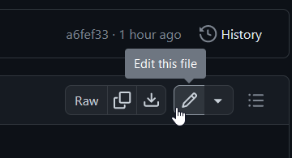

# Guide to Editing Docs

Hello! As you may be able to notice, this docs site is completely open source and free to edit on GitHub. You can see the GitHub page for this site at [https://github.com/space-wizards/docs](https://github.com/space-wizards/docs).

There are a couple things to keep in mind when contributing. While we disallow web-edit PRs (those made exclusively on GitHub) on the main Space Station 14 & Robust Toolbox repos, that is not the case here. **Web-editing is encouraged** to make editing documentation as painless as possible.

If you want to get an idea of what features are at your disposal when writing documentation, go to our [Docs Example Page](./docs-example-page.md).

## Making basic edits

If you just want to make a basic edit of a page, simply follow these steps--you don't need any of the fancy stuff talked about later:

1. Create an account on GitHub, or log in if you already have one.

2. Fork the [space-wizards/docs](https://github.com/space-wizards/docs) repo on GitHub.


3. Click the 'View & Edit Page on GitHub` icon in the very top right of any page on this site.


4. Click the 'Edit this file' button at the top right of the file view.



5. Make your changes, then commit & create a pull request! We'll handle the rest.

## Building

If you want to locally build the docs, the necessary dependencies are Rust and some binaries installed using `cargo`. It's recommended that you use `cargo install` or `cargo quickinstall`, as building can take a while.

From cargo, install:
- `mdbook`
- `mdbook-admonish`
- `mdbook-embedify`
- `mdbook-emojicodes`
- `mdbook-linkcheck`
- `mdbook-mermaid`
- `mdbook-template`

Run `mdbook serve` to build and locally host the documentation from the `book` directory at `localhost:3000`.

## Porting pages from Wiki.js

To port a page, you'll need write access to `docs.spacestation14.io` (old wiki.js), or find some way to view MD source idk.

1. Find a page with the `Porting` template on the top
2. Find the corresponding page in Wiki.js -- it should just have the same name 
3. Copy over the Wiki.js markdown
4. Change any relative links to point to their correct corresponding
5. Change any self-hosted or imgur images to be hosted in `src/en/assets` instead
6. Adjust any admonishments as follows:
    ``````
    > etc text example
    {.is-(danger/warning/info/example)}
    ``````
    to
    ``````
    ```admonish danger/warning/info/example "Title Text Or Leave blank etc"
    etc text example
    ```
    ``````
7. Add a redirect for the original wiki.js link to the new `src/SUMMARY.md` link in `book.toml`--follow the example. You'll need to add `/index.html` after the wiki.js link for it to redirect properly.

## Testing changes

If you've made a PR, the easiest way to test your changes, since they're just markdown, is to view them in GitHub's own markdown viewer in the `Files changed` tab. You can also use a local markdown previewer extension for something like [VSCode](https://marketplace.visualstudio.com/items?itemName=shd101wyy.markdown-preview-enhanced). 

If you want a slightly more authentic experience, every PR will have the `Test mdBook Build & Upload Artifact` action run, and you can download the built site like so:


Then, just unzip it and open `index.html`. Our custom CSS and stuff won't work super well but it'll look good enough.

For an authentic-authentic experience, just follow the build instructions above and run `mdbook serve` like normal.

### Note to self

Unported pages that need a better place to stay than wikijs:
- Secret pages
- Maintainer meeting notes
- Admin draft notes
- Old design docs (technically done since they should all be on hackmd)
- 20kdc's hosting rewrite
