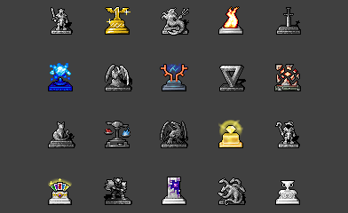

# Gods Gamemode

| Designers     | Implemented | GitHub Links |
|---------------|-------------|--------------|
| EmoGarbage404 | :x: No      | TBD          |

## Overview

**Gods** is a gamemode built around competition between several omniscient gods and the people who serve them. 
In the mode, players playing as various gods grow, command, and lead a sect of their own creation, shaping them to do various tasks in order to grow the god's power.
At the same time, other gods and sects on the station are doing the same, on a neck-to-neck race to see which god can achieve maximum divinity and ascend first.

## Background

I feel like there's a general lack of good antagonists that encourage people to actually get out of their way and interact with others in a means that isn't simply murderous and actually leads to engaging play.
The vast majority of antagonists focus solely on trying to murder and snowball as much as possible, which, while engaging, limits how much they can be active and raises the skill floor tremendously.

The goal of the mode is to have a relatively low-stakes mode that can lead to engaging interpersonal conflicts (through sect wars and battles) while also not being primarily focused on combat.

This mode takes **_loose_** inspiration from Hand of God as well as more liberal inspiration from the game Populous.

## Round Flow

At the start of the round, all of the gods spawn together in a circle in the center of the station. 
The gods, by default, are invisible to all regular players but are able to speak with each other.
They cannot directly attack each other: the only purpose of spawning together is so they can immediately start talking shit and being mean, in good competitive spirit.

After a short delay, each god is given the **divine inspiration** ability, allowing them to choose a single crew member to become their prophet.
Each god must then go out and find a good candidate. 
Mindshielded crew are immune to the effects of the gods, as well as the chaplain.

Upon using **divine inspiration**, the target crewmate becomes your **Prophet** and you unlock the rest of your abilities.
The prophet is given robes, various equipment, and a notification that they have now become ~~one of my elite employees~~ a god's Prophet.

The rest of the round focuses on the prophet, given divine knowledge and guidance by their god, leading their sect into accomplishing various tasks in order to raise their god's **Divinity** (this will be elaborated more on later).
The various gods will not only aid their own sects in growing more powerful, but also in attacking and disrupting the activities of other sects, in order to weaken their gods.

Once a god's **Divinity** and **Ascension Level** reaches the max amount, they can ascend into **Ultimate Godhood**.
Using their power, they snuff out all other god's and their followers, turning them into ash in a cinematic station-wide event, and grant their loyal followers extreme power.

At this point, the mode is essentially complete, with one god reigning supreme and their followers ascended into powerful states. 
The mode can either end here (conventional secret) or a new antag could be started and the followers left to their own mysterious devices (dynamic).

## Divinity and Ascension Levels

_Various gods from Dungeon Crawl_

The main resources that gods manage, besides their loyal followers, are **Divinity** and **Ascension Level**.
**Divinity** functions as an expendable resource: using it, you can perform various divine feats and aid your followers. 
**Ascension Level**, on the other hand, functions as a cap to how much **Divinity** a god can have at a time, limiting their abilities.

**Ascension Levels** function as a sort of staircase. 
They are raised by certain actions, but only when a threshold is reached does the level raise, increasing the **Divinity** cap.

**Divinity** is raised by certain actions but also has a very low passive generation.

### Ascension Level: Altars & Temples
Altars and Temples are the primary way of increasing the **Ascension Level** of a god. 
Any prophet or disciple is capable of, at the cost of some plain resources, creating a temple on the station.
Prophets are additionally able to create altars, which serve as temples except with additional properties.

Both of these structures, when blessed with a god's tome (spawned on every prophet and able to be created by a prophet blessing a book) become activated and tied to the tome's god.
All temples and altars give a small increase to a god's ascension level as well as a small buff (non-stacking) to disciples nearby.

Altars additionally permit sacrifices, which grant **Divinity**. One exception is the sacrifice of other gods' prophet or a chaplain. 
These sacrifices instead give a permanent increase to a god's **ascension level**.

Although, be careful with your placement, as other sects can use their god's tome to steal your temples and altars.

### Divinity: Sacrifices & Preaching
The way in which **Divinity** is increased varies largely from god to god. 
For the most part, each god has their own unique methods to raise divinity. 

A generic method for raising divinity is simply preaching, which can be accomplished by reading a god's tome aloud near other players. 
Be careful, however, as the results of preaching lessen after someone has be preached to.
Additionally, this can quickly make you a target of security and other sects. 
It's best saved for low-level disciples.

Based on a god's theme, you can sacrifice various items to raise their favor. 
A god of hunting may want animals, greed may want valuables, and a god of silliness may want the entire clown.

Alongside these methods, each god also has unique methods of raising their divinity. 
These can range from cooking meals, to setting things on fire, to slipping people with soap. 
These are by far the most effective methods, and encourage disciples to get out into the station and cause some mischief.

## Abilities
Gods all have unique abilities based on their themes. However, they all also have a few generic ones:

>**Divine Word (Cost: None)**: Sends a private message to your prophet.

>**Wrath (Cost: None)**: Usable on any disciple: deals a small amount of damage and stuns them.

>**Smite (Cost: None)**: Instantly obliterates your disciple, returning your **ascension levels**. 
> Can only be used on living disciple who is not currently taking damage.

>**Bless (Cost: Low)**: Gives a temporary buff to a target disciple, healing them, increasing their movement speed, and giving them armor.

These abilities are more specialized per-god and can be applied to temples:

>**Give Artifact (Cost: Low)**: Creates a god-specific equipment item at a target altar.
> If sacrificed at another god's altar, grants a large divinity buff.

>**Imbue Temple (Cost: Medium)**: Permanently imbues a target temple with godly energy.
> Any disciples of other gods who are nearby will find themselves weakened in its presence.

The following abilities are only unlocked with progressively higher **ascension levels**:

>**Divine Rage (Cost: Medium)**: Does a god-specific attack at a target location. 
> Cannot be performed near other god's temples. 

>**Inspiration (Cost: Medium)**: Buff all disciples in a radius with a strengthened version of "Bless."

>**Catastrophe (Cost: High)**: Creates a highly destructive attack at a given area. 
> Can be used near non-imbued temples.

>**Ascension (Cost: Max)**: Ascends a god, smiting other gods and followers. 
> Ends the gamemode.

Gods finally have one last "ability," creating disciples.
Any player at a temple or altar can offer themselves as a disciple to a god.
You can accept their offer at the cost of an **ascension level**. 

It's important to be particular about who you accept, as dead disciples do not return ascension levels (only smites).

## Secular Interference
All sects are antagonists and thereby subject to the whims of security players and validhunters alike.
A disciple (not prophet) can be forcefully deconverted with a mindshield, removing them from the sect.
Gods' abilities can be quite destructive and chaotic, so it is in the best interest of the crew to try and not let them grow too powerful. 

Or maybe, it isn't?

If you wish, you can always do some minor aid for a sect in order to gain their favor before becoming one of their followers. 
Just be careful that you don't end up on the wrong side of a God's turf war and they send their disciples after you.