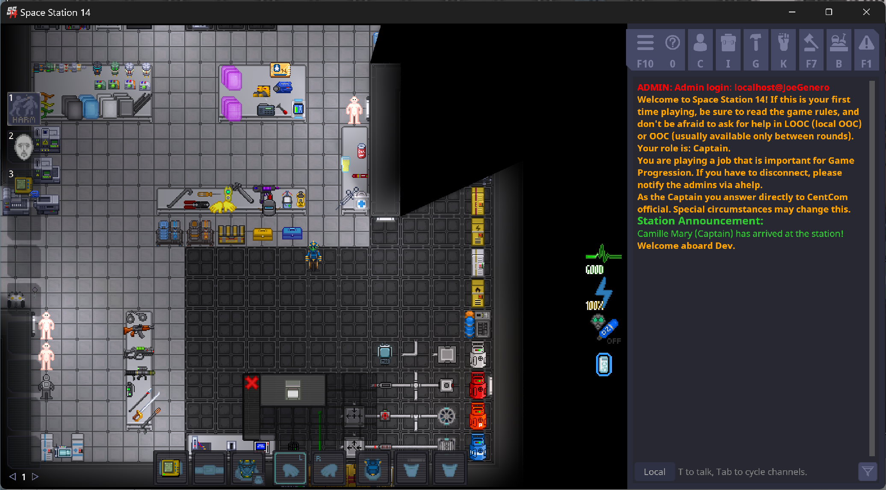
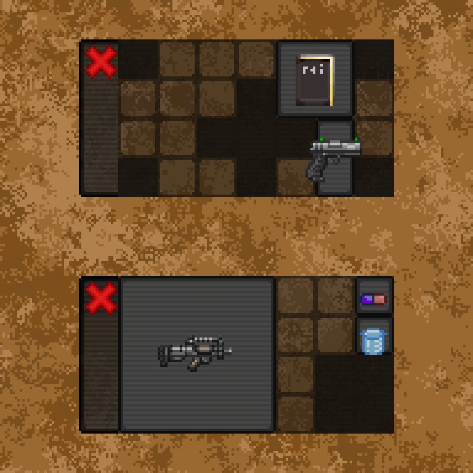

# Grid Inventory
**Authors:** EmoGarbage

Credit to the SS13 server Fields of Fire, whose inventory overhaul served as inspiration for the UI.

## Abstract

Grid inventory is intended to be a replacement for the current inventory backend and UI. 
It encompasses both an internal rewriting of storages, wherein they are classified by geometric shapes, as well as a redesign of the UI, aiming to translate the internal logistics of the system in an immediately understandable way. 
Under the system, storages will consist of grids made up of tiles and items will be small items that can be moved around and fit into the grid. 

## Storage Pains

Laying out what's wrong with the current storage system is important, because inventories--and for the purpose of this document, inventory refers to any given storage container, not the players' hands and clothing HUD--fail in subtle and unexpected ways.
The failures can be divided largely into two categories, mechanical and visual, and both show the unique ways in which a core system can underperform and in turn erode more central mechanics.

In terms of the mechanical failings, those which call for the rewriting of the core of the system, the most evident is the inability to represent objects of unorthodox or strange shape.
Whether it be a numerical size or an enum, it is impossible to communicate the spacial properties of something like a broom or a life preserver.
Inventories cannot be long and thin or made up of many smaller sections.
There is a lot of genuine interest in nuance in the problem of storing an object: it exists as a microcosm of greater questions of the value of what you carry and if it can be stored in an efficient manner. 
As the system exists currently, the "efficiency" of storage is not a concept that can be explored, which is a shame.

On a more surface level, the presentation and interactions of a list inventory is also laden with issues.
By existing as an infinitely scalable list, containers are forced to express the sizes and capacity numerically, relying on exposing objectively meaningless numbers in order to communicate scale.
Furthermore, lists are bad at displaying images at a scale that is easily understood (due to their properties of being scalable) and thus rely on things like text, which simply saturates what should be a very simply HUD element with lots of text and numbers.
Lists are also frequently used to fill up large chunks of the screen, which genuinely looks terrible.

Ideally, a perfect storage system should not only be able to handle weird sizes and shapes of containers and items alike, but also visually convey this in a way that is immediately able to be understood by a new player without being overly reliant on text and numbers.

Thing goes in bag is simple: it should feel simple to do. 
It should never feel sprawling or overwhelming or like you're scanning your screen for crap.

## Grid Inventory

Our solution? A to-scale HUD element that can represent uniquely shaped item's as well as display the size of things in an immersive and immediately understandable way.

### Items

Items in grid inventory are a deviously simple. 
They retain the ItemSize enum from the current system, but gain an additional `inventory shape`. 
This is just the shape the item takes up in the grid and it additionally serves to codify the hidden weight mechanics of the current inventory in a more intelligent way. 
Rather than tiny items having a weight value of 1, they simply take up a single square.
Items would have reasonable default sizes inferred from the current weight values of items with an optional specifier for other custom shapes.

Inside of the inventory, you'd be able to manually move around and rotate items, allowing gaps to be filled and space optimized with proper planning. 
You'd also be able to intuit how much of the inventory an item fills from a simple glance, since the volume is of the container is represented visually.

### Storage

For the most part, storages exist as literal translations of the current values. 
A 28 capacity simply becomes a 7x4 box.
In terms of balance, the numerical values of the different items and storages remains the exact same.
The only difference is having to place the items into the bag and organize them to potentially make room.

Of course, putting an item in your bag will automatically try and orient it within the grid, not allowing it only if there's no room for it to fit.
This means there's an equal measure of convenience in terms of picking items quickly, only being a hindrance when trying to fit an unwieldy object.

The hotkeys for quickly taking items in and out of bags will remain identical, simply remembering the order of inserted items and taking them out in the reverse order.

### A Brief Aside About Slots

For slot-based storage, like belts, the UI will remain the same, but simply with standardized item sizes. 
A 7 slot belt is a container with 7 squares and every item takes up only a single square. This loses out on the benefits of the scaling, but it integrates well enough and conveys the same information as the previous system, so it's kinda moot.