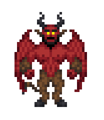

# Devil Redux

| Designers | Implemented | GitHub Links |
|---|---|---|
| mirrorcult, with help from Emisse & freeman | :x: No | TBD |

<i>DEAL OR NO DEAL MOTHERFUCKER</i>

## Overview

Devil was a minor antagonist featured in some SS13 servers, notably /tg/station. The devil spawned as a regular crewmember, and their goal was to make contracts with other crewmembers (giving them valuables, revival, etc) in order to grow their own power and eventually become a murderboney archdevil.

This antagonist was eventually removed, though the concept was still well-liked, because this implementation failed to pan out and usually ended up with the devil being killed immediately.

**The design here will differ in several key ways.** The devil:

- will no longer start as a regular crewmember. It will be a proper middle manager of hell looking to rise up the ranks, as shown in the sprite above.
- will be immortal. It cannot be killed by any means, but can be inconvenienced through religious means, like holy water or salt circles.
- will have minimal interactions with the world around them besides contracts. **It cannot attack people (no access to combat mode at all)**, or interact with most machines, but can pick up and interact with items (e.g. for contracts, or to steal a precious item as part of a contract)
- starts immediately with several powers, notably the ability to spawn a contract of some type as well as jaunt with very few restrictions (and probably a few more for flavor).
- does not gain attacking powers and become an 'archdevil' with more contracts. They may gain some new powers or contract types, but their main goal is simply to fulfill their objectives however they like and have fun.
- has contracts which are more prone to lawyering, negotiation & have better modularity in general

### Reasoning

The above changes might look a little confusing, but they're intended to deal with the exact problems that this antagonist faced in its previous iterations in SS13. 

By making the devil immortal, it solves the validhunting problem--you simply will have to deal with the devil existing: it's a devil, after all. You may be able to annoy him with a good enough crew

Making the devil unable to harm others solves the murderbone snowballing problem. Rather than the devil just trying to max its numbers out so it can do some killing, it's now actually in the round to generate fun scenarios, and its objectives (for example getting anyone to sign a specific type of contract) promote this.

Making the devil not a crewmember, but just a separate antagonist, gives it more personality and allows for the role to be spawned midround quite easily. Furthermore, it's good flavor: a middle-manager devil looking to get a promotion heads out to a dusty space station to prove it can still cook up some contracts. Good shit.

## Contracts

Beyond the worth expounding on the *unique* contract system, how it's intended to work, what type of gameplay it should foster, and possible counterplay. These are the bread and butter of devil gameplay.

Contracts are **simply fancy pieces of paper** which can be written on. However, they do have some fixed areas--a header, bullet point list, and footer. Since it's just text, you can use font changes/size changes, color changes, etc (to a certain degree).

A devil can spawn and create a contract, but **anyone can edit a contract**, including the person signing it. The crewmember must sign it first, after which the devil can no longer edit the contract without voiding their signature. When the devil signs the contract, it goes into effect.

Each contract has a fixed downside that, when the crewmember signs it, **they sign away their soul** and will **go to hell when they die** (not able to be revived, forced into a hell dimension).

Each contract has a number of **clauses** which are listed in bullet points. Clauses are **written in natural language** and use an extremely rudimentary parsing system to determine their effect. Each clause has a limited number of characters, and they have three different ways of changing their behavior: *triggers*, *positive/negative effects*, and *modifiers*.

**Triggers** are how the clause will be triggered. A clause may have as many triggers as you can fit. Normally, it's simply "on signing the contract", however some other triggers are available:
- "after X minutes/seconds", simply delaying the
- "randomly" will pick a random trigger (& time if a time trigger was selected)
- "on death/crit" does what you think.
- "on hearing/speaking word" also does what you think.

**Modifiers** are fun language tricks that subtly change how the contract works or who it affects:
- "not", "can't", "won't" etc. simply negates the effect! These can stack, i.e. "not won't can't not" (four negations) means the effect **will** occur.
- by default, effects will apply to the non-devil who signed the contract, but "the devil/contracter", "the human/contractee/crewmember" etc will either add a degree of specificity to who it applies to, or to change who it applies to.

**Positive effects** are things such as:
- A specific item requested by the crewmember
- Vitality--healing, revival, stun resistance, etc
- Increased view range
- Innate pinpointer to any player
- A random or specific spell
- Darkvision / xray vision
- Gaining a hand or other body part

Each contract may only have one positive effect in total.

**Negative effects** are things such as:
- Die (to be used with certain modifiers)
- Explode
- Remove X hands
- Get kill smited
- Blindness, forced pacifism, clumsy, etc
- Polymorphing into another creature
- Spawn a hostile creature nearby

Each contract must have one variable downside, in addition to the fixed downside.

## Imagine the fun

Simply imagine it!!

- A devil jaunts into the middle of a nukie firefight to offer one of them revival in exchange for dying in 10 minutes
- A headrev makes a contract with a devil to be able to seek out the hiding captain, but the captain made a deal with the devil to have increased vitality
- A crewmember negotiates a roleplay contract with a devil--they will sign a contract IF the devil gets someone else to sign a contract, or if the devil does something else for their amusement (such as a fiddle battle)!
- The chaplain lures a devil into their office under the pretense of making a contract, but traps it forever in a circle with a salt grenade! However, some wily crewmates still seek out contracts with the devil by entering the salt circle themselves, or even destroying it to free it.
- A wily lawyer inserts the words "devil in 30 seconds not not becomes monkey" into another clause in small font, and the devil actually falls for it!