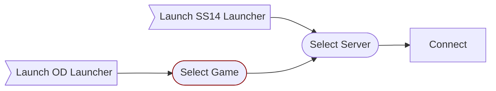

# Launcher Game Selector

| Designers | Implemented | GitHub Links |
|---|---|---|
| ZeWaka, ike709 | :x: No | WYCI |

## Overview

OpenDream needs the ability to display multiple games, another abstraction level over servers.

This would bring the order to:

## Background

So, somewhat obviously, OpenDream needs to operate at one level higher of an abstraction than the SS14 Launcher currently supports.
This because the SS14 launcher is currently envisioned to just be for the /game/ Space Station 14.

To address this, we can  basically rebrand the current concept of hubs to be 'games', like Byond does.
Then, we'd have some master list of 'games' that is distributed somehow. GitHub repo with a json file the client manually pulls, a webserver api on central.spacestation14.io, anything works.

Essentially, all launchers running on the RT framework would be able to swap between different 'games' and then choose servers that the game is running. Kinda like how Byond was intended to run (and does outside of SS13).
Obviously, this does somewhat magnify the hub effect (people join popular shit), but I don't think it'd be worse than Byond already is.

Obviously, there'd need to be some sort of Highly Political Process to determine how new games get added into this list-of-hubs but that's kinda out of scope of this document.

### 'OpenDream' Launcher

This launcher would start at the 'Games' context, allowing you to pick from any of the games.

### Space Station 14 Launcher

This launcher would start in the 'Space Station 14 game' context, allowing you to pick from the various ss14 servers.

### Hub API Changes

Additionally, from what I can tell, the concept of having multiple hubs/games is somewhat undeveloped, insofar as there's no metadata associated with the hub address.

Therefore, I also propose an endpoint like `/hub/api/meta` which can have information about these 'games', like the name, desc, a logo in base64(or png etc) to display on the launcher, etc.

## Example Flow

#### Select Game

#### Select Server

 (not going to bother editing this one to match, but you get the idea)

## Other Thoughts

There could potentially be a 'Space Station 13' launcher start starts in the SS13 context, to try and minimize the hub effect.
