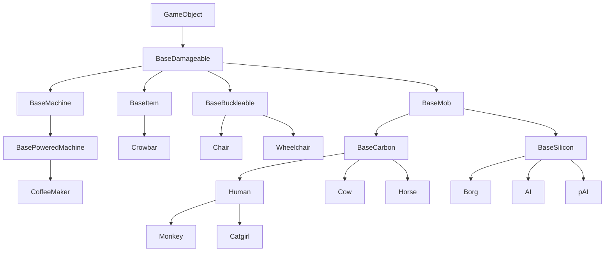
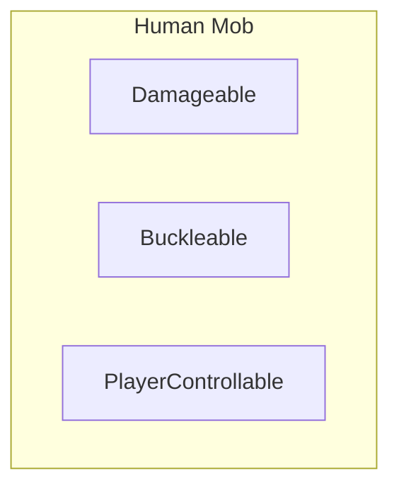
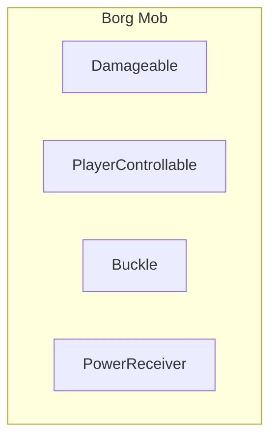
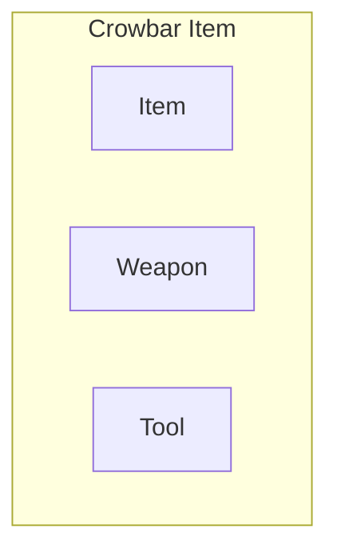
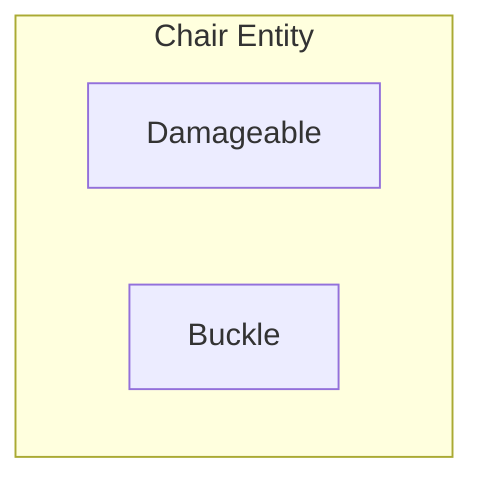
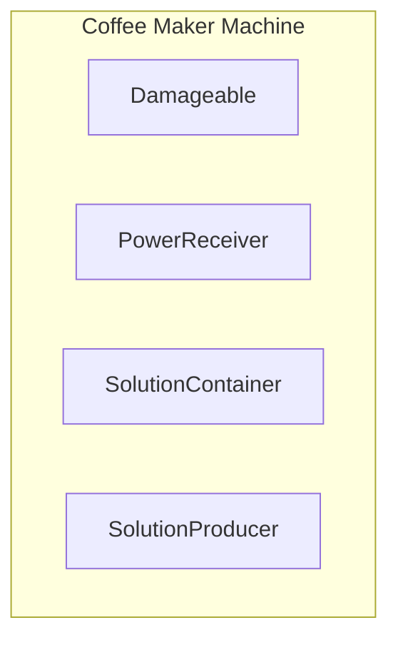

# ECS

Embed these nicely somewhere.

https://youtu.be/W3aieHjyNvw

https://youtu.be/JxI3Eu5DPwE

## The solution to 'OOP is Bad': ECS

So, the ECS ([Entity Component System](https://en.wikipedia.org/wiki/Entity_component_system)) gang has finally convinced you that OOP is bad and ECS is good, huh?
Good! OOP is indeed bad. In this document, we'll revisit some basic concepts such as Components, Entity Systems and Events, and explore an ECS approach to them.

```admonish info
For a solid, real example of ECS in action on our codebase, take a look at [Stacks](https://github.com/space-wizards/space-station-14/pull/4046) and [Actors](https://github.com/space-wizards/RobustToolbox/pull/1774).
```

## Why composition over inheritance for game objects?
When you think of how to design game objects such as humans, items or walls, your first idea might be to use complex inheritance trees for this:



Seems fine at first, right?
However, as you keep adding more and more features you'll soon realize the limitations of this. Let's go over some of the problems you might encounter.

1. Say you wanted to make borgs, but not AIs nor pAIs, draw power from the powernet like `BasePoweredMachine` can.
What do you do? Do you make borgs inherit from `BasePoweredMachine`?
That's not an option, as they need to inherit both `BaseMob` and `BaseSilicon`.
Do you make `BaseMob` inherit `BasePoweredMachine` instead?
That doesn't make sense either, most mobs will not need that functionality.
Your only option here is to duplicate the code that handles power across `BaseMachinePowered` and `Borg`.
2. Now, say you wanted to allow people to buckle themselves to horses and borgs, but not the rest of mobs.
What do you do, do you make `BaseMob` inherit `BaseBuckleable`?
That doesn't make sense, as most mobs will not need that functionality.
Your only option again is to duplicate code across multiple, distant classes.

As we've seen, having complex inheritance trees like this is not ideal, and eventually forces us to needlessly duplicate code, or give certain game objects functionality they're never gonna need.
The solution to all these problems is to use **composition** instead.











As you can see, by using composition all our problems from before are solved neatly, without duplicating any code and allowing for better maintainability and extensability:
- Borgs and coffee makers share the `PowerReceiver` component, which makes them able to draw power from a net.
- Borgs and chairs share the `Buckle` component, which allows entities with `Buckleable`, like humans, to be buckled to them.
- Humans and borgs share the `PlayerControllable` (also known as `Mind` in SS14 code) component, which allows them to be controlled by a player...
- And most of the game objects above share `Damageable`, which allows them to have "health" and be damaged.

TODO: finish this
----

Edit all this text into something proper for a doc... Sigh

Okay so we usually mean a bunch of things by "OOP bad", and I'm not sure how to condense it all into a simple explanation but here I go.
1. First of all, inheritance. There are many problems and inflexibility that come with complex inheritance trees... Imagine we had no components and instead had a big-ass inheritance tree: If you had a "machine" base class that has power consumption, and a different "mob" base class that has funny player-controlling mechanics, now you essentially cannot make a mob have machine qualities or vice versa without making ugly hacks, or a common base for both "machine" and "mob". But at the same time, that wouldn't make much sense either! Most mobs aren't gonna need "power consumption features", and few machines are gonna be player-controlled at all... So to solve this awful, gnarly problem we use "composition" (components!) instead of inheritance. You know this stuff already, if you want an entity to have hands, add `HandsComponent`. If you want to make it consume power, `PowerConsumerComponent` will help! If you want to make it player-controllable, add `MindComponent` and control the entity and-- oh hey we made a "cyborg mob" out of reusable, generic components! This, of course, is hard to do with a big-ass inheritance tree alone... Of course, inheritance can be good and fine for small things, or when you have a very small and self-contained inheritance tree (see something like `SoundSpecifier` for example, it's tiny but inheritance helps a ton there) but when you have a big complex game like ss14, inheritance just makes things way more painful.
2. Also, encapsulation is another one. OOP likes to put both data and methods/logic on the same class, as a bundle, and only expose certain things to the outside of that class. You know, the funny access modifiers like `public`, `private` and such? So encapsulation is good for something like the engine, which specifically needs to obscure/prohibit access to some data or methods. But it doesn't make thaaaat much sense for game data and logic, for example. `StackComponent` in SS14 have no private fields or properties in 'em, anyone is free to go and read/write the values as they please. However, this is not the recommended way to interact with stacks, at all!
`StackSystem` has a few methods to operate on `StackComponent`, and change its values. So to use a certain amount of things on the stack, you use `StackSystem.Use`, to split it you use `StackSystem.Split`, etc, and `StackSystem` will take care of everything for you. Because turns out that changing the stack amount value isn't enough. You also need to do funny stuff such as: dirtying the component for network syncing purposes, setting the appearance value, raise a `StackCountChanged` event, etc.
The way you would do this in E/C would be to put all of that logic in the "amount" property on `StackComponent`, or maybe a method. Then you could `private` the actual "amount" number away. However the E/C architecture will not be accepted in this codebase, we will only use the ECS architecture going forward.

See, putting any kind of logic in a component class doesn't make sense at all. If we think about how stuff in ECS is structured, it's like this:
1. Our game world has a bunch of entities, the entities have components
2. There are systems that operate on components

Therefore, components should only have data in them, and no logic whatsoever. Systems should give the entities their behavior, when they have the appropriate components.
I'm more saying like... Rather than have logic in components change stuff, we want entity systems to operate and modify components. So instead of having:
`HandsComponent.Pickup(ItemComponent)`, you would have:
`HandsSystem.Pickup(UserEntity, ItemEntity)`.


## Components, revisited
Ah, components. For a long time, they have been the heart of the game's simulation: a mix of data and logic akin to a bowl full of soggy noodles.
However, as we've experienced in our own codebase, scaling these is far from ideal.
After a while, you start getting components which are tightly coupled to a lot of other components, and end up with an unmaintainable mess. What do you do when a component requires another component to exist on an entity? Add it if it's missing, or report an error?

The solution to all this and more is to remove ALL logic from components, and simply treat them as containers for your data, or markers. In the long run, this means that components can be all turned into structs, and therefore potentially increase performance in many areas of the game.

But wait, if we remove all logic from components, how do we add behavior to an entity?
Enter *Entity Systems*.

## Entity Systems: What they should have been from the start
Entity Systems, as their name implies, are systems for entities.
This means that ultimately they hold all logic and behavior for entities.
