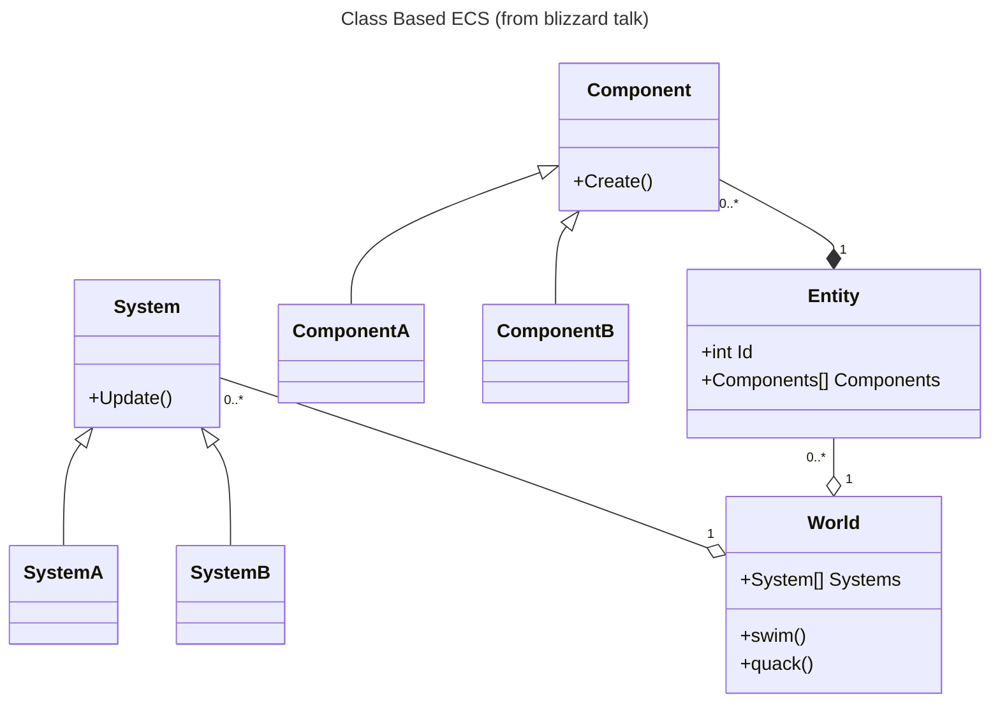

# ECS
<!-- Summary:  *contexts* -->
RobustToolbox (RT) employs the Entity Component System (ECS) software architecture pattern. ECS consists of three parts *entities*, *components*, and *systems*. ECS is the total extreme of the object oriented principal of composition over inheritance. ECS therefore looks fundamentally different from most of programming patterns, but has the advantage of clean separation of responsibility.

ECS is a fairly constrained pattern when compared to the entirety of object oriented programming. ECS does not need to utilize any object oriented concepts; however, RobustToolbox makes use of inheritance to ensure that programers do not need to build games with boiler plate. Inheritance is also used in the multiplayer configuration of RobustToolbox to alleviate the need for code repetition on the client and server. Beyond the engine's implementation of ECS and the multiplayer setups, programers should not consider inherence as a valid solution to an ECS problem.

## Parts of ECS
<!-- insert cursed diagram (class) ECS -->



### Entities
Entities are game objects. The logic that operates the game will be applied to entities. Entities do not have any logic themselves; instead, entities hold units of information called components. A single game object consists of many unique components which can be added and removed as the game is running. RobustToolbox's components are addressed by a unique ID.

### Components
Components are the fundamental unit of entities. Components are data fields all related to the same concept such as Position or Velocity. Both Position and Velocity may be internally identical, both storing 2 numbers in a 2D game, but should be kept separate as these have fundamentally different meanings.

Components should be minimal (atomic). A Mobile component could combine Position and Velocity components; however, this combination can already happen in the entity. In the future if a game object should not have the ability to move splitting the Mobile will require a refactor of logic code present in systems.

### Systems
Entity behaviors are defied by systems. Systems act on entities with certain components. A basic movement update system would operate on all entities which have both position and velocity by adding the velocity to the position. A basic Render system would operate on all entities with a Position and Texture components.

Systems select the Entities to operate on based off of queries. These queries select entities by which components are or are not present.

```c#
// code example here
```
## recommended resources

##
<iframe width="420" height="315"
src="https://www.youtube.com/embed/W3aieHjyNvw">
</iframe>

<iframe width="420" height="315"
src="https://www.youtube.com/embed/JxI3Eu5DPwE">
</iframe>
