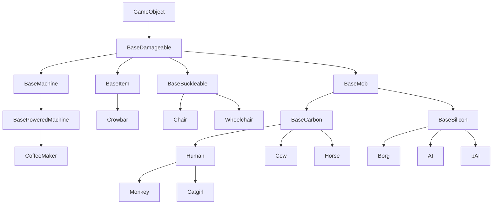
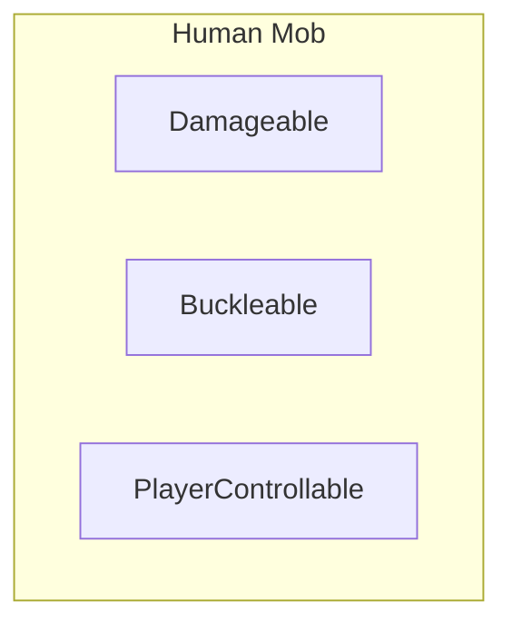
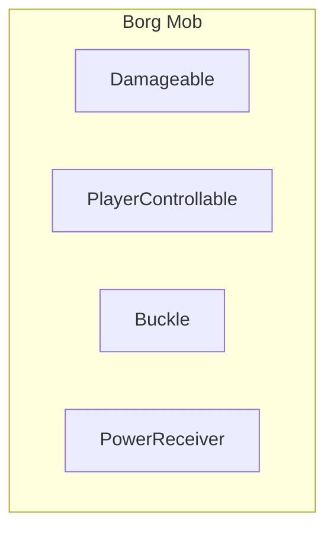
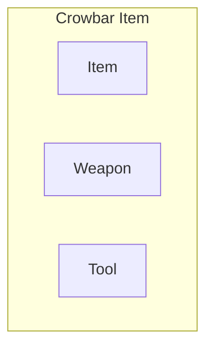
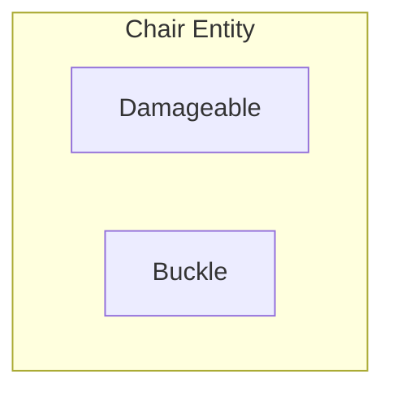
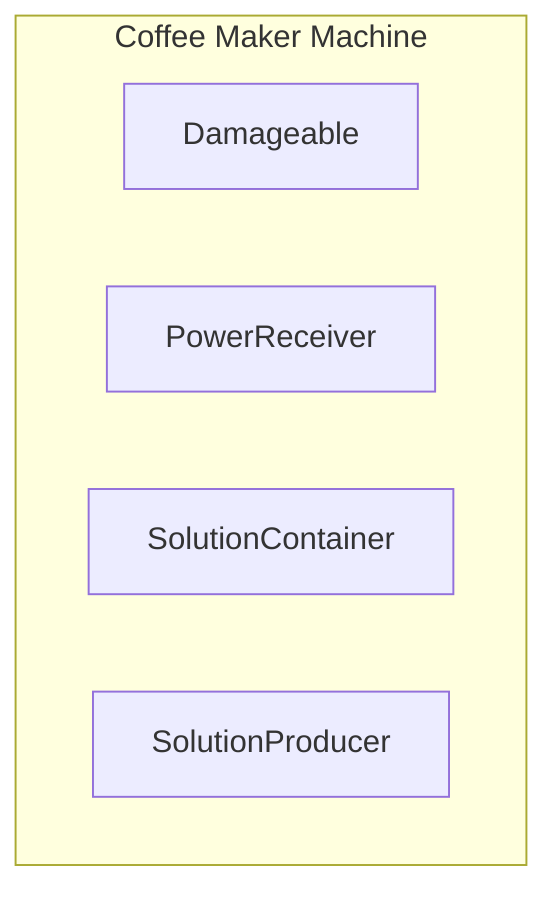

# Object Oriented Pitfalls

Many programers are familiar with object oriented programming (OOP) basics. Some of the contributors to SS14 and RobustToolbox have experience with BEYOND and the DM language which utilize unconstrained OOP as a platform for development. This guide exposes some of the pitfalls of OOP and how ECS and RobustToolbox avoid said pitfalls.

## composition over inheritance

Composition over inheritance is an object oriented design principal; ECS is considered to be a maximization of this principal. This document will demonstrate the what and why of Composition over inheritance and its relevance to RobustToolbox.

### What is composition over inheritance?
In the case of a choice between inherence to grant properties and composition, fields which are other classes, which do the same, chose composition. The reasoning is that while inherence can be powerful, it is inflexible.

### Why composition over inheritance for game objects?
Consider the following inheritance tree:

This tree is highly efficient, all code that would need to be repeated is instead inherited from a parent class, but manipulating this tree is cumbersome as the placement of a new type of game object must be carefully considered both for the present and future.

1. Borgs for example which are neither AI nor PAI, would need to draw power from the powernet like `BasePoweredMachine`. In this tree Borgs could inherit from `BasePoweredMachine`, but that is not an option as borg *must* inherit from `BaseMob` and `BaseSilicon`. `BaseMob` could be moved to inherit from `BasePoweredMachine`, but this would grant unwanted functionality to `BaseCarbon`. The only effective option is to replicate the code across `BasePoweredMachine` and `Borg`.

2. Another example is allowing players to buckle themselves to only horses and borgs. Moving `BaseMob` to inherit from `BaseBuckleable` once again will not work as the buckling properties will transfer to mobs which should not be buckled to. Code replication is again required in this instance.

Code replication should be  avoided as it introduces the issue of keeping replicated code artifacts in sync. The strategy that ECS uses to avoid these inheritance problems is to grant properties to game objects. A game object, instead of a member of a tree, is defined by the properties (components), that it is *composed* of.

By using composition the problems from before are solved neatly, without duplicating any code and allowing for better maintainability and extensibility:
- Borgs and coffee makers share the `PowerReceiver` component, which allows both to draw power from a net.
- Borgs and chairs share the `Buckle` component, which allows entities with `Buckleable`, like humans, to be buckled to them.
- Humans and borgs share the `PlayerControllable` (also known as `Mind` in SS14 code) component, which allows them to be controlled by a player.
- And most of the game objects above share `Damageable`, which allows them to have "health" and be damaged.

## Encapsulation

Encapsulation is the fundamental concept of OOP.

### What is encapsulation?

Encapsulation is the bundling of data and functions/logic. These bundled functions are called methods and operate on the data within an object. Both the data and methods can be shown or hidden to outside classes.

## why not encapsulation?
The bundling of data and logic raises an issue. Game code is highly coupled, so idea of game objects containing properties (components) is discarded by encapsulation. Any methods written for these components must also know about and interact with other components. A borg with the `PowerReceiver` component and `PlayerControllable` component may have changes to control when power is low. The `PlayerControllable` component would need to know about the `PowerReceiver` component to change the player speed, and the `PowerReceiver` component would need to know about the `PlayerControllable` component to deplete the internal battery.

Either methods must be added to components to communicate between themselves causing high coupling, or the game logic should be moved out of components. ECS and RobustToolbox do not combine game data (components) and the logic required to operate said component into the same bundle. Instead logic is moved into systems which to avoid the same problem solved by moving logic out of components do not contain state.

Systems have the ability to operate on more than one component simultaneously. For example a `PoweredMovementSystem` could operate on all `PowerReceiver` and `PlayerControllable` components contained within a single entity. Entities witch contain those components will be operated on by the `PoweredMovementSystem`. Multiple systems can operate on components at the same time. Input being taken by `PlayerInputSystem` and `PoweredMovementSystem` can both operate on `PlayerControllable`.

Because systems are external to components and still need to interact, components must only contain public fields. This allows for direct interaction with components from any system. Each system could interact with every component, but this would likely cause redundant code. Systems may call functions on other systems to avoid replication functionality that always exists. Since there is no state in a system there should be no concern of side effects. However, the order in which systems are executed will change the outcome and should be configured.

## Conclusions
1. The game world has a bunch of entities, the entities have components

    Entities aggregate components to form game objects

2. There are systems that operate on components

    Systems should give the entities their behavior, when they have the appropriate components.

3. Components have no logic

    Components should only have data in them, and no logic whatsoever.

4. Systems have no state

    Systems should only have logic in them, and no data whatsoever.
