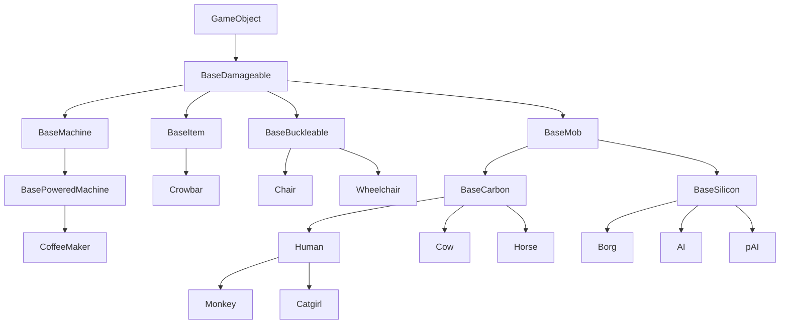
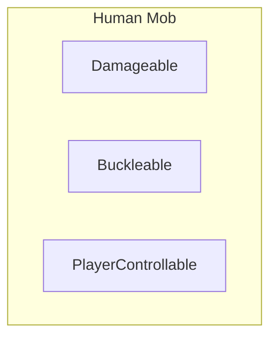
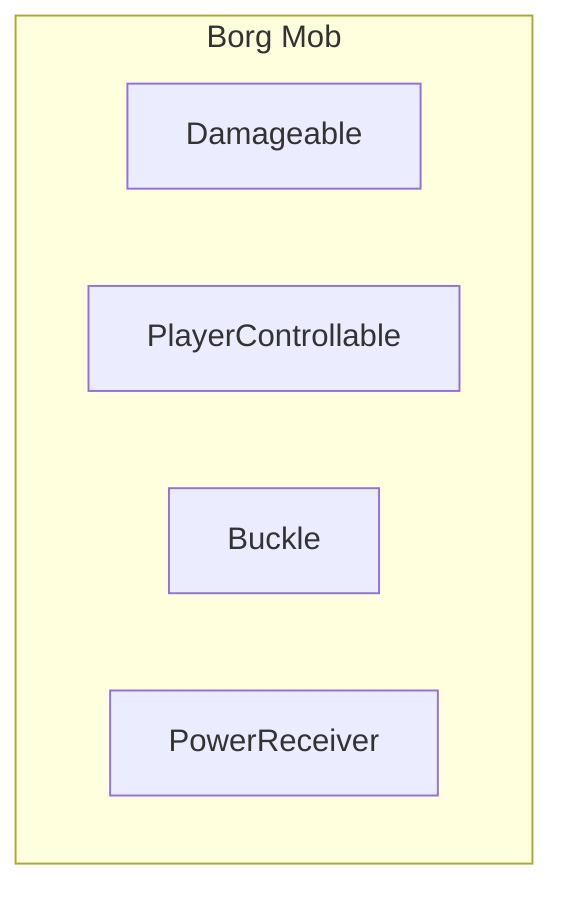
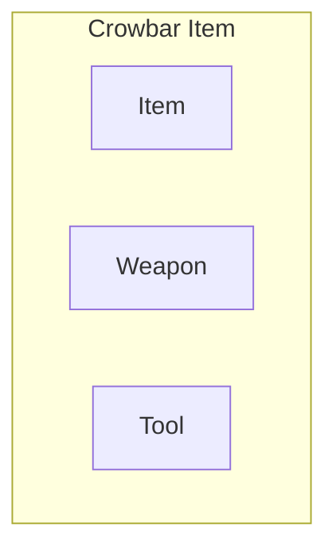
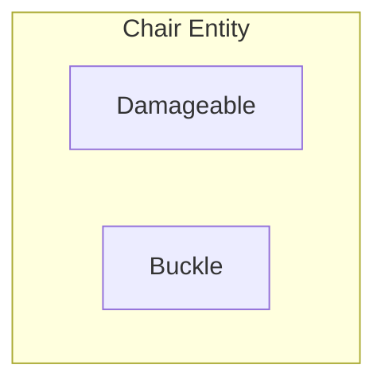
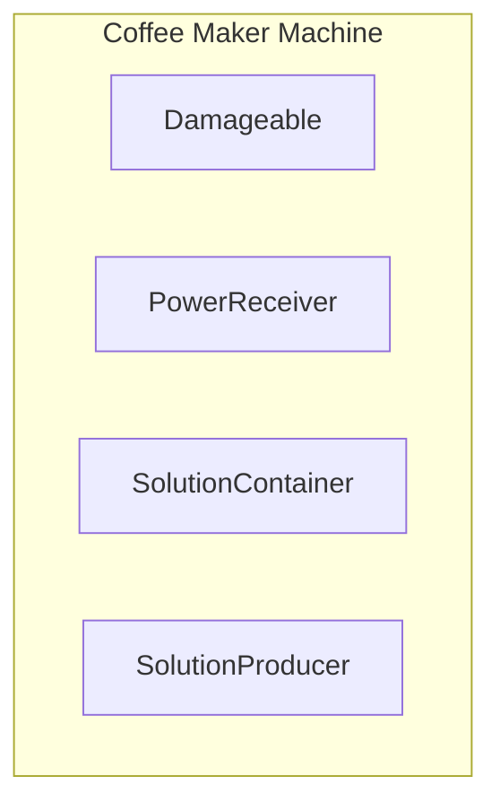

# ECS

Embed these nicely somewhere.

https://youtu.be/W3aieHjyNvw

https://youtu.be/JxI3Eu5DPwE

## The solution to 'OOP is Bad': ECS

So, the ECS ([Entity Component System](https://en.wikipedia.org/wiki/Entity_component_system)) gang has finally convinced you that OOP is bad and ECS is good, huh?
Good! OOP is indeed bad. In this document, we'll revisit some basic concepts such as Components, Entity Systems and Events, and explore an ECS approach to them.

```admonish info
For a solid, real example of ECS in action on our codebase, take a look at [Stacks](https://github.com/space-wizards/space-station-14/pull/4046) and [Actors](https://github.com/space-wizards/RobustToolbox/pull/1774).
```

## Why composition over inheritance for game objects?
When you think of how to design game objects such as humans, items or walls, your first idea might be to use complex inheritance trees for this:



Seems fine at first, right?
However, as you keep adding more and more features you'll soon realize the limitations of this. Let's go over some of the problems you might encounter.

1. Say you wanted to make borgs, but not AIs nor pAIs, draw power from the powernet like `BasePoweredMachine` can.
What do you do? Do you make borgs inherit from `BasePoweredMachine`?
That's not an option, as they need to inherit both `BaseMob` and `BaseSilicon`.
Do you make `BaseMob` inherit `BasePoweredMachine` instead?
That doesn't make sense either, most mobs will not need that functionality.
Your only option here is to duplicate the code that handles power across `BaseMachinePowered` and `Borg`.
2. Now, say you wanted to allow people to buckle themselves to horses and borgs, but not the rest of mobs.
What do you do, do you make `BaseMob` inherit `BaseBuckleable`?
That doesn't make sense, as most mobs will not need that functionality.
Your only option again is to duplicate code across multiple, distant classes. 

As we've seen, having complex inheritance trees like this is not ideal, and eventually forces us to needlessly duplicate code, or give certain game objects functionality they're never gonna need.
The solution to all these problems is to use **composition** instead.











As you can see, by using composition all our problems from before are solved neatly, without duplicating any code and allowing for better maintainability and extensability:
- Borgs and coffee makers share the `PowerReceiver` component, which makes them able to draw power from a net.
- Borgs and chairs share the `Buckle` component, which allows entities with `Buckleable`, like humans, to be buckled to them.
- Humans and borgs share the `PlayerControllable` (also known as `Mind` in SS14 code) component, which allows them to be controlled by a player...
- And most of the game objects above share `Damageable`, which allows them to have "health" and be damaged.

TODO: finish this
----

Edit all this text into something proper for a doc... Sigh

Okay so we usually mean a bunch of things by "OOP bad", and I'm not sure how to condense it all into a simple explanation but here I go.
1. First of all, inheritance. There are many problems and inflexibility that come with complex inheritance trees... Imagine we had no components and instead had a big-ass inheritance tree: If you had a "machine" base class that has power consumption, and a different "mob" base class that has funny player-controlling mechanics, now you essentially cannot make a mob have machine qualities or vice versa without making ugly hacks, or a common base for both "machine" and "mob". But at the same time, that wouldn't make much sense either! Most mobs aren't gonna need "power consumption features", and few machines are gonna be player-controlled at all... So to solve this awful, gnarly problem we use "composition" (components!) instead of inheritance. You know this stuff already, if you want an entity to have hands, add `HandsComponent`. If you want to make it consume power, `PowerConsumerComponent` will help! If you want to make it player-controllable, add `MindComponent` and control the entity and-- oh hey we made a "cyborg mob" out of reusable, generic components! This, of course, is hard to do with a big-ass inheritance tree alone... Of course, inheritance can be good and fine for small things, or when you have a very small and self-contained inheritance tree (see something like `SoundSpecifier` for example, it's tiny but inheritance helps a ton there) but when you have a big complex game like ss14, inheritance just makes things way more painful.
2. Also, encapsulation is another one. OOP likes to put both data and methods/logic on the same class, as a bundle, and only expose certain things to the outside of that class. You know, the funny access modifiers like `public`, `private` and such? So encapsulation is good for something like the engine, which specifically needs to obscure/prohibit access to some data or methods. But it doesn't make thaaaat much sense for game data and logic, for example. `StackComponent` in SS14 have no private fields or properties in 'em, anyone is free to go and read/write the values as they please. However, this is not the recommended way to interact with stacks, at all!
`StackSystem` has a few methods to operate on `StackComponent`, and change its values. So to use a certain amount of things on the stack, you use `StackSystem.Use`, to split it you use `StackSystem.Split`, etc, and `StackSystem` will take care of everything for you. Because turns out that changing the stack amount value isn't enough. You also need to do funny stuff such as: dirtying the component for network syncing purposes, setting the appearance value, raise a `StackCountChanged` event, etc.
The way you would do this in E/C would be to put all of that logic in the "amount" property on `StackComponent`, or maybe a method. Then you could `private` the actual "amount" number away. However the E/C architecture will not be accepted in this codebase, we will only use the ECS architecture going forward.

See, putting any kind of logic in a component class doesn't make sense at all. If we think about how stuff in ECS is structured, it's like this:
1. Our game world has a bunch of entities, the entities have components
2. There are systems that operate on components

Therefore, components should only have data in them, and no logic whatsoever. Systems should give the entities their behavior, when they have the appropriate components.
I'm more saying like... Rather than have logic in components change stuff, we want entity systems to operate and modify components. So instead of having:
`HandsComponent.Pickup(ItemComponent)`, you would have:
`HandsSystem.Pickup(UserEntity, ItemEntity)`.


## Components, revisited
Ah, components. For a long time, they have been the heart of the game's simulation: a mix of data and logic akin to a bowl full of soggy noodles.
However, as we've experienced in our own codebase, scaling these is far from ideal.
After a while, you start getting components which are tightly coupled to a lot of other components, and end up with an unmaintainable mess. What do you do when a component requires another component to exist on an entity? Add it if it's missing, or report an error?

The solution to all this and more is to remove ALL logic from components, and simply treat them as containers for your data, or markers. In the long run, this means that components can be all turned into structs, and therefore potentially increase performance in many areas of the game.

But wait, if we remove all logic from components, how do we add behavior to an entity?
Enter *Entity Systems*.

## Entity Systems: What they should have been from the start
Entity Systems, as their name implies, are systems for entities.
This means that ultimately they hold all logic and behavior for entities.

### Events, subscriptions and methods
Entity Systems use *event subscriptions* to receive callbacks when certain things happen.
For example, you can subscribe to receive a callback when a component of a certain type gets initialized, etc.
Systems can also have public methods that other entity systems can call, and they may raise events to communicate things. Generally, your public methods will take entity UIDs, components and data as arguments.

```csharp
// A system running on the server...
// Whenever an user interacts with an entity that has this component,
// a counter in it will be incremented by zero. An event will be raised too.
// Other Entity Systems can interact with FooComponent using the public API here.
public sealed class FooSystem : EntitySystem
{
    [Dependency] protected readonly SharedAppearanceSystem _appearanceSystem = default!;

    // Always subscribe to events here, on initialize
    public override void Initialize()
    {    
        // Subscribe to FooComponent being initialized...
        SubscribeLocalEvent<FooComponent, ComponentInit>(OnFooInit);
        
        // Subscribe to FooComponent being interacted on by an user with an item.
        SubscribeLocalEvent<FooComponent, InteractUsingEvent>(Handle);
        
        // Subscribe to the MoveEvent broadcast event, raised whenever
        // an entity moves... Just an example subscription
        SubscribeLocalEvent<MoveEvent>(OnEntityMove);
    }
    
    // This is called when a FooComponent is initialized. 
    private void OnFooInit(Entity<FooComponent> ent, ref ComponentInit _)
    {
         // Initialize your FooComponent here
    }
    
    // Example handler for when FooComponent is interacted with by an user.
    private void Handle(Entity<FooComponent> ent, ref InteractUsingEvent args)
    {
        // Increase interact counter by one
        // We call this method as it handles everything for us.
        SetInteractCounter((ent, ent.Comp), ent.Comp.InteractCounter + 1);
    }
    
    // This is called whenever an entity moves.
    private void OnEntityMove(ref MoveEvent ev)
    {
        // Do something here! Although we do nothing because this is an example...
    }

    // Public method that other systems can call to interact with FooComponent
    public void ResetInteractCounter(Entity<FooComponent?> ent)
    {
        // We just call our other method, which handles everything for us.
        SetInteractCounter(ent, 0);
    }

    // Public method that other systems can call to interact with FooComponent
    public void SetInteractCounter(Entity<FooComponent?> ent, int count)
    {
        // Try to resolve the component...
        if (!Resolve(ent, ref ent.Comp))
            return;
    
        // Store the old counter, for later...
        var oldCounter = ent.Comp.InteractCounter;
        
        // Set the new interact counter
        ent.Comp.InteractCounter = count;
    
        // Now we set some appearance data, if the entity has an appearance comp
        if (TryComp(ent, out AppearanceComponent? appearance))
            _appearanceSystem.SetData(ent, FooVisualData.InteractCounter, count, appearance);
            
        // Now, we raise an event to let everyone know InteractCounter changed
        // Because the third argument is false, this event will not be broadcast.
        // This is raised as a directed event only! 
        RaiseLocalEvent(ent, new FooInteractCounterChangedEvent(oldCounter, ent.Comp.InteractCounter));
    }
}

[RegisterComponent]
public sealed partial class FooComponent : Component
{    
    // This will be increased every time an user interacts with us.
    // Notice how the logic for this is not in this component, but in the system.
    [DataField]
    public int InteractCounter = 0;
}

// Event that will be raised whenever the FooComponent interact counter changes.
// This event is immutable and informative, meaning it cannot be changed by handlers
// and its only purpose is to inform of some event, in this case, a change in a value
public sealed class FooInteractCounterChangedEvent : EntityEventArgs
{
    public int OldCounter { get; }
    public int NewCounter { get; }
    
    public FooInteractCounterChangedEvent(int oldCounter, int newCounter)
    {
        OldCounter = oldCounter;
        NewCounter = newCounter;
    }
}

[Serializable, NetSerializable]
public enum FooVisualData
{
    InteractCounter,
}
```

### Creation and use

When you create a new class that inherits EntitySystem, or an existing entity system, it will be automatically created and used by the engine when you run the game.
They are basically [singletons](https://gameprogrammingpatterns.com/singleton.html), meaning that only one instance of the entity system exists at once.

### Lifetime
Entity Systems have different lifetimes on the server and the client:
On the server, the lifetime of entity systems is essentially the same as the program.

But on the client, the lifetime of entity systems is completely different.
Entity Systems will be created and initialized upon connecting to a server, and shutdown then removed when the client disconnects from the server. For this reason, you should always handle Entity System shutdown cleanup very carefully on the client. 

### Inter-dependencies

Entity Systems can hold dependencies to other entity systems, using the `[Dependency]` attribute, just like with IoC managers. This is preferred over getting other entity systems manually and caching them in a field in your system, or getting them on the fly in methods. 
Something to note is that you can only have dependencies to entity systems in entity systems.
Example:

```csharp
public sealed class BarSystem : EntitySystem
{
    public void Doo()
    {
        // Some logic here
    }
    
    public void Hicky()
    {
        // Some logic here
    }
}

public sealed class FooSystem : EntitySystem
{
    // This will be automatically set when the system is created.
    [Dependency] private readonly BarSystem _barSystem = default!;
 
     // Regular IoC manager dependencies also work here
    [Dependency] private readonly IPlayerManager _playerManager = default!;
 
    public override void Initialize()
    {
        // This works in initialize, dependencies have been resolved already.
        _barSystem.Doo();
    }
    
    public void MyFunnyMethod()
    {
        _barSystem.Hicky();
    }
}

```


## Events, or how to create a complex game without spaghetti
Events allow entity systems to communicate between themselves without explicitly coupling them.

There are two ways to raise (and subscribe to) an event in RobustToolbox; using directed events and broadcast events.

### Directed events
Directed events are raised on a specific entity, and if any number of event subscriptions match the event and one of the components on the entity, those will get called back. The order in which they're called back can be specified explicitly when subscribing to the directed event, if needed (see "Sorted events").
This kind of event is usually preferred; they are much more performant and they allow us to raise events on component lifestage events (see below).

### Broadcast events
Broadcast events are raised without being bound to any specific entity (unless the event instance itself specifies it! But even in that case it's still not fully "directed").
Entity systems subscribe to these events, and they'll get a callback anytime the event is raised.

### Sidenote: Sorted events
Both directed and broadcast event subscriptions can specify an ordering.
More specifically, they can specify which types (entity systems) will handle the event before and after the subscribing entity system.

If the "before" and "after" arrays are null, the event handling won't take sorting into account for this entity system.
Sorted event subscriptions use a slower path, so only use them when you really need them.

## Event patterns

Now that we know how to raise events, let's learn about a few different coding patterns and event "types" you might find when working with events! Please keep in mind that some events might mix some of these patterns or not follow them 100% accurately. Be creative when creating events!

### Immutable events
These events are immutable - that is, you can't alter their contents.

#### Lifestage event
This kind of event is very special, you cannot create new ones without modifying the engine and they're always directed.
They inform the subscriber of a component lifetime event.
- **ComponentAdd** - The component has been added to the entity.
- **ComponentInit** - The component has been initialized.
- **ComponentStartup** - The component has been started up.
- **ComponentShutdown** - The component has been shut down.
- **ComponentRemove** - The component is about to be removed.

#### Informative event
This kind of event informs the subscriber that something has happened.
For example: An event raised whenever an entity is anchored by a player, an event raised whenever a mob has died...

### Mutable events
These events can have both immutable fields and mutable fields.
Entity Systems and handlers are free to change the mutable fields to communicate things to the event raiser such as the result of an action, special data, etc.

#### Cancellable event
Also known as "Attempt events".
These events are usually raised to allow other entity systems to cancel something from happening.
For example, when a player anchors a machine you might want to raise an anchoring attempt event that others entity systems can cancel if the tile is occupied, if the player mob is incapable of anchoring, etc. These events' instance usually have a "Cancelled" mutable field that can be set to true by entity systems to cancel the action or event. Other entity systems are free to uncancel them, but this is usually not something you want to do.

You can inherit `CancellableEntityEventArgs` to use this.

#### Handled event
These events are meant to be handled by a single entity system. They have a "Handled" mutable field which denotes whether they've been handled already or not. Other entity systems need to cooperate and only handle them if they haven't been handled before. Variant of *method event* below.

You can inherit `HandledEntityEventArgs` to use this.

#### Ensuring event
This event is essentially a *handled event*, the only thing that changes is how entity systems deal with it. This kind of event allows you to perform an operation on an entity, *ensuring* that it will have a certain component. If it doesn't have it, it will be added by the entity system handling it.
This pattern works by raising a handled event, both directed and broadcast. 
It works because directed events are always raised before broadcast events.

The directed subscription will always set the event as handled, and perform some operation.
The broadcast subscription, on the same entity system, does nothing if the event has been handled. If it hasn't been handled, however, it adds the component to the entity and manually calls the directed handler to perform the operation.

#### Method event

**DO NOT USE THIS UNLESS YOU KNOW WHAT YOU'RE DOING.**
99.9 % of the time you need to use methods on entity systems instead of this.

This type of event can have "input" fields, which are immutable and set by whoever is raising the event,
"output" fields, which are mutable and set by whoever handles the event, and 
"input/output" fields, which are mutable, and able to be set by the caller and receivers. 

For example, stack splitting uses (*not anymore since the anti-method event revolt of 2021*) a (directed) event which has an amount as the input field, and a nullable entity for the newly created split stack as the output field.
However, broadcast events that follow this pattern are also very useful: to create a stack entity of a specific stack type, you can raise a broadcast event with the stack type as the input, and get an entity as the output.

This kind of event is perfect for certain complex cases, where multiple entity systems might want to perform logic when an event is raised, similar to regular old method calls. This allows entity systems to communicate between themselves without any kind of coupling, while keeping things modular and extensible in a way that component logic would never have let us. If you need to extend functionality, you can almost always do this without having to modify any existing code, as you can intercept events, or just subscribe to them.

### Manually sorted events

Sometimes, you just need to be able to sort some event subscriptions into multiple priorities...
~~But given that adding this to the underlying directed event system is not possible, we can create a priority system ourselves, for our event.~~ Turns out an actual event sorting system was added after this was written. How about that! You should probably use that instead of this, unless you know what you're doing.

To do this, instead of creating a single event we would create two or more events.

- BeforeDooHickyEvent
- DooHickyEvent
- AfterDooHickyEvent

As their names imply, these get raised in order, creating a neat priority system.
You can even mix this pattern with the *handled event* pattern to stop raising the next priority events if the prior one has been handled already.

## Event creation best practices
- Event class names should always end in "Event", never "Message" or anything else.
- If your event involves an entity and is broadcast, it should have a property/field that references the entity. Remember that `RaiseLocalEvent()` broadcasts the event by default unless otherwise specified, so this is very important if you want broadcast subscriptions to be able to use your event properly.
- Input parameters for the event should always be set in the constructor. Optional input parameters too, use optional arguments for those.
- Document your event class properly. Write what it does, or what it's supposed to represent. If a property is meant to be an input and/or output parameter, specify so in a comment.

## ECS FAQ
**Q**: Whats the difference between E/C and ECS?
**A**: The E/C architecture was popularized in 2003 by the Unity Engine. ECS+Events is a better architecture than the Unity style E/C architecture. E/C uses component messages which involves putting logic in components. ECS is a specific design that's optimized for parallelism and cache friendliness. ECS downgrades entities from having their own code to just being a bundle of components, and does the same for components, loading all the work onto systems. The idea is a system can be optimized to do it's job in a massively parallel manner, and systems themselves can be executed in parallel with dependency resolution.

**Q**: So why do components not use encapsulation? (i.e. private members.)
**A**: First of all, components cannot use encapsulation because then they would have logic them, which would conflict with the ECS principles we follow. Encapsulation makes no sense when components are simple data containers, as they have no logic. Furthermore, if the purpose of encapsulation is to prevent coders from directly modifying underlying component members instead of going through specific entity systems, there are better ways to prevent that.
Documenting/commenting the code, reviewing PRs and using the new `Friend` attributes.

**Q**: Why were interfaces in components replaced by systems and events?
**A**: Using interfaces had very poor performance, events and systems are significantly faster, aside from more powerful and maintainable. Aside from that, using interfaces in components meant they needed to hold logic, violating one of our main ECS principles.

**Q**: And an entity is a collection of components with an identifier?
**A**: An ideal entity is just an identifier, and its components are stored elsewhere, efficiently.
The point is data oriented design. The identifier is just an index into several one-component-type-only arrays in most performant setups. Components have no code, no behaviour, nothing, just data fields.
Systems are supposed to do the behavior/logic.

**Q**: So components act like tags?
**A**: Yes. Components are data storage, essentially tags with configurable data. Entity Systems act on components, and their data.

**Q**: So the systems are just looking for components on entities?
**A**: Yes and no. The ideal system doesn't know about the entity at all, it only knows the components it acts on.

**Q**: So when you need an interaction between two components what looks at both of those components and goes "oh these need to work together"?
**A**: #1 It's best to avoid these kinds of relationships in the first place.
#2 You have a 3rd system (so you have A and ASystem, B and BSystem, you'd have an ABSystem that gets a list of tuples of (A,B) to act on).
For example, a player rendering system might need access to 3-4 components, but that's valid for its use case (in, e.g., a roguelike).

**Q**: What does `RaiseLocalEvent` do?
**A**: It raises an event, locally (as opposed to networked). There are two overloads to it. One only takes the event, and will raise it broadcasted. And the other takes in an `EntityUid` and the event to raise it directed to an entity, and has an optional parameter to also raise it broadcasted.
