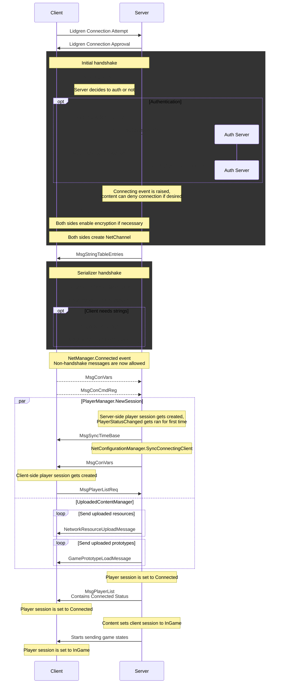

# RobustToolbox Connection Sequence

This is a complete sequence of what steps get taken when a client connects in RobustToolbox (and to some extent, Space Station 14). This is an incredibly involved and messy system that evolved over multiple years, and has many moving parts and sets of state. Oof.

## Basic overview

