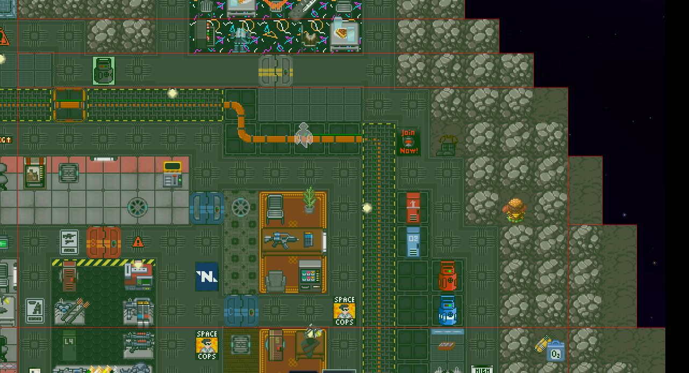

# Grids

RobustToolbox has support for tilemaps in engine, called grids (ss14 players may also call them shuttles or stations). 

Internally these are stored via chunks so that whenever a tile updates it only updates that specific chunk rather than the entire grid. These are stored by the chunk's origin, the bottom-left corner, in a hashmap. This means that whenever the grid expands we don't need to copy a giant array over and only need to worry about creating or deleting a new chunk as necessary.

## Grid Collision
Grids use the same physics code (box2d) as everything else. You should [read up on how box2d works](https://box2d.org/documentation/) first.

We generate fixtures for each chunk and attach them to the grid's body. Whenever a tile updates we regenerate all of the fixtures for that chunk; we also prefer to generate fixtures as large as possible to reduce their overall count. For instance, if a 16x16 chunk had all of its tiles filled then it would have 1 fixture that's 16x16. In SS14 this looks as follows:

<!--Lol image nerd-->
*Red lines represent the bounds of the fixtures. An SS14 map may be comprised of hundreds of fixtures.
*In the bottom-left you can see the seam between the neighbouring chunks. Fixtures are only generated on a per-chunk basis so won't be any larger.

## Grid Splitting
Whenever tiles are detached from the rest of a grid we detect if we should split this off into a new grid.

To do this, we are required to pathfind whenever the grid's fixtures update and determine whether any pieces are now detached. Instead of doing this per tile which would be prohibitively expensive we instead turn groups of tiles on the same chunk into "nodes" and pathfind over that instead. The entire process is as follows:
1. Whenever the chunk needs to regenerate fixtures we also regenerate its nodes. We do this by floodfilling every tile into the chunk and returning each individual node.
2. For each node we determine its neighbours. These can't be on the same chunk because if they were then they would've been part of the original floodfill so we only check tiles on the neighboring chunks for their nodes.
3. At this point we have constructed the graph of the grid. In the above steps we marked which nodes were dirty i.e. the new ones created and all of the neighbours. From here we start floodfilling the dirty nodes to determine if they all have connections to each other. If all of the dirty nodes still connect then there is no split possible, but if there are still nodes left over after floodfilling then we will continuously iterate until we have all individual groups of nodes.
4. From the above we take each group of nodes and turn these into new grids. To do this we:
- Create the new grid and apply the position + physics data of the old grid (e.g. its velocity)
- Set all of the tiles on the new grid
- For each tile, check for any anchored entities and re-anchor them on the new grid. Because the new grid has the same position and rotation as the old parent we only need to worry about updating the parent.
- For each tile, check for any non-anchored entities and re-parent them to the new grid.
- Set all of the files on the old grid to empty.

## Debugging

### Commands

`showchunkbb`
Toggles showing all of the grid fixtures in the viewport.

`showgridnodes`
Toggles visibility of the grid nodes used to check splitting. Also includes connections between the nodes.