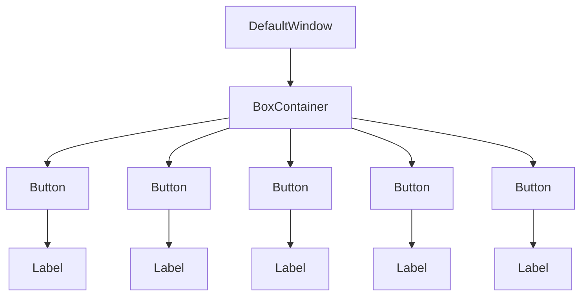
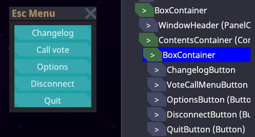
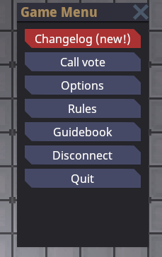
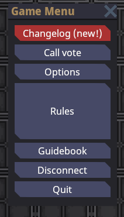
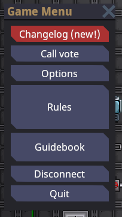

# User Interface

I can't be bothered to think of an elegant opening paragraph for this page. This is the UI tutorial.

```admonish info
Code completion can help a lot with finding what controls and attributes you can use
```

## The `Control`

The game's UI is made up of a ton of `Control`s. Each `Control` is one element of the UI system. Controls have various functions, some being obvious things like text labels and buttons, while others serve to lay stuff out automatically.


Here we have a basic UI in the game. As you can see, it is a window made up of multiple buttons. There is one more control at play here, however, and that is `BoxContainer` to automatically lay the buttons out on top of eachother.

The actual layout XAML code for this UI looks like this (at the time of writing). You don't have to understand exactly what's going on here yet, of course:

```xml
<DefaultWindow xmlns="https://spacestation14.io"
            xmlns:changelog="clr-namespace:Content.Client.Changelog"
            xmlns:ui="clr-namespace:Content.Client.Voting.UI"
            Title="{Loc 'ui-escape-title'}"
            Resizable="False">

    <BoxContainer Orientation="Vertical" SeparationOverride="4" MinWidth="150">
        <changelog:ChangelogButton />
        <ui:VoteCallMenuButton />
        <Button Name="OptionsButton" Text="{Loc 'ui-escape-options'}" />
        <Button Name="DisconnectButton" Text="{Loc 'ui-escape-disconnect'}" />
        <Button Name="QuitButton" Text="{Loc 'ui-escape-quit'}" />
    </BoxContainer>
</DefaultWindow>
```

The `DefaultWindow` contains a `BoxContainer` to automatically lay the `Button`s out vertically, and the `Button`s contain a `Label` to show the text (the `Label` is automatically created to make the code shorter). In this way, the UI controls effectively form a tree:



### Core Layout

Laying your controls out properly is perhaps one of the most important parts of UI. Laying out controls manually (as in, specifying positions and sizes manually) is annoying, problematic for resizing, etc... As such, the UI system is designed so that you can easily compose layout based on helper controls, such as the aforementioned `BoxContainer`.

This section describes how layout works for a *single* control. Below sections will go into details for layout controls such as `BoxContainer`.

All controls are effectively laid out as a bunch of rectangles. They have a size and a position relative to their parent. In the next screenshot you can see the effective rectangle of one of these buttons:  


(if you're wondering, this is with the `devwindow` UI viewer, type `devwindow` in the game console and go to the UI tab.)

And the parent `BoxContainer` which contains all the buttons:



To properly understand the layout system, there are a few concepts that need to be explained:

Every control has a `DesiredSize`. This is effectively the "minimum" space that a control wants to be able to lay itself out correctly without being cut off or such. Controls calculate this based on their contents, and these contents can of course include *other* controls, depending on which control we're talking about. Some examples:

* `Label` (a text label): the actual text size laid out.
* `TextureRect` (an image): assuming it can't shrink, the size of the image. 
* `BoxContainer`: the combined size of its contents, laid out sequentially.
* `Button`: the size of its contents + some padding for the button's border.
* base `Control` itself: the maximum of the sizes of its children

As stated however, the `DesiredSize` is only the *minimum*. In practice controls often get much more space than they "need". Even in the escape menu there is tons of spare horizontal space inside the buttons, but the text itself doesn't take the full width. Conceptually, while the UI system is laying out controls, the parent control (such as `BoxContainer`) *arranges* or *gives* space to its child controls. The controls then choose how they should occupy this space themselves. In the case of the escape menu, `BoxContainer` gives the full width to the control. The default behavior of most controls is to *stretch* to fill that space. The result is that the button "stretches" to fit the full width of the menu.

This behavior is governed by `HorizontalAlignment` and `VerticalAlignment` on the control, which effectively says "what do we do if we have more space than we need". The default for both is `Stretch`, which is "take as much space as we can". You can also `Center` which centers the control while keeping it as small as possible. And there's also `Left`/`Top` and `Right`/`Bottom` to align the control to one side. Let's try messing around with the `HorizontalAlignment` on various things in the escape menu:

`HorizontalAlignment="Center"` on each of the buttons individually:


<details>
  <summary>XAML Code (click to expand)</summary>
  
  ```xml
    <BoxContainer Orientation="Vertical" SeparationOverride="4" MinWidth="150">
        <changelog:ChangelogButton  HorizontalAlignment="Center" />
        <ui:VoteCallMenuButton HorizontalAlignment="Center" />
        <Button HorizontalAlignment="Center" Name="OptionsButton" Text="{Loc 'ui-escape-options'}" />
        <Button HorizontalAlignment="Center" Name="DisconnectButton" Text="{Loc 'ui-escape-disconnect'}" />
        <Button HorizontalAlignment="Center" Name="QuitButton" Text="{Loc 'ui-escape-quit'}" />
    </BoxContainer>
  ```
</details>

`HorizontalAlignment="Left"` on each of the buttons individually:


<details>
  <summary>XAML Code (click to expand)</summary>
  
  ```xml
    <BoxContainer Orientation="Vertical" SeparationOverride="4" MinWidth="150">
        <changelog:ChangelogButton  HorizontalAlignment="Left" />
        <ui:VoteCallMenuButton HorizontalAlignment="Left" />
        <Button HorizontalAlignment="Left" Name="OptionsButton" Text="{Loc 'ui-escape-options'}" />
        <Button HorizontalAlignment="Left" Name="DisconnectButton" Text="{Loc 'ui-escape-disconnect'}" />
        <Button HorizontalAlignment="Left" Name="QuitButton" Text="{Loc 'ui-escape-quit'}" />
    </BoxContainer>
  ```
</details>

`HorizontalAlignment="Left"` only on the `BoxContainer` itself. This means we are changing the `BoxContainer` itself to shrink, so it takes the width of the largest button. All the other buttons still expand to fill the space of the `BoxContainer`, so they all have the same size, that of the largest button:


<details>
  <summary>XAML Code (click to expand)</summary>

```admonish info
Note: to actually make this example work, we need to move the `MinSize` declaration onto a containing control. In the normal menu, the `BoxContainer`'s `MinWidth` is solely responsible for the width of the menu, so it itself has no extra space. Wrapping it in a parent control which has the `MinSize` fixes that.
```

  ```xml
    <Control MinWidth="150">
        <BoxContainer Orientation="Vertical" HorizontalAlignment="Left" SeparationOverride="4">
            <changelog:ChangelogButton  />
            <ui:VoteCallMenuButton />
            <Button Name="OptionsButton" Text="{Loc 'ui-escape-options'}" />
            <Button Name="DisconnectButton" Text="{Loc 'ui-escape-disconnect'}" />
            <Button Name="QuitButton" Text="{Loc 'ui-escape-quit'}" />
        </BoxContainer>
    </Control>
  ```
</details>

There are other useful layout properties you can use to influence layout of an individual control:

* `MinSize`/`MinWidth`/`MinHeight`: Allows you to set a custom minimum size for the control, which is used on top of the existing size calculated based on children.
* `MaxSize`/`MaxWidth`/`MaxHeight`: Allows you to limit the size of a control.
* `SetSize`/`SetWidth`/`SetHeight`: Allows you to set a specific size for a control.
* `Margin`: Allows you to set a margin of blank space around a control.

## Layout Controls

There are many controls whose sole purpose is to lay their children out in a certain way, and otherwise be invisible. This section will go over some of them.

### `BoxContainer`

`BoxContainer` is perhaps one of the simplest layout controls there is. It lays out its children sequentially in a certain `Orientation`, either vertically or horizontally. Controls do not overlap.

### `GridContainer`

`GridContainer` lays out its children in a configurable grid.

### `ScrollContainer`

TODO

### `LayoutContainer`

TODO

## Common Attributes
These attributes are present on most layout controls.
### Margin
Sets the margin of the control this attribute is put on.
Example:
```xml
<BoxContainer Orientation="Vertical" Maring="4">
        <Label Text="Fancy label 1" />
        <Label Text="Fancy label 2" />
    </BoxContainer>
```
This example sets an even margin of 4. You also can define the sides separately:
- `Margin="<uniform>"`
- `Margin="<horizontal> <vertical>"`
- `Margin="<left> <top> <right> <bottom>"`

### Horizontal/VerticalExpand

Controls have two rather confusing properties. We already went over the `HorizontalAlignment` and `VerticalAlignment` above, but there's another similar-sounding property: `HorizontalExpand` and `VerticalExpand`. These properties are very weird. Truth be told, if the UI system was more well-developed, these wouldn't be here in the first place. **People often use them without understanding what they actually do, so read up, nerd.**

These two properties influence the layout of your control **only in a few specific containers**: `BoxContainer`, `SplitContainer`, and `GridContainer`. If your controls is not in one of these and you set `*Expand`, your code is automatically wrong.

So what does it do exactly? I'll use `BoxContainer` as an example. Suppose I edit the escape menu so that there's more space than the buttons need:



<details>
  <summary>XAML Code (click to expand)</summary>
  
  ```admonish info
  Oh look, the escape menu has grown since the last time I edited this guide!
  ```
  
  ```xml
    <BoxContainer Orientation="Vertical" SeparationOverride="4" MinWidth="150">
        <changelog:ChangelogButton Access="Public" Name="ChangelogButton"/>
        <ui:VoteCallMenuButton />
        <Button Access="Public" Name="OptionsButton" Text="{Loc 'ui-escape-options'}" />
        <Button Access="Public" Name="RulesButton" Text="{Loc 'ui-escape-rules'}" />
        <Button Access="Public" Name="GuidebookButton" Text="{Loc 'ui-escape-guidebook'}" />
        <Button Access="Public" Name="WikiButton" Text="{Loc 'ui-escape-wiki'}" />
        <Button Access="Public" Name="DisconnectButton" Text="{Loc 'ui-escape-disconnect'}" />
        <Button Access="Public" Name="QuitButton" Text="{Loc 'ui-escape-quit'}" />
    </BoxContainer>
  ```
</details>

`BoxContainer` always gives its children as little space as necessary along its primary axis. This means that unused space is not filled! In the example above, we could make the window horizontally bigger, and the buttons would get wider. But giving the window vertically bigger just adds empty space.

This is where `VerticalExpand` comes in. If we give a control `VerticalExpand="True"`, watch what happens:



<details>
  <summary>XAML Code (click to expand)</summary>
  
  ```xml
    <BoxContainer Orientation="Vertical" SeparationOverride="4" MinWidth="150" MinHeight="300">
        <changelog:ChangelogButton Access="Public" Name="ChangelogButton"/>
        <ui:VoteCallMenuButton />
        <Button Access="Public" Name="OptionsButton" Text="{Loc 'ui-escape-options'}" />
        <!-- Hey, maybe that's what it'll take to make people actually read the server rules! -->
        <Button Access="Public" Name="RulesButton" VerticalExpand="True" Text="{Loc 'ui-escape-rules'}" />
        <Button Access="Public" Name="GuidebookButton" Text="{Loc 'ui-escape-guidebook'}" />
        <Button Access="Public" Name="WikiButton" Text="{Loc 'ui-escape-wiki'}" />
        <Button Access="Public" Name="DisconnectButton" Text="{Loc 'ui-escape-disconnect'}" />
        <Button Access="Public" Name="QuitButton" Text="{Loc 'ui-escape-quit'}" />
    </BoxContainer>
  ```
</details>

Aha. Now we're making use of that space! The `BoxContainer` is actually giving the rest of the space to the rules button. This is what `Expand` does.

You can give multiple controls `Expand`, and then the expansion will be proportionate to their `SizeFlagsStretchRatio` property:



<details>
  <summary>XAML Code (click to expand)</summary>
  
  ```xml
    <BoxContainer Orientation="Vertical" SeparationOverride="4" MinWidth="150" MinHeight="300">
        <changelog:ChangelogButton Access="Public" Name="ChangelogButton"/>
        <ui:VoteCallMenuButton />
        <Button Access="Public" Name="OptionsButton" Text="{Loc 'ui-escape-options'}" />
        <!-- Hey, maybe that's what it'll take to make people actually read the server rules! -->
        <Button Access="Public" Name="RulesButton" VerticalExpand="True" SizeFlagsStretchRatio="1.5" Text="{Loc 'ui-escape-rules'}" />
        <Button Access="Public" Name="GuidebookButton" VerticalExpand="True" Text="{Loc 'ui-escape-guidebook'}" />
        <Button Access="Public" Name="WikiButton" Text="{Loc 'ui-escape-wiki'}" />
        <Button Access="Public" Name="DisconnectButton" Text="{Loc 'ui-escape-disconnect'}" />
        <Button Access="Public" Name="QuitButton" Text="{Loc 'ui-escape-quit'}" />
    </BoxContainer>
  ```
</details>


To reiterate: `Horizontal/VerticalAlignment` and such changes the behavior of the control within its alloted space. `Horizontal/VerticalExpand` changes how the parent container decides how much space to give in the first place. Only select parent containers respect `Horizontal/VerticalExpand`.

## XAML UI

Complex UIs can involve quite a lot of controls. Previously, most UIs were made by manually constructing these deep control trees in C#. This sucked. Nowadays we have The Technology(tm) and thanks to XamlUI, things don't suck as much. Yay!

XAML allows you to specify control trees in, well, XML. To recap, if you somehow skipped the top half of this page, it looks something like this:

```xml
<DefaultWindow xmlns="https://spacestation14.io"
            xmlns:changelog="clr-namespace:Content.Client.Changelog"
            xmlns:ui="clr-namespace:Content.Client.Voting.UI"
            Title="{Loc 'ui-escape-title'}"
            Resizable="False">

    <BoxContainer Orientation="Vertical" SeparationOverride="4" MinWidth="150">
        <changelog:ChangelogButton />
        <ui:VoteCallMenuButton />
        <Button Name="OptionsButton" Text="{Loc 'ui-escape-options'}" />
        <Button Name="DisconnectButton" Text="{Loc 'ui-escape-disconnect'}" />
        <Button Name="QuitButton" Text="{Loc 'ui-escape-quit'}" />
    </BoxContainer>
</DefaultWindow>
```

### Syntax

At its core, XAML is just a fancy way to specify .NET objects in XML. Just most XAML frameworks (like ours) wrap it in a bunch of stuff to make it particularly suited for UI stuff. This makes it both relatively straightforward to map to anything, but also not exactly the concise or pleasing way to write UI code in more complex scenarios. Oh well.

#### XML Basics

You can skip this bit if you have the most basic understanding of what XML is. Since basically every programmer knows HTML nowadays and that's almost the same thing you probably already do. But anyways here goes:

Your XML document is made up of a bunch of **tags**. This is an example of a tag:

```xml
<Foo />
```

Comments look like this:
```xml
<!-- This is a comment! -->
```

Note the funny angle brackets denotating the parts of the tag, and the funny slash at the end (we'll come back to this later).

XML tags can have **attributes**. These are additional properties that go onto the tags. Here's an example:

```xml
<Foo Bar="Baz" A="B" />
```

XML tags can contain things (in our case: other tags). This brings us to the distinction between "open" and "closed" tags. Up until now I only showed closed tags (ending with a `/>`) which can contain no content. You can also make an open tag like so:
```xml
<Foo> </Foo>
```

If you are experienced with HTML, in XML any tag can be either open or closed. Also XML does not allow the various parser edge cases based on tag name (`<br>`, `<p>`, ...), it's much more consistent.

The contents of the tag go between the two bits there. Contents can be other tags or simply plain text (but plain text currently is not used in our engine):

```xml
<Foo>
  <Bar />
  <Baz><Foo A="B" /></Baz>
</Foo>
<!-- You get the idea -->
```

#### Namespaces

Because XAML maps to actual .NET types (mostly), you need to actually import namespaces for it to resolve types. This is done by putting an `xmlns` attribute on the top tag in the document. `xmlns="..."` is the namespace used by default (e.g. `<Button>`) whereas `xmlns:foo="..."` allows importing additional namespaces that can be imported by prefixing a tag name with `foo:`, like so: `<foo:Button>`. These namespaces are not specified by plain C# namespace-names, it's kinda complicated and involves URIs and stuff. Just leave `xmlns="https://spacestation14.io"` for the engine namespace and import the rest by copy pasting and basic pattern recognition I guess. You can see some examples I pulled out of a random XAML file:

```xml
<Control xmlns="https://spacestation14.io"
         xmlns:x="http://schemas.microsoft.com/winfx/2006/xaml"
         xmlns:gfx="clr-namespace:Robust.Client.Graphics;assembly=Robust.Client"
         xmlns:parallax="clr-namespace:Content.Client.Parallax"
         xmlns:style="clr-namespace:Content.Client.Stylesheets">
```

#### Core Syntax

Every XML tag represents one object. So `<Button />` just makes an empty, simple `Robust.Client.UserInterface.Controls.Button` the same way you would do `new Button()`. You can specify properties on the made objects with attributes on the tag, like so:

```xml
<Button Text="Click me!" Margin="4" />
```

You can make controls contain other controls ([remember, it's a tree!](#the-control)) by putting them inside eachother, like so:

```xml
<BoxContainer Orientation="Vertical" SeparationOverride="4" MinWidth="150">
  <changelog:ChangelogButton />
  <ui:VoteCallMenuButton />
  <Button Name="OptionsButton" Text="{Loc 'ui-escape-options'}" />
  <Button Name="DisconnectButton" Text="{Loc 'ui-escape-disconnect'}" />
  <Button Name="QuitButton" Text="{Loc 'ui-escape-quit'}" />
</BoxContainer>
```

The contents of attributes are converted to the type of the property automatically. For simple stuff like numbers, strings, enums, etc... it's quite obvious. For types such as `Vector2` and `Thickness` (used by margins) it's space-separated numbers.

You may have also noticed the funny `{Loc 'ui-...'}` thing. This is called a **markup extension**. The short version is that they're magic you can put in properties to do special stuff. In this case, `{Loc 'key'}` looks up a [localized string](../ss14-by-example/fluent-and-localization.md).

### Usage

To *use* XAML for a new control, you need to make a file called `FooControl.xaml`, and then put the corresponding C# code in `FooControl.xaml.cs`. At a minimum, all you need to do is call `RobustXamlLoader.Load(this);` somewhere in the object's constructor. If you want support for code-behind (`Name` properties on declared controls) you will need to make the C# class `partial` and add the `[GenerateTypedNameReferences]` attribute to it. A complete example looks like so: 

```xml
<!-- FooControl.xaml -->
<Control xmlns="https://spacestation14.io">
  	<Button Name="PressButton" Text="Click me!" />
</Control>
```

```cs
// FooControl.xaml.cs
[GenerateTypedNameReferences]
public partial class FooControl : Control
{
    public FooControl()
    {
    		RobustXamlLoader.Load(this);
        PressButton.OnPressed += _ => Logger.Debug("Foo");
    }
}
```

```admonish info
Sometimes the code-behind properties (`PressButton` in the above example) can fail to be generated by your IDE. At the time of writing it's been a year and source generators are still very janky, hooray. Generally, reloading the project or building will probably fix it.

Rider 2022.1 EAP3 seems to have fixed many of these issues finally. Make sure to be up to date.
```

The XAML code is automatically compiled to IL so it can be efficiently constructed at runtime. The association between XAML file and C# class is made by location and name. If you need, you can specify the class to use directly in XAML with an `x:Class` declaration like so:

```xml
<Control xmlns="https://spacestation14.io"
         xmlns:x="http://schemas.microsoft.com/winfx/2006/xaml"
         x:Class="Content.Client.UserInterface.FooControl">
		<!-- UI code -->
</Control>
```

## UI Controllers
UI controllers are reponsible for creating, updating and removing controls. Entity systems must not do this themselves.
Any data that they use must be obtained by binding their methods to system events (see example below) or by calling methods on IoC services, such as IPlayerManager.
To create one, make a new class that inherits `UIController`. This type will then be instantiated automatically as a singleton by the `UserInterfaceManager`.
Widgets are retrieved within UI controllers by calling `UIManager.GetActiveUIWidgetOrNull<T>()`, where T is a widget such as `ActionsBar`.

### Dependencies
An UI controller may have dependencies to other IoC services and controllers using the \[Dependency\] syntax.
For systems, \[UISystemDependency\] must be used instead.
Once systems are loaded, UI controller methods may be bound to events declared on them.

```cs
public sealed class ActionUIController : UIController, IOnSystemChanged<ActionsSystem>, IOnStateEntered<GameplayState>
{
    // Dependency is used for IoC services and other controllers
    [Dependency] private readonly GameplayStateLoadController _gameplayStateLoad = default!;

    // For entity systems, UISystemDependency is used instead
    [UISystemDependency] private readonly ActionsSystem? _actions = default!;

    private ActionsWindow? _window;

    public override void Initialize()
    {
        base.Initialize();

        // We can bind methods to event fields on other UI controllers during initialize
        _gameplayStateLoad.OnScreenLoad += LoadGui;
        _gameplayStateLoad.OnScreenUnload += UnloadGui;

        // UI controllers can also subscribe to local and network entity events
        // Local events are events raised on the client using RaiseLocalEvent
        // SubscribeLocalEvent<PlayerAttachedEvent>(ev => {});

        // Network events are events raised by the server and sent to the client
        // SubscribeNetworkEvent<PlayerAttachedEvent>(ev => {});
    }

    private void LoadGui()
    {
        DebugTools.Assert(_window == null);
        _window = UIManager.CreateWindow<ActionsWindow>();
        LayoutContainer.SetAnchorPreset(_window, LayoutContainer.LayoutPreset.CenterTop);
    }

    private void UnloadGui()
    {
        if (_window != null)
        {
            _window.Dispose();
            _window = null;
        }
    }

    private void ToggleWindow()
    {
        if (_window == null)
            return;

        if (_window.IsOpen)
        {
            _window.Close();
            return;
        }

        _window.Open();
    }

    public void OnSystemLoaded(ActionsSystem system)
    {
        // We can bind to event fields on entity systems when that entity system is loaded
        system.LinkActions += OnComponentLinked;
    }

    public void OnSystemUnloaded(ActionsSystem system)
    {
        // And unbind when the system is unloaded 
        system.LinkActions -= OnComponentLinked;
    }

    // This will be called when ActionsSystem raises an event on its LinkActions event field
    private void OnComponentLinked(ActionsComponent component)
    {
    }

    public void OnStateEntered(GameplayState state)
    {
        if (_actions != null)
        {
            _actions.OnActionAdded += OnActionAdded;
            _actions.OnActionRemoved += OnActionRemoved;
            _actions.ActionReplaced += OnActionReplaced;
            _actions.ActionsUpdated += OnActionsUpdated;
        }

        // Bind hotkeys once we enter the gameplay state (start a round and join it as the client)
        CommandBinds.Builder
            .Bind(ContentKeyFunctions.OpenActionsMenu, InputCmdHandler.FromDelegate(_ => ToggleWindow()))
            .Register<ActionUIController>();
    }

    public void OnStateExited(GameplayState state)
    {
        // Unbind hotkeys after we exit the round (we enter the lobby or disconnect)
        CommandBinds.Unregister<ActionUIController>();
    }
}
```

UI controllers may also implement the following interfaces:
### IOnStateChanged<T>
Implements two methods: `OnStateEntered(T state)` and `OnStateExited(T state)`.
These methods are automatically called when the respective state is entered and exited, for example GameplayState.
If only the entering or exiting logic is needed, `IOnStateEntered<T>` and `IOnStateExited<T>` may be implemented instead.

### IOnSystemChanged<T>
Implements two methods: `OnSystemLoaded(T system)` and `OnSystemUnloaded(T system)`.
These methods are automatically called when the respective system is loaded and unloaded, for example ActionsSystem.
If only the loaded or unloaded logic is needed, `IOnSystemLoaded<T>` and `IOnStateUnloaded<T>` may be implemented instead.
