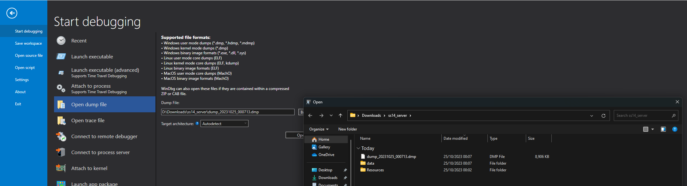

# Debugging server lockups

If `SS14.Watchdog` detects that your server has locked up, it will kill the server and restart it. If this happens for real on a live server, a chance of just looking at logs is out of the window. This guide will give a quick 101 for how to approach debugging this kind of issue.

```admonish info
Just to be clear: you may get a similar error if the game server can't reach the watchdog due to misconfiguration, in which case the game server will reliably get killed after startup, on loop. This article is not about that, this is about a genuine, real-nasty crash bug.
```

## Background: Watchdog Pings

The watchdog expects the game server to send it regular *ping* messages to indicate that the game server is still alive. The game server sends these pings at a regular interval of 15 seconds (currently unconfigurable, what was past me thinking), and the watchdog expects one at least every *`TimeoutSeconds`* in the instance configuration. If the game were to get stuck in an infinite loop of some kind, it would cease to send these pings and the watchdog would quickly kill it and restart it.

## Alright, so what have we got?

If you want to trigger this real easy, connect to your server and run something like this in `scsi`:


Expanding the log excerpt from above, we have something like this:

```
[WARN] net.ent: Got late MsgEntity! Diff: -12, msgT: 0, cT: 12, player: PJB
[WARN] eng: MainLoop: Cannot keep up!
[22:50:20 WRN SS14.Watchdog.Components.ServerManagement.ServerInstance] test: timed out, killing
[22:50:20 INF SS14.Watchdog.Components.ServerManagement.ServerInstance] test: making on-kill process dump of type Normal
[createdump] Gathering state for process 91738 Robust.Server
[createdump] Writing minidump to file /home/luna/ss14_watchdog_test/instances/test/dumps/dump_2023-10-24_22-50-20
[createdump] Written 120233984 bytes (29354 pages) to core file
[createdump] Target process is alive
[createdump] Dump successfully written in 306ms
[22:50:20 INF SS14.Watchdog.Components.ServerManagement.ServerInstance] test: Process dump written to /home/luna/ss14_watchdog_test/instances/test/dumps/dump_2023-10-24_22-50-20
[22:50:20 INF SS14.Watchdog.Components.ServerManagement.ServerInstance] test: killing process...
[22:50:21 INF SS14.Watchdog.Components.ServerManagement.ServerInstance] test shut down with status ProcessExitStatus { Reason = ExitCode, Status = 137, IsClean = False }
[22:50:21 WRN SS14.Watchdog.Components.ServerManagement.ServerInstance] test shut down before sending ping on attempt 1
[22:50:21 INF SS14.Watchdog.Components.ServerManagement.ServerInstance] test: Restarting server after exit...
```

```admonish info
If you're even reading this page I hope you have enough experience hosting a server to know this, but just to be clear: those two `[WARN]` messages are **not it**.
```

The game server itself produced no meaningful logs (as it rarely does in a case like this), all we got to go by is the watchdog killing us. Luckily, the watchdog is configured by default to make a **core dump** of the game server process if it has to kill it, and listed the path dumped to in the log output.

What is a core dump? It's a file that contains the memory of the process when it crashed. By default, this dump includes enough memory to get stack trace information using a debugger. If you want more, you can change the `TimeoutDumpType` property on the watchdog instance configuration to [one of these values](https://learn.microsoft.com/en-us/dotnet/core/diagnostics/microsoft-diagnostics-netcore-client#dumptype-enum). Be warned that core dumps are quite big, and reporting more info can make them *outright huge*.

```admonish danger
Core dumps can contain sensitive information from your server (such as database passwords) and should **not** be given to people you do not trust!
```

"Ok, so I have a file that weighs a couple hundred megabytes, what do I do with it? Do I drag it into Rider?" Oh you sweet summer child.

You have two options that I know of to debug this: lldb and WinDBG. One of those is a command-line debugger. The other is a command-line Windows debugger that at least has the courtesy of having a basic UI. Hey, at least you don't need to use gdb!

```admonish failure
Core dumps are fragile little beings, and by default do not include all the context needed to debug something on their own. In general, it is by far the easiest to debug them if you're debugging them on the system they happened on, and *none of the underlying files changed*, e.g. through game server update.

With the necessary experience and or/infrastructure (symbol servers my beloved) it is possible to handle them much later or on another system, but that's far outside of the scope of this tutorial and even I don't have experience with that.[^2]
```

### Using lldb

lldb is a decent[^1] debugger for Linux and macOS. Install it:

```sh
# Or whatever package manager you use 🤗
$ sudo apt install lldb
```

You will also need [SOS](https://learn.microsoft.com/en-us/dotnet/core/diagnostics/sos-debugging-extension). This will extend lldb to make debugging a .NET trace possible:

```sh
luna@Mimas:~/ss14_watchdog_test
$ dotnet tool install -g dotnet-sos
You can invoke the tool using the following command: dotnet-sos
Tool 'dotnet-sos' (version '7.0.447801') was successfully installed.
luna@Mimas:~/ss14_watchdog_test
$ dotnet sos install
Installing SOS to /home/luna/.dotnet/sos
Creating installation directory...
Copying files from /home/luna/.dotnet/tools/.store/dotnet-sos/7.0.447801/dotnet-sos/7.0.447801/tools/net6.0/any/linux-x64
Copying files from /home/luna/.dotnet/tools/.store/dotnet-sos/7.0.447801/dotnet-sos/7.0.447801/tools/net6.0/any/lib
Creating new /home/luna/.lldbinit file - LLDB will load SOS automatically at startup
SOS install succeeded
```

Now you are ready to load the core dump into lldb:
```
$ lldb -c instances/test/dumps/dump_2023-10-24_23-07-16
Current symbol store settings:
-> Cache: /home/luna/.dotnet/symbolcache
-> Server: https://msdl.microsoft.com/download/symbols/ Timeout: 4 RetryCount: 0
(lldb) target create --core "instances/test/dumps/dump_2023-10-24_23-07-16"
Core file '/home/luna/ss14_watchdog_test/instances/test/dumps/dump_2023-10-24_23-07-16' (x86_64) was loaded.
(lldb)
```

```admonish tip
You're going to want a [cheat sheet](https://github.com/carolanitz/DebuggingFun/blob/d0b21847d1ad1506bbaaded915c1625a21165b9c/lldb%20cheat%20sheet.pdf) for that `(lldb)` prompt.
```

At this point you have a native debugger open and you can well and truly debug everything. Hell, if the game server dies due to native crashes, this is also how you'd be debugging it. You can use regular `lldb` commands to do regular native debugging on native modules and whatever. Though it's still not for the heart and may require further setup, e.g. to get symbols for native libraries.

For some meaningful info out of the *managed* stack trace, we can run the `clrstack` command from SOS:

```
(lldb) clrstack
OS Thread Id: 0x172fa (1)
        Child SP               IP Call Site
00007FFFD245BFB0 00007F15096C2F7B Submission#0+<<Initialize>>d__0.MoveNext()
00007FFFD245C000 00007F150962B9FE System.Runtime.CompilerServices.AsyncMethodBuilderCore.Start[[System.__Canon, System.Private.CoreLib]](System.__Canon ByRef)
00007FFFD245C060 00007F150962B940 System.Runtime.CompilerServices.AsyncTaskMethodBuilder`1[[System.__Canon, System.Private.CoreLib]].Start[[System.__Canon, System.Private.CoreLib]](System.__Canon ByRef)
00007FFFD245C0A0 00007F15096C2E92 Submission#0.<Initialize>()
00007FFFD245C0E0 00007F15096C2CD3 Submission#0.<Factory>(System.Object[])
00007FFFD245C110 00007F150962B06C Microsoft.CodeAnalysis.Scripting.ScriptExecutionState+<RunSubmissionsAsync>d__9`1[[System.__Canon, System.Private.CoreLib]].MoveNext()
00007FFFD245C1C0 00007F150962AD2B System.Runtime.CompilerServices.AsyncMethodBuilderCore.Start[[Microsoft.CodeAnalysis.Scripting.ScriptExecutionState+<RunSubmissionsAsync>d__9`1[[System.__Canon, System.Private.CoreLib]], Microsoft.CodeAnalysis.Scripting]](<RunSubmissionsAsync>d__9`1<System.__Canon> ByRef)
00007FFFD245C220 00007F150962AC50 System.Runtime.CompilerServices.AsyncTaskMethodBuilder`1[[System.__Canon, System.Private.CoreLib]].Start[[Microsoft.CodeAnalysis.Scripting.ScriptExecutionState+<RunSubmissionsAsync>d__9`1[[System.__Canon, System.Private.CoreLib]], Microsoft.CodeAnalysis.Scripting]](<RunSubmissionsAsync>d__9`1<System.__Canon> ByRef)
00007FFFD245C260 00007F150962AB6F Microsoft.CodeAnalysis.Scripting.ScriptExecutionState.RunSubmissionsAsync[[System.__Canon, System.Private.CoreLib]](System.Collections.Immutable.ImmutableArray`1<System.Func`2<System.Object[],System.Threading.Tasks.Task>>, System.Func`2<System.Object[],System.Threading.Tasks.Task>, System.Runtime.CompilerServices.StrongBox`1<System.Exception>, System.Func`2<System.Exception,Boolean>, System.Threading.CancellationToken)
00007FFFD245C320 00007F150962A4CC Microsoft.CodeAnalysis.Scripting.Script`1+<RunSubmissionsAsync>d__21[[System.__Canon, System.Private.CoreLib]].MoveNext()
00007FFFD245C500 00007F150962A21B System.Runtime.CompilerServices.AsyncMethodBuilderCore.Start[[Microsoft.CodeAnalysis.Scripting.Script`1+<RunSubmissionsAsync>d__21[[System.__Canon, System.Private.CoreLib]], Microsoft.CodeAnalysis.Scripting]](<RunSubmissionsAsync>d__21<System.__Canon> ByRef)
00007FFFD245C560 00007F150962A140 System.Runtime.CompilerServices.AsyncTaskMethodBuilder`1[[System.__Canon, System.Private.CoreLib]].Start[[Microsoft.CodeAnalysis.Scripting.Script`1+<RunSubmissionsAsync>d__21[[System.__Canon, System.Private.CoreLib]], Microsoft.CodeAnalysis.Scripting]](<RunSubmissionsAsync>d__21<System.__Canon> ByRef)
00007FFFD245C5A0 00007F150962A03F Microsoft.CodeAnalysis.Scripting.Script`1[[System.__Canon, System.Private.CoreLib]].RunSubmissionsAsync(Microsoft.CodeAnalysis.Scripting.ScriptExecutionState, System.Collections.Immutable.ImmutableArray`1<System.Func`2<System.Object[],System.Threading.Tasks.Task>>, System.Func`2<System.Object[],System.Threading.Tasks.Task>, System.Func`2<System.Exception,Boolean>, System.Threading.CancellationToken)
00007FFFD245C670 00007F15065AF51D Microsoft.CodeAnalysis.Scripting.Script`1[[System.__Canon, System.Private.CoreLib]].RunAsync(System.Object, System.Func`2<System.Exception,Boolean>, System.Threading.CancellationToken)
00007FFFD245C6D0 00007F15096C2BCA Microsoft.CodeAnalysis.Scripting.Script`1[[System.__Canon, System.Private.CoreLib]].CommonRunAsync(System.Object, System.Func`2<System.Exception,Boolean>, System.Threading.CancellationToken)
00007FFFD245C720 00007F15096A8336 Robust.Server.Scripting.ScriptHost+<ReceiveScriptEval>d__12.MoveNext() [/home/runner/work/space-station-14/space-station-14/RobustToolbox/Robust.Server/Scripting/ScriptHost.cs @ 209]
00007FFFD245C800 00007F15096A79F3 System.Runtime.CompilerServices.AsyncMethodBuilderCore.Start[[Robust.Server.Scripting.ScriptHost+<ReceiveScriptEval>d__12, Robust.Server]](<ReceiveScriptEval>d__12 ByRef)
00007FFFD245C840 00007F15096A795C System.Runtime.CompilerServices.AsyncVoidMethodBuilder.Start[[Robust.Server.Scripting.ScriptHost+<ReceiveScriptEval>d__12, Robust.Server]](<ReceiveScriptEval>d__12 ByRef)
00007FFFD245C860 00007F15096A7913 Robust.Server.Scripting.ScriptHost.ReceiveScriptEval(Robust.Shared.Network.Messages.MsgScriptEval)
00007FFFD245C8F0 00007F150658947F Robust.Shared.Network.NetManager+<>c__DisplayClass106_0`1[[System.__Canon, System.Private.CoreLib]].<RegisterNetMessage>b__0(Robust.Shared.Network.NetMessage)
00007FFFD245C960 00007F1506587964 Robust.Shared.Network.NetManager.DispatchNetMessage(Lidgren.Network.NetIncomingMessage) [/home/runner/work/space-station-14/space-station-14/RobustToolbox/Robust.Shared/Network/NetManager.cs @ 912]
00007FFFD245CA30 00007F15059608DF Robust.Shared.Network.NetManager.ProcessPackets() [/home/runner/work/space-station-14/space-station-14/RobustToolbox/Robust.Shared/Network/NetManager.cs @ 492]
00007FFFD245CBE0 00007F15053F906A Robust.Server.BaseServer.Input(Robust.Shared.Timing.FrameEventArgs) [/home/runner/work/space-station-14/space-station-14/RobustToolbox/Robust.Server/BaseServer.cs @ 686]
00007FFFD245CD80 00007F1505963FA4 Robust.Shared.Timing.GameLoop.Run() [/home/runner/work/space-station-14/space-station-14/RobustToolbox/Robust.Shared/Timing/GameLoop.cs @ 135]
00007FFFD245D760 00007F150525A0F5 Robust.Server.BaseServer.MainLoop() [/home/runner/work/space-station-14/space-station-14/RobustToolbox/Robust.Server/BaseServer.cs @ 565]
00007FFFD245D7A0 00007F14F9729475 Robust.Server.Program.ParsedMain(Robust.Server.CommandLineArgs, Boolean, Robust.Server.ServerOptions) [/home/runner/work/space-station-14/space-station-14/RobustToolbox/Robust.Server/Program.cs @ 78]
00007FFFD245D8E0 00007F14F971B8D2 Robust.Server.Program.Start(System.String[], Robust.Server.ServerOptions, Boolean) [/home/runner/work/space-station-14/space-station-14/RobustToolbox/Robust.Server/Program.cs @ 46]
00007FFFD245D930 00007F14F9718901 Robust.Server.Program.Main(System.String[]) [/home/runner/work/space-station-14/space-station-14/RobustToolbox/Robust.Server/Program.cs @ 25]
```

Now this we can work with! At the bottom is the program main, at the top is *`Submission#0`* which is an internal detail of the C# Interactive that we ran `while (true) { }` in. While I can't show you the IL bytes or C# code in lldb (well I'm sure the former is possible with SOS), I can show you the assembly code which looks like a pretty simple infinite loop:

```
(lldb) disassemble -s 0x7f15096c2f72 -F intel
    0x7f15096c2f72: nop
    0x7f15096c2f73: nop
    0x7f15096c2f74: mov    dword ptr [rbp - 0x1c], 0x1
->  0x7f15096c2f7b: nop
    0x7f15096c2f7c: jmp    0x7f15096c2f72
```

I hope this helped getting started using a native debugger on stuff like this.

### Using WinDBG

WinDBG is the Windows debugger you pull out when all else has failed (which it has, here). [You can get WinDBG Preview from the Microsoft Store.](https://www.microsoft.com/store/productid/9PGJGD53TN86)

You will also need [SOS](https://learn.microsoft.com/en-us/dotnet/core/diagnostics/sos-debugging-extension). This will extend WinDBG to make debugging a .NET trace possible:

```
C:\Users\Luna
> dotnet tool install -g dotnet-sos
Skipping NuGet package signature verification.
You can invoke the tool using the following command: dotnet-sos
Tool 'dotnet-sos' (version '7.0.447801') was successfully installed.
C:\Users\Luna
> dotnet sos install
Installing SOS to C:\Users\Luna\.dotnet\sos
Creating installation directory...
Copying files from C:\Users\Luna\.dotnet\tools\.store\dotnet-sos\7.0.447801\dotnet-sos\7.0.447801\tools\net6.0\any\win-x64
Copying files from C:\Users\Luna\.dotnet\tools\.store\dotnet-sos\7.0.447801\dotnet-sos\7.0.447801\tools\net6.0\any\lib
Execute '.load C:\Users\Luna\.dotnet\sos\sos.dll' to load SOS in your Windows debugger.
SOS install succeeded
```

You can load the created dump file into WinDBG by going File -> Start debugging -> Open dump file, then selecting the file. If the file doesn't have an extension, you need to change the filter on the open dialog to select it.



You will need to run the `.load` command mentioned in the above output to load SOS:

```
0:000> .load C:\Users\Luna\.dotnet\sos\sos.dll
```

```admonish tip
You probably still want a proper cheat sheet for WinDBG Preview. It has a bit of UI, but usage of the internal command line is still very necessary. Anyways I couldn't find anything like the well-formatted lldb one in 5 seconds of searching online, so find one yourself I guess.
```

I won't repeat myself from the lldb side: you have a full native debugger. This can do everything, if you know how to use it.

You can use `!clrstack` to show the managed stack trace:

```
0:000> !clrstack
OS Thread Id: 0x9034 (0)
        Child SP               IP Call Site
000000F7BF57D0F0 00007ffab591c72a Submission#0+<>d__0.MoveNext()
000000F7BF57D150 00007ffaf84334b8 System.Runtime.CompilerServices.AsyncMethodBuilderCore.Start[[System.__Canon, System.Private.CoreLib]](System.__Canon ByRef)
000000F7BF57D1B0 00007ffab591c642 Submission#0.()
000000F7BF57D220 00007ffab591c484 Submission#0.()
000000F7BF57D270 00007ffab4bb043c Microsoft.CodeAnalysis.Scripting.ScriptExecutionState+d__9`1[[System.__Canon, System.Private.CoreLib]].MoveNext()
000000F7BF57D330 00007ffab4bb0113 System.Runtime.CompilerServices.AsyncMethodBuilderCore.Start[[Microsoft.CodeAnalysis.Scripting.ScriptExecutionState+d__9`1[[System.__Canon, System.Private.CoreLib]], Microsoft.CodeAnalysis.Scripting]](d__9`1<System.__Canon> ByRef)
000000F7BF57D3A0 00007ffab4bb0040 System.Runtime.CompilerServices.AsyncTaskMethodBuilder`1[[System.__Canon, System.Private.CoreLib]].Start[[Microsoft.CodeAnalysis.Scripting.ScriptExecutionState+d__9`1[[System.__Canon, System.Private.CoreLib]], Microsoft.CodeAnalysis.Scripting]](d__9`1<System.__Canon> ByRef)
000000F7BF57D3E0 00007ffab4baff72 Microsoft.CodeAnalysis.Scripting.ScriptExecutionState.RunSubmissionsAsync[[System.__Canon, System.Private.CoreLib]](System.Collections.Immutable.ImmutableArray`1<System.Func`2<System.Object[],System.Threading.Tasks.Task>>, System.Func`2<System.Object[],System.Threading.Tasks.Task>, System.Runtime.CompilerServices.StrongBox`1<System.Exception>, System.Func`2<System.Exception,Boolean>, System.Threading.CancellationToken)
000000F7BF57D490 00007ffab4baf932 Microsoft.CodeAnalysis.Scripting.Script`1+d__21[[System.__Canon, System.Private.CoreLib]].MoveNext()
000000F7BF57D680 00007ffab4baf6a3 System.Runtime.CompilerServices.AsyncMethodBuilderCore.Start[[Microsoft.CodeAnalysis.Scripting.Script`1+d__21[[System.__Canon, System.Private.CoreLib]], Microsoft.CodeAnalysis.Scripting]](d__21<System.__Canon> ByRef)
000000F7BF57D6F0 00007ffab4baf5d0 System.Runtime.CompilerServices.AsyncTaskMethodBuilder`1[[System.__Canon, System.Private.CoreLib]].Start[[Microsoft.CodeAnalysis.Scripting.Script`1+d__21[[System.__Canon, System.Private.CoreLib]], Microsoft.CodeAnalysis.Scripting]](d__21<System.__Canon> ByRef)
000000F7BF57D730 00007ffab4baf4d0 Microsoft.CodeAnalysis.Scripting.Script`1[[System.__Canon, System.Private.CoreLib]].RunSubmissionsAsync(Microsoft.CodeAnalysis.Scripting.ScriptExecutionState, System.Collections.Immutable.ImmutableArray`1<System.Func`2<System.Object[],System.Threading.Tasks.Task>>, System.Func`2<System.Object[],System.Threading.Tasks.Task>, System.Func`2<System.Exception,Boolean>, System.Threading.CancellationToken)
000000F7BF57D7F0 00007ffab30cd6b6 Microsoft.CodeAnalysis.Scripting.Script`1[[System.__Canon, System.Private.CoreLib]].RunAsync(System.Object, System.Func`2<System.Exception,Boolean>, System.Threading.CancellationToken)
000000F7BF57D860 00007ffab591c3ba Microsoft.CodeAnalysis.Scripting.Script`1[[System.__Canon, System.Private.CoreLib]].CommonRunAsync(System.Object, System.Func`2<System.Exception,Boolean>, System.Threading.CancellationToken)
000000F7BF57D8B0 00007ffab58f6f0d Robust.Server.Scripting.ScriptHost+d__12.MoveNext() [/home/runner/work/space-station-14/space-station-14/RobustToolbox/Robust.Server/Scripting/ScriptHost.cs @ 209]
000000F7BF57D9C0 00007ffab58f6606 System.Runtime.CompilerServices.AsyncMethodBuilderCore.Start[[Robust.Server.Scripting.ScriptHost+d__12, Robust.Server]](d__12 ByRef)
000000F7BF57DA20 00007ffab58f657c System.Runtime.CompilerServices.AsyncVoidMethodBuilder.Start[[Robust.Server.Scripting.ScriptHost+d__12, Robust.Server]](d__12 ByRef)
000000F7BF57DA50 00007ffab58f653c Robust.Server.Scripting.ScriptHost.ReceiveScriptEval(Robust.Shared.Network.Messages.MsgScriptEval)
000000F7BF57DAE0 00007ffab30c3755 Robust.Shared.Network.NetManager.DispatchNetMessage(Lidgren.Network.NetIncomingMessage) [/home/runner/work/space-station-14/space-station-14/RobustToolbox/Robust.Shared/Network/NetManager.cs @ 810]
000000F7BF57DBA0 00007ffab265bfb7 Robust.Shared.Network.NetManager.ProcessPackets() [/home/runner/work/space-station-14/space-station-14/RobustToolbox/Robust.Shared/Network/NetManager.cs @ 439]
000000F7BF57DD70 00007ffab265acea Robust.Server.BaseServer.Input(Robust.Shared.Timing.FrameEventArgs) [/home/runner/work/space-station-14/space-station-14/RobustToolbox/Robust.Server/BaseServer.cs @ 683]
000000F7BF57DE20 00007ffab2670b47 Robust.Shared.Timing.GameLoop.Run() [/home/runner/work/space-station-14/space-station-14/RobustToolbox/Robust.Shared/Timing/GameLoop.cs @ 135]
000000F7BF57E5E0 00007ffab25d6685 Robust.Server.BaseServer.MainLoop() [/home/runner/work/space-station-14/space-station-14/RobustToolbox/Robust.Server/BaseServer.cs @ 565]
000000F7BF57E610 00007ffaa93f24f0 Robust.Server.Program.ParsedMain(Robust.Server.CommandLineArgs, Boolean, Robust.Server.ServerOptions) [/home/runner/work/space-station-14/space-station-14/RobustToolbox/Robust.Server/Program.cs @ 78]
000000F7BF57E6A0 00007ffaa93f12ca Robust.Server.Program.Start(System.String[], Robust.Server.ServerOptions, Boolean) [/home/runner/work/space-station-14/space-station-14/RobustToolbox/Robust.Server/Program.cs @ 46]
000000F7BF57E700 00007ffaa93f06f2 Robust.Server.Program.Main(System.String[]) [/home/runner/work/space-station-14/space-station-14/RobustToolbox/Robust.Server/Program.cs @ 25]
```

Same as above, again. Wow!

I hope this helped getting started using a native debugger on stuff like this.

```admonish note
🤫 I actually used `dotnet dump collect` to get the Windows dump because I was too lazy to set up the watchdog twice just for this article. Works the same, mostly. Hell I'm pretty sure it uses the same underlying library to create the dump as the watchdog!
```

[^2]: I tried to open a Linux core dump in WinDBG, which is supported to some degree... but it cried about enough missing files and other pains I gave up. Try moving your watchdog `bin/` folder out of the way and debugging a core dump with lldb... Yeah you get wildly different results huh?

[^1]: About as good as dev tooling on Linux gets, which is not very great.
