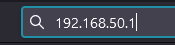
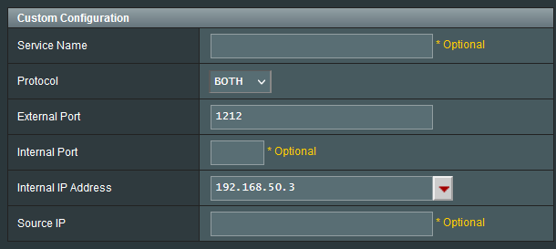

# Port Forwarding

```admonish warning
Obligatory warning: If you manage to mess up your router configuration, you may give attackers access to your network. We are not responsible if you press the wrong buttons on your router interface.
```

```admonish info
If you already know how to port forward: SS14 uses ports `1212/tcp` **and** `1212/udp` by default.
```

If you are hosting from a consumer/residential connection, you probably need to **port forward** to make your game server accessible from the outside world. If this is your first time doing something like this, this guide will try to help you.

Exactly how to do this depends on your network's router and internet service provider (ISP). We cannot hope to account for all possible details and problems you may run into. Depending on your ISP/router it may even be impossible to port forward directly from your home connection, and you may be forced to contact your ISP or use a VPN service instead.

Note that **none of this is unique to Space Station 14**. "Port Forward" is a standard term you can plop into Google. There's been decades of people doing this for other games, like Minecraft. If you do not manage to get it working with this guide alone, may want to put some combination of your ISP name + "Port forward" into Google.

```admonish info
> Yes, this guide may grossly oversimplify some networking concepts.
```

## VPN services

If you are using some form of VPN, probably all the info in this guide is irrelevant as the VPN necessarily changes the network of your computer.

You can try to see if port forwarding is supported by your VPN service, in which case it will probably be pretty reliable and easy to do.

Using a VPN service may also be the only option you have if your ISP otherwise makes port forwarding impossible. We have no recommendations or guides for specific services here.

## UPnP Port Forwarding

The first thing to try is to enable UPnP port forwarding in the server configuration. The game server will try to automatically port forward by contacting your router. This may not work on all routers, and on some other routers you may first need to enable UPnP in the settings. Though if it does work, this is by far the easiest method.

*See also: [Config File Reference](../general-development/tips/config-file-reference.md)*

Open `server_config.toml` in a text editor. You should be able to find a section that looks like this:

```toml
# Automatic port forwarding!
# Disabled by default because you may not want to do this.
# upnp = true
```

Remove the leading `#` in front of `upnp` like so:

```toml
# Automatic port forwarding!
# Disabled by default because you may not want to do this.
upnp = true
```

Save the file and try to restart your server. If all goes well, you should see a message like this in the server console:

```
[INFO] net.upnp: Peer 0.0.0.0: Successfully UPnP port forwarded 1312/udp and 1312/tcp
```

If it failed, you will instead see an warning like this:

```
[WARN] net.upnp: Peer 0.0.0.0: Failed UPnP port forwarding, your server may not be accessible. Check with your router's settings to enable UPnP or port forward manually
```

If it succeeds and your server is accessible from the outside world, great! If it doesn't work, read on.

## Manual Port Forwarding

```admonish info
Disable UPnP from your config if you are going to do manual port forwarding. It may cause issues.
```

```admonish info
It is extremely common for your ISP to install a router for you. Because of this, "check your router's manual" may instead involve "check your ISP's help site or ask their support".

If you do have your own router, there may be somebody in your house that knows how to do this, so ask them.
```

You will have to open your router's settings interface, and port forward from there. **Instructions may vary heavily based on router model.** We'll try to provide a general outline that might work for a lot of routers, but if it's not applicable you will need to check with your router's manual or check with your ISP.

I will be using screenshots from my own router (an Asus RT-AX86U) as a guide. Your router will most likely look far different.

### Step 1: Access your router settings

There are many different ways that your router allows you to access its settings. I will now list a couple possible ones:

* By accessing the router via your web browser
* Using a standalone program (e.g. Apple Airport hardware)
* Opening your account settings on your ISP's website

We will only be covering the first option here.

First you will need to figure out the IP address of your router. This is usually simple enough but depends on your computer operating system.

If you are on **Windows**, open **Command Prompt** and run `ipconfig`. It will list the network interfaces of your PC, which look something like this:

```
Ethernet adapter Ethernet:

   Connection-specific DNS Suffix  . :
   IPv4 Address. . . . . . . . . . . : 192.168.50.3
   Subnet Mask . . . . . . . . . . . : 255.255.255.0
   Default Gateway . . . . . . . . . : 192.168.50.1
```

As your PC may very likely have multiple network interfaces, you will need to find the one that's connected to your router. That means it usually has an IP address listed that looks something like this: `192.168.xxx.xxx` or `10.xxx.xxx.xx`.

In this case, there are two important IP addresses: `IPv4 Address` is the address of your computer on your local network (**you will need this later**), and `Default Gateway` is the address of your router.

Grab the address of your router (the gateway address) and copy-paste it into your browser's address bar:



In the best case scenario, you now have some sort of login screen open:


If you don't know the login credentials, some things you may want to try:

1. Checking the router unit to see if there's a sticker or something
2. Checking any documentation from your ISP
3. Trying your wifi password
4. Asking your family
5. Trying common combinations like "admin" "admin"

### Step 2: Port forward

Assuming you managed to open your router's settings and log in, you now need to port forward.

Try to find anything that sounds like "port forward" in your router settings. This is far too specific between routers to even begin trying to guide you.

When you do find it, you'll want to look for some form of "add" button to add another port mapping. Exact menus vary, but the information you will probably need to enter is:

* Protocol: both UDP and TCP. (If you can only do one at a time, add two separate mappings insetead)
* External Port: 1212
* Internal Address: your computer's local network address from step 1



Save the settings or something.

If this failed too, we have one last check.

## Check your computers firewall
If you are certain you did not mess up the above (or you are using your regular rented linux server), our last hope is to check for if your computer has it's own firewall active and blocking the connection.

If you are on MacOS or Linux you will have to do your own research. Especially on linux as there are many firewall programs.

I will cover Windows here

1. Search for "Windows firewall" and open it
2. At the top, click on "Action" --> "New rule"
3. Change the option to "Port"
3. Type "1212" as the port and make it a tcp rule (or whatever you set your port to if you changed it)
4. Ensure "Allow the connection" is selected and that the rule applies everywhere (domain, private, public)
5. Name it anything and do the steps again for udp instead.

If you did this step correctly, then maybe it works! If it still doesn't work, uhhhh...

## ISP Fuckery

If you did the above steps correctly and your server **still** isn't globally accessible, your ISP may be getting in the way.

The most common reason for this is that your ISP uses Carrier-grade NAT ("CGNAT") which makes port forwarding impossible. Another possible reason we've heard about is that certain network ports or protocols are automatically blocked by them.

Either way, if this is the case we cannot help you further. You are probably best off contacting your ISP's support or checking their site to see what you can figure out. Some ISPs may allow exemptions to CGNAT, others may do it but will charge you for it, and so on.
