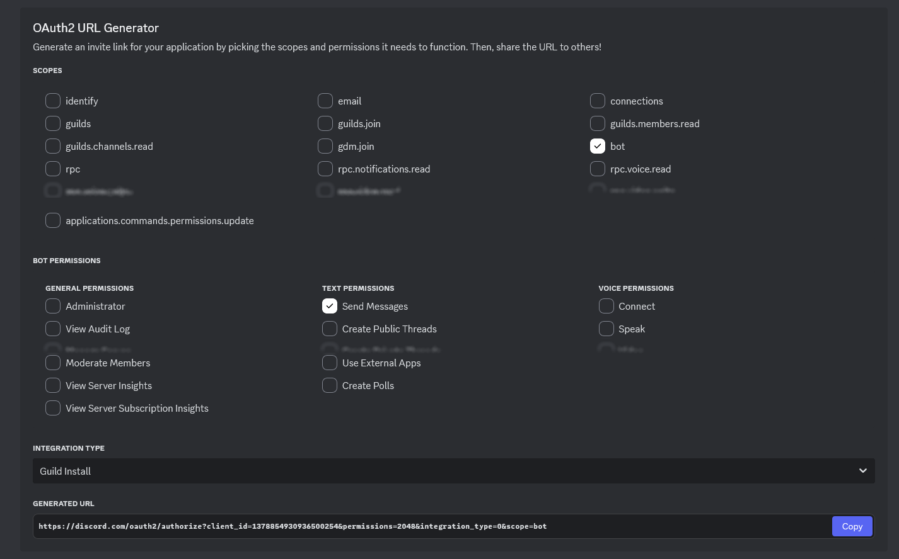
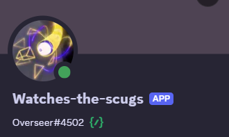

# Setting up Discord Integration

We have many different integrations with Discord that you can use in your community. This is the guide for setting all of that up.

Our integrations currently fall under three categories. Please read each section for which features are available.

* Game Server Webhooks
* Game Server Embedded Bot
* Standalone Bot

## Prerequisites

This guide will frequently refer to "IDs" for Discord channels, servers, etc. To get these, you should enable "Developer Mode" in Discord's settings, then you can right click things to get their ID number.

## Game Server Webhooks

The simplest form of integration is provided by [Discord Webhooks](https://support.discord.com/hc/en-us/articles/228383668-Intro-to-Webhooks). It enables the game server to directly send messages to specific Discord channels, with minimal setup.

This is currently used for the following features:

* Automatic round status notifications (end, start).
    * Includes pinging a role when the round has ended.
* Relaying in-game adminhelp messages.

Configuration is extremely simple. Generate a webhook for the relevant Discord channels (see link above), then enter them into your server configuration file:

```toml
[discord]
# Webhook to send adminhelp messages to.
ahelp_webhook = "<Webhook for ahelps>"

# Webhook to send round status messages to.
round_update_webhook = "<Webhook for round ping>"

# Optionally, a role ID to ping when the round has ended.
round_end_role = "<Role ID to ping>"
```

## Game Server Embedded Bot

This involves the game server hosting its own internal Discord bot, allowing more advanced features than simple webhooks can provide, though again with relatively little setup work.

This is currently used for the following features:

* Bi-directional OOC/Admin chat bridge
* More to come!

### Overview

The game server is capable of hosting its own Discord bot directly via [Discord.Net](https://docs.discordnet.dev/). This means you don't need to run a separate program on your server to get this functionality, you only need to create a bot on Discord's developer site and configure your server appropriately.


### Core setup

#### Bot creation

```admonish failure
Every game server should have its own independent Discord application/bot. Do not re-use the Discord bot tokens, as it may cause tons of fun bugs!
```

1. Go to [Discord's Developer Site](https://discord.com/developers/applications) to register a new application.
2. Give your bot a proper name, avatar, all that good stuff.
3. You will most likely want to make your bot private, so that only you can add it to Discord communities. To do this:
    1. Go to "Installation" and set "Install Link" to "None."
    2. Go to "Bot" and disable "Public Bot"
4. Under "Bot", enable "Server Members Intent" and "Message Content Intent".
5. Go to "OAuth" and generate an installation URL by ticking the following checkboxes and pressing copy: 
6. Paste the generated URL into your browser to install the bot.
7. Go to "Bot", press "Reset Token" and copy the token it gives you.

#### Server configuration

Add the following to your server config file to set up the Discord bot:

```toml
[discord]
# The bot token you copied earlier.
token = "fill me"
# The ID of your Discord server. Right-click your server to be able to copy the ID.
guild_id = fill me
# A prefix that must be added to all commands interpreted by the bot.
# This should be unique between game servers (and any other bots you may have on your Discord).
# Note that commands are not currently used, but they will likely be added in the future.
prefix = "!"
```

If you did all this correctly, your server should connect to Discord the next time it restarts. You can confirm this by checking the server logs, and seeing whether your bot gets an online status.

### Chat relay (OOC/admin chat)

The Discord bot can automatically relay messages between Discord and in-game channels. This is supported for both OOC and admin chat.

To configure, create the channels Discord-side, and make sure the bot has both Read Messages and Send Messages permission in them. Then add the following configuration to your server:

```toml
[ooc]
# The ID of the channel on Discord. Copy this by right clicking the channel.
discord_channel_id = fill me

[admin]
# The ID of the channel on Discord. Copy this by right clicking the channel.
chat_discord_channel_id = fill me
```

You can, of course, leave one out if you only wish one of the two channels to be relayed.

## Standalone Bot

This involves hosting a standalone Discord that works independent of the game servers. This is the functionality running on the official Discord's Overseer bot, covering:

* Game server status checking & automated updating of channel.
* Commands to restart/stop game servers.
* Automated message responses.



The bot uses [Red Discord Bot](https://github.com/Cog-Creators/Red-DiscordBot) as a modular base, with our own cogs located [here](https://github.com/space-wizards/wizard-cogs). This means you can add much more functionality to it from other cog developers, if you'd later.

```admonish note
We only provide support for the official wizard-cogs, Support for Red itself or other cogs is not provided by us, please get support in the official RedBot Discord or the appropriate cog developer.
```

```admonish warning
Most of our cogs require a minimum of python 3.11, please ensure you have this version before asking for support.
```

### Setup
1. Follow the [Red Documentation](https://docs.discord.red/en/stable/install_guides/index.html) on how to install and start the Base Red bot. Note that like an SS14 server. You need a computer that will stay turned on for your bot to function.
2. If you have not already, give [Red's Getting started](https://docs.discord.red/en/stable/getting_started.html#getting-started) page a read.
3. After you get your bot set up and invited to your server, you can now install the wizard-cogs repository to your bot. [p] in this case is your bots prefix you chose during redbot setup.
```
Enable the built-in downloader cog
[p]load downloader

Add the wizard-cogs repository
[p]repo add wizard-cogs https://github.com/space-wizards/wizard-cogs

Install the cog of choice, check out the GitHub link to see your options
[p]cog install wizard-cogs <cog_name>

Load the cog
[p]load <cog_name>
```

```admonish note title="Hints"
Looking for other interesting cogs? Check out the [Redbot Cog index](https://index.discord.red/). Like stated above we don't provide support for these cogs.

Not an English server? Some cogs have translations, You can change this with ```[p]set locale <language_code>```. Our cogs don't support other languages than English currently.
```

#### Game server status


##### Setup
1. Install ```[p]cog install wizard-cogs gameserverstatus```
2. Add your server ```[p]statuscfg addserver ss14 <server-name> <address to your server>```
3. Done! View your work with ```[p]status <server-name>``` (Of course your server needs to be online)

##### Setting up automated watching


If you like to have a channel where the status message is automaticly updated. Then watch is the feature you want.
1. After adding a server, use the following command ```[p]statuscfg addwatch <server> <#channel>```
2. As long as the bot has permissions to post in that channel. You will see the server status automaticly update in the message about every 2 seconds.

#### SS14.Watchdog Power actions


Allows you to communicate with SS14.Watchdog to perform certain actions.
1. Install ```[p]cog install wizard-cogs poweractions```
2. Setup your server by running ```[p]poweractionscfg add``` and pressing the green add button. Only admins can run this command. Otherwise, the bot won't respond.
You will get a form you will be asked to fill in (**Notice**: Neither us nor the RedBot developers will receive this information. This information will only be stored by the bot and won't be shown publicly.)


- Name: The server's name, you will be providing this to the bot when restarting the server.
- URL: The URL to the watchdog instance, make sure to provide a URL accessible by the bot. Example: If you are exposing the watchdog's API at 'https://example.com/watchdog' then what's that you wanna input. You can probably use 'localhost' too if the bot is hosted on the same machine as the watchdog. The default watchdog port is ``5000``
- Server ID: The name of your server in your watchdog's appsettings.yml that stores your server config. *Not* the "Name" config.
- API token: The ApiToken in your watchdogs configuration.
3. After clicking submit if the bot reported success then you are done! Repeat for your other server.

##### Commands available
Make a server restart now:

```[p]restartserver <name>```

Restart all servers the bot has configured:

```[p]restartnetwork```

*This will ask for confirmation before working*

Instruct the server to shutdown after the current round ends:

```[p]stopserver <name>```

Tell watchdog to prepare to update a server:

```[p]updateserver <name>```

#### GitHub Integration
Yet to be ported to redbot. You can use a [github webhook](https://gist.github.com/jagrosh/5b1761213e33fc5b54ec7f6379034a22) in the meantime.

#### Autoresponder (WYCI, Nanotrasen Block Game, Based)


```[p]cog install wizard-cogs autoresponder```

Why... (Responds to users saying "Something when" with "When you code it", "Tetris" with "Nanotrasen Block Game" and "Based" with "Based on what". This is an inside joke inside Space Station 14 communities)
