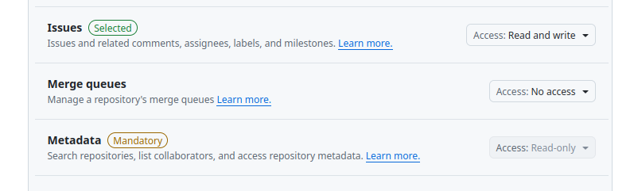
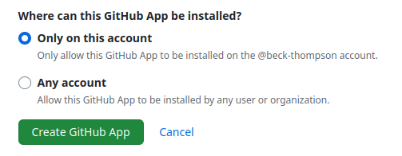
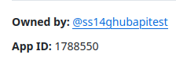
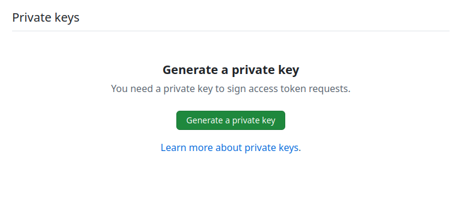
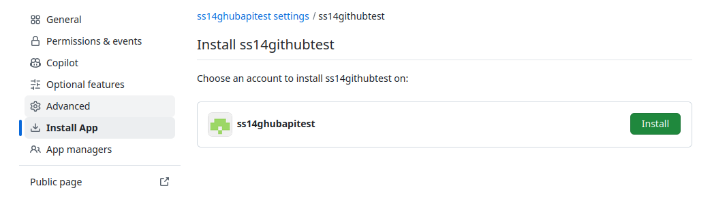
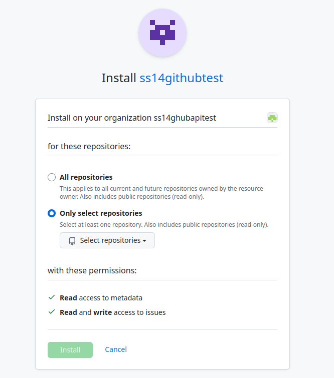

# Setting up GitHub integration
SS14 servers support basic github integration. Currently this is just creation of bug reports!

# Setup
Setting this up will allow any player who meets the requirements (See [Important CVars](#important-cvars)) to make bug reports.

0. (Optional) Create a new repository that only your GitHub organization has access to. You can transfer issues from this new repository to your main repository.
1. Create a new app (`https://github.com/settings/apps`). When creating the app, only allow issue creation permissions (and metadata). **Make sure you are logged in as the repository owner** (This is usually the organization itself)! You do not need a webhook URL.  


2. Under the "General" tab, get the apps app ID and also generate a private key. This will download the private key to your computer.  


3. Install the app in your orginzation, and only give it access to one repository.


4.  Add this to your server configuration
```toml
[github]
# Can be found at https://github.com/settings/apps/APPNAME - scroll to the bottom
github_app_private_key_path = "/home/root/appName.2025-08-15.private-key.pem"
# The app id found at https://github.com/settings/apps/APPNAME
github_app_id = 1787332
# If url is: https://github.com/space-wizards/space-station-14
# repo name is "space-station-14", repo owner is "space-wizards"
github_repository_name = "space-station-14"
github_repository_owner = "space-wizards"

[bug_reports]
enable_player_bug_reports = true
```

# Testing
If you run into issues, the servers console should display errors, make sure to look at that if issues are not being created. The `testgithubapi` also will do a few checks to ensure you filled out all the required fields (And also create 1 issue).

# CVars
Go to `CCVars.BugReports.cs` for the full updated list of cvars! Almost all the settings can be tweaked there - you probably want to change them depending on what type of fork you are running. Put them in the server configuration to change them like the other settings.