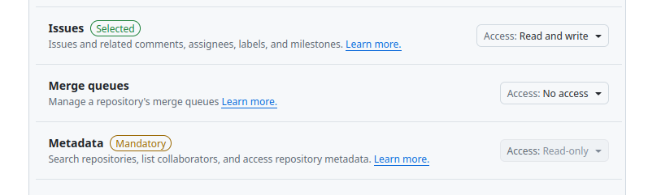
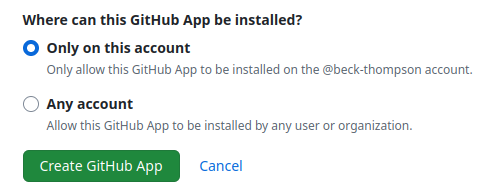
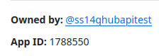
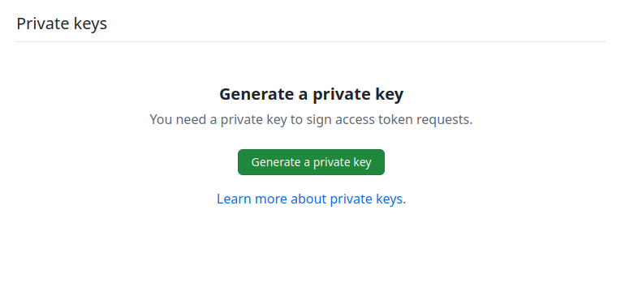
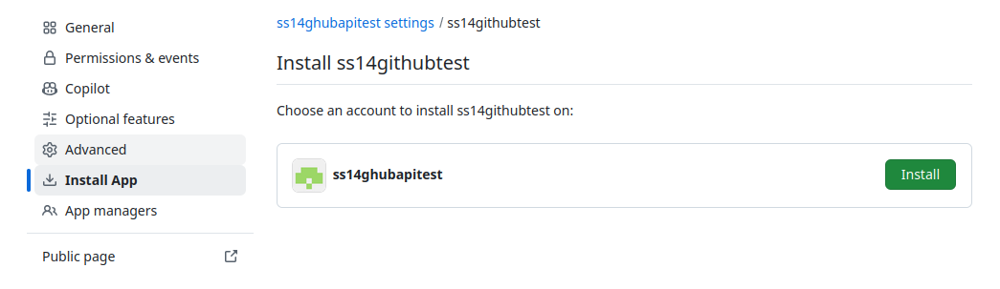
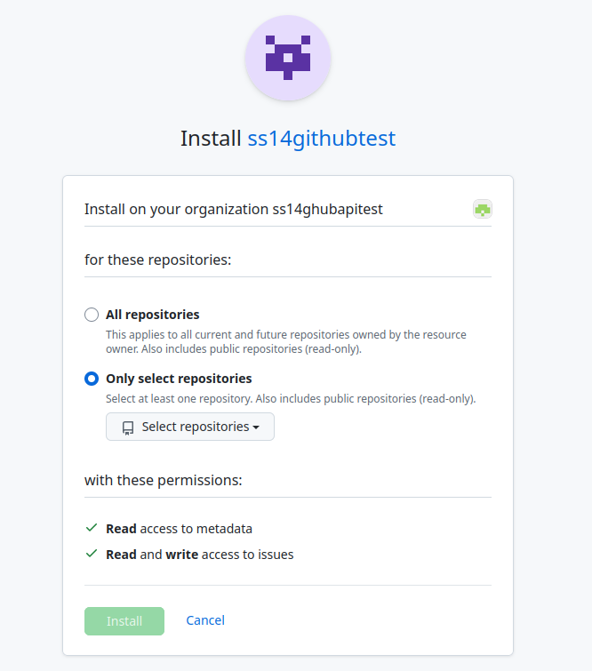

# Setting up GitHub integration
SS14 servers support basic GitHub integration. Currently this is used just for creation of bug reports using GitHub Issues (ability to do so for players is limited by CVar (See [Important CVars](#important-cvars))).


# Setup
This intregration uses GitHub App as authorization, so to use it you will need to create one.

WARNING! Keep in mind that steps, related to GitHub UI and interactions can be out of date due to changes on GitHub side. In case of problems with this guide - try looking into up-to date instructions 
https://docs.github.com/en/apps/creating-github-apps

0. (Optional) Create a new repository that only your GitHub organization has access to.  You might want to do this if you are worried about spamming the main repository. You can transfer issues from this new repository to your main repository, but GitHub have known limitation. If you would like players issues to be created in private repository and then transfer them to public one by hand, GitHub does not provide any automation for that specific case (private->public).
1. Create a new GitHub app (IMPORTANT! **Make sure you are logged in as the repository owner** (This is usually the organization itself)! ):
* go to `https://github.com/settings/apps` and click 'New GitHub App'
* Fill 'GitHub App name' with whatever you would like app to be named
* Add any valid url for 'Homepage URL' - this is not used anywhere except for app description
* Uncheck 'Active' checkbox under 'Webhook' section - you will not need it
* Under 'Permissions' section in 'Repository permissions' allow issue read+write permissions (and metadata, which will be checked automatically)

* Ensure that 'Only on this account' installation option is checked

* Click Create GitHub App at the bottom of the page
2. Under the "General" tab, get the app's **app ID** and also generate a **private key** (this will be a link in panel located at the top of window). This will download the private key to your computer.  


3. Go to you 'Install App' section of app page and click 'Install' for your organization. Only give it access to repository that should contain created issues.


4. Upload private key that you got in step 2 to the server and add following lines to your server configuration
```toml
[github]
# Can be found at https://github.com/settings/apps/APPNAME - scroll to the bottom
github_app_private_key_path = "/home/root/<PATH TO FOLDER WHERE YOU STORED YOUR PRIVATE KEY>"
# The app id found at https://github.com/settings/apps/APPNAME
github_app_id = <YOUR APP ID>
# If url is: https://github.com/space-wizards/space-station-14
# repo name is "space-station-14", repo owner is "space-wizards"
github_repository_name = <your repository owner - typically organization or user>
github_repository_owner = <your repository name>

[bug_reports]
enable_player_bug_reports = true
```

# Testing
If you run into issues, the servers console should display errors, make sure to look at that if issues are not being created. The `testgithubapi` console command also will do a few checks to ensure you filled out all the required fields (And also create 1 issue, as there is no other way to check if feature is working).

# CVars
Go to `CCVars.BugReports.cs` for the full updated list of cvars! Almost all the settings can be tweaked there - you probably want to change them depending on what type of fork you are running. Put them in the server configuration to change them like the other settings.