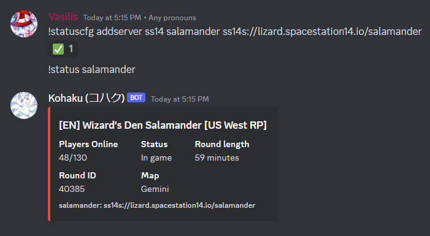
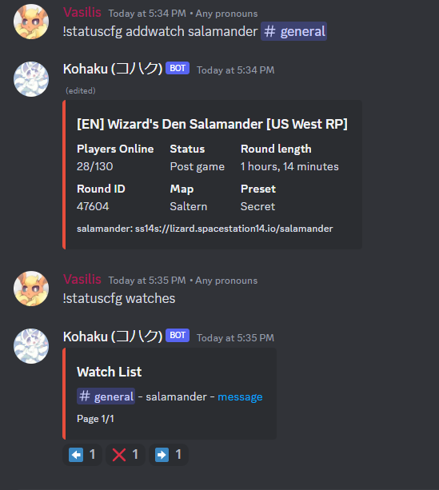
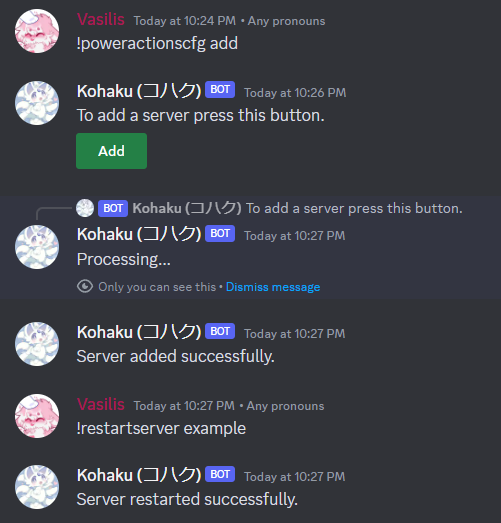
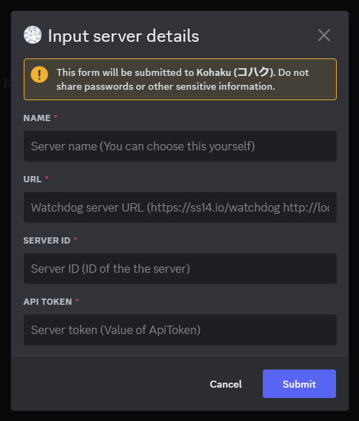
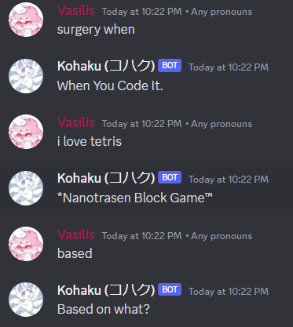

# Setting up your own discord bot for your server

You may have noticed in the official Wizards Den discord server that we have a bot that provides some nice features such as linking GitHub issues/pull requests, OOC & Discord bridge and a status command. 

Luckily for you, this is easy to set up with the help of the [Red Discord Bot](https://github.com/Cog-Creators/Red-DiscordBot/tree/V3/develop). A modular self-hosted Python discord bot. You do not need to know anything about programming to set up this bot. And this guide will help you with how to install and use our cogs on the bot.

```admonish note
We only provide support for the official wizard-cogs in the #hosting channel on the discord, Support for Red itself or other cogs is not provided by us, please get support in the official RedBot Discord or the appropriate cog developer.
```

## Setup
1. Follow the [Red Documenation](https://docs.discord.red/en/stable/install_guides/index.html) on how to install and start the Base Red bot. Note that like an SS14 server. You need a computer that will stay turned on for your bot to function.
2. If you have not already, give [Red's Getting started](https://docs.discord.red/en/stable/getting_started.html#getting-started) page a read.
3. After you get your bot set up and invited to your server, you can now install the wizard-cogs repository to your bot. [p] in this case is your bots prefix you chose during redbot setup.
```
Enable the built-in downloader cog
[p]load downloader

Add the wizard-cogs repository
[p]repo add wizard-cogs https://github.com/space-wizards/wizard-cogs

Install the cog of choice, check out the GitHub link to see your options
[p]cog install wizard-cogs <cog_name>
```

```admonish note title="Psss"
Looking for other interesting cogs? Check out the [Redbot Cog index](https://index.discord.red/). Like stated above we don't provide support for these cogs.
```
```admonish note title="Psss Combo 2"
Not an English server? Some cogs have translations, You can change this with ```[p]set locale <language_code>```. Our cogs don't support other languages than English currently.
```
Now you are ready, please be sure to check the [Wizard-Cogs Github](https://github.com/space-wizards/wizard-cogs) in case any new cogs have been added.


Otherwise, I will list the most interesting ones here with setup instructions

### Game server status


#### Setup
1. Install ```[p]cog install wizard-cogs gameserverstatus```
2. Add your server ```[p]statuscfg addserver ss14 <server-name> <address to your server>```
3. Done! View your work with ```[p]status <server-name>``` (Of course your server needs to be online)

#### Setting up automated watching


If you like to have a channel where the status message is automaticly updated. Then watch is the feature you want.
1. After adding a server, use the following command ```[p]statuscfg addwatch <server> <#channel>```
2. As long as the bot has permissions to post in that channel. You will see the server status automaticly update in the message about every 2 seconds.

### SS14.Watchdog Power actions


Currently only has the functionality to restart servers as of writing
1. Install ```[p]cog install wizard-cogs poweractions```
2. Setup your server by running ```[p]poweractionscfg add``` and pressing the green add button. Only admins can run this command. Otherwise, the bot won't respond.
You will get a form you will be asked to fill in (**Notice**: Neither us nor the RedBot developers will receive this information. This information will only be stored by the bot and won't be shown publicly.)



- Name: The server's name, you will be providing this to the bot when restarting the server.
- URL: The URL to the watchdog instance, make sure to provide a URL accessible by the bot. Example: If you are exposing the watchdog's API at 'https://example.com/watchdog' then what's that you wanna input. You can probably use 'localhost' too if the bot is hosted on the same machine as the watchdog.
- Server ID: The name of your server in your watchdog's appsettings.yml that stores your server config. *Not* the "Name" config.
- API token: The ApiToken in your watchdogs configuration.
3. After clicking submit if the bot reported success then you are done! Repeat for your other servers or give it a shot with ```[p]restartserver <name>```.

### New round pinging & Ahelp relay
While it's not specificly a bot feature, I thought I might as well throw it in here since there's no other documentation on it and it's related to Discord.
1. Make a discord webhook in the channel you want the pings to arrive in. You can make one by clicking on the cogwheel in the channel > Integrations > Webhooks. Once done copy the URL
2. Set the following [CCVars](https://docs.spacestation14.com/en/general-development/tips/config-file-reference.html) in your config
```
discord.ahelp = <Webhook for ahelps>
discord.round_update_webhook = <Webhook for round ping>
discord.round_end_role = <Role ID to ping>
```

### OOC Bridge
This is to be coded into the game server itself. Please await it.
Check on the status of [This PR](https://github.com/space-wizards/space-station-14/pull/23458)

Once it's merged and confirmed stable I will update this documentation with all the cool stuff it adds.

### GitHub Integration
Yet to be ported to redbot. You can use a [github webhook](https://gist.github.com/jagrosh/5b1761213e33fc5b54ec7f6379034a22) in the meantime.

### Autoresponder (WYCI, Nanotrashen Block Game, Based)


```[p]cog install wizard-cogs autoresponder```

Why... (Responds to users saying "Something when" with "When you code it", "Tetris" with "Nanotrashen Block Game" and "Based" with "Based on what". This is an inside joke inside Space Station 14 communities)