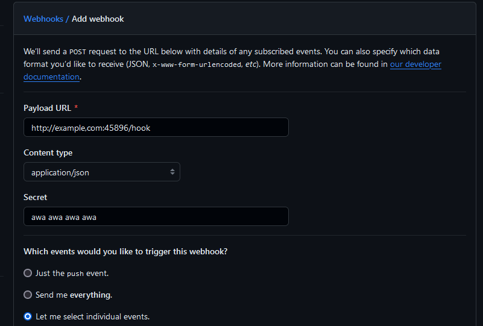
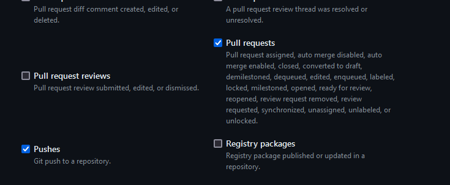

# Setting up SS14.Changelog

## Setup

1. Clone the git repo for SS14.Changelog:
```
git clone https://github.com/space-wizards/SS14.Changelog
```

2. Build the project

```
dotnet publish -c Release --no-self-contained -r linux-x64
```

Output files will be in `SS14.Changelog/bin/Release/net8.0/linux-x64/publish/` (or something like that). Put them on your server somewhere.

3. After you will want to git clone your SS14 repository somewhere. I would recommend the same folder as SS14.Changelog

4. Setup your config

Here is what you'll want to put in `appsettings.yml`. Please read every comment:

```yml
Serilog:
  Using: [ "Serilog.Sinks.Console", "Serilog.Sinks.Loki" ]
  MinimumLevel:
    Default: Information
    Override:
      SS14: Verbose
      Microsoft: "Warning"
      Microsoft.Hosting.Lifetime: "Information"
      Microsoft.AspNetCore: Warning

  WriteTo:
    - Name: Console
      Args:
        OutputTemplate: "[{Timestamp:HH:mm:ss} {Level:u3} {SourceContext}] {Message:lj}{NewLine}{Exception}"

  Enrich: [ "FromLogContext" ]

  # If you want Loki logging.
  #Loki:
  #  Address: "http://localhost:3101"
  #  Name: "centcomm"

# Change URL/port to bind to here.
urls: "http://localhost:45896"

Changelog:
  # Secret configured in the github webhook, to ensure authenticity.
  GitHubSecret: "<SECRET>"
  # The branch to look at for generating changelogs.
  ChangelogBranchName: "master"
  # The SSH Key to use to push/pull changes.
  SshKey: '/opt/ss14_changelog/ssh_key'
  # The on-disk repo to keep up to date and to generate changelogs in.
  # You need to initialize this manually with git clone.
  ChangelogRepo: '/var/lib/changelog/repo/'
  # How long to wait after a changelog-change has been merged/pushed before we generate changelogs and push a commit.
  DelaySeconds: 60
  # The filename of the changelog file. I suggest you set this to something else so that upstream and your fork changelogs are seperated
  # Note you will have to create this file on your repo ahead of time with at least one entry written manually right now otherwise it will explode
  ChangelogFilename: "Fork.yml"

AllowedHosts: "*"
```

Then you will want to create a github webhook on your repo. You should find it under repo settings.

Click on add webhook and fill it in. Payload url being the url/ip of your server you will be hosting SS14.Changelog on and ```/hook```. Set the content type to ```application/json```. Set the secret to the same secret you put in the appsettings.yml. And click "Let me select individual events" and select "Pull requests" and "Pushes".





URL for example would be: "https://yourserver.com/hook"

You will need this url to be accessible from the internet, you are free to reverse proxy this. Or github can send it directly to the port if you wire it up with the port you provided in urls.

Of course if you do the latter. Make sure to change it to http

You will also mostly likely want a systemd service to run this in the background.

## Discord webhook Setup

To be written

## RSS feed

If you would like to setup an rss feed for your changelogs then you can do this too.

The publishing system can automatically publish the changelog to an RSS feed. This is done from [`actions_changelog_rss.py`](https://github.com/space-wizards/space-station-14/blob/master/Tools/actions_changelog_rss.py) which is ran from the [publishing workflow](https://github.com/space-wizards/space-station-14/blob/master/.github/workflows/publish.yml).

### Server setup

The resulting RSS file must be hosted on a separate server, accessible via SFTP. I recommend setting up an SFTP-only chrooted user. If you know how to do this you probably don't need to look very hard at this.

```shell
# Create a group for SFTP-only users
groupadd sftp-only
# Create changelog user
useradd changelog-rss --groups sftp-only --create-home

# Create directory for chrooted sftp
mkdir --parents /var/sftp/home/changelog-rss
chown changelog-rss: /var/sftp/home/changelog-rss

# Set up SSH key for user
mkdir /home/changelog-rss/.ssh
ssh-keygen -t ed25519 -f changelog_key -N ""
cat changelog_key.pub >> /home/changelog-rss/.ssh/authorized_keys
# Save changelog_key, you'll need it for GitHub-side setup.
chown -R changelog-rss: /home/changelog-rss/.ssh

# (example, depends on what web server you want to use)
# Give nginx access to the upload directory
setfacl -m u:nginx:rx /var/sftp/home/changelog-rss
```

You will also need to add the following to `/etc/ssh/sshd_config`:

```
Subsystem sftp internal-sftp

Match Group sftp-only
    ChrootDirectory /var/sftp
    X11Forwarding no
    AllowTcpForwarding no
    AllowAgentForwarding no
    ForceCommand internal-sftp
```

You'll still need to make sure the changelog file is exposed through a web server somwhere. I'll leave that up to you. Whatever you do, make sure that your web server reports the file's `Content-Type` as `application/rss+xml`.

```admonish warning
The SSH key MUST be ed25519. I couldn't be bothered to make the script more flexible.
```

### GitHub setup

In the official publishing workflow, `actions_changelog_rss.py` automatically starts running once the `CHANGELOG_RSS_KEY` secret is set on GitHub. This should be the private key that will allow you to connect over SFTP.

Before you set that however, there are still some changes you should make to `actions_changelog_rss.py`:

```python
# Change these to suit your server settings
# https://docs.fabfile.org/en/stable/getting-started.html#run-commands-via-connections-and-run
SSH_HOST = "centcomm.spacestation14.io"
SSH_USER = "changelog-rss"
SSH_PORT = 22
RSS_FILE = "changelog.xml"
HOST_KEYS = [
    "AAAAC3NzaC1lZDI1NTE5AAAAIEE8EhnPjb3nIaAPTXAJHbjrwdGGxHoM0f1imCK0SygD"
]

# RSS feed parameters, change these
FEED_TITLE       = "Space Station 14 Changelog"
FEED_LINK        = "https://github.com/space-wizards/space-station-14/"
FEED_DESCRIPTION = "Changelog for the official Wizard's Den branch of Space Station 14."
FEED_LANGUAGE    = "en-US"
FEED_GUID_PREFIX = "ss14-changelog-wizards-"
FEED_URL         = "https://central.spacestation14.io/changelog.xml"
```

* You should set the `SSH_` parameters to whatever connection parameters you need to connect via SSH.
* `RSS_FILE` is the name of the destination file in the SFTP directory.
* `HOST_KEYS` must contain the ed25519 host key of your destination system. You can find it at `/etc/ssh/ssh_host_ed25519_key.pub`. Cut off the starting `ssh-ed25519` bit.
* `FEED_` parameters all change the contents of the RSS feed. You should probably change these to make them distinct from the ones used by Wizard's Den.

### Custom XML data

The RSS feed created contains both a normal HTML-based description of the changes, as well as some more structured information from the source changelog, that can be displayed by specialized tools. This data is all under the `https://spacestation14.com/changelog_rss` XML namespace.

A quick summary of the data:
* An `<item>` contains a `ss14:from-id` and `ss14:to-id` to describe the range of changelogs covered by an RSS item.
* Each RSS item can contain a series of `<ss14:entry>` elements containing the entries making up the RSS item.