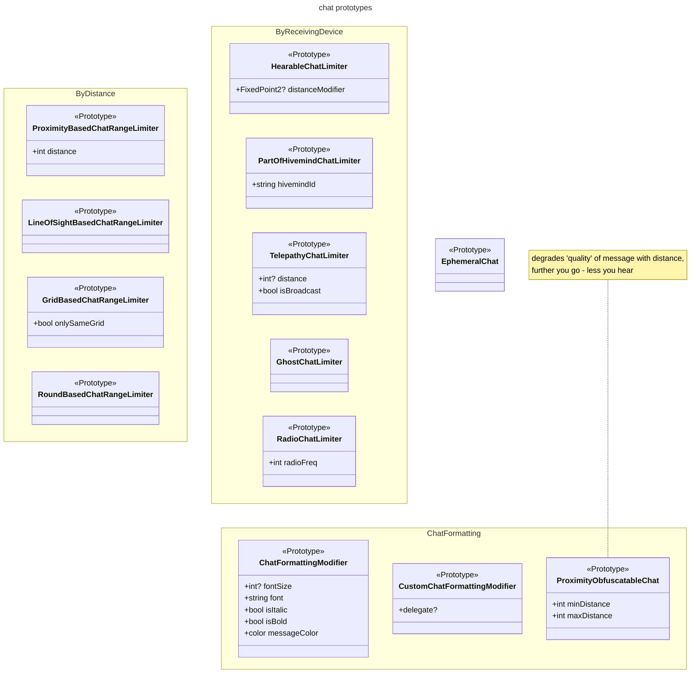
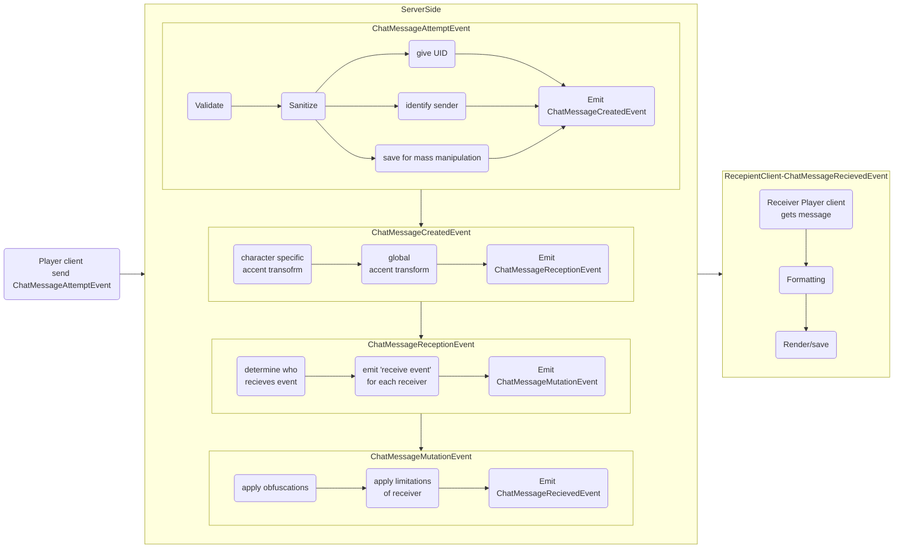

# Chat and Other Messaging

## What is Chat?
Under term 'chat' we understand all messages that players, in-game entities and admins are exchanging in game. There are a lot of requirements that are implemented in current chat system, but there are also a lot to be desired - extensibility is quite poor, some of features require a lot of work for just porting stuff from ss13. In this document we will try to deduce core requirements and ways to fit them in current ecosystem of the game, also will discuss positive and negative traits of new chat system.

** this document is based on FairlySadPanda Chatfactor Design Page (https://github.com/space-wizards/docs/pull/221/files).

## First lets discuss what game currently have.

Chat and other messages are usually sent in context of some 'way of communication' - by 'saying and hearing', or 'writing and seeing', or 'emoting and seeing'. Lets call this abstraction for 'way of communication' **Communication type**. Communication types usually are defined by
- constraints on sending side (must have mouth, must have ability to speak, must have working headset, must have cryptokey inside headset, etc)
- constraints on receiving side (must... have ears?, must see message author, must be near author, etc)
- specific formatting settings for rendering this communication type

Other then that chat and other messages sent between players (in-game entities and admins) can be grouped into two typesfrom game atmophere standpoint:
* **In-round messages** - These chat types cover messages that are "round-scoped". This means they relate to something that shows up in replays and are "things that happened in that particular round". They are part of round and thus part of replay.
* **"Out of round" messages** - These are "server-scoped" messages. They don't need to show up in replays (although it's an implementation note if they do or not) and cover all out-of-game conversation.

Generally you can summarize the difference between the two types by "the former is sent by something that exists in the Space Station 14 universe, and the latter is sent by people in the real world". Lets try to look at currently existing communication types, separated by those categories.

### "In round" messages:

| Commuication type				| Details  	|
|:---:							| ---		|
| Whisper  						| Quiet verbal communication that is very short range and features occlusion mechanics.				|
| Say  							| Normal verbal communication. Main difference compared to whisper - is not obfuscated. You either hear it all or not hear it at all. Can be modified to be louder using exclamations.				|
| Emote  						| Visual communication via body langage. Requires line-of-sight.				|
| LOOC  						| Out-of-character chat that is supposed to be used for asking for help or "I need to go AFK" messages, but is actually used for being salty.				|
| Background					| Place where automated chats like vending machine announcements are issued. Essentially identical to local chat, but these messages are "not real" and do not go into chat logs or get message IDs (see below).				|
| Device radio					| Device radio covers radio that sends and receives from a specific location in the game, like handheld radios or intercoms.				|
| Internal radio  				| Internal radio covers radio that is granted by some internal power, like Binary for robots or "nearly everything" for Nar'sie				|
| Radio  						| Equipment radio covers radio that is granted by having access to a worn piece of equipment, such as a headset				|
| Dead	 						| The place ghosts talk where players can't hear them (and the place admins post when they want to be seen by dead people)				|
| Prayer 						| Messages sent from players in-game to admins via some artifact like the red phone or the maint altar				|
| Announcements  				| Various announcements from automated messages through to adminbus messages or comms console notifications				|
| Subtle  						| Messages targeted at one specific player, currently solely an adminbus feature				|
| Admin  						| Admin-only chat|

Radio-related ones are all different kinds of wireless communication via **hub servers** or other technology that can be listened to via equipment or innate powers. Covers all "role-specific" communications like Binary for robots or the Syndicate channel for traitors and nuclear operatives. 

### "Out of round" messages
| Commuication type				| Details  	|
| :---:							| ---		|
| OOC  							| Lobby comms for people out-of-game. Usually switched off by cvar during games.				|
| Admin  						| Admin notices, from all-player bwoinks to requests for feedback on events.			|
| Server  						|  "PLAYER JOINED, PLAYER LEFT" yadda yadda. Also covers tips.				|

* Faxing and other player-to-player messages like PDA messages (proposed) work like chatting but don't use the same devices like the chat log and fall out of most of the "chat" domain.
* Server tips are out-of-round, but Tippy (the rare pop-up clown that gives a tip) is considered in-round by players.

## Functional requirements
Now that we looked at all what we have, lets try to aggregate it into unique requirements.

From main standpoint of chat we can deduce that most of requirements will be concentrated around two processes - **emitting (producing) message**, and **consuming** (and rendering, as a result). **We will call process in between oh those 'chat pipeline'.**

We can state that there is always 1 producer, and 1 or more consumers of messages. Both sides can be either player or some in-game entity. For both sides pipeline can be different, based on aspects of entity, environment, and way of communication.

Nature of ss14 development is fluent and there is a lot of demand for features to be customizable within yaml prototypes, without having 'fun' of writing and testing c# code. It is better to create new chat system with this in mind. As previously said, we have producing and consuming, so lets try to find out what configuration/configurability they need.

From **message producing** standpoint

| Condition				| Technical description | Description 			|
|:---					|:---			|:---				|
|Is cautious			| Does not have StunnedComponent, MutedComponent or GhostComponent |Can only speak if alive and awake |
|Have organ to speark	| Have VoiceComponent / HandsComponent / BorgChassisComponent |  Can only speak while having mouth, can only emote while having hands, can only beep-boop whyle having chassis, can smile only when have mouth, etc.|
|Have device in inventory| Have item with component in InventorySlot 'ears' / 'hands'... |Can talk to radio only while have headset and cryptokey. Includes 'device should be turned on' / 'is not jammed' and |
|Have working server on same grid| Grid that current entity is on have also Entity with component, |Can talk to radio only if comms are not dead (exist and have power)|
|Have admin access		| AdminManager.IsAdmin(ActorComponent.PlayerSession) returns true |Can only speak if is admin|
|Is on grid				| Is entity on requested grid |Can only speak while on certain grid?|
|Is part of faction		| Have NpcFactionMemberComponent |For dragon-carp and this kind of thing scenarios|
|Is part of living hivemind	| Have HivemindComponent, and there is at least one HivemindComponent with 'IsMain'=true value with same HivemindId as author |Can speak inside hivemind network while at least 1 of hivemind-cores exists/alive. Changelings can have their telepathy chat until all main ones are dead. And in case there are 2 blobs - let them have separate chats!|
|Is dead				| Have GhostComponent |Dead chat only for admin or dead people|

Most of conditions can be placed togather.

From **message consumption** standpoint

| Condition				| Technical description |Examples |
|:---					|:---				|:---				|
|Is cautious			| Does not have SleepingComponent, DeafComponent (?)| Can only hear if is alive and awake.|
|HaveOrgan				| Have HearingComponent (?) | Can only hear if have ears, can only see if have eyes, etc.|
|Have working device	| Have item with component in InventorySlot 'ears' / 'hands'...|Can only hear if have device in slot|
|Is within proximity	| Have distance between message consumer and author less then 'max distance' (can be modified with values on HearingComponent? SUPER EARS?) |Can only hear if is within some range of message author, or some device|
|Is on grid				| Is entity on requested grid |Can only hear while on same/certain grid|
|Have eye contact		| Is author in LOS |Can only see emote if is in line of sight. Also can be used as part of some 'psyhic scream' of vampire mechanics - telepathy, based on line of sight|
|Is part of faction		| Have NpcFactionMemberComponent |same as for producer |
|Is part of living hivemind	| Have HivemindComponent, and there is at least one HivemindComponent with 'IsMain'=true value with same HivemindId as author| same as for producer |
|Is dead				| Have GhostHearingComponent | Dead chat only for admin or dead people|

Then, in chat pipeline there should be parts which mutate message text in some cases - **chat message mutators**.

| Mutator				| Examples |
|:---					|:---				|
|Proximity obfuscation	| Changes words making message text less understandable, most of the time - based on distance|
|Languages				| Some players can talk using their 'native language' of race, which obscures message for players of same race, and does not for others|
|Accents 				| Accent of charater mutates words / parts of messages for all who can hear them|

Other then that we have some **non-functional requirements**
- messages should be censored if they have naughty stuff
- messages should be trottled (rate-limited and excessive-ones should be ignored + notification of limit should be visible to sender)
- messages should be removable in batch from history (using author as key)
- most messages (in-round) should be written to round replay, but there are ephemeral communication types which are excluded

For sample of condition for checking if 'something' have component - see  **ComponentInTile**.




<table>
<tr>
<th>  </th>
<th>  </th>
</tr>
<tr>
<td>

```yaml
- type: communicationType
  abstract: false
  parent: []
  id: say
  name: Say
  description: 
  chatPublishConditions: 
  - !type:IsNotMuteChatConsumeCondition
	component: VoiceComponent
	
  chatConsumeConditions:
  - !type:HaveEarsChatConsumeCondition
  - !type:IsNearChatConsumeCondition
	maxDistance: 10
```

</td>
<td>

```yaml
- type: communicationType
  abstract: false
  parent: []
  id: whisper
  name: whisper
  description: 
  chatPublishConditions: 
  - !type:CanSpeakChatProduceCondition
  chatConsumeConditions:
  - !type:HaveEarsChatConsumeCondition
  - !type:IsNearChatConsumeCondition
	maxDistance: 7
  messageMutators:
  - !type:ProximityObfuscationMessageMutator
    minDistance: 3
    maxDistance: 7
  messageMutators:
  - !type:SenderWithoutLineOfSightObstructionMessageMutator
```

</td>
</tr>
<tr>
<td>

```yaml
- type: communicationType
  abstract: false
  parent: []
  id: handsEmote
  name: HandsEmote
  description: 
  chatPublishConditions: 
  - !type:HaveHandsChatProduceCondition
  chatConsumeConditions:
  - !type:HaveEyesChatConsumeCondition
  - !type:IsNearChatConsumeCondition
	maxDistance: 10
```	
</td>
<td>

```yaml
- type: communicationType
  abstract: false
  parent: []
  id: faceEmote
  name: FaceEmote
  description: 
  chatPublishConditions: 
  - !type:FaceVisibleChatProduceCondition
  chatConsumeConditions:
  - !type:HaveEyesChatConsumeCondition
  - !type:IsNearChatConsumeCondition
	maxDistance: 10
```	
</td>
</tr>
<tr>
<td>

```yaml
- type: communicationType
  abstract: false
  parent: []
  id: robotEmote
  name: RobotEmote
  description: 
  chatPublishConditions: 
  - !type:HaveHandsChatProduceCondition
  chatConsumeConditions:
  - !type:HaveEarsChatConsumeCondition
  - !type:IsNearChatConsumeCondition
	maxDistance: 10
```	
</td>
<td>

```yaml
- type: communicationType
  abstract: false
  parent: []
  id: looc
  name: LOOC
  description: 
  chatPublishConditions: 
  - !type:CanSpeakChatProduceCondition
  chatConsumeConditions:
  - !type:HaveEarsChatConsumeCondition
  - !type:IsNearChatConsumeCondition
	maxDistance: 10
```	
</td>
</tr>
<tr>
<td>

```yaml
- type: communicationType
  abstract: false
  parent: []
  id: background
  name: Background
  description: 
  chatPublishConditions: 
  - !type:CanSayBackgroundProduceCondition
  chatConsumeConditions:
  - !type:HaveEarsChatConsumeCondition
  - !type:IsNearChatConsumeCondition
	maxDistance: 5
```	
</td>
<td>

```yaml
- type: communicationType
  abstract: false
  parent: []
  id: deviceRadioSecurity
  name: Device radio security wave
  description: 
  chatPublishConditions: 
  - !type:CanSpeakChatProduceCondition
  chatConsumeConditions:
  - !type:HaveEarsChatConsumeCondition
  - !type:HaveRadioHeadgearChatConsumeCondition
    radioWave: 'security'
  - !type:IsNearChatConsumeCondition
	maxDistance: 10
	minDistance: 3
```	
</td>
</tr>
<tr>
<td>

```yaml
- type: communicationType
  abstract: false
  parent: []
  id: dead
  name: Dead
  description: 
  chatPublishConditions: 
  - !type:IsDeadChatProduceCondition
  chatConsumeConditions:
  - !type:IsDeadChatConsumeCondition

```	
</td>
<td>

```yaml
- type: communicationType
  abstract: false
  parent: []
  id: prayer
  name: Prayer
  description: 
  chatPublishConditions: 
  - !type:IsNearDeviceChatProduceCondition
    deviceType: altar
  chatConsumeConditions:
  - !type:IsAdminChatConsumeCondition
```	
</td>
</tr>
<tr>
<td>

```yaml
- type: communicationType
  abstract: false
  parent: []
  id: announcement
  name: Announcement
  description: 
  chatPublishConditions: 
  - !type:IsDevice
	device: ComputerComms
  chatConsumeConditions:
  - !type:GridBoundChatConsumeCondition
	onlySameGrid: true

```	
</td>
<td>

```yaml
- type: communicationType
  abstract: false
  parent: []
  id: prayer
  name: Prayer
  description: 
  chatPublishConditions: 
  - !type:IsNearDeviceProduceCondition
    deviceType: altar
  chatConsumeConditions:
  - !type:IsAdminChatConsumeCondition
```	
</td>
</tr>
</table>

## Component-based Chat Privilages

Chat should be driven by components, rather than having its functionality defined completely in C#. This brings easiness to manage and add more independent actors. To use messaging mob should have access to it, which should be governed by components they have. That is true to most channels (excluding LOOC and Dead). For example, to actually speak in local chat, a mob must have the following component:

```cs
using Robust.Shared.GameStates;

namespace Content.Shared.Chat.V2.Components;

/// <summary>
/// Declares that this entity can chat in local chat
/// </summary>
[RegisterComponent, NetworkedComponent, AutoGenerateComponentState]
public sealed partial class CanLocalChatComponent : Component
{
    // TODO: Ensure you can't locally chat in insufficient atmosphere
    /// <summary>
    /// How far can this entity be heard from?
    /// </summary>
    [DataField, AutoNetworkedField]
    public float Range = 10.0f;
}
```

Note that this component not only grants them the right to use local chat, it also determines how they use it. In this case, it governs the range they can be heard from. It stands to reason that Nar'sie, eldritch god, probably speaks louder than Pun-Pun.

## The Chat Message Lifecycle

Chat messages are created and used via a lifecycle of events. This can also be described as "chat is event-driven". What both of these terms mean is that a series of events build a step-by-step process (pipeline) that turns a player's input into output other players can read.

The lifecycle can be summarized by the following steps.




1. In the client, a player attempts to send a chat message to a channel by issuing a chat message attempt event.
    * This attempt goes over the network to the server.
2. The attempt is processed by a **chat message attempt processor** on the server.
    * The validator issues a chat validation event that is consumed by processors. 
    * If no processor fails the attempt, the validator will then sanitize the message's contents. 
    * The result of sanitization is handed to the **chat message repository**.
3. The **chat message repository** stashes the chat message away to be referred to later.
    * It gives the message a unique ID that can be used to reference the message at any point later on.
    * It associates all messages with the player who sent them, allowing for easy mass-deletion by an admin.
    * It issues a chat message created event that allows further processors to respond.
4. The **chat message created processor** listens for chat message creation events.
    * The processor issues an chat message accent transformation event that is consumed by processors.
    * These processors modify the sent message to add "global" modifiers, such as a lizard person's trailing s's, a voice mask, and so on.
    * It issues a chat reception event that is consumed by processors.
    * These processors determine who receives the event.
    * The receiver processor then emits a chat message mutation event for each receiver.
    * These processors determine how a chat message is altered due to obfuscation, language, and so on.
    * After each mutation event is fully processed, the processor emits a chat message received event to the receiver.
    * This received event goes over the network to the client.
5. The **chat message received processor** listens to chat message received events on the client.
    * The various types of chat messages are then formatted and emitted in the various ways the client displays chat (in the chat log, in speech bubbles, etc)

It's not required that the processors in the above lifecycle are synchronous. For example, the chat message created processor could be broken up into accent transformation, receiver determination, mutation transformation and emission to clients. But the overall set of steps remains the same.

Likewise, it's not required these names to be stuck to absolutely - naming things is hard.

### Intended benefits of this approach

1. Code is split between "is this legal to send" and "how to handle that it has been sent". This means concerns are separated, which tends to make code easier to maintain - security requirements shouldn't bleed into other aspects of the chat management system, for example.
2. A set of events is easy to refactor. The work of the chat message repository does not assume anything about validation, who the eventual receivers are, and so on. It's one tightly-bounded component in a larger set of processors. This means it's easy to add or remove any one part.
3. Аunctionality can be added using event listeners, without need to ruin Open-Closed Principle. For example, handheld radios don't ever really need to share code space with actual radios, but they both listen for radio message creation events. The handheld radio code would implement its own chat message created processor, handling accent, reception and mutation events itself. An example of why this is beneficial is that it makes a "universal translator" radio easy to implement.
4. All messages have a common ID. This means de-duplication is possible. For example, if the same message is sent to a handheld radio, an intercom and someone's headset, the frontend can detect that it has already displayed the chat message once, and thus the message does not need to be spammed repeatedly into the chat log, or might have a reduced impact in message bubbles.
    * This also means specific "delete/modify this message" and "nuke all of this player's messages" commands are possible for admin!

### Technical Details

This document can't describe the exact names and properties of every single event this process issues, but at an overall level there are a few technical notes worth considering.

1. Messages use inheritance and generics where possible to allow for code reuse. For example, all chat attempt events inherit from "ChatAttemptEvent", which specifies they must have a NetEntity and a message. Sometimes, like with internal, device and equipment radio events, this can involve multiple stages of inheritance.
2. Inheritance (and generics) are prioritized over in-message state flags. For example, there are several "radio attempt event" messages, rather than one "radio attempt event" message that has an internal type enum. This is so we can leverage the message bus effectively. In general, letting the message bus handle directing messages where they need to go is more efficient and cleaner, even
if it occasionally causes handler code duplication.
3. Generics are used for processor events, like chat sanitization events. For example, ChatValidationEvent\<T\> allows for different events to be validated in different ways: a radio event can have its channel checked to make sure it exists, for example.
4. Processor events should have the "abstract generic" raised first, then the "implementation generic" events. The event bus can't handle deep type comparison. For example, when T implements ChatAttemptEvent, ChatValidationEvent\<ChatAttemptEvent\> is raised before ChatValidationEvent\<T\>. Only when both types of event are raised and processed can the overall process continue onwards.

## Frontend Considerations

This document is almost entirely concerned with the backend implementation of chat. However, from exploration, there are a few considerations to take place:

1. It should not be too hard to bolt this new system on to the legacy frontend chat system, although this will need old and new code to live side-by-side for a while. Transformation between the new backend events and the old ChatMessage events, with their janky WrappedMessage fields and so on, will be necessary.
2. When building the new frontend system, it would be best to mimic the separation of concerns that the backend server code has implemented. The frontend chat management system is a large class that is exceptionally difficult to read. Reception, formatting and display should be broken apart into their own steps, with the former not assuming the implementation details of the latter.
3. It'd be really funny if shouting made your text bigger. I'm just saying. Bold is fine, but, like, size eighteen font would really sell that you're being loud.