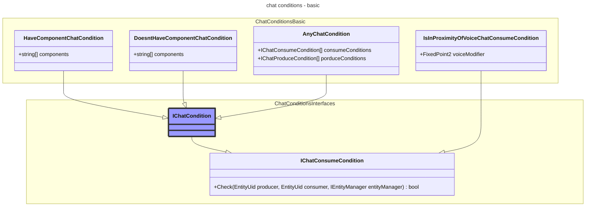

# Chat and Other Messaging

## What is Chat?
Under term 'chat' we understand all messages that players, in-game entities and admins are exchanging in game. There are a lot of requirements that are implemented in current chat system, but there are also a lot to be desired - extensibility is quite poor, code contains a lot of questional double/triple+ checks, it is distributed over a vast amount of classes. In this document we will try to deduce core requirements and ways to fit them in current ecosystem of the game, also will discuss positive and negative traits of new chat system.

** this document is based on FairlySadPanda Chatfactor Design Page (https://github.com/space-wizards/docs/pull/221/files).

## First lets discuss what game currently have.

Chat and other messages are usually sent in context of some 'way of communication' - by 'saying and hearing', or 'writing and seeing', or 'emoting and seeing'. Lets call this abstraction for 'way of communication' **Communication type**. Communication types usually are defined by
- constraints on sending side (must have mouth, must have ability to speak, must have working headset, must have cryptokey inside headset, etc)
- constraints on receiving side (must... have ears?, must see message author, must be near author, etc)
- specific formatting settings for rendering this communication type

As chat is one of core parts of the game, almost all chat messages are part of replays.

Other then that chat and other messages sent between players (in-game entities and admins) can be grouped into two typesfrom game atmophere standpoint:
* **In-round messages** - These chat types cover messages that are "round-scoped". This means they relate to something that shows up in replays and are "things that happened in that particular round". They are part of round and thus part of replay.
* **"Out of round" messages** - These are "server-scoped" messages. They don't need to show up in replays (although it's an implementation note if they do or not) and cover all out-of-game conversation.

Generally you can summarize the difference between the two types by "the former is sent by something that exists in the Space Station 14 universe, and the latter is sent by people in the real world". Lets try to look at currently existing communication types, separated by those categories.

### "In round" messages:

| Commuication type				| Details  	|
|:---:							| ---		|
| Whisper  						| Quiet verbal communication that is very short range and features occlusion mechanics. |
| Say  							| Normal verbal communication. Main difference compared to whisper - is not obfuscated. You either hear it all or not hear it at all. Can be modified to be louder using exclamations.				|
| Emote  						| Visual communication via body langage. Requires line-of-sight.				|
| LOOC  						| Out-of-character chat that is supposed to be used for asking for help or "I need to go AFK" messages, but is actually used for being salty.				|
| Background					| Place where automated chats like vending machine announcements are issued. Essentially identical to local chat, but these messages are "not real" and do not go into chat logs or get message IDs (see below).				|
| Device radio					| Device radio covers radio that sends and receives from a specific location in the game, like handheld radios or intercoms.				|
| Internal radio  				| Internal radio covers radio that is granted by some internal power, like Binary for robots or "nearly everything" for Nar'sie				|
| Radio  						| Equipment radio covers radio that is granted by having access to a worn piece of equipment, such as a headset. This way of communication is kinda special as it involves whispering for nearby even if there communicatons for radio are not working |
| Dead	 						| The place ghosts talk where players can't hear them (and the place admins post when they want to be seen by dead people)				|
| Prayer 						| Messages sent from players in-game to admins via some artifact like the red phone or the maint altar				|
| Announcements  				| Various announcements from automated messages through to adminbus messages or comms console notifications				|
| Subtle  						| Messages targeted at one specific player, currently solely an adminbus feature				|
| Admin  						| Admin-only chat|

Radio-related ones are all different kinds of wireless communication via **hub servers** or other technology that can be listened to via equipment or innate powers. Covers all "role-specific" communications like Binary for robots or the Syndicate channel for traitors and nuclear operatives. 

### "Out of round" messages
| Commuication type				| Details  	|
| :---:							| ---		|
| OOC  							| Lobby comms for people out-of-game. Usually switched off by cvar during games.				|
| Admin  						| Admin notices, from all-player bwoinks to requests for feedback on events.			|
| Server  						|  "PLAYER JOINED, PLAYER LEFT" yadda yadda. Also covers tips.				|

* Faxing and other player-to-player messages like PDA messages (proposed) work like chatting but don't use the same devices like the chat log and fall out of most of the "chat" domain.
* Server tips are out-of-round, but Tippy (the rare pop-up clown that gives a tip) is considered in-round by players.

### Desirable but not currently implemented

Here we will list things that are not currently implemented but are desired to be easily added - porting stuff from ss13 is usually alluring, although not always good idea.

| Commuication type				| Details  	|
| :---:							| ---		|
| Hivemind  					| Blobs and other oddities usually can talk using some sort of bio-radio - hivemind, which is like real radio, but - messages are not being forwarded to whisper on talking, and when hivemind core members are dead - it should collapse (at least chat is not available). And there is no reason to have same hive-mind radio if there is more then one main blob, for example - such chat should have id of network and round should be able to have more then 1 of such chat at the same time, even for same antag type. As for hivemind core - blob have single core, but for example changeling could have multiple main ones. |
| Telepathy  					| vamps and brain-parasites could communicate using direct messaging, selecting one target and talking 'as kinda hivemind between 2 targets' but only in one direction. |
| PDA DM						| PDA needs messaging feature which is ofc PDA app and depends on separate system, but it also requires to leave notification for player in chat - that they received message on PDA. Maybe text of message should be included. It is sort of direct messaging. |

## Functional requirements
Now what we looked at in previous parts, lets try to aggregate it into unique requirements.

From main standpoint of chat we can deduce that most of requirements will be concentrated around two processes - **emitting (producing) message**, and **consuming** (and rendering, as a result). **We will call process in between oh those 'chat pipeline'.** But sometimes that process is more complex - consuming device could be just relay that transfers and emits almost the same message by itself - some kind of **forwarding**. *Example of such thing is portable radio, which is listening and broadcasting what it hears.*

We can state that there is always 1 producer, and 1 or more consumers of messages. Both sides can be either player or some in-game entity. Chat pipeline exact process can be different, based on aspects of entity, environment, and way of communication. Consumers could be not only players, but **also devices**. This is important part as it brings extensibility to next level - all sort of devices becomes available when routing of messages can be done through multiple layers of devices without too much of hand-crafted c# logic.

Nature of ss14 development is fluent and there is a lot of demand for features to be customizable within yaml prototypes, without having 'fun' of writing and testing c# code. It is better to create new chat system with this in mind. As previously said, we have producing and consuming, so lets try to find out what configuration/configurability they need.

From **message producing** standpoint

| Condition				| Technical description | Description 			|
|:---					|:---			|:---				|
|Is cautious			| Does not have StunnedComponent, MutedComponent or GhostComponent |Can only speak if alive and awake |
|Have organ to speak	| Have VoiceComponent / HandsComponent / BorgChassisComponent |  Can only speak while having mouth, can only emote while having hands, can only beep-boop whyle having chassis, can smile only when have mouth, etc.|
|Have device in inventory| Have item with component in InventorySlot 'ears' / 'hands'... |Can talk to radio only while have headset and cryptokey. Includes 'device should be turned on' / 'is not jammed' and |
|Have working server on same grid| Grid that current entity is on have also Entity with component, |Can talk to radio only if comms are not dead (exist and have power)|
|Have admin access		| AdminManager.IsAdmin(ActorComponent.PlayerSession) returns true |Can only speak if is admin|
|Is on grid				| Is entity on requested grid |Can only speak while on certain grid?|
|Is part of faction		| Have NpcFactionMemberComponent |For dragon-carp and this kind of thing scenarios|
|Is part of living hivemind	| Have HivemindComponent, and there is at least one HivemindComponent with 'IsMain'=true value with same HivemindId as author |Can speak inside hivemind network while at least 1 of hivemind-cores exists/alive. Changelings can have their telepathy chat until all main ones are dead. And in case there are 2 blobs - let them have separate chats!|
|Is dead				| Have GhostComponent |Dead chat only for admin or dead people|

Most of conditions can be placed togather.

From **message consumption** standpoint

| Condition				| Technical description |Examples |
|:---					|:---				|:---				|
|Is cautious			| Does not have SleepingComponent, DeafComponent (?)| Can only hear if is alive and awake.|
|HaveOrgan				| Have HearingComponent (?) | Can only hear if have ears, can only see if have eyes, etc.|
|Have working device	| Have item with component in InventorySlot 'ears' / 'hands'...|Can only hear if have device in slot|
|Is within proximity	| Have distance between message consumer and author less then 'max distance' (can be modified with values on HearingComponent? SUPER EARS?) |Can only hear if is within some range of message author, or some device|
|Is on grid				| Is entity on requested grid |Can only hear while on same/certain grid|
|Have eye contact		| Is author in LOS |Can only see emote if is in line of sight. Also can be used as part of some 'psyhic scream' of vampire mechanics - telepathy, based on line of sight|
|Is part of faction		| Have NpcFactionMemberComponent |same as for producer |
|Is part of living hivemind	| Have HivemindComponent, and there is at least one HivemindComponent with 'IsMain'=true value with same HivemindId as author| same as for producer |
|Is dead				| Have GhostHearingComponent | Dead chat only for admin or dead people|

All of conditions could be summarized as acyclic graph of checks, Composite pattern if you like, that will look pretty much the same way as construction system conditions - look at Content.Shared.Construction.***IGraphCondition*** and types, implementing it. Most of checks would be simple checking if entity have components, or something simple yet custom - if certain component have expected value of property.

Then, in chat pipeline there should be parts which mutate message text in some cases - **chat message mutators**.

| Mutator				| Examples |
|:---					|:---				|
|Proximity obfuscation	| Changes words making message text less understandable, most of the time - based on distance|
|Languages				| Some players can talk using their 'native language' of race, which obscures message for players of same race, and does not for others|
|Accents 				| Accent of charater mutates words / parts of messages for all who can hear them|

There must be basic mutators - as currently system have cvar-based things like capitalize 'I' and small stuff like this. It might be ok to put them into basic type for communicationType and still turn them on/off based on cvar.

Author of message is important part of message itself and his identity can be obstructed, based on his, or listener situation:

| Is identity obstructed 			| Have line of sight| Is voice changed	| Result|
|:--- |:---| :---| :---|
| Clothes hides identity 			| have no LOS		|Voice changed 		|Author is marked as impersonated|
| Clothes hides identity 			| have LOS			|Voice changed 		|Author is marked as impersonated|
| Clothes does not hide identity 	| have no LOS		|Voice changed 		|Author is marked as impersonated|
| Clothes does not hide identity 	| have LOS			|Voice changed 		|Author is marked as himself but voice is remarked as impersonated|
| Clothes hides identity 			| have no LOS		|Voice not changed 	|Author is marked as himself|
| Clothes hides identity 			| have LOS			|Voice not changed 	|Author is marked as himself|
| Clothes does not hide identity 	| have no LOS		|Voice not changed 	|Author is marked as himself|
| Clothes does not hide identity 	| have LOS			|Voice not changed 	|Author is marked as himself|


- Cloths and no line of sight can obstruct seeing real identity of author
- Some devices can lead to changes in voice, basically changing author identity from listener perspective.
- Having id card on author AND having line of sight should lead to knowing author identity BUT have still mention using which voice author is talking
- Having no clothes that disguise identity and having line of sight should lead to knowing author identity and mentioning voice he used to talk.

Other then that we have some **non-functional requirements**
- messages should be censored if they have naughty stuff
- messages should be trottled (rate-limited and excessive-ones should be ignored + notification of limit should be visible to sender)
- messages should be removable in batch from history (using author as key)
- most messages (in-round) should be written to round replay, but there are ephemeral communication types which are excluded

Those are major part of chat pipeline and must be invoked always. There might be need for flags on messages that are relayed (travel through chat pipeline multiple times) to not invoke all of mutators for same text multiple times.


Condition types listed below are samples but not full list of required to implement conditions.



Only **AnyChatCondition** is a separate aggregator, as default strategy is 'WhenAll' - only accept chat message produce/consume when all mentioned conidtions are met.


Below are samples, how yaml configs for communicationType are expected to be looking like.

<table>
<tr>
<th>  </th>
<th>  </th>
</tr>
<tr>
<td>

```yaml
- type: communicationType
  abstract: true
  parent: []
  id: commonSay
  name: Base say
  description: basic proto for any verbal interactions
  chatPublishConditions: 
  - !type: DoesNotHaveComponentsChatCondition
    components: [StunnedComponent, MutedComponent, GhostComponent]
  - !type: HaveComponentsChatCondition
    components: [VoiceComponent]
```

</td>
<td>

```yaml
- type: communicationType
  abstract: true
  parent: [commonSay]
  id: commonRadio
  name: Base radio
  description: basic proto for any radio interactions
  chatPublishConditions: 
  - !type: HaveDeviceInInventoryChatCondition
    targetslot: All
	deviceComponents: [HeadsetComponent]
  - !type: HaveWorkingDeviceOnGridChatCondition
    component: TelecomServerComponent
	gridCondition: sameGrid

```

</td>
</tr>
<tr>
<td>

```yaml
- type: communicationType
  abstract: false
  parent: [commonSay]
  id: say
  name: Say
  description: normal verbal conversation
  chatConsumeConditions:
  - !type:HaveComponentsChatCondition
    components: [ListeningComponent]
  - !type:IsInProximityOfVoiceChatConsumeCondition
```

</td>
<td>

```yaml
- type: communicationType
  abstract: false
  parent: [commonSay]
  id: whisper
  name: Whisper
  description: 
  chatConsumeConditions:
  - !type:HaveComponentsChatCondition
    components: [ListeningComponent]
  - !type:IsInProximityOfVoiceChatConsumeCondition
    voiceModifier: 0.3
  messageMutators:
  - !type:ProximityObfuscationMessageMutator
    fullInfoDistanceVoiceModifier: 0.1
    minInfoDistanceVoiceModifier: 0.7
```

</td>
</tr>

</table>

## Chat pipeline

The lifecycle can be summarized by the following steps.


1. On client side, a player attempts to send a chat message to a channel by issuing a chat message attempt event **<1.1>**. It is important to undestand that **this is a statement of intent**. System should deduce what attempt to send to certain Communication type really means separately.
	* To create attempt, client should deduce from user intentions (control settings and message content) by which **Communication type** user wants to send message. CommunicationType protoId is packed into event.
    * This attempt goes over the network to the server emitting **ChatMessageProduceAttemptEvent**.
2. Attempt is processed by a 'chat message attempt processor' on the server - **ChatMessageProduceSystem**.
    * Rate-limit for message original author is checked, and if limit is reached - author is notified **<2.1>**.
	* By ProtoId of Communication type list of conditions for produce is extracted. Each of them is executed, and if all of them return 'true' - message produce is considered valid **<2.1>**.
    * Sanitize on message's contents is called **<2.2>**. Sanitization consists of censorship and removal of non valid text (for example, smiley faces at the end of message are are ejected from message text and emitted as separate emote events)
3. The **chat message repository** stashes the chat message away to be referred to later.
    * It gives the message a unique ID that can be used to reference the message at any point later on **<2.3>**.
    * It associates all messages with the player who sent them, allowing for easy mass-deletion by an admin **<2.4>**.
4. The **chat message mutator** listens for 'chat message produced' events.
	* By ProtoId of Communication type list of mutators is requested **<&#8203;3.1>**. 
	* These mutators are refined by adding "global" modifiers, such as a lizard person's trailing s's, a voice mask, and so on **<&#8203;3.2>** (additional event to collect mutators?)
    * The system issues an chat message accent transformation event for person-specific accents **<&#8203;3.3>**.
	* Then **ChatMessageProducedEvent** is emitted.
5. List of receivers is prepared, based on communication type:
	* Check if there are players or devices, fitting to receive message (use consume conditions? need to narrow down list before running conditions!**<&#8203;3.5>**)
	* ChatMessageConsumeAttemptEvent is emitted for each possible consumer **<&#8203;3.6>**.
6. ChatConsumeSystem ensures people who recieves messages CAN receive it transforms messages personally for each of them
    * Send **ChatMessageConsumeAttemptEvent** **<4.1>**.
    * Check consumer obfuscation, language, and so on **<4.2>**.
    * Emit **ChatMessageConsumedEvent** - network it to client side! **<4.4>**
7. The client side listens to **ChatMessageConsumedEvent** events.
    * The various types of chat messages are then formatted and emitted in the various ways the client displays chat (in the chat log, in speech bubbles, etc)

It's not required that the processors in the above lifecycle are synchronous. For example, the chat message created processor could be broken up into accent transformation, receiver determination, mutation transformation and emission to clients. But the overall set of steps remains the same.

Likewise, it's not required these names to be stuck to absolutely - naming things is hard.

### Intended benefits of this approach

1. Code is split between "is this legal to send" and "how to handle that it has been sent". This means concerns are separated, which tends to make code easier to maintain - security requirements shouldn't bleed into other aspects of the chat management system, for example.
2. A set of events is easy to refactor. The work of the chat message repository does not assume anything about validation, who the eventual receivers are, and so on. This means it's easy to add or remove any one part.
3. Some of functionality can be added using event listeners, conditions and mutators, without need to ruin Open-Closed Principle. For example, handheld radios don't ever really need to share specific code space with actual radios, but they both listen for radio message creation events and can share most of conditions on producer side. The handheld radio code would implement its own prototype and maybe even some of conditions and mutators, while sharing handling accent, reception and mutation events itself. An example of why this is beneficial is that it makes a "universal translator" radio easy to implement, or have vast network of relaying mechanisms based on messaging.
4. All messages have a common ID. This means de-duplication is possible. For example, if the same message is sent to a handheld radio, an intercom and someone's headset, the frontend can detect that it has already displayed the chat message once, and thus the message does not need to be spammed repeatedly into the chat log, or might have a reduced impact in message bubbles.
    * This also means specific "delete/modify this message" and "nuke all of this player's messages" commands are possible for admin!

## Implementation Considerations

As far as it goes, implementing systems, described in document in one go will not end up well, so implementing them as non-functional code (inactive) and then attaching all of the strings - seems like realistic approach. This will require some adapter code for front-end and could use parts of FSP previously added Chat/V2 code, but is clearly preferred to replaing all of the stuff in one go.