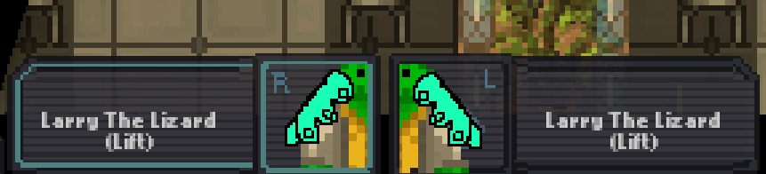

# Grapples & Grabs

| Designers | Implemented | GitHub Links |
|---|---|---|
| mith | :information_source: Open PR | TBD |

## Overview

The grabbing system from SS13 is really good sometimes and kinda bad other times; hopefully this is a synthesis of the good parts without the bad parts from a few codebases. As with any system in the game, a good grabbing system should be flexible, intuitive, and integrated with other mechanics - through what I feel are fairly straightforward mechanical rules, this system works to add mechanical depth to roleplay, rescue, infiltration and obviously combat gameplay. I hope you enjoy my brief outline.

## Background

Combat right now is pretty much entirely informed by equipment and, to a lesser extent, environment. Aside from the use of things like grenades or circumstantial tricks like spacing an area or slipping a tile, fights generally boil down to clicking on the space man until he's horizontal, especially in melee where things like cover are barely an element. Robust grappling, in such a way as to be integrated with gunplay, weapons and environmental opportunism is, in my opinion, the main solution to that.

Obviously combat is the main thing, but having alternatives to dragging that dont rely on rollerbeds will open up options for newmed mechanics that might discourage dragging injured people along the floor, will open options for deciding to drag someone out of a dangerous area NOW, or take a few seconds to fireman-lift them more stably for later, will give options for throwing people to safety across gaps, force a choice between carrying someone effectively with two hands, or slowly but keeping a hand free etc.

Finally, smaller tweaks like being able to pick up a mouse then pet the mouse in your hand, being able to dance with other spacemen in the bar and being able to lift and carry large objects over railings will all allow a little more meaningful interaction with the world around a character; the best kind of emotes and RP actions are ones where there's also a mechanical element.

Plus, some form of more advanced grabbing was inevitable; it's better to go in with a plan than have it emerge incidentally through disparate features that dont necessarily consider the big picture.

## Big Picture

The proposed system will be familiar to anyone who's played SS13. I'll use the term Grapples to refer to any level of ctrl-click player-pulling interaction, and within that there will be multiple types of Grapple. Below is a straightforward albeit ugly flowchart demonstrating how the Grapple types connect; below that, an explanation of each. It's a lot of words, but that's me being thorough more than anything else, if you asked someone 'what do you think doing X would do in this situation', it's likely they'd intuit correctly.

## Pull

The initial result of ctrl+click on any draggable mob or entity will behave similarly to how it does currently. The target will move with the puller unless they walk out of the range or the puller is knocked down and/or disabled somehow. Attack damage will have a 50% chance to break a Pull. Initiating a Pull will have a very brief doafter bar of 0.5 seconds, largely to prevent instant combos. Initiating a pull on an object will have a visible indicator everyone can see the same as attacking - possibly just a ghost-looking hand going from the pulled entity to the pulling entity - a similar indicator should occur for all grapple upgrades.

As is the case currently, ctrl+rightclick while pulling will move the entity to the position clicked.

Throwing using the hand an entity is being pulled with will perform a push; this behaves similarly to throwing an object and can knock mobs into walls, tables and chairs dealing no damage and a momentary (less than 0.5 seconds) stun or trip, over a short distance. Mobs pushed into doors will open it if they have access and will slip on slippy tiles/objects. Pushed entities will not pass over obstacles like railings or tables.

By clicking with a hand engaged in a pull, the pulled entity can be used on objects - in most cases this will just display flavour text 'X pushes Y up against the Z' or similar, but will have contextual utility like opening doors, planting DNA, counting as contact for viral transmission, possibly working on retinal scanners or similar if those are added later. Even in more aggressive Grapple types, this behaviour will remain the same unless combat mode is enabled.

In combat mode, clicking with a pull in-hand will act as a violent shove; attacking an object with a mob this way will act the same as if you attaked the mob with the object - the exception being objects too heavy to pick up normally, where the damage will be halved and no effects will apply (glass tables won't break etc). Mobs can be banged together this way, dealing damage to both.

If two mobs are both pulling each other, they will do a little ballroom style dance animation. Both are free to move, and will slowly move together to their mid-point within a small radius unless one moves out, in which case the Pull will break as normal. If either throws the other, they'll both spin away from eachother (0.5 second stun) and break the Pull completely.

Pulls will display with an inhand icon, visuals based on the pulled entity. For lizards or other tailed species, this may have to be represented with a third 'hand' element that only appears when pulling (resembling a tail wrapping round the UI box?²). Switching hand or performing other actions will not impact or release the Pull. If the Pull 'item' is dropped, or the right-hand pulling UI element halfway up the screen is clicked (which remains as it is now), the Pull will release. A disarm will break a Pull, if aimed at the pulling mob.

A pulled mob and a pulling mob will have a slight speed penalty; roughly 10%, to their movement (note, does not impact the speed at which the mob is moved by the pull). If a mob initiates a pull on a mob that's already being pulled, the initial Pull will not break fully; the inhand (or intail) icon will remain (greyed out or similar) as long as the mobs remain within range, and the icon can be used inhand to reassert the pull. The movement penalty remains in these circumstances and will stack per Pull - this way a group of people, or zombies, can hinder movement of a mob and overpower into a grapple with numbers. If one Pull is upgraded to a Grab, all active Pulls on the grabbed mob will be rendered 'passive'; if a Pull is upgraded to a Grab on a mob already being Grabbed, the mob will be snatched into the new Grab. A Pin or a Lift will remove all other grapples on a mob.

*Applications and justifications*

Pull is the root of the system so will be used for a lot of different things. The brief doafter bar is in consideration that grabbing then insta-throwing could be powerful if it can be bound to a single input or just used quickly. In combat, hopefully, Pull will function as a mix-up, allowing for environmental disables, disarms and repositionings, particularly when paired with a throw. Outside of combat, the dancing thing seems like a fun mini-feature, but otherwise not much has changed with pulls. Being able to stack pulls is a means for a numerical advantage to translate to nonlethally overpowering and hindering a single target - particularly relevant to zombies.

## Lift

With an entity pulled and occupying one hand, a ctrl+click with an empty off-hand will create a 5-second doafter bar and, if the target is a mob rather than an object, a CLEAR WARNING TEXT. When completed, this will Lift the entity with two hands, occupying both. This will visually set the mob horizontal and raise them to chest-height. A lifted mob is initially stunned for 2 seconds (though this length could easily be reduced for balance). Once the stun passes, the mob will be unable to move, but any movement inputs or disarms will count as a resist attempt; a lifted mob has a 1/4 chance of instantly escaping from the Grapple on a given attempt, with a 4-second cooldown shared by other actions such as inventory management, attacks etc. A mob in a lift can't Pull and any Grapples they were maintaining will be broken as they're lifted. A lifted mob isn't restricted in any other way and can speak, interact within its range etc. An entity can be put in a Lift while in a Grab, which functions identically to if it were from a Pull and a Lift can follow from a Pin or Choke, with the doafter timer reduced to only 2 seconds.

A mob maintaining a Lift moves at normal speed (or possibly slightly reduced speed²), but has both hands occupied, essentially 'wielding' whatever they are carrying. Aside from the lack of hands, the lifter isn't restricted in any other way. Lizards are able to initiate a Pull with their tail while lifting an entity. The lifted entity can be placed down as normal; mobs can be placed on tables without having to climb etc. As with a Pull, in-hand entities can be used on other objects and, if combat mode is enabled, this will deal additional damage to both. This damage is more (I'd think 1.5x damage²) than if the object were used to attack the mob directly, and will break breakable objects etc. A lifted entity can be thrown and it will travel roughly as far as a normal thrown object. Visually, the throwing entity does a spin, as if following a hammer toss, and the thrown entity tumbles. The throw will do significant damage and (with a mob) stun if it hits a wall or impassable furniture-type object, but the stun is significantly less at short distances, and it will do no damage if it only hits the floor. A Lift-thrown entity will knock down mobs it passes through, dealing mild damage - if enough are hit at once the game plays a skittles-falling-down sound effect. Entities thrown from a Lift will pass over obstructing objects like tables, rails, etc.

On the user interface, a Lift will display an icon in each hand, both visually derived from the sprite of the object. Dropping a Lift in either hand will transfer the Grapple into a Grab using the other hand; this way a user can go via a Lift to switch hands in a Grab. As with a Pull, Lift will have a unique centre-right UI icon which, when clicked, drops the entity entirely. Taking attack damage comes with a 50% chance to drop a carried entity, and a third-party disarm will always end the Grapple. When an entity if lifted, they lose any existing Grapples, and are unable to Grapple until they escape.

*Applications and justifications*

In combat the Lift has a few applications. When using a mob it can serve as either a risky showboat move to deal more damage with a strong chance (as compared to a Grab, for example) that the person will escape and you will lose your Grapple advantage entirely, or is a single-use ability with a significant setup time to damage and stun a number of mobs by hurling one spaceman at other spacemen (or, say, an emagged grinder). The two-second initial stun is intended to prevent situations where someone manages to Lift a mob who escapes instantly - at least guaranteeing the chance to insta-throw after an investment of 5.5 seconds of prep. With a non-mob object, this is the way large heavy objects can be utilized in a fight, which will hit harder, but come with the downsides of time taken to lift and being droppable upon taking damage.

Outside of combat, this is the most efficient way to move heavy mobs or furniture-type objects over longer distances. In some cases it can be a time-efficient way to move large objects over a table or rail by lifting then throwing, assuming the object taking some damage isn't an issue. This would also be the best way to retrieve injured or immobile mobs from a dangerous environment - doubly so as a lizard who can Pull a second; throwing mobs to safety if required.

## Grab

If a pulled mob is ctrl+clicked again using the same hand, or the inhand UI element representing the Pull is inhand used, a 2 second doafter bar with a CLEAR WARNING (again, if mob) will appear, after which the Pull upgrades into a Grab. This doafter bar has a 75% chance to be interrupted by incoming attack damage, and fails if the target moves outside the Pull radius or otherwises causes the Pull to break. While maintaining a Grab, an entity has its movement speed halved (or reduced relative to the size/speed of the grabbed entity²), and the Grab fully occupies one hand, even in cases where a Pull might not (lizards etc). A grabbed entity is upright and unable to move, and will be positioned directly in front of their detainer; if the grabber changes facing, the grabbed will be moved to always be in front. 

While being grabbed, movement inputs and disarms will be interpreted as an attempt to resist; this occurs instantly and has a 1/8 chance of instantly breaking the Grab, a 1/4 chance of moving both mobs a short distance in the given direction, and a 5/8 chance of failing. Resist attempts have an 8-second cooldown. This cooldown is also shared with any other actions taken by a grabbed mob, such as interacting with inventory or attacking. A grabbed mob has a 50% chance to fail on any attack attempt on their grabber, with failed ranged attacks firing in a random direction. A grabbed mob can speak, change their facing direction and use abilities freely. As a grabbed mob is upright and in the direction the grabbing mob faces, they will function as cover for projectiles.

While maintaining a Grab, a mob is able to move freely, albeit slowed, and can interact with their offhand with no limitations. Attacks directed from grabber to grabbed will automatically target the bodypart that would deal the most damage¹. Stripping items from a grabbed mob takes half the time it would otherwise take. A grabbed entity can be thrown; this is a shove and throws a mob slightly less distance than an object throw. A shove will deal a mild stun/trip (1.5 seconds) and decent damage if it leads to collision with a solid object; walls, doors etc will stun, tables chairs etc will trip. A mob shoved this way onto a table will be on top of the table and glass tables will break and deal further slashing damage. As with prior Grapples, entities can be used on other objects and outside of combat mode this functions as with Pulls. In combat mode this interaction deals higher damage than with a Pull, and has a chance at a brief (less than 0.5 second) stun. This interaction will break tables and deal full furniture damage. Using a grabbed mob on a toilet, sink or liquid-containing bucket will perform a swirlie, causing suffocation and applying the fluid. There are any number of possible contextually-sensitive applications of this that would be easy enough to add. Non-mob entities can be used as improvised heavy weapons this way, and will break (or have a chance of breaking²) on swing, if appropriate.

If two mobs are grabbing each other, neither can freely move. The mobs will be facing one another in immediate proximity, and will visually jostle. Both mobs have 4-second action cooldowns as with a grabbed mob. Any given movement inputs have a 1/2 chance of lurching both mobs a few tiles in that direction, and a 1/8 chance of breaking the Grapple entirely. All attacks in this state have a 50% chance of missing, but have a higher chance of targeting critical organs when they do hit¹'². Slamming the other party into nearby mobs/objects will be subject to the same fail chance and cooldown, but otherwise work as normal. In a mutual Grab, if either party throws the other, both will be knocked back and slipped for a few seconds. If one mob maintains a Grab while the other only has a Pull, this behaves as a normal Grab, but the target has a lower 6 second cooldown and 1.5 times the success chance on resists and attacks, as well as the opportunity to upgrade the Pull into a mutual Grab. The pulling mob can choose to perform a throw, sacrificing their Pull, for a single resist attempt that isn't restricted by the cooldown timer.

Grabs will be visually represented on the UI inhand as with a Pull, but with embellishments highlighting the inhand 'object'. On examine, the mobs will show 'they are being grabbed by X' or vice versa, so its clear². The centre-right UI will have a different icon to Pull, which can similarly be clicked to instantly release the Grapple, as would dropping the inhand 'object'. While grabbing, a mob is able to Pull a seperate entity with their other hand, but will be unable to upgrade this into a second Grab.

*Applications and justifications*

Grab is intended to serve as the basis of the more committed Grapple mechanics. Combat applications are straightforward; with an investment of 2.5 seconds of doafter bar time (assuming perfect inputs), it puts you in an advantagious position in a fight - the risks are also obvious, with reduced movement, protection only in one direction, and those bars being easy to interrupt through damage. It's a risk-reward mechanic that allows an opportunistic combatant to potentially put themselves in a commanding position while risking wasting time vs simply attacking. The synergies with other forms of combat are present with the critical targeting a target you've grabbed, allowing them to function as a human shield, being able to damage them with environmental objects etc, while also giving a strong footing to upgrade the grapple further. This is also one means by which a person can wield furniture-type objects, significantly increasing options for improvised weapons and giving high damage choices at the cost of movement speed, prep time and disarmability.

Outside of combat, this would be a more reliable way to move heavy objects, especially over tables, railings etc or to prevent clowns opening dangerous crates in the hallways. In some cases, this may be useful for medical or security to secure a willing participant for a Lift, if environmental factors are breaking the Pull.

## Scoop

If a mob is ctrl+clicked, and is significantly smaller than the mob doing the clicking, they are scooped up and become an inhand object. This would function similarly to how it functions now, with a few minor changes. Firstly, the in-hand mob will be subject to a similar action and resist cooldown, with a 4 second cooldown and a 1/4 chance of instant success on a resist. Attack damage from a held mob has a 1/8 chance of instantly dropping the mob, reduced to 1/12 with gloves.

With a mob inhand, activating will interact as if clicking the mob normally; usually petting the animal. In combat mode, the interaction will be hostile and will deal gradual damage over 6 or so seconds, then a large lump of damage that will almost always kill the mob. Held mobs can be used to interact with other objects; you can feed them, inject them or use them as improvised weapons dealing damage to both. When thrown, a small mob will be briefly stunned if it hits a wall.

Clicking a small mob will pet/attack the mob, rather than picking them up, scooping requires a ctrl+click².

*Applications and justifications*

Changing the resist mechanics, in a combat situation, forces both parties to make decisions. Grabbing a mouse doesn't guarantee you'll be able to kill it - you can choose to throw it into an environmental hazard or disposal bin, begin the action of necking it in-hand, or use combat mode to slam it into something, but there's always a chance it will escape before you can deal lethal damage. This means fighting it 'in the field' is also an option and, naturally, there is synergy between, as you can throw a mouse at a wall, then beat it with an object. Combatwise (if killing a mouse counts as combat) it forces decisions from both parties, as the mouse can also decide between attacking or resisting.

Outside of combat, this allows for more interactions; mice can be petted, can be picked up and petted, can be fed from your hand or whatever.

## Pin

From a Grab, a mob can be further restrained by reinforcing (ctrl+click or inhand use) into a Pin. This action takes 6 seconds with a 50% chance of being interrupted by attack damage. Pinning a mob renders both parties immobile; if the pinning mob moves, the Pin will instantly return to a Grab, while any of the pinned mob's movements will make a resist attempt - returning to a pin from a Grab started this way only takes 3 seconds. Resisting a Pin gives a 1/10 chance of reducing the Grapple back to a Grab. After 20 seconds, a resist check also has a 1/20 chance of escaping the Grapple entirely (and slipping the pinner)². This all shares a 20 second cooldown with other actions. A pinning mob can freely interact with their other hand and isn't restricted in any way other than mobility.

A pinned mob becomes prone, thus will no longer act as a human shield to incoming projectiles, and drops any in-hand items. Said mob, with their face planted in the ground, isn't able to use their headset and all speech comes out as a whisper. Any interactions other than speech and emoting are limited by the same cooldown as resisting and a pinned mob isn't able to attempt attacks or Grapples - they could, potentially, trigger a device, if they were able to retrieve and activate it despite the action cooldowns. 

Throwing a pinned mob slides them along the floor; the distance is comparable to a Lift throw and will slip any humanoids it passes under - if they hit a solid object, they will be stunned for 5 seconds and take mild damage, with the same distance stun falloff applying as with the Lift throw. In combat mode, a pinned mob can be slammed against the floor or VERY nearby objects if the pinner clicks them, doing significant head damage to the pinned and mild damage to whatever object it is.

Applying a Pin from a mutual Grab will 'win' the grapple; the now-pinned mob loses their Grab entirely.

As with other grabs, a Pin can be instantly dropped from the right-hand UI icon, and can be released by simply dropping the inhand object. A third-party disarm only has a 50% chance of breaking a pin, and attack damage has a 25% chance - in both cases a successful break has a 3/4 chance of reverting to a Grab and a 1/4 of releasing the Pin and stunning the pinner on the ground. Only mobs can be pinned, attempts to reinforce a Grab on a non-mob entity will do nothing (or something? maybe reduce it to a pull?²). 

*Applications and justifications*

The Pin is intended entirely for combat, and functions as a highly conditional win-state. With only two participants, it's very unlikely (but never impossible) someone will escape a Pin - this allows the pinner to cuff, rob, interrogate or search their victim with assurance of relative safety. On the flip side, the pinner being immobile and single-handed is highly vulnerable to any interference, and can easily be attacked by the pinned person's friends, the ability to instantly transition from a Pin to a Grab leaves the door open for downgrading the security of the hold in exchange for an opportunity to fight or escape, while the quicker re-Pin means the time investment isn't completely wasted until the Grapple is broken. The main applications for this will likely be maint-ambushes, prison breaks or sec officers being caught short, and gives a (hopefully) fair way to completely subdue a person without resorting to equipment or crit. It's also worth noting that a hypothetically perfect pin would require 8.5 seconds of establishing grapples - plenty of time for a target to shout on the radio before being cut off, unles they choose to prioritise fighting back.

## Choke

This is more of a sub-Grapple than its own section. A pin can be reinforced one final time while in combat mode over 5 seconds to turn it into a Choke. A choke behaves identically to a Pin but for three differences. Firstly, the choked target can't speak at all, barring their last words, which come out as a whisper. Secondly, a Choke prevents breathing, which will cause the target to (presumably) slowly suffer oxyloss damage. Finally, resists to a Choke have a 1/10 chance of returning it to a Pin and a 1/30 chance of breaking the Grapple and stunning the choker, with the same cooldown and restrictions as a Pin. Reinforcing a Choke will return to a Pin, and it can be released at any time by the UI icon or dropping as with other Grapples.

The UI inhand icon for a Choke will resemble the Pin, but slowly pulse red.

*Applications and justifications*

This is pretty obviously just murder tool, though I suppose you could put someone in crit with the guaranteed only-oxy damage to revive them later. It's unique in that it's silent, so if you manage to get someone in a Choke while alone, you're likely going to be able to get away with the murder. Worth noting there's always a chance of a maint-clown wandering in, there's suit sensors, and there's the 8.5 seconds of scream-time they had, so it's not wholly reliable. As with a pin, a Choke leaves a very small chance for a lucky break for the target, forcing both parties to improvise.

## Pre-Empting Concerns Maybe

I'm a big fan of iterative design and spitballing, so feedback is super good and I enjoy the process, there's a lot here and I'm not expecting it all to be liked by everyone. That being said, I want to pre-empt some things I think people are gonna ask with the justifications I have in mind for them:

**Why is there so much RNG? Combat's no fun if it boils down to dice rolls.**

My aim with the chance-based stuff was twofold, and I *strongly* feel like it's the right call on both counts:

Firstly, with a grapple system, and with a *lot* of the other systems in ss13, events come down entirely to inputs; which is to say if you can input the actions quickly, precisely and in the right order or, worse, use macros to do so, situations will virtually always resolve the same way. If the mechanics were based on doafter bar timers entirely, it would be completely possible to account for all outcomes and while it might sound lame to say, mechanics this powerful shouldn't be something that can be applied 100% of the time in the same way. An easy example is how in SS13, with the right timing, you were able to slip someone, table them, then cuff them without them having any means to change that outcome once they'd slipped shy of having pre-prepared adrenals - that's something I want to avoid and leads into my second reason.

Secondly, this is a fight, possibly to the death - the vibe *should* be a little chaotic, or at least not easily predictable. If you check the outcomes of resists, there's very rarely a situation where a single resist check rolling well is going to completely turn the tables, barring the very low chance to throw a pin, which only becomes possible after the pinner has 20 seconds to disarm/restrain/damage the pinned, setting up other advantages for the fight that would follow. I don't think, taken as a whole, the RNG elements are very swingy; I'm aiming for controlled chaos, where things will take longer than expected, or outcomes might have to be accounted for, to keep both parties on their toes and improvising and adjusting strategies rather than going through predictable motions, and to prevent the fight feeling like a foregone conclusion for the recipiant of the grapple.

**Pins are too strong/weak**

IDK maybe. I think they'll be pretty balanced, they're based on an old mechanic from hippiestation that, IMO, elevated combat a ton. It's the only viable alternative to stun weapon meta for sec to use that I can think of. If it sucks, theres a huge amount of numerical levers that can be adjusted to balance it.

**This is really long, it's too complicated, only a small group of people will know how to use grapples and they'll powergame**

There's a lot of words, because I wanted to explain every situation, every interaction, every edge case, but I genuinely believe this system is intuitive. If you paused gameplay and asked a given player what they think will happen if you click X at this moment, I'd wager more often than not they'd guess right. The mechanics are built around existing rules, like 'object in hand, combat mode, hit thing with object' or 'use object in hand, does obvious thing with it'. The only standout from that, I think, is the Lift, but I *feel* like once players figure out its just pulling with two hands, it'll click into place. Fundamentally, this system is simple, it's just flexible with a ton of niche interactions and details that 90% of the time will never come up and when they do, my hope is player will have intuited something might work, then be delighted to learn they can give the mime a swirlie.

**This is impossible to implement**

Yeah I defo can't implement this. I feel kinda gross writing a doc for something I'm not able to do. If there's genuine issues with implementing stuff I hope there's ways to work round it, if not oh well.

¹: Dependent on newmed features
²: I'm not 100% confident on this, and would like feedback to iterate
