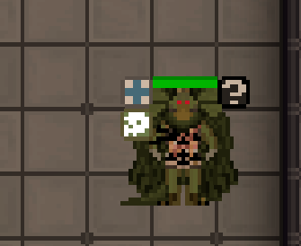

# Body

```admonish warning "Warning"
- BodySystem is still in its infancy, there are many behaviors which still do not exist.
- If you are a downstream that relies on surgery, many behaviors will break if you move to the new BodySystem without easy replacement as of current writing.
```

What is a spessman? A miserable little pile of Containers!

Body is the group of underlying simulation systems that drives mobs that are person- or animal-shaped in Space Station 14. A sentient vending machine does not have a Body. A dead mothroach does.

## Top-Level Overview

A mob in Space Station 14 is an entity that is either player or NPC controlled. A mothroach, a sentient vending machine, and a Nuclear Operative Commander are all mobs. The behaviors and abilities of that mob is determined by the components attached to the entity.

For example a mob is often damageable, meaning it can take damage and keep track of damage taken. Mobs also often have mob states which change what actions a mob can take depending on damage taken, and even more are destructible which allows the mob to be destroyed when enough of a certain damage type is taken. 

However, all of these components are attached to one entity, and there is the very real possibility that we would like a mob to have many behaviors which cannot be attached to that entity. 

BodySystem and its associated Components, which currently include BodyComponent and VisualBodyComponent, are meant to handle these extra entity allowing one entity to actually be made up of multiple entities with their own unique behaviors and systems.

This is primarily done through event relays, which take events raised on the body and relay them towards the organs contained within the body allowing those organs to handle events meant for the body and extending the body's capabilites. In addition, the insertion and removal of organs from the body will raise its own event which allows for multiple body components to work together.

## What does BodySystem do?

BodySystem is currently in its infancy after being rebuilt from the ground up. If you're used to the old system you'll find some behaviors still missing but there are some new capabilities as well. 

The primary strength of BodySystem is that it allows for finer control over organ based behavior. The core BodySystem is simple by design to make it highly extensible, every entity that makes up a body is considered to be an organ and is stored in the `body_organs` container for easy querying. All behaviors therefore rely on the logic of inserting, removing, and querying organs in this container.

There is, by design, very little logic for the BodyComponent itself, and the majority of systems are instead attached to organs within the body with some being attached to components that listen to or interface with the body. 

For example, the way a body is visualized is almost enitrely done through organs. Any body with a VisualBodyComponent will query the organs in a body any time a new organ is added/removed or a marking on an organ is changed to build up the sprite that makes up a body entity. 

### Body Visuals: VisualBodyComponent

```admonish note "Example"
- Below we can see a body constructed of multiple organs with multiple markings
- Each marking is attached to an organ rather than being attached to the body itself.
```


Any organ which contributes to the body's sprite will have a VisualOrganComponent which provides data for that organ's sprite and visuals. Organs can also store markings which are handled by the VisualOrganMarkingsComponent which are self contained as well, handling sprites, layers and when to hide the markings in response to inventory items being equipped. 

All behavior is handled by these organs with VisualBodyComponent only existing to send data to these organs if needed and to designate that a body is capable of receiving sprite changes from organs stored within the body. 

## What do Organs do?

Organs as stated above act as entities which handle events for the body. Because the body is simple by design organs are where the primary complexity of the system lies. 
There are many different components for organs and the list will expand as body system develops further but all follow the same logic. The body recieves an event, that event is relayed to the organs, a component on an organ recieves the event and handles it with one of its systems. 

For example, a body has the respirator component meaning they need to breathe. The body runs the `Inhale()` method which gets an air mixture from the surrounding environment. That mixture is then raised through event to the body which sends it to the organs, an organ from the body takes that gas and stores it in its own gas mixture then handles the event. Later, that gas mixture is metabolized by the lungs which increases the saturation of the body's respirator component, preventing the body from suffocating. 

The goal of the body is to have all systems work in this capacity, the body needs something done so it raises an event which can be handled by the organs, or in the case of an entity without a body handled by itself through a different component. 

## What's Missing?

Currently the biggest piece missing from BodySystem as of current writing is a proper relations system. Parts fit in the body and do behaviors but there's no component/system currently to define a structure and validate behaviors, nor is there an easy way to order certain organs being able to interface with eachother. Both of these will rely on an extensible entity relations system which has not been built yet. 
