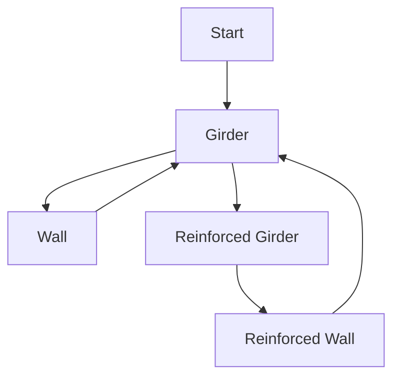

# Construction
- Powerful
- Data-Oriented
- Event-Driven
- Turing-Complete
- Approved by PJB[^1]
- Powered by Graph Theory and AI Pathfinding
- Coded by the same nerd who brought you atmos and botany :^)

## TODO Index

- Introduction to Construction Graphs
	- Explain the concept of graphs, nodes, edges and steps.
- Writing and Designing Construction Graphs
  - Explain how to actually write and design a good graph.
- List of Steps, Actions and Conditions.
- Writing Initial Constructions.
  - Explain limitations.
- How to Add Custom Steps
- Construction System Internals
  - General overview on how construction works internally.

## The construction graph

This construction system is built upon the belief that any complex construction in the game can be defined as a [graph](https://en.wikipedia.org/wiki/Graph_theory) of interconnected states, or **nodes**. The goal of this system is to ease the design and creation of new complex interactions (constructions) between entities, while drastically reducing the amount of code needed to be written to allow for them.

Graphs consist of **nodes** and the links, called **edges**, between them.

**The "Girder" construction graph**



---
### Nodes

Nodes represent the current state of an entity.
An entity that has a construction graph will always be at one of the nodes, and can move between them under certain circumstances, as defined by edges. 

#### Nodes and entity prototypes
Nodes can specify an entity prototype ID. An entity that arrives at a node that specifies a prototype different than the one it has will be deleted, and the specified entity prototype will be spawned at its place instead. When this happens, every container owned by the entity's `ConstructionComponent` will be transferred to the new entity. 

```admonish info
The specified entity prototype MUST have a `ConstructionComponent` with the correct graph and node.
```

#### Actions
You can specify actions that will be executed when an entity arrives at a node (whether it arrives by an edge, or is spawned while already at the node).
To create a new one, you must simply create a C# class that implements `IGraphAction`.
Actions can do anything, from spawning a different prototype to deleting the entity itself.

---
### Edges
Edges are the links or transitions between nodes. They specify the interactions required for an entity to change from a specific node to another one. 
#### Completed actions
You can specify actions that will be executed when an edge is completed, right before the entity reaches the new node. This uses the same classes as node actions, using `IGraphAction`. You can create new ones by implementing this interface in a new C# class.
#### Conditions
You can also specify conditions that must be satisfied for the edge to be available. These will all be checked before starting and during an edge. You can create custom actions by creating a new C# class that implements `IEdgeCondition`.
#### Steps
Steps are the interactions required for an entity to go from one node to another in an edge.
An edge can specify as many steps needed as required.
##### Tool step
This step requires you to use a tool with the right quality on the entity.
##### Material step
This step requires you to insert an arbitrary amount of a material to an entity.
    It works by *splitting* material stacks.
##### Component step
This step requires you to insert an entity with a specific component.
    Using this step isn't discouraged, but using tags instead is recommended in most cases.
##### Tag step
This step requires you to insert an entity with a specific tag.
##### Multiple Tags step
This step requires you to insert an entity with a number of tags as specified by `allTags` and `anyTags`. `allTags` acts as an `AND` gate, while `anyTags` acts as an `OR` gate. You will only be able to insert entities that fulfills both requirements. You can specify only one of the two, or specify both at once.
#### Containers
Any step that needs the user to introduce an item to the construction (material, prototype and component steps) can store the introduced item in a named container on the entity. When the entity changes due to reaching a node with a different entity prototype, all those containers *will be transferred to the new entity*. The construction system allows you to use this stored item for any purpose, such as retrieving data in a component of the stored item for different effects (See the computer construction graph) or simply to "keep" and later return the same exact item an user introduced. 

---
### The construction graph Prototype

Below you'll find an example construction graph, documented to teach how to write graphs.
For real-world examples, refer to the graph prototypes in the game's code.

```yaml
- type: constructionGraph

  # Identifier for the graph.
  id: ExampleGraph
  
  # Graphs must specify an starting node for pathfinding purposes.
  # All other nodes should be reachable from this one.
  start: start
  
  # And now we actually define the graph!
  graph:
  
    # You define nodes like this.
    - node: start
    
      # The entity prototype specified by this node.
      # This will turn the entity into it, if different.
      entity: MySpecialEntity
    
      # Nodes can have actions that are executed when the node is reached.
      # They are executed in the same order they're defined, from top to bottom.
      actions:
        # You specify actions without parameters like this.
        # The type is the name of the C# class that implements IGraphAction.
        - !type:ExampleActionWithNoParameters {}
        
        # Actions can specify any parameters, as they implement IExposeData.
        - !type:ExampleActionWithParameters
          foo: "bar"
          
        # Below, you'll find all valid actions as of the time of writing.
        
        # This action simply plays a sound from the entity, with pitch variation.
        - !type:PlaySound
          sound: /path/to/my/sound.ogg
          # When sound collection is specified, "sound" is ignored.
          soundCollection: mySoundCollection
          
          # This action displays a popup to the user.
        - !type:PopupUser
          # Whether the popup is shown on the cursor, or on the entity.
          cursor: false
          text: "Hello, person who made me reach this node!"
          
          # Sets the anchor value of the entity.
        - !type:SetAnchor
          value: true
          
          # Snaps the entity to the tile it's standing on.
        - !type:SnapToGrid
          offset: Center # or Edge. See the SnapGridOffset enum.
          
          # Spawns an entity prototype on the location of the entity.
        - !type:SpawnPrototype
          # The entity prototype ID. In this case, a single steel sheet.
          prototype: SteelSheet1
          # Number of times it will be spawned
          amount: 5
          
          # Changes the sprite of the entity.
        - !type:SpriteChange
          # Layer to change. Zero by default.
          layer: 0
          # RSI+State sprite specifier.
          specifier:
            sprite: "My/special/sprite.rsi"
            state: "sample_state"
          # Texture sprite specifier. Duplicated only for teaching purposes.
          specifier: "My/texture/somewhere.png"
          
          # Changes the RSI state of a layer.
        - !type:SpriteStateChange
          # Layer to change. Zero by default.
          layer: 0
          state: "my_state"
          
          # Sets the data of a visualizer to an int.
        - !type:VisualizerDataInt
          # The key (either a regular string or enum) of the data.
          key: "enum.MyVisualizerVisuals.MyVisuals"
          # The actual data to be set.
          data: 1
        
          # Special action that creates a computer from a computer board
          # in a specific container. You probably don't want to use this.
        - !type:BuildComputer
          # The container where the computer board is located. 
          container: "board"
          
          # Deletes the entity! Actions after this one aren't executed.
        - !type:DeleteEntity {}
      
      # And now we define the edges!
      edges:
        # This defines an edge. "otherNode" is the identifier of another node.
        - to: otherNode
          # This also takes actions like above.
          # They will be executed when the edge is completed.
          completed:
            - !type:ExampleActionWithNoParameters {}
            
          # Edges can also specify conditions.
          # All of these must be satisfied for the edge to be available.
          # They are defined in a similar way to the actions above.
          conditions:
            - !type:ExampleConditionWithNoParameters {}
            
            # Below you will find all conditions as of the time of writing.
          
              # Condition for when there has to be an entity with
              # a component on a tile, or no entities with
              # a certain component on the tile.
            - !type:ComponentInTile
              # The component name.
              component: "myComponent"
              # If true, any entity on the tile must have the component.
              # If false, no entity on the tile must have the component.
              hasEntity: true
              
              # Condition for when a container on the entity must be empty.
            - !type:ContainerEmpty
              container: "board"
              
              # Condition for when an entity needs to be anchored or unanchored.
            - !type:EntityAnchored
              # anchored state required for the condition to be satisfied
              anchored: false
              
              # Condition for when the entity's wire panel must be open/closed.
            - !type:WirePanel
              # State of the wire panel for the condition to be satisfied.
              open: true
    
      # And now we define the actual steps of this edge.
      steps:
      
      
        # Material step. Requires you to insert a material.
      - material: Glass # Any from StackType.
        amount: 2
        # If store is specified, it will store the material in a container.
        # If store is not specified, it will simply delete it.
        store: myContainer
        # All steps can have a do_after delay, in seconds.
        doAfter: 2
        # All steps can also have completed actions, just like edges.
        # They're specified in the same way as with node actions.
        # They will be executed when the step is completed (after the doAfter)
        completed:
        - !type:ExampleActionWithNoParameters {}
        
        
        # Tool step. Requires you to use a tool on the entity.
      - tool: Screwing # As specified in the ToolQuality enum.
        doAfter: 0.25
        
        
        # Component step.
      - component: ComputerBoard # This accepts any entities with that component.
        # The container where the item will be stored at.
        # It will be deleted if this is not specified.
        store: board
        # This name will be used in the construction guide.
        name: Computer Board
        # This icon will be used in the construction guide.
        # It uses SpriteSpecifier.
        icon: /Textures/My/Path/To/A/Texture.png
        
        
        # Prototype step. Requires you to insert an entity that comes from a
        # specific prototype. Won't accept anything else.
      - prototype: MyVerySpecificPrototype
        # The container where the item will be stored at.
        # It will be deleted if this is not specified.
        store: aCertainContainer
        # This name will be used in the construction guide.
        name: A Certain Item
        # This icon will be used in the construction guide.
        # It uses SpriteSpecifier.
        icon:
          sprite: My/Path/To/A/Sprite.rsi
          state: MyState
      
      
        # Tag step. Requires you to insert an entity that has a specific tag.
        # Won't accept anything else.
      - tag: MyVerySpecificTag
        # The container where the item will be stored at.
        # It will be deleted if this is not specified.
        store: anotherCertainContainer
        # This name will be used in the construction guide.
        name: Another Certain Item
        # This icon will be used in the construction guide.
        # It uses SpriteSpecifier.
        icon: /Textures/I/Cant/Thing/Of/Anything.png
        
        
        # Multiple tag step. Allows you to require a certain configuration of tags.
        
        # I will now write multiple valid multiple tag step configurations
        # Keep in mind that multiple tag steps can also specify 
        # "store", "name", "icon" and "doAfter" as well! I will omit them here 
        # for extra clarity...
        
        # This will require the entity to have all of the tags below.
      - allTags:
          - MyTagOne
          - MyTagTwo
          
        # This will require the entity to have any of the tags below.
      - anyTags:
          - MyTagOne
          - MyTagTwo
          
        # This will require the entity to have MyTagOne and either
        # MyTagTwo or MyTagThree.
      - allTags:
          - MyTagOne
        anyTags:
          - MyTagTwo
          - MyTagThree
          
        # This will require the entity to have MyTagOne and MyTagFour
        # and either MyTagTwo or MyTagThree.
        # As you can see, you can put these in any order!
      - anyTags:
          - MyTagTwo
          - MyTagThree
        allTags:
          - MyTagOne
          - MyTagFour
    
    # We can keep defining as many nodes as we want... The sky is the limit!
    - node: otherNode
    - node: anotherNode    
```

**TODO**: List and explain all graph actions/conditions in a list somewhere.

## The construction recipe prototype

To specify construction/crafting recipes in the construction menu, you need to write construction prototypes.

```yaml
# Girder
- type: construction

  # User-friendly name.
  name: girder
  
  # Recipe identifier.
  id: girder
  
  # Construction graph identifier.
  graph: girder
  
  # The node we start the recipe from. (State of the construction ghost)
  startNode: start
  
  # The node we're trying to arrive. Can be any node in the graph, as long as
  # there's a path to it from the starting node.
  targetNode: girder
  
  # User-friendly category of the recipe.
  category: Structures
  
  # User-friendly description shown on the menu.
  description: A large structural assembly made out of metal.
  
  # Sprite specifier for the recipe. Shown on the menu.
  icon:
    sprite: /Textures/Constructible/Structures/Walls/solid.rsi
    state: wall_girder

  # Whether this is an Structure or an Item.
  # In the case of an structure, a construction ghost will be placed.
  # The user then needs to interact with it to start building it.
  # In the case of an item, the user attempts to craft the item directly from
  # the items in their hands, inventory and surroundings.
  objectType: Structure
  
  # Placement mode.
  placementMode: SnapgridCenter
  
  # Same as edge conditions, but these will be checked before constructing.
  conditions:
    - !type:ExampleConstrutionConditionWithNoParameters {}
    
    # Below you'll find all current construction conditions as of writing this.
    
    # Checks if there's a low wall in the tile. Useful for windows.
    - !type:LowWallInTile {}
    
    # Checks if there are no windows in the tile. Useful for low walls.
    - !type:NoWindowsInTile {}
```

#### Initial construction
What happens when you attempt to craft an item, or start building a construction ghost?
The construction system will try to find a path from the starting node to the target node.
This first step in construction is very special. It has some limitations that regular edges don't have.
For example, tool steps aren't allowed, and edge conditions are not checked. For this reason, you should design your starting node so it has clear, simple edges without these disallowed features. Completed step and edge actions are, however, allowed. They will all execute at once when the construction succeeds.

**TODO**: Move this to construction menu explanation.

#### Construction conditions
Construction conditions must be C# classes in the Shared content project.
They implement `IConstructionCondition`.

**TODO**: List all current construction conditions.

## Construction menu

**TODO**: Move construction prototype explanation here.

**TODO**: Explain the "start" node and use glass sheet graph example.

### Construction ghosts

**TODO**: Explain initial construction properly.

### Crafting

**TODO**: Explain how item crafting graphs work.

[^1]: PJB is really stinky.