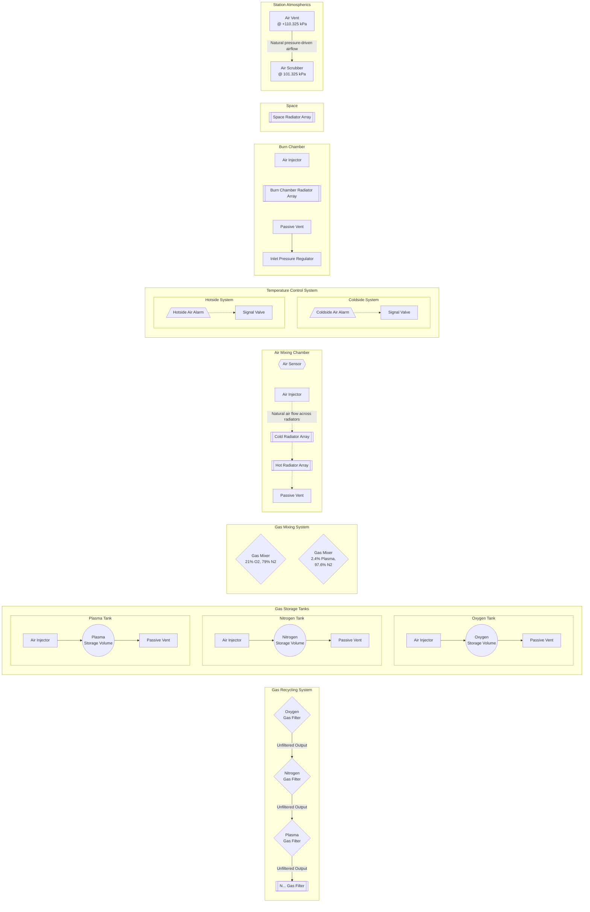

# Atmospherics
Keeping a soon-to-be-colander of a station filled with soon-to-be-unbreathable air.

## Concept
Atmospherics is the department responsible for maintaining the station's air supply, keeping it livable and breathable for all crew members.
There are a lot of interesting real-life challenges that come with keeping comfortably warm air inside a tin can surrounded by the cold vacuum of space.
The Atmospherics simulation aims to simulate these challenges and the quasi-realistic mechanics that surround them in a fun and engaging way, promoting gameplay that is both cooperative and emergent.

## Design Pillars

### Emergence (Parts of a Whole)
Atmospherics and its mechanics, tooling, and devices should perform small unit operations, or single tasks, with multiple devices coming together to form a larger system. Just like how all logic gates (and computers in general) are built off of the universal logic gates `NAND` and `NOR`, atmospheric systems are built via the combination of smaller devices.

This allows for a wide variety of solutions to problems and encourages players to think creatively about how to solve them.
There should rarely be a single "correct" solution to a problem, instead players should be able to come up with their own solutions based on the tools available to them.

This heavily promotes emergent gameplay, where players can create complex systems that work together to achieve a goal, such as keeping the station's air supply livable or creating a system that can recycle air efficiently.

This is incredibly fun to play with, as players can create their own solutions to problems and experiment with different combinations of devices to see what works best.
Players can also share their solutions with others, creating a community of players who can learn from each other and build on each other's ideas.

For example, a complex air recirculation system may consist of simple radiators, scrubbers, air vents, passive vents, sensors, and air alarms, all working together to create a system that can heat/cool the air in an entire station.

### [Intuitive and Inter-Connected Simulation](../core-design.md) (Quasi-Realistic Simulation)
All Atmospherics mechanics should be intuitive and easy to understand, with a focus on creating a quasi-realistic simulation of real-world atmospheric systems. Devices and mechanics should do what you expect them to do at face-value, coming from real-life experiences. The player should not need to care, or even be aware, about the underlying mechanics, code, or abstractions that Atmospherics performs or runs on. As such, devices should follow the basic principles of physics and chemistry, where:

1. Energy and matter should be neither created nor destroyed.
2. Gas flows from high pressure to low pressure unless forced by a pump.
3. Temperature transfers from hot to cold. Going in the opposite direction requires energy input.

Intuitiveness shouldn't compromise the simulation's complexity or depth, and realism should not come at the cost of fun — it's ok to make some concessions to make the simulation more enjoyable and engaging for players.

#### Mechanical Leading & Learning
Atmospherics mechanics should not require players to wiki dive or heavily rely on hearsay from other players to understand how they work.
Instead, mechanics should be designed in a way that players can learn them through gameplay and experimentation, with the game providing enough feedback to help players understand how the mechanics work.

Current-generation Xenoarch (Emoarch) does an incredibly good job at this. The player may be given a list of artifact triggers; however, real critical thinking, emergent gameplay, and chaos come from trying to make all of those triggers happen at the same time.

### Large-Scope Effects
Atmospheric events and mechanics should affect departments, areas, and the station as a whole, rather than just Atmospherics' own department.
Mechanics should not encourage players staying in their department, minimally interacting with other people in the round.

In these events, interdepartmental interaction can take place, either frictional or cooperative, as players from different departments work together to solve a problem.

For example, the creation of new gasses should not just affect the Atmospherics department. Instead, it should be able to also affect departments like Science or Cargo, as they may be able to use the new gases for their own purposes (new technology, selling, etc.).

## Objectives
Atmospherics is largely a reactionary department, meaning that it reacts to the state of the station and its air and responds to any upsets or deviations from the norm. Atmospherics can also be proactive, fulfilling requests from other departments or crew members to create new systems or products that can help the station or its crew.

It's **extremely important** that repair work is not seen as a distraction from proactive gameplay, otherwise players may choose to ignore repair work and focus on proactive gameplay instead. Repair work should be fun, engaging, and rewarding, with players feeling like they are making a difference when they fix something.

## Progression
### Roundstart
Atmospheric technicians start with their basic tools and are tasked with starting up and checking the various systems that maintain the station's air supply.
Since these tasks are both the first actions that need to be taken, and the most important, they should be easy to understand and perform, with players being able to quickly get a grasp of how the department works.
Someone who just got transferred to Atmospherics, with limited experience in the department, should be able to perform these tasks without much trouble.

To assist in this, atmospherics systems like distronet, wastenet, and recyclernet should be pre-mapped and ready to use.
These systems can also be left in a half-completed state, with players needing to fill in the gaps and complete the systems themselves.
Leaving these systems partially completed offers some benefits:
- For new players, it introduces systems like the construction system.
- For more experienced players, it allows them to experiment with the systems and create their own solutions to problems, without having to tear down existing systems.

### Mid-Round
As the round progresses, Atmospherics will be faced with various challenges and problems that need to be solved.
Various mechanics from other departments can cause atmospheric upsets, such as fires, explosions, temperature deviations, or other events that can affect the station's air supply.

When not performing repairs, the proactive gameplay of Atmospherics can emerge, focusing on creating new systems or products that can help the station or its crew.
Atmospherics can make new gases or materials that can be used by other departments, such as Science or Cargo, or create new systems that can help the station or its crew in some way.
Engineering often gets requests from Medical to revamp the medical department's layout—Atmospherics can do the same for other departments, such as Science requesting a chilled area.

### Late-Round
As the round progresses, Atmospherics may be faced with more widescale challenges and problems. Maybe a spacing has knocked out a large portion of the station, or a large tritium fire has heated the station to dangerous levels.

This is around the time when Atmospherics can no longer sustain the incoming damage and evacuation has to be called.
It's important that this feeling of "being underwater" does not come too early in the round, as it can lead to players feeling like they are not making a difference and that their efforts are futile.

## Mechanics

### Simulation
Of course, the most important mechanic of Atmospherics is the Atmospherics simulation itself.
This simulation is responsible for simulating the various gases and their interactions with each other, as well as any barotrauma, temperature, or pressure effects that may occur.

Note that Atmospherics is not really supposed to be a realistic ideal-gas simulation as its primary focus: it is supposed to be a **theatrical performance**, where the effects of it inflict horror and a feeling of real danger onto players, and give players interesting challenges to solve that make sense (when relating them to the real world).
Realism is not the primary goal, but rather a means to an end, a way to create a fun and engaging experience for players.

### Devices (Partially Implemented)
Devices are the various tools and machines that Atmospherics uses to interact with the Atmospherics simulation.
It gives agency to players, allowing them to manipulate gases via various means, such as filtering, mixing, heating, cooling, and more.

Devices should respect some outlined expectations, and Atmospherics currently needs more of them to effectively control gas.

### Flow-based Processes (Not Implemented Yet)
Most devices should be flow-based, where pumps apply pressure, forcing gas through a device, which performs some operation on the gas.
This atomizes multiple device operations (pumping and filtering) out into singular operations, allowing for more control over setups.

### Reaction-based Processes (Not Implemented Yet)
Atmospherics should have multiple ways of performing a goal or operation, with each having upsides and downsides.
For example, atmospherics can heat up air via a heater thermomachine or a burn chamber.
In a similar vein, operations like filtering operations can have chemical-based processes, where a resource is expended in order to filter out a certain gas.
Fractional air distillation is also an interesting option to look at (after all, you have the coldness of space on the other side of the wall).

### Flow-based Station Air Recirculation (Not Implemented Yet)
Currently, air in a room is simply regulated for contaminants and replaced if voided.
This is undesirable, as air in a room can heat up or cool down, which cannot be controlled via current atmospherics systems.
Additionally, Atmospherics lacks an in-depth life support system to look after.

By forcing air to recirculate throughout the station and moving it through a heat exchanger, we can control the temperature of the station's air.
This gives Atmospherics a good system to look after, and gives them more control over the station.