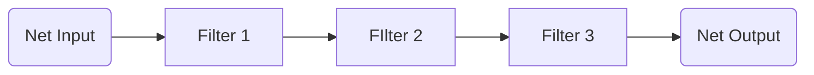

# Atmospherics Design Choices

This page documents certain decisions and thought processes made in Atmospherics, which were usually in response to observed bad gameplay or poor effects on a round.
When designing mechanics for Atmospherics, you should see if anything here matches up or goes against with what you're proposing.

Most of what is said here is derived from an Atmospherics Core Design Pillar.
You should read the [Atmospherics design document](../atmos.md) before continuing.

### Realism-focused Gameplay
When designing for Atmospherics, mechanics should not replicate realism 1:1 as the main reasoning for that mechanics existence.
Mechanics in general should be designed around some form of quasi-realism, where mechanics "make sense" rather than perfectly replicating real-life behavior.
Realism can be used to achieve the behavior that you want, but care should be taken in using it as the sole justification for a change - it should benefit Atmospherics and its gameplay positively, or discourage bad behavior.
Gameplay should be fun at the end of the day, after all.

Note that the intended audience for Atmospherics is used to common media tropes portraying things a certain way.
You should read up on the [coconut effect](https://tvtropes.org/pmwiki/pmwiki.php/Main/TheCoconutEffect) for more info. Also see the ["reality is unrealistic"](https://tvtropes.org/pmwiki/pmwiki.php/Main/RealityIsUnrealistic) trope.

#### "Space is cold"
Physicists in the room know that space is actually an excellent insulator due to there being [no matter in space](https://en.wikipedia.org/wiki/Outer_space#Environment).
This rules out two major forms of [heat transfer](https://en.wikipedia.org/wiki/Heat_transfer): [conduction](https://en.wikipedia.org/wiki/Thermal_conduction) (heat transferring between particles in contact) and [convection](https://en.wikipedia.org/wiki/Convection_(heat_transfer)) (heat transferring through fluid movement).

As such, usually the only form of heat transfer available in a renewable way is [radiation](https://en.wikipedia.org/wiki/Thermal_radiation).

You have likely experienced this phenomenon yourself if you have ever used a thermos or a [vacuum flask](https://en.wikipedia.org/wiki/Vacuum_flask).
Vacuum flasks reduce the opportunity for conduction and convection by placing a vacuum between the inner and outer layers of the flask.
The result is the temperature of the flask's contents not equalizing with the environment as fast as if it was in a regular container.

In media, these common images are portrayed as a result:
- Humans/humanoids freezing due to space being "cold".
  - In reality, humans cool down in space due to a lot of the liquids inside of them [boiling and evaporating](https://en.wikipedia.org/wiki/Outer_space#Vacuum) due to the reduced pressure in space. However, this occurs over a long period of time. In reality, barotrauma is the effect that kills you.
- Spacecraft being cold/frozen after being depowered for a long time.
  - In reality, spacecraft usually have to utilize some sort of [thermal control system](https://en.wikipedia.org/wiki/Spacecraft_thermal_control) to maintain a safe environment for whatever the mission needs.
    - The radiator panels on the International Space Station have the [very important job](https://www.nasa.gov/wp-content/uploads/2021/02/473486main_iss_atcs_overview.pdf) of radiating heat that gets rejected from the crew living quarters and any other waste heat that is generated from equipment. Otherwise, the craft may get too cold or too hot.
    - Ascension crafts have to deal with the heat that is generated from any sort of hot-gas engine providing impulse. This heat may make its way though the craft's structure and into the crew cabin or any other critical area if not designed properly.
    - The James Webb Space Telescope employs a [highly complex passive and active thermal control system](https://en.wikipedia.org/wiki/James_Webb_Space_Telescope#Sunshield_protection) in order to keep its infrared sensor below 50 K. Infrared radiation from the sun would completely drown out the instrument otherwise.

SS14 models these unrealistic mechanics to an extent, as it makes the simulation more theatrical and engaging.
Mechanics often provide obstacles or problems for the crew to work around or solve.
- When undergoing a [free expansion](https://en.wikipedia.org/wiki/Joule_expansion#), gases under the ideal gas law [do not change temperature](https://en.wikipedia.org/wiki/Joule_expansion#Ideal_gases) (this changes when discussing [real gases](https://en.wikipedia.org/wiki/Joule_expansion#Real_gases), however Atmospherics models ideal gases).
  - Atmospherics goes against this and cools gases that are being spaced in order to make the room feel cold. This presents the crew with a cold spaced space station, which is good for theatrics and aligns with the player's expectations. Players are encouraged to find some insulation to keep themselves warm or don some form of space protection.
- Astronauts in a spacesuit usually have the problem of keeping themselves cool out in space. Since space and the suit itself is an excellent insulator, physical activity and infrared radiation from the sun will cook you alive very quickly. As such, spacesuits usually need some sort of active thermal control system in order to prevent overheating.
  - Atmospherics goes against this and instead cools players who walk over scaffolding or are otherwise exposed to space. If you want to survive, you'll need proper insulation for the trip. This is good for keeping the crew and their gameplay station-focused, gating space access behind considerable effort and presenting problems or challenges for people to solve when attempting an unprotected spacewalk. Emergent behavior like chemicals that increase body heat to safe levels, or cryochemicals that repair spacing damage are interesting solutions to the insulation problem.

Atmospherics having "cold" on the other side of the wall is generally a good thing, as sometimes cool things involve cold things.
Mechanics can be designed with needing "cold" in mind, with atmospherics taking advantage of "readily available cold" for whatever's needed for it.

### Black Boxes and Obfuscated Mechanics
Care should be taken in designing mechanics so that they do not effectively turn your system into a [black box](https://en.wikipedia.org/wiki/Black_box).
Mechanics should also not be heavily [obfuscated](https://en.wikipedia.org/wiki/Obfuscation) (whether intentional or by accident) to the point where it requires heavy consultation of a guide or other external resource.

Obfuscation and black boxes are bad to an extent unless the scope of the black box/obfuscation is very limited, or it is designed very well.

Players will usually perform the following instead:
- They sit idle in-game consulting the guidebook (which is still bad), an online resource, guide, or whatever until they learn how the mechanic works or whatever meta-setup is needed to "win" at your mechanic. They may seek consultation from a player, which is good from a player interaction standpoint, but this usually leads to them following a "best stratagey" that completely bypasses any mystique or investigation aspect that you designed your mechanic around.
- They don't interact with your mechanic, especially if your mechanic is something that can cause station-wide destruction. This is especially unfortunate if your mechanic is vital for round progression.
- They go through the trouble of learning your mechanic in a sandbox environment instead of learning the mechanic with other players.
- They look at the code since upstream SS14 is open source.

#### Gas Reactions
Current implementation gas reaction/mixing gameplay is very poor, mostly in part due to its black box behavior.

Their requirements, conditions, ratios, and other parameters aren't available to the player.
This information is usually communicated through guides or hearsay, whether it be in-game or in online spaces.
While this may seem like a fun engineering challenge, setting up gas mixing for more complicated gases is difficult for a new player to perform in a standard SS14 round.
There are also problems around knowing that gas reactions exist in general.

Most players either consult a guide, listen to player hearsay, spend hours experimenting with setups in a dev environment, or resort to looking at the code in order to determine how the reaction works.
Due to the time and difficulty involved in tuning setups to perfection, players often get really mad when someone changes anything that could potentially affect their perfect setup.

Instead, players should be made aware that these gas reactions exist and various parameters of a reaction (ex. reaction rate, concentration required, etc.)
This makes setting up a reaction and tuning it easier, which is excellent when paired with unit-based devices enabling a wide variety of solutions to problems.

### Implementation Details and Gameplay
Atmospherics and its technical design should not create a situation where players rely on or need to be aware of an internal implementation detail.
An implementation detail in this context is a programming decision or internal behavior that should be hidden from the player.

Learning and taking advantage of implementation details often requires knowledge of how Atmospherics simulates the environment on a technical level.
This is very hard for any new player to learn and should not be the intended way for mechanics to be communicated/learned in Atmospherics.

Taking advantage of these implementation details often lead to unintended gameplay that is hard to balance when considering all players, ex. players producing tons of gases or bypassing certain mechanical restrictions.
For this reason, circumstances where players can take advantage of an implementation detail should be removed.

In the case where players were heavily reliant on the implementation detail to meaningfully progress or have fun in Atmospherics' gameloop, the behavior should be substituted with mechanics that make sense to the player and respect their expectations.

#### Device Ordering
Atmospherics does not process devices all at the same time, rather devices are queued for update and processed one at a time.
This can lead to the following circumstance:

Imagine a line of filters, like in a station recyclernet, all connected in series:

In this instance the filters are updated in order from F1 → F2 → F3.
Now let's introduce \\( n \\) mols of gas in the inlet and process an atmostick.
The following would occur:
- Atmospherics would process the first filter first. This first filter will take the gas and deposit it in the inlet of the second filter.
- Atmospherics then processes the second device, which is the second filter. The second filter then moves the gas to the third filter.
- Atmospherics processes the third filter which moves the gas to the outlet.

In this instance, we've just processed \\( n \\) mols of gas through three filters, all in one atmostick.

Now imagine that the filters are updated "out of order" where F1 → F3 → F2.
The following would occur:
- Atmospherics processes filter 1 and moves gas from the inlet to filter 2.
- Atmospherics now processes filter 3. Nothing happens because filter 3 has no work to do.
- Atmospherics processes filter 2 which moves gas to filter 3. However, we've already updated filter 3 in this tick, so filter 3 cannot do anything until the next atmostick.

In this instance, we did not process any gas at all, and have to wait a second atmostick in order to fully process \\( n \\) mols of gas.
In more complex setups, this type of behavior can add up and impede the flow rate of a setup.

This isn't fun for players at all, as a player not aware of this implementation detail is missing out on a high flow setup.
Players attempting to recreate their setups might see different behavior from round-to-round, all because the device order didn't line up right.

As such, update-order behavior should be improved to the point where players do not need to be aware of Atmospherics' processing order. This is a [very hard problem](https://en.wikipedia.org/wiki/Gas_networks_simulation) with multiple solutions due to the nature of accurately simulating a massive gas network with many sources and loads.