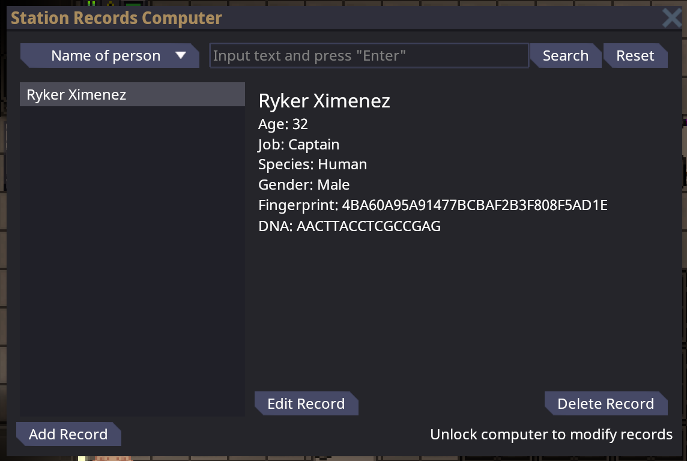
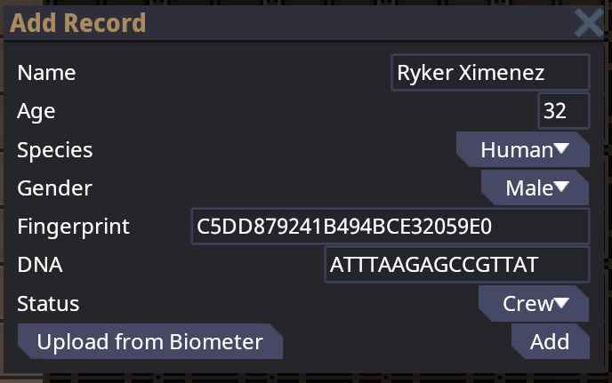

# Creating, Editing, and Deleting Station Records

| Designers  | Implemented | GitHub Links |
|------------|-------------|--------------|
| Centronias | :x: No      |              |

Station records track crew members "on paper". They're effectively the "truth" which ID cards represent, they're used to
look up information about criminal suspects, and in the future, they'll perhaps track medical information like blood
type. As it stands today, though, station records are created on round start and are immutable from then on (latejoins
notwithstanding), which leads to some pain points across the game. This proposal describes how Station Records could be
created, modified, and deleted diagetically within the game, but before we get to the proposals, I'd like to enumerate
the pain points to better motivate the changes.

## Pain Points

1. Visitors, adopted noncrew, etc. cannot be added to station
   records ([issue](https://github.com/space-wizards/space-station-14/issues/22503))
2. Destroyed records cannot be recreated
3. Known antagonists who are not in station records cannot be tracked by criminal records
4. Crew members who are known to have had their biometrics changed cannot have their records updated
5. Anything beyond a couple keystrokes sucks and should be avoided

## Adding new Station Records

The ability to add new station records would go a long way to addressing the problems above. Mechanically, this could be
implemented on the existing Station Records computer:

* New button in the UI of the Station Records Computer:
  `Add Record` ([mockup](#station-records-with-add-and-edit-buttons))
* Clicking this button opens a new UI window which accepts the information required to create a new
  record ([mockup](#add-a-new-record))
* Submitting this window creates a new record with the given information and leaving other related records either blank
  or not created

Technically, this should be straightforward, as it'd just involve "reserving" a new station record key and creating the
associated station record entries just like on roundstart.

In terms of gameplay, this would give the Head of Personnel more things to do, though only rarely. It's not required by
the game, so some HoPs may choose to not do this at all.

## Editing existing Station Records

Editing an existing record would likely be quite rare, but in the cases that sombody is known to have had their
biometrics changed (eg. DNA scrambler; cloned person gets new fingerprints), it's an important capability to have. Same
as adding records, this could be implemented on the existing Station Records computer:

* New button in the UI of the Station Records Computer:
  `Edit Record` ([mockup](#station-records-with-add-and-edit-buttons))
* Clicking this button opens a new UI window which shows existing information in editable text boxes /
  dropdowns ([mockup](#add-a-new-record))
* Submitting this window applies any changes to the records.

Technically, this should be really straightforward. The records already exist, we're just changing the values. This is
already implemented for criminal records.

In terms of gameplay, this would give the HoP even more options. Again, I don't expect this to be used that often,
except to fill in information that's missing when a new record is created. For example, a visitor arrives, has a new
record created, but only their name and species are entered initially. Later, when the information is collected, the DNA
and fingerprint are entered in by editing the visitor's record.

## Deleting existing Station Records

Finally, we complete the feature set by enabling the deletion of records. This is useful in the case that a new record
is added in error, or perhaps in the case that an antagonist wants to erase the evidence of their existence, or
something. Once again, this would be implemented on the existing Station Records computer:

* New button in the UI of the Station Records Computer:
  `Delete Record` ([mockup](#station-records-with-add-and-edit-buttons))
* Clicking this button changes it into a red `Confirm Deletion` button which would perhaps lock out clicking for a short
  delay to prevent accidental double-clicking
* Confirming destroys the record, including any attached criminal / medical records

Technically, because station record keys are stored by other things, it'd be necessary to keep the key "reserved" and
unused by anything else, but simply clearing all of the associated records should be sufficient to implement this
feature.

## Limiting Access to Station Record Editing

Station Records are quite sensitive information, so the average greytider shouldn't be able to edit them. A simple
solution to this could be something like the lock on the AI Upload Console: a machine-level toggle-lock which, when
unlocked, enables the use of any non-read capabilities of the computer.
([See explanatory text in mockup](#station-records-with-add-and-edit-buttons))

## Collecting and Entering Biometrics for New / Edited Records

Typing DNA and fingerprints manually sucks, and there's not a good way to get this information for new or edited
records. To solve both problems at once, meet the "Handheld Biometer", a device similar to the Detective's forensic
scanner. The Biometer would be used to collect biometrics from humanoids and automatically enter that information into
the Station Records add/edit UI. Specifically, the workflow would look like this:

* Person is at the HoP to get their record modified
* HoP picks up the Handheld Biometer, uses it on the person
* After a brief wait, the Biomete completes, storing the collected information internally
* The HoP opens the Station Records computer, open the `Add Record` window
* The HoP enters the name of the person manually (it's not a biometric which can be measured)
* The HoP, with the Biometer in hand, clicks a button, and the rest of the biometric information is miraculously entered
  automatically ([`Upload from Biometer` in mockup](#add-a-new-record))

The Biometer would include a UI for viewing the collected informationl, and that UI could include the ability to print
the information (both just like the Forensic Scanner). The Biometer would retain whatever information it's got until
another scan is performed, overwriting its internal contents.

This item, being unique and important for a part of the HoP's gameplay, should spawn in the HoP's locker and likely also
be a steal target like other unique command items.

## Tracking Crew Membership

Today, the presence of a Station Record implies the described person is a member of the crew as all crew are given a
record upon spawning, and non-crew do not get a record. If we permit the creation of new records, especially to track
known hostiles, it is important to be able to denote that the record represents crew versus non-crew.

Mechanically and technically, this would just be a new Station Record type with a value of `Crew`, `Visitor`, or
`Non-crew`, and it's entered / modified in the same ways described above as existing information.

In terms of gameplay, it may not do much of anything at all except enable the AI to look up records and do things to
positively determined noncrew. I am not advocating for this to affect things like job icons, so probably the impact
would be nonexistent beyond flavor.

## Open Questions

* What is the minimum information needed to create a new Station Record?
    * I'm inclined to say you need only enter the `Name` and crew status

## UI Mockups

#### Station Records with add and edit buttons

#### Add a new Record

