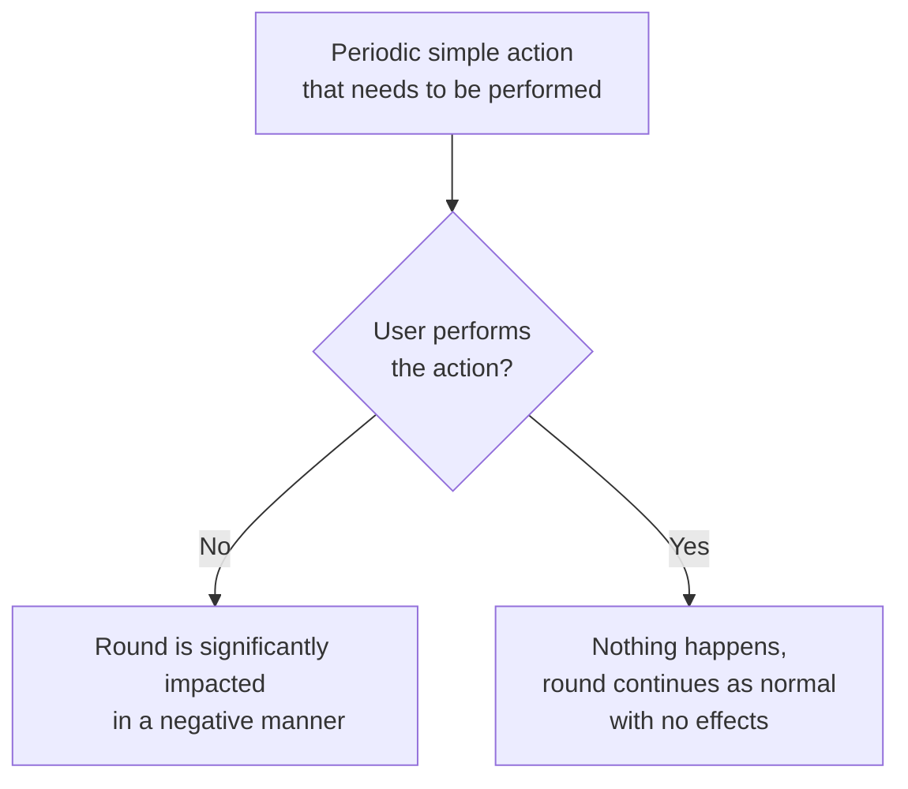

# Engineering
Assembling, maintaining, and powering a station soon to undergo rapid unscheduled disassembly.

## Concept
Engineering is the department responsible for assembling, maintaining, and powering the station and its equipment, keeping it functional and usable by the crew. 
In addition, Engineering may process or synthesize materials, using these materials to create new items or structures researched by Science or requested by other departments.

It is extremely fun and rewarding for players to solve a mechanical issue or build something new for other players.
As such, Engineering and its mechanics should promote collaboration, cathartic solutions, and above all, the feeling that the player's actions are making a difference.

## Design Pillars

### Cogs in a Machine
Engineering mechanics should promote teamwork, where dividing multiple people up into performing individual tasks results in a speedy resolution to a large problem.

This gives the player the feeling of contributing towards a wider goal, or "keeping a machine alive."
This feels fantastic and provides engaging roleplay and interaction.
Players can divide themselves up among tasks, coordinate responses, allocate more people to matters more urgent, and so on.

As such, mechanics should be designed in a way that fulfills the following requirements:
1. **Large tasks can be parallelized.**
   - Multiple people should be able to work on a large task without one person conflicting with another person's work.
     - A good example: Setting up solars does not require people to wait on other people for tasks to be done—the work can be completed asynchronously and by any number of people.
     - A mixed, mostly good example: Engine construction. While the work is parallelizable, multiple people may have different ideas as to what engine design should be used. In addition, many engineers prefer to wait until the engine generator is in place and containment online before the PA is fully assembled.
       - While these concerns may not be able to be 100% alleviated, communication issues like engine design can be helped by giving the CE tools to help lead their team. For example, an engine projector that projects holograms of engine parts to be moved.
   - If a task requires that a certain phase of work being completed, that subtask should be parallelizable.
     - A good example: Hull breach repair. Atmospherics cannot restore air pressure without the hull being airtight, so that is a blocker. But multiple people can work on patching the hull, working from multiple directions inwards.
2. **Mechanics and tasks should be intuitive and easy to see how they fit into a larger picture.**
   - Players should be able to identify subsystems in a larger system and be able to understand what that system does and how it contributes to a larger system. Using an analogy, players should be able to identify a cog in a machine and see how that cog turning keeps the entire system moving.
     - A good example: SMESes in the context of the station power distribution network. They may be given a fancy name (Superconducting Magnetic Energy Storage); however, in the grand scheme of things, players can understand that it is just a big battery that supplies backup power to the station.
     - A bad example: SMESes and generators in the context of power ramping. Power is not delivered instantaneously in some devices, rather the output of the device slowly ramps up to match demand. As a result, power may not be supplied as quickly as consumers demand it, resulting in a deficit and brownout until the suppliers ramp up enough to satisfy demand. This is currently not communicated intuitively.
   - Mechanics or systems should intuitively communicate their role in a greater system, whether that be through their outer appearance, connection to real life, or through their UI or interactions.
     - Ex. It is **visually intuitive** that an air vent releases air into an atmosphere, or that an SMES stores power.
     - Ex. It is **interactively intuitive** through UI that a generator has greater fuel efficiency at power outputs lower than their maximum output.

### Difficulty Population Scaling
The difficulty of tasks should scale with the population of the Engineering department, or the number of people that is expected to be doing that task.

The intention of this design pillar is to prevent situations where a skeleton crew (likely) cannot achieve the tasks necessary for the station's beginning-of-round survival.
For example, stations designed to host a skeleton crew (or stations that may see a skeleton crew engineering department) should have engines that can be operated by a skeleton crew.

It's important to note that it's okay to have tasks out-scale the player in the end-stages of a round where chaos and disrepair are supposed to be happening. However, this should not be happening at the beginning of the round, or as a first introduction to a system.

For example:
- Setting up the AME is a task that can be achieved in a reasonable timeframe by one person.
- Setting up the Singularity or Tesla engine can be achieved solo, but this takes a bit of time as setup is a complex series of steps, compared to other engines. Multiple people should be able to set up the engine in a reasonable timeframe. This makes the Singularity/Tesla less attractive for lower-population stations, and an alternative generator should be afforded, or the setup of these generators be partially or fully completed.
- Setting up the TEG can sometimes be a difficult task for one or multiple people, especially people being introduced to many mechanics like Atmospherics and its limiting factors like window shattering. Mechanics like these should be communicated visually or intuitively as mentioned before.

### Toolset and Accelerated Work
The items in Engineering's restricted-level toolset should speed up their work, enabling productivity and response time higher than if a person wants to achieve a maintenance task on their own accord.

In a sense, everyone should be able to do work involving Engineering in a pinch, but performing work in a timely manner involves calling Engineering to help out.
This allows players to still perform their duties if Engineering is in a skeleton-crew state, but they are still encouraged to call on Engineering if available for large tasks.

### Proactive, Reactive, and Maintenance Tasks
Tasks given to Engineering should not be extremely menial or feel like a filler task meant to keep engineering barely idle.
These tasks are boring and do not contribute to fun gameplay.

For example, presume that we make a task where engineering has to replace fuses on a substation frequently.
If these fuses aren't replaced, the substation will be disabled. This has the following effects:
- If this task is not completed for some reason, a large portion of the population's round is now negatively impacted, and this impaction is outside their control, which reduces agency.
- This menial work distracts away from potentially interesting work that Engineering could be doing, such as construction, renovation, or other interesting mechanics. In addition, this menial work could be so boring that Engineers may frequently forget to perform the work in exchange for doing work that actually interests them.

This substation fuse replacement can be boiled down to the following tree:

Generally speaking, very few tasks should have this dynamic, if at all.
Instead, your mechanic should be designed around upsets driven by in-round events that can happen either by chance or by antagonistic activity.
Players should be able to tell when these upsets occur if their effects on the round are large. These upsets should do damage to the station proportional to the time or amount of resources it takes to perform the upset.

### Station Infrastructure and Sabotage
Large and critical station infrastructure should be designed in a way that makes sabotage very hard to perform unless significant resources and/or time are dedicated to performing it.