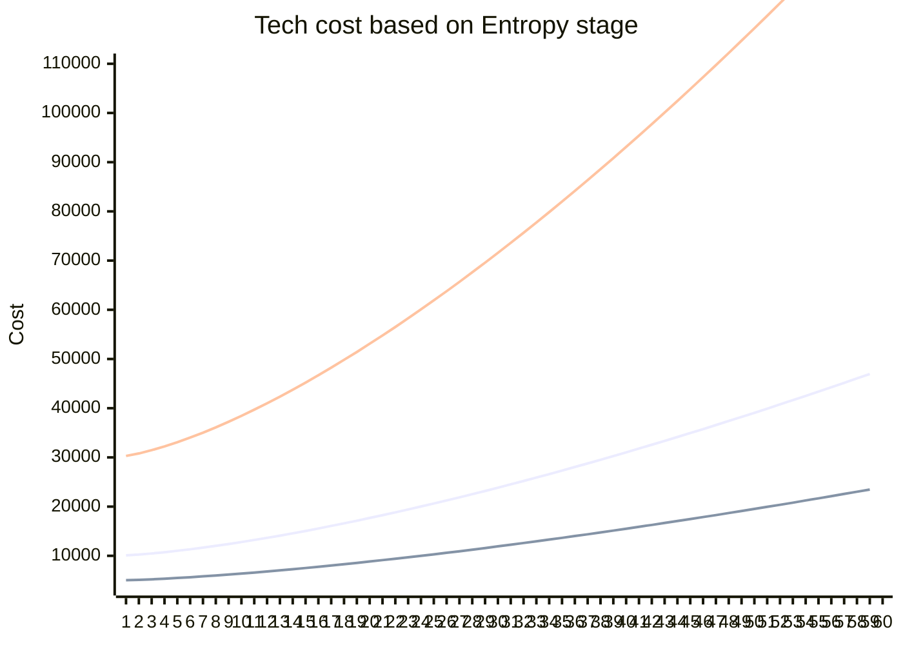

# Entropy in technology research process

| Designers       | Implemented | GitHub Links |
|-----------------|---|---|
| Fildrance		  | :x: No		| TBD		   |

## Overview

Main objective of changes 
 - Make technology researching process less 'dull' and more involving
 - Make the choice of technologies feel important, and make people actually think what they are doing with points
 - Add more meaningful departments interactions with sci
 - Make generating loads of science points viable and positive thing (currently after very small gap -
  it realy does not matter how much you generate, you can buy everything within minutes)
 - Make another way engineers can use extra power they produce for the good of the station (hopefully its not goint to be the only way extra power can be used)

As people got used to science research process it appears that the process of 'buying' technology is pretty blunt overall - you push the button, 
you recieve recepie at protolathe. It feels like process can be improved largely and we can 'squeeze' a little bit more gameplay from it 
using very minor changes.


## Core changes

### Entropy stages and direct research cost
Main change in department work is going to be pretty simple - now technology cost is not plain, it is
going to scale up with every research scientists going to pick. Every technology is going to increase 
'Entropy stage' of the **research server** - an integer number that influences every tech cost. 
Tier 1 technologies will increase Entropy stage by '1', Tier 2 - by '3', Tier 3 - by '9'.

Formula for calculating tech cost based on Entropy stage:
```
(BaseCost + (BaseCost / 100) * EntropyStage ^ 1,45) - (BaseCost + (BaseCost/ 100) * EntropyStage ^ 1,45) % 25)
```

5000 / 10 000 / 30 000 baseline costing tech when entropy stage is applied


same numbers but in table:

#### with 5000 cost tech

| technologies researched count | next research cost |
| --- | --- |
|1 |5050 |
|2 |5125 |
|3 |5225 |
|4 |5350 |
|5 |5500 |
|6 |5650 |
|7 |5825 |
|8 |6000 |
|9 |6200 |
|10|6400 |
|11|6600 |
|12|6825 |
|13|7050 |
|14|7275 |
|15|7525 |
|16|7775 |
|17|8025 |
|18|8300 |
|19|8550 |
|20|8850 |
|21|9125 |
|22|9400 |
|23|9700 |
|24|10000|
|25|10300|
|26|10625|
|27|10925|
|28|11250|
|29|11575|
|30|11925|
|31|12250|
|32|12600|
|33|12950|
|34|13300|
|35|13650|
|36|14025|
|37|14375|
|38|14750|
|39|15125|
|40|15500|
|41|15900|
|42|16275|
|43|16675|
|44|17075|
|45|17475|
|46|17875|
|47|18275|
|48|18700|
|49|19100|
|50|19525|
|51|19950|
|52|20375|
|53|20800|
|54|21250|
|55|21675|
|56|22125|
|57|22575|
|58|23025|
|59|23475|
|60|23925|

#### with 10000 cost tech

| technologies researched count | next research cost |
| --- | --- |
|1 |10100|
|2 |10250|
|3 |10475|
|4 |10725|
|5 |11025|
|6 |11325|
|7 |11675|
|8 |12025|
|9 |12400|
|10|12800|
|11|13225|
|12|13650|
|13|14100|
|14|14575|
|15|15050|
|16|15550|
|17|16075|
|18|16600|
|19|17125|
|20|17700|
|21|18250|
|22|18825|
|23|19425|
|24|20025|
|25|20625|
|26|21250|
|27|21875|
|28|22525|
|29|23175|
|30|23850|
|31|24525|
|32|25200|
|33|25900|
|34|26600|
|35|27325|
|36|28050|
|37|28775|
|38|29525|
|39|30275|
|40|31025|
|41|31800|
|42|32575|
|43|33350|
|44|34150|
|45|34950|
|46|35750|
|47|36575|
|48|37400|
|49|38225|
|50|39050|
|51|39900|
|52|40775|
|53|41625|
|54|42500|
|55|43375|
|56|44250|
|57|45150|
|58|46050|
|59|46950|
|60|47850|

#### with 30000 cost tech

| technologies researched count | next research cost |
| --- | --- |
|1 |30300 |
|2 |30800 |
|3 |31475 |
|4 |32225 |
|5 |33075 |
|6 |34025 |
|7 |35025 |
|8 |36100 |
|9 |37250 |
|10|38450 |
|11|39700 |
|12|41000 |
|13|42350 |
|14|43750 |
|15|45200 |
|16|46700 |
|17|48250 |
|18|49825 |
|19|51425 |
|20|53100 |
|21|54775 |
|22|56500 |
|23|58275 |
|24|60075 |
|25|61925 |
|26|63775 |
|27|65675 |
|28|67625 |
|29|69575 |
|30|71575 |
|31|73600 |
|32|75650 |
|33|77725 |
|34|79850 |
|35|82000 |
|36|84150 |
|37|86350 |
|38|88575 |
|39|90825 |
|40|93100 |
|41|95400 |
|42|97725 |
|43|100075|
|44|102450|
|45|104850|
|46|107275|
|47|109725|
|48|112200|
|49|114700|
|50|117200|
|51|119750|
|52|122325|
|53|124900|
|54|127500|
|55|130125|
|56|132800|
|57|135450|
|58|138150|
|59|140875|
|60|143600|

Amount of techs game currently have is described in following table

|Tier   | Tech Cost     | Count of tech |
| ---   | ---           |   ---         |
| 1     | 5 000         | 11            |
|       | 10 000        | 5             |
|       | 7 500         | 11            |
|       | 8 000         | 1             |
|       |               |               |
|Sum    | 195 500       | 28            |
|       |               |               |
| 2     | 10 000        | 7             |
|       | 10 500        | 1             |
|       | 5 000         | 3             |
|       | 7 500         | 4             |
|       | 15 000        | 1             |
|       | 12 500        | 1             |
|       |               |               |
|Sum    | 153 000       | 17            |
|       |               |               |
| 3     | 15 000        | 4             |
|       | 10 000        | 5             |
|       |               |               |
|Sum    | 110 000       | 9             |
|       |               |               |
|Total  | 458 500       | 54            |

Graph and this data shows that with new tech cost its almost impossible 
to just collect points to for every tech - you need to work with new mechanic of Entropy.

### Ways to mitigate rising research costs

There will be 3 major ways to decrease entropy stage to actually fight back cost creep:

| Speed | Name| Description|Dependency on other department |
|---|---|---|---|
| it depends!| Anti-Entropy Engine |construct Anti-Entropy Engine a device which uses power from station network to decrease Entropy stage|strongly depends on how much power engieneering is going overproduce|
| mid (luck dependent ) | encrypted disks | salv team can find 'right' encrypted disk on scraps and expeditions. Disk can decrease Entropy stage by random flat number when inserted into server - (from 0 to 25). Entropy stage could not be less then 0. (future feature for when skill chips gonna be added - disks gonna be able to also increase level, only RD can see what disk 'actually is doing' by reading extra description). Pretty much self-explantory - find disk, insert disk, number goes down. | depends on salf team|
| SLOW | server defragmentation | set your RD server to defragmentation, so it will slowly start decreasing Entropy stage | None |
| mid | attaching anomaly to RnD server | Anomaly analyzer can be used on RnD server, like on anomaly container (but only on one of them, not both at the same time) to reduce amount of Entropy stages new researches give by 1. This means still '1' for Tier 1 (this is a mid-game technic), Tier 2 will add '2', Tier 3 will add '8'. | Your department crewmates? so None.|

#### Energy sink

Anti-Entropy Engine is 
* a constructable device
* t1 engineering research costing 10 000 points
* require HV wire to operate 
* have to be bind using multitool to RnD Server before starting up
* will draw power from network to charge based on settings (slider 5-100 kw draw)
* changing draw rate will require confimration and going to stop charging (but not drawing power) to prevent fast charge rate change abuse
* uses 1 'charge' per 1 Entropy stage to decrease
* requires 20 000 kw in total per 1 charge
* players can set required amount of charges (1-10) to be stored 
* after storing set amount of charges, power draw is disabled and device is ready to be used. Usage is instant.

(future feature - add charges for sacrifising anomaly cores! more charges for non-depleted)

| power draing | time to charge |
| ---		   | ---			|
| 100kw		   | 20 sec			|
| 50kw		   | 40 sec			|
| 20kw		   | 1m 40 sec		|
| 10kw		   | 3m 20 sec		|
| 5kw		   | 6m 40 sec		|

#### RD Server defragmentation

Defragmentation is an action that will be called using Research console. Action will set RD server in 'defragmentation state' for 5 minutes,
during which researching new technologies will be disabled. This can be cancelled from Research console, but Entropy stage will not be reduced 
no matter how close process was to completion - it needs to complete. Each defragmentation is 5 minute long and reduces Entropy stage by 3. 
Entropy stage cannot be less then 0.

This is default action which your team will be using in case you have no extra power, your salv are useless, and your day is ruined. 
Just sit and wait, blaming other departments. Or collect enough research points to buy anything!


# Watch where you click

To make technologies that players pick to be researched even more meaningful, researching now will take server time. 
Server is going to be able to research only 1 technology at a time, time will be specified per technology. 
Deeper tech going to take more time, tech that costs more is going to take more time, but also there is going to be exceptions
for game balance purposes (Explosives going to take x2 time).

To make working with research time feel more fluent, researches going to combine into queue. 
Points will be consumed based on adding techonolgies to queue, Entropy stage is going to be recalculated 
and applied on adding to queue (so trying to collect many points and queue all reasearches is not better 
then using points as they come). Cancelling item from queue will recalculate all remainging item costs 
(it will make them cheaper and return all points that tech was costing and however much you have saved 
on techs that are staying further in queue).

To (kinda) counteract randomness by which technology options are provided, technologies can be rerolled for random new ones for a flat price of 2000 points, so players could really
choose - to research something not so useful and get rid of it (but it will help in advancing to new tier), or reroll tech and hope something they
are searching for will appear. **(maybe add some ways to drop reset cost for 1-2 uses?)**

To counteract (to some extent) research times and time that RnD server is consuming for defragmentation, 
RnD Server is going to have gas port - it could 'eat' some cold gas and lower time to research tech. 
Research time is going down based on how cold gas is going to be. When provided with frezon, research time is going to be instant, but defragmentation will only go down to 1 minute per -3 Entropy stgates.

'Key frames' -> 
* -173°C is going to make research 20% faster, 
* -233°C is going to make it 40% faster, 
* -273°C is going to make it 80% faster

```mermaid
xychart-beta
    title "a"
    x-axis [-173, -233, -273 ]
    y-axis "Research speed improved by %" 0--> 100
     line [20, 40, 80]

```

#### tech research time samples

**Numbers are not final and are presented for example!!**

| Tier| technology (base cost)| base research time(mm:SS) | using -173°C gas|using -233°C gas|using -273°C gas|
| --- |--- | --- | ---| ---| ---|
| 1 | SpaceScanning (5 000) | 00:10| 00:08 | 00:06 | 00:02 |
| 1 | AdvancedPowercells (7 500) | 00:40 | 00:32 | 00:24 | 00:08 |
| 1 | ExplosiveTechnology (10 000) | 01:40 | 01:20 | 01:00 | 00:20 |
| 2 | AdvancedAnomalyResearch (10 000) | 02:00| 01:36 | 01:12 | 00:24 |
| 2 | AdvancedToolsTechnology (10 000) | 02:00| 01:36 | 01:12 | 00:24 |
| 2 | DeterrenceTechnologies (7 500) | 01:20| 01:04 | 00:48 | 00:16 |
| 3 | BluespaceStorage (15 000) | 04:00| 03:12 | 02:24 | 00:48 |
| 3 | PortableFission (10 000) | 03:00| 02:12 | 01:48 | 00:36 |

# Not only nerfing

As most of the points in this list seems just nerfing and giving people obsticles and 'something to do', to bring some butter to the bread, 
limit of only 1 discipline with t3 being able to be researched is going to be lifted in favour of 2 disciplines (with all t3 technologies for both available).
It will be hard thing to do considering amount of Entropy stages the first t3 is going to give, but its a good endgame that maybe could entertain people even during 
4+hour shifts.

# Release plan

1. Cost increase mechanic will be 1 PR with CVar to disable incrementing (so it won't touch current game balance on merge!).
2. Research reroll will be 1 PR and i hope everyone is ok with it just existing even without Entropy. Its a nice thing.
3. Research queue will be 1 PR and will be hopefully funny and nice for people, they will enjoy new UI
4. Defragmentation will be 1 PR bound to CVar from first one.
5. Disks affecting Anti-entropy going to be 1 small PR that will be ok as it won't affect anything until CVar is ON
6. Anti-Entropy Device will be 1 PR that is bound to CVar
7. Gas-eating for RD server (and faster research) is going to be 1 PR thats going to be working and is dependent on #3
8. Then we do PR with enable CVar (or remove it and conditions bound to it) and all features join togather.

# Why the entropy

So our RD server takes abstract data and creates technology. It can be considered a lab rat AI (created only for research and not for thinking or talking ofc)
that knows all about our usual tech, but using this data combined with tons of alien/anomalous data it can try to mash numbers togather to create new useful 
for us ways to use conventional tech (gravity gun etc). If it AI that want to be simple but fast, it is going to use quantum computing - hence, work (better 
in our case) with cooling!

And entropy as a merit of of energy dispersal, going to bring problems into our little lab rat AI brain.