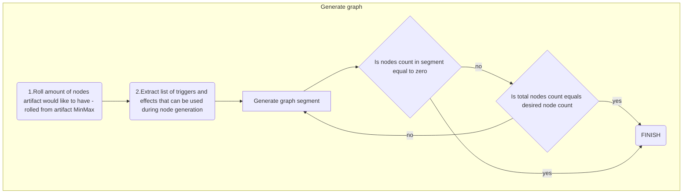
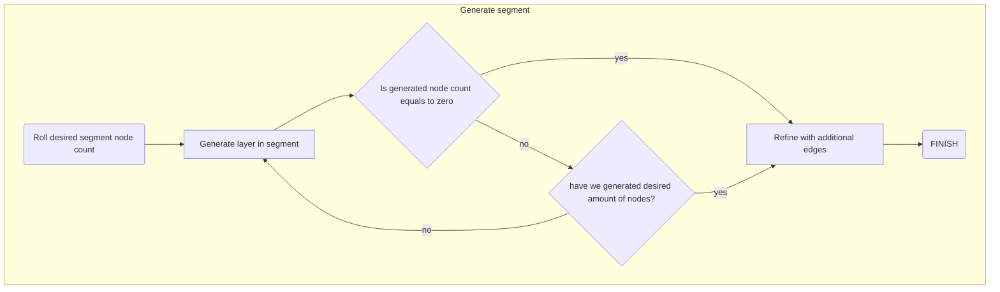
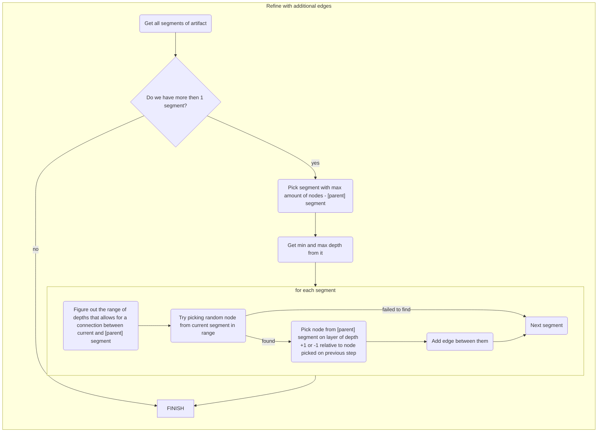
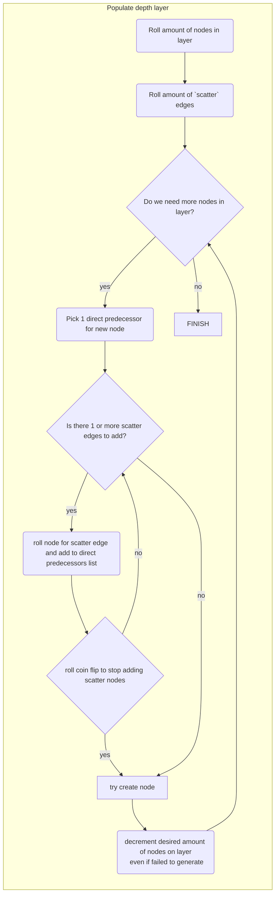
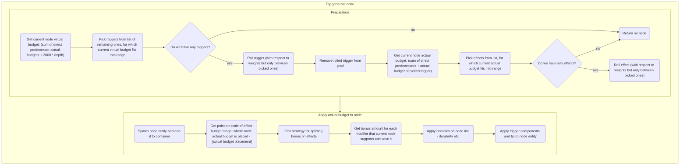
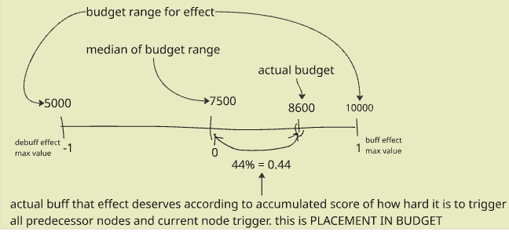

# XenoArch Redux [3MOArch]
```admonish warning "Attention: Legacy Documentation!"
This document is ported from before the game-area reorganization and has not been reviewed or updated.
It may not fit with the new design requirements.
```

| Designers       | Implemented | GitHub Links |
|-----------------|---|---|
| Thee EmoGarbage | :warning: Partiall | https://github.com/space-wizards/space-station-14/pull/33370 |

## Overview

This proposal aims to re-imagine the science subdepartment of XenoArch and Artifacts in general in an effort to give them more depth, and utility.
This will be accomplished by changing node traversal to add more player agency, improving in-game tools for categorizing and understanding artifact structure, and adding additional equipment that makes manipulation more interesting.

The ultimate goal is to redesign the system so players can better understand how artifacts work and to allow greater utility and mechanics to arise out of artifacts.
XenoArch should feel like unlocking the sprawling secrets of an artifact while additionally gaining points as a secondary reward for the research. Artifacts should not be viewed as thing that belongs only to lab, 
but rather as useful tool for all crew members, increasing sci-to-other-departments interactions.

_This redesign lends partial inspiration to Goon's artlab as well as Noita's customizable wands._

## Background
As it is now, artifacts consist of interconnected nodes, each one carrying an effect and a trigger. 
The effect is just some crazy behavior that happens in response to the trigger, which is just some kind of generic action taken upon the artifact.

These nodes form a tree, wherein each individual node's depth within this tree determines the craziness of the its effect and trigger.
An artifact has a single node which is active, which is what determines the current effect and trigger which must be done.

Moving to another node requires the completion of the current node's trigger and is semi-random in nature.

While the core concept of XenoArch is interesting and has decent integration with salvage and cooperation for collecting tools for triggers, there are also many situations where players feel as if they lose the ability to meaningfully interact with them.

I'll outline some of the core issues here:

### Randomness
Artifact generation is completely random, but so is the activation of effects.
Players cannot meaningfully control which effects they activate and even the limited tools they have like the traversal distorter are extremely esoteric and don't actually provide meaningful control.

The result of this is that while many effects could potentially be extremely useful and provide players interesting means of interacting with their environments, there's no way to actually harness of control the randomness to produce those interesting outcomes.
At best, you simply re-trigger a beneficial effect several times and reap the rewards in that way.

### Lack of Complexity
Artifacts are primarily dictated by a single effect with the occasional mix-up of having permanent effects (many of which are underwhelming).
Activation stimuli are similar: the only sliding scale to adjust with how difficult something is to activate is just how hard it is to do that singular trigger.

Since these triggers are always placed in isolation, unless the effect is having some pronounced impact on the crew's ability to trigger the artifact, triggers mostly devolve into incredibly simple and routine tasks.

A water trigger should have lots of depth, but it instead is mostly just walking in with a cup of water and splashing it, which is really the most boring way to engage with something like that.

### Lack of Progression
Artifacts have an innate progression in the form of the scaling of nodes, which is mostly built around increasingly difficult triggers and more dangerous and wacky effects.
This is a good start for a system like this, but the unfortunate reality of it is that the scaling isn't pronounced enough to often feel like a deviation from the early-depth nodes.

Especially when taken in with randomization of artifacts, you can oftentimes just get subpar generation that flounders in weak effects that don't feel like a progression in research.

## Artifacts
I'll use the element of a [tech tree](https://en.wikipedia.org/wiki/Technology_tree) as a reference to explain the new generation.

Each node is essentially an upgrade in a tech tree.
The structure also can be described as a typical tech tree structure (a [directed acyclic graph](https://en.wikipedia.org/wiki/Directed_acyclic_graph)) but without requirement for presence of one 'root' - first element in the graph.
There can be more then 1 node that are available to be interacted with from the start (depth 0 nodes), they can belong to 1 or more segments (non-connected sub-graphs inside one artifact).

Just like old system, all of these nodes have a trigger and an effect associated with them.
However, you do not 'move' to a node like the current system, but you instead permanently unlock it like a tech tree.

And just like a tech tree, unlocking a node has a cost associated with it.
The 'cost' is the activation of all of the triggers of the nodes in that path - that is, all of the nodes that needed to be unlocked in order for the current node to become available.

In this situation, the 'active' nodes are the nodes in each path that have the highest tier.
These are the nodes that will produce effects when they are activated.
The remaining nodes are classified as 'latent' - unlocked but not creating any effects when the artifact is activated.

All remaining nodes are simply locked and have no behavior.

### List of terms

| Term | Explnation |
|-----------------|---|
|Node| Point in graph of nodes, contains trigger for its unlocking, effect that will be invoked upon activation, tips, aspect modifiers, budget info|
|Segment| Separated acyclic directed graph of nodes. One artifact can contain more then one segment.|
|Layer/depth| Row in node graph. Starts with 0 at the bottom, with easier nodes and more or less useless/weak effects, and in deeper layers triggers gets harder and effects gets more powerful, dangerous and valuable|
|Node trigger| Actions that are required to perform node unlocking. Usually represented by XAT(XenoArtifactTrigger) components|
|Node effect| Actions that artifact will perform after node activation. Can be useful, useless, harmful or annoying|
|Node activation| invoking effect of node. Can be done by manual interaction, usually is done upon unlocking node. **Manual activation invokes all active nodes in artifact.**|
|Node unlocking| opening node for future activations. Can be done by executing list of triggers on the node (which is list of trigger on node and all chain of predecessors, connected to it by edges) |
|Active node| Active are nodes which are both 'unlocked' and are last in chain of unlocked nodes, connected by edges|
|Budget range| Min and max values, between which acceptable range of budget lies. Both triggers and effects have budget range, each of them have own values|
|Virtual budget|Proposed amount of score node could have, based on predecessor and depth. Can be used to pick trigger which then decides actual budget|
|Actual budget| Score-estimate of how 'valuable' this node is. Increases with depth and amount of predecessors. |
|Aspect of effect| Separate part of node effect that, amount of which can be changed. Like range of teleportation can be increased or decreased.|
|Placement in budget| Floating point value from -1 to 1. Amount of buff or debuff that node should receieve. Calculated using 'actual budget' of node and its effect 'budget range'. Exact amount certain aspect should get is determined by strategy.|
|Meta-nodes| Node effects, which are doing nothing by themselves upon activation, but rather add modifiers to effect aspects of other nodes effects|

### Activation and Unlocking Nodes
The activation of an artifact is now something that is distinct from simply triggering a node in the old system.

Activating an artifact is simply achieved by using it in hand, clicking on something, or other context interactions.
Doing this simply causes all the effects of the active nodes simultaneously.

By making many effects happen at once, they can combine in novel ways and increase the utility and chaos of the artifact, greatly improving on the current system where lackluster nodes can seem to have 0 effect at all.

As a balancing factor, each node of the artifact now has a durability.
Activating an artifact degrades the durability of all of the active nodes.
When the node is fully degraded, it no longer produces any effect when activated.

The durability can be repaired using special equipment (which will be elaborated on further later).

In exchange easier activation, unlocking nodes is now more complex.
To unlock a node, you must provide the stimulus for that node as well as the the stimuli for every node below it in its path (the path being all of the nodes that had to be unlocked in order to reach the current node).

Once the first stimulus is provided, an activation period (roughly 10 seconds) begins wherein all the stimuli activations will be recorded. 
At the end of that period, if the stimuli recorded _exactly match_ a node's required stimuli, it will be unlocked.

```admonish info
Note that if you need stimuli A, B, and C but you instead provide A, B, C, and X, the node will not be unlocked.
It must be an exact match and not simply a superset.
```

Once unlocked, the node's effect will occur while a small animation and sound effect playing, giving feedback to the players that something has occured.


### Graph generation



This process attemtpts to bind smaller segments into larger graph, as larger interconnected graphs have proven to be much more interesting.








### Node graph generation

Nodes are generated by picking trigger and effect from respective pools. Same trigger cannot occur more then once on artifact graph or there will be a possibility of overlapping, so list of triggers is getting exhausted as generation goes on.
List of effects to be picked is list of possible entity prototypes, which will be spawned as nodes inside artifact, while list of triggers contain 1 component for each pick. 
For unlocking mechanic to work properly all triggers are made unique, which means max size of artifact is amount of different triggers we have in pool. 

**remark: Almost all of budget things is internal game mechanics and is not for player to view.**

For balance we introduce concept of 'node budget'. 
- Each trigger on the list gets 'budget range' and 'budget' assigned, according to how hard it is to activate by default (w/o interference).
- Each effect on the list gets 'budget range' it can match to. Some effects can scale (give more resources), giving them greater range, while others cannot.

Trigger and effect rolling should look like following:
  1. When trying roll trigger - our 'virtual budget' is sum of 'actual budget' for each node predecessor + (depth * 2000). For starting node that will be 0, so we only roll triggers which have 'Budget range' like '0-*' (things like using tools, feeding artifact, using water etc). 
  When rolling between triggers we consider weights that were placed upon them in full weighted list (got from XenoArtifactComponent), but we roll only between picked by budget options. 
  So even if we have very low weight option, but it is the only one we can roll upon, probability of picking  it will be 100%
  2. After picking trigger we get trigger 'budget' from it - that, plus 'actual budget' of direct predecessors is current node's 'actual budget'
  3. Then we roll for 'effect' that have this budget in its 'budget range', in same manner we rolled trigger

Example of segment generation process (detailed version w/o how actual budget applies mods to xeno artifact effect aspects):
We rolled tree with 1 tier0 node, 1 tier2 node and 1 tier3 node. All tier0 nodes connect to tier1.
1. roll tier0 node from triggers, 'virtual budget' is 0, 'trigger budget range' 0 - 4 000, we get 'trigger budget' 1 500, resulting 'actual budget' is 1 500
2. roll effect from effects with with 1 500 - for example, budget range 1 000 - 6 000 fits nicely.
4. calculate tier1 node virtual budget : 1 500 (1 node of tier0 are direct predessors) + 2 000 * 1 (its tier1 node) = 3 500
5. roll trigger with 'virtual budget' of 3 500 - for example trigger with 'budget range' 2 000 - 10 000. We get 'trigger budget' 7 500 and get node 'actual budget' 1 500 (predessors sum) + 7 500 = 9 000
6. roll effect with budget range that will include 9 000 - for example 10 000 - 15 000
7. calculate tier2 node 'virtual budget' - 9 000 (tier1 direct predessor) + 2000 * 2 (its tier2 node) = 13 000. Roll trigger with 'budget range' that contain 13 000 (for example, trigger with range 10 000-> 30 000). Trigger budget 14 000 makes 'actual node budget' 9 000 + 14 000 = 23 000
8. roll effect with budget range that will contain 23 000

### Placement in budget and effect modifiers

As finishing touch for balancing and making related gameplay more deep, we must 

Following picture schematically (using example) describes what is 'placement in budget'. 
Placement in budget is important because this way we can describe, how much 'over the budget' or 'under the budget' node currently is.
To compensate for that we should apply counter-effect - thats where we use 'effect aspects' and 'effect modifiers'.
By default we select 4 of aspects that can be modified:
* effect duration - if effect is going to have prolonged effect (for example how long foam stays, how long lights are flickering) then it can be increased or decreased
* node durability - base node durability can be increased or decreased
* effect range - if effect have range, in which it operates (for example foam range, explosion range) - it can be increased or decreased 
* effect power - most of effects have some way to measure power so it could be increased or decreased. Samples are:
  - amount of foam/steel/trash produced
  - complexity of created artifact
  - how healthy created anomaly will be
  - amount of healing / damage applied on activation
  - etc

Those 4 are aspects that can scale with 'placement in budget' out of the box. 
Each effect explicitly should state which ones it supports and related effect code should explicitly handle it.

On top of that we exepct some more aspects to be modifiable separately - they are supposed to come from node 'meta-effects':
* offset of activation position
* delay until activation
* etc

When node is created, generation process picks strategy on how to distrubute buff/debuff from 'placement in budget' to effect aspects.
* First it looks how many aspects node supports. 
  * If there is 0 - then there is no way to affect it, so generation skips this step.
  * If there is 1 - the only strategy to spread buff/debuff to effect is to dump it all into that stat.
  * If there is more then 1 - it rolls one of strategies randmoly. Strategies include:
    * "Fair split" amount of 'placement in budget evenly' - just divide number by amount of aspects and then assign each resulting value. Pretty buring overall.
    * "Pick one and dump" all in one - assign provided 'placement in budget' value to one aspect, zero for others. Can lead to peak results but will limit usability.
    * "Leader and followers" - randomly pick one aspect, assign 70% to it, split what will be left between others. Most interesting result.
    * "Full random" - distrubute it randomly.

------

So as of example, lets say we have node with 'placement in budget' = '-0.80'. We got node that supports following aspects:
* Power
* Durability
* Range

As we have more then 1 aspect, now we roll strategy for distribution and we get 'Leader and followers'. 
We roll leader stat and we get 'Durability'. So we get -0.8 * 0.7 = -0.56 <- de-buff (hance, it is negative) value for our 'Dirability', then we get whats left and devide by how many aspects left - 2: (-0.8-(-0.56))/2=-0.12
So we assign -0.12 debuff for 'power' and 'range'.

------

So what all these numbers from -1 to 1 means? 
Well, there is no way to make some universal code to scale any component using just 1 float, so every component would require code to do exacty that - know how to apply modificator. 
But to make configuration easier and more streamlined. For that we introduce **EffectModifiers**. 
They are a way to configure transformation from 'placement in budget' value to actual amount of effect components of effect should get.
**For simplicity we presume that every component on effect (if it have multiple) is going to receive same values for buff/debuff.**
The way we configure it by the following way:
yaml:
```
  - type: XenoArtifactNodeBudget
    modifyBy:
      enum.XenoArtifactEffectModifier.Power: "budgetDependant add -15,30"
      enum.XenoArtifactEffectModifier.Range: "budgetDependant add -3,2,10"
      enum.XenoArtifactEffectModifier.Duration: "budgetDependant multiply -5,15,20"
```
So it is Dictionary<Enum, ModifierProviderBase> where enum is artifact aspect, and value is class with simple signature of:
```
public float Modify(float originalValue)
```

So it eats some value and returns it modified. Each modifier derived class have its own logic on how to modify value. Lets look at our previous example one more time:
```
enum.XenoArtifactEffectModifier.Range: "budgetDependant add -3,0,10"
```
* 'budgetDependant add' means BudgetDependantAddEffectModifier, a short and more easy to read declaration of type
* -3 means that at -1 'placement in budget' it will ADD -3 to 'originalValue' and return result, if method 'Modify' will be called.
* 2 means it will add 2 on 0 'placement in budget' it will ADD 2 to 'originalValue' and return result. All points in-between are linerly extrapolated, which means that, for example,
if we have -0.5 'placement in budget', we are going to have 2[central value] + ((-3-(-2))[max distance from center] *0.5[current distance]) = -0.5
* 10 means that at 1 'placement in budget' it will ADD 10 to 'originalValue' and return result. 
* So if we will have 0.5 'placement in budget', we will get 2[central value] +((10-2)[max distance from center])*0.5 = 6

Number in the middle (marker for 0 'placement in budget') is not mandatory, if skipped it will approximate between 2 provided numbers (min and max).
On top of 'add' we can apply 'multiply' for cases when we need to multiply effectiveness in some way (for examply, if we want max power output an 1.0 'placement in budget' be x4 of default one, and x0.5 when at -1.0, we would use enum.XenoArtifactEffectModifier.Range: "budgetDependant multiply 0.5,4") and 'log' (it will multiply value by log of 'placement in budget' with provided base and minor modifications to make numbers scale in more neat way).

Effect modifiers come into play in 2 major scenarios:
1. Artifact **generation** enforces some aspects (currently - only durability) to be affected
2. Artifact **forced activation** enforces all non-init aspects of each node to be affected by both modifiers from other nodes and modifiers from 'placement in budget'

**Effect modifiers and whole changing of effect aspect thing is not applied on node unlocking activation.**



### Meta-nodes

To increase interactivity of artifacts and make them more versatile we add meta-nodes - nodes that have no effect by themselves, but change behaviour of other nodes. 
They can have pretty streight-forward effect, like 'chance to not consume durability on use' or things for more mathematical approach (change position where effect going to be applied by N meters north).
Meta-nodes are rare compared to normal nodes, and to make them more special - any manipulations with them are going to be much tougher - they cannot be repaired using glue, Resequencer have higher chance of failing with them, etc.

Meta-nodes require node activations to utilize shared context between all nodes in one artifact.


## Equipment

### Analysis Console
The artifact analyzer and analysis console will be improved to no longer have any kind of delay and to show significantly more information

The console UI will now visually draw all the nodes in the structure, using lines to connect them.
All unlocked nodes will have basic information such as stimuli, effects, depth, research value, durability, and whether or not the node is active.
This info can be accessed by clicking on the node in the UI, which will show a small window.

Locked nodes that are connected to unlocked nodes will be given a limited information display, showing only the stimuli and the effect.
This allows players to have a limited strategy for the nodes they want to unlock. 

### Handheld Scanner
The handheld node scanner will be used to check information on the current active nodes of the artifact.

Clicking on an artifact with the handheld scanner will link it to artifact which then can be viewed in a UI.
This gives similar info as the analysis console but is limited to the active nodes of the artifact and its current state.

The scanner now gains a lot of utility as being able to quickly assess the state of an artifact without needing to bring it to science.

### Artifexium
Artifexium, which previously activated artifacts, will now serve as a "dummy" stimuli when applied during an activation period.

For example, if stimuli A, B, and C are needed, but only A and B are provided, spraying artifexium will substitute the non-existent C stimulus and unlock the node.

If there are multiple nodes which could be unlocked by a the artifexium (say, a node needing stimuli ABC and one needing stimuli ABD), one will simply be unlocked at random.

### Artifact Fragments
Artifact fragments will no longer simply just be a random chunk that's spit out after an artifact is crushed.
Instead, each distinct path of the artifact's structure will be turned into a fragment which stores the nodes and connections from that path.

These fragments, instead of being crafted into a new artifact, will be combined with existing artifacts at a **Splicer**.
This provides interesting gameplay where you can combine artifacts to create more tactically useful artifacts with beneficial or dangerous effects.

The fragments will also scale their artifexium values in relation to the amount research they provide. 

### New Equipment
New equipment (besides the splicer) will focus mostly on manipulating the active nodes of an artifact and interacting with the new mechanics.

**Artifact Glue** is a reagent made from artifexium and when applied to an artifact will repair the durability of nodes on it. 
This provides additional uses for artifexium and ways to extend an artifact's lifespan in the case of beneficial effects that players are using often.

The **Resequencer** simply takes the existing nodes and shuffles them, creating new connections.
This can completely flip the effects of an artifact and enable new wacky combinations.
It can also help reach particularly hard to get nodes and allow science to fully unlock the artifact.

The **Arti-nUKer** is a special device that obliterates all active nodes on an artifact. 
The severed connections are automatically merged, fixing any holes created in the structure.
This is basically a free re-roll of effects paired with easier to activate high-depth nodes.

The Resequencer and Arti-nUKer both serve as mid-tier research to provide optional depth for the truly engaged archeologists, without the boring technical complexity of the traversal distorter.

## Research Generation
The analysis console UI will show the current research value of the artifact as well as the value it needs to exceed to generate more research.

This will also show the calculation for how the research value is achieved, providing more info and transparency to players.

The research value for an artifact is calculated similarly to how it is now:
- Unlocked nodes give research based on their effect, stimulus, and depth.
- Artifacts with no locked nodes grant an additional bonus.

However, there are factors which can damage the research value of an artifact:
- Nodes with completely degraded durability (gluing the artifact to repair it does not incur this penalty)
- Missing nodes, such as those from the effect of the Arti-nUKer.
- Additional nodes, such as from the effects of the Splicer. 

Note that the calculation for the last two points is based on the total number of nodes in the original vs. the current artifact.
If you destroy 2 nodes and then repair it by splicing 2 nodes onto it, you incur 0 penalty.

To actually gain research from the artifact, you must place it on an analyzer and begin the 'research' task in the analysis console UI.
Extracting points works only once per node, and uses all of node durability - so console asks for confirmation before extracting points.

This provides an interesting window wherein sabotage and other such measures can be taken to steal the artifact or otherwise interrupt science.